# 03 — Organograma canônico do Campus Foz do Iguaçu (codificado)

Fonte: `03-organograma-canonico.json` (este `.md` é gerado por `python3 scripts/render_pop.py --organograma`; não editar à mão). Convenções: setor nível 1 `S<num>-<SIGLA>`, subdivisão `S<num>.<nn>-<SIGLA>`, processo `<SIGLA>-<nn>`.

| Código | Sigla | Setor | Rótulo no app (`id_app`) | Pai | Status | Domínio | Tipo | Gera POP | Processos conhecidos |
|---|---|---|---|---|---|---|---|---|---|
| `S01-DG` | DG | Direção Geral de Campus | Direção Geral de Campus | — | ok | Governança e Direção do Campus | core | sim | DG-01 |
| `S01.01-GAB` | GAB | Gabinete da Direção Geral | Gabinete da Direção Geral | S01-DG | pl | Governança e Direção do Campus | suporte | sim | — |
| `S01.02-CONS` | CONS | Conselho de Campus | Conselho de Campus | S01-DG | pl | Governança e Direção do Campus | core | sim | — |
| `S02-ATDG` | ATDG | ATDG — Assessoria Técnica da Direção Geral | ATDG — Assessoria Técnica da Direção Geral | S01-DG | ok | Assessoria Técnica e Gestão por Processos | core | sim | — |
| `S02.01-CON` | CON | ATDG — Convênios e Parcerias | ATDG — Assessoria Técnica da Direção Geral | S02-ATDG | wip | Convênios, Parcerias e Captação | core | sim | CON-01, CON-02, CON-03, CON-04, CON-05 |
| `S02.02-CAP` | CAP | ATDG — Captação de Recursos | ATDG — Assessoria Técnica da Direção Geral | S02-ATDG | wip | Convênios, Parcerias e Captação | core | sim | CAP-01, CAP-02 |
| `S02.03-CTR` | CTR | ATDG — Controladoria e Compliance | ATDG — Assessoria Técnica da Direção Geral | S02-ATDG | wip | Controladoria, Compliance e Riscos | core | sim | CTR-01, CTR-02, CTR-03, CTR-04, CTR-05 |
| `S02.04-COM` | COM | ATDG — Comunicação Oficial | ATDG — Assessoria Técnica da Direção Geral | S02-ATDG | pl | Comunicação Oficial | suporte | sim | — |
| `S02.05-GI` | GI | ATDG — Gestão Interna | ATDG — Assessoria Técnica da Direção Geral | S02-ATDG | pl | Gestão Interna e Planejamento | suporte | sim | — |
| `S02.06-MAP` | MAP | ATDG — Mapeamento de Processos | ATDG — Assessoria Técnica da Direção Geral | S02-ATDG | ok | Assessoria Técnica e Gestão por Processos | core | sim | MAP-01, MAP-02, MAP-03, MAP-04 |
| `S03-SADM` | SADM | Secretaria Administrativa | Sec. Administrativa — Geral | S01-DG | wip | Administração e Suprimentos | suporte | sim | — |
| `S03.01-DMC` | DMC | Div. de Manutenção e Conservação | Div. de Manutenção e Conservação | S03-SADM | wip | Infraestrutura e Serviços | suporte | sim | — |
| `S03.02-DST` | DST | Div. de Segurança e Transportes | Div. de Segurança e Transportes | S03-SADM | wip | Infraestrutura e Serviços | suporte | sim | — |
| `S03.03-DINF` | DINF | Div. de Informática | Div. de Informática | S03-SADM | wip | Tecnologia da Informação | suporte | sim | — |
| `S03.04-ALM` | ALM | Div. de Almoxarifado | Div. de Almoxarifado | S03-SADM | ok | Suprimentos e Materiais | core | sim | ALM-01, ALM-02, ALM-03, ALM-04, ALM-05, ALM-06, ALM-07, ALM-08 |
| `S03.05-DPAT` | DPAT | Div. de Patrimônio e Equipamentos | Div. de Patrimônio e Equipamentos | S03-SADM | wip | Suprimentos e Materiais | core | sim | — |
| `S03.06-DLIC` | DLIC | Div. de Licitação | Div. de Licitação | S03-SADM | wip | Contratações Públicas | core | sim | — |
| `S03.07-DRH` | DRH | Div. de Recursos Humanos | Div. de Recursos Humanos | S03-SADM | wip | Gestão de Pessoas | core | sim | — |
| `S03.08-DATL` | DATL | Div. de Apoio Técnico aos Laboratórios | Div. de Apoio Técnico aos Laboratórios | S03-SADM | wip | Infraestrutura e Serviços | suporte | sim | — |
| `S03.09-DSA` | DSA | Div. de Serviços de Apoio | Div. de Serviços de Apoio | S03-SADM | wip | Infraestrutura e Serviços | suporte | sim | — |
| `S03.10-DCOM` | DCOM | Div. de Compras | Div. de Compras | S03-SADM | wip | Contratações Públicas | core | sim | — |
| `S04-SFIN` | SFIN | Secretaria Financeira | Sec. Financeira — Geral | S01-DG | wip | Finanças e Orçamento | core | sim | — |
| `S04.01-DFIN` | DFIN | Div. de Finanças | Div. de Finanças | S04-SFIN | wip | Finanças e Orçamento | core | sim | — |
| `S04.02-DCONT` | DCONT | Div. de Contabilidade | Div. de Contabilidade | S04-SFIN | wip | Finanças e Orçamento | core | sim | — |
| `S05-CACAD` | CACAD | Coordenação Acadêmica | Coordenação Acadêmica — Geral | S01-DG | wip | Gestão Acadêmica | core | sim | — |
| `S05.01-DPG` | DPG | Div. de Pós-Graduação | Div. de Pós-Graduação | S05-CACAD | wip | Gestão Acadêmica | core | sim | — |
| `S05.02-DGRAD` | DGRAD | Div. de Graduação | Div. de Graduação | S05-CACAD | wip | Gestão Acadêmica | core | sim | — |
| `S05.03-DAE` | DAE | Div. de Assistência Estudantil | Div. de Assistência Estudantil | S05-CACAD | wip | Gestão Acadêmica | suporte | sim | — |
| `S06-BIB` | BIB | Biblioteca | Biblioteca | S01-DG | wip | Informação e Acervo | suporte | sim | — |
| `S06.01-DCRA` | DCRA | Div. Circulação, Referência e Acervo | Div. Circulação, Referência e Acervo | S06-BIB | wip | Informação e Acervo | suporte | sim | — |
| `S07-CCSA` | CCSA | Centro de Ciências Sociais Aplicadas — Direção de Centro | CCSA — Direção de Centro | S01-DG | pl | Ensino, Pesquisa e Extensão (Centro) | core | sim | — |
| `S07.01-CCSA-ADM` | CCSA-ADM | CCSA — Administração | CCSA / Administração | S07-CCSA | pl | Colegiados e Cursos | core | sim | — |
| `S07.02-CCSA-CC` | CCSA-CC | CCSA — Ciências Contábeis | CCSA / Ciências Contábeis | S07-CCSA | pl | Colegiados e Cursos | core | sim | — |
| `S07.03-CCSA-DIR` | CCSA-DIR | CCSA — Direito | CCSA / Direito | S07-CCSA | pl | Colegiados e Cursos | core | sim | — |
| `S07.04-CCSA-HOT` | CCSA-HOT | CCSA — Hotelaria | CCSA / Hotelaria | S07-CCSA | pl | Colegiados e Cursos | core | sim | — |
| `S07.05-CCSA-TUR` | CCSA-TUR | CCSA — Turismo | CCSA / Turismo | S07-CCSA | pl | Colegiados e Cursos | core | sim | — |
| `S07.06-CCSA-NPJ` | CCSA-NPJ | CCSA — NPJ | CCSA / NPJ | S07-CCSA | pl | Colegiados e Cursos | core | sim | — |
| `S07.07-CCSA-NUTUR` | CCSA-NUTUR | CCSA — NUTUR | CCSA / NUTUR | S07-CCSA | pl | Colegiados e Cursos | core | sim | — |
| `S07.08-CCSA-NUPESA` | CCSA-NUPESA | CCSA — NUPESA | CCSA / NUPESA | S07-CCSA | pl | Colegiados e Cursos | core | sim | — |
| `S08-CECE` | CECE | Centro de Engenharias e Ciências Exatas — Direção de Centro | CECE — Direção de Centro | S01-DG | pl | Ensino, Pesquisa e Extensão (Centro) | core | sim | — |
| `S08.01-CECE-CC` | CECE-CC | CECE — Ciência da Computação | CECE / Ciência da Computação | S08-CECE | pl | Colegiados e Cursos | core | sim | — |
| `S08.02-CECE-EE` | CECE-EE | CECE — Engenharia Elétrica | CECE / Engenharia Elétrica | S08-CECE | pl | Colegiados e Cursos | core | sim | — |
| `S08.03-CECE-EM` | CECE-EM | CECE — Engenharia Mecânica | CECE / Engenharia Mecânica | S08-CECE | pl | Colegiados e Cursos | core | sim | — |
| `S08.04-CECE-MAT` | CECE-MAT | CECE — Matemática | CECE / Matemática | S08-CECE | pl | Colegiados e Cursos | core | sim | — |
| `S08.05-CECE-PPGEEC` | CECE-PPGEEC | CECE — Mestrado em Eng. Elétrica e Computação | CECE / Mestrado em Eng. Elétrica e Computação | S08-CECE | pl | Colegiados e Cursos | core | sim | — |
| `S08.06-CECE-PPGTGS` | CECE-PPGTGS | CECE — Mestrado em Tecnologias, Gestão e Sustentabilidade | CECE / Mestrado em Tecnologias, Gestão e Sustentabilidade | S08-CECE | pl | Colegiados e Cursos | core | sim | — |
| `S09-CEL` | CEL | Centro de Educação e Letras (novo abr/2026) — Direção de Centro | CEL — Direção de Centro | S01-DG | new | Ensino, Pesquisa e Extensão (Centro) | core | sim | — |
| `S09.01-CEL-LPI` | CEL-LPI | CEL — Letras Português-Inglês | CEL / Letras Português-Inglês | S09-CEL | new | Colegiados e Cursos | core | sim | — |
| `S09.02-CEL-LPE` | CEL-LPE | CEL — Letras Português-Espanhol | CEL / Letras Português-Espanhol | S09-CEL | new | Colegiados e Cursos | core | sim | — |
| `S09.03-CEL-PED` | CEL-PED | CEL — Pedagogia | CEL / Pedagogia | S09-CEL | new | Colegiados e Cursos | core | sim | — |
| `S10-CES` | CES | Centro de Educação e Saúde (novo abr/2026) — Direção de Centro | CES — Direção de Centro | S01-DG | new | Ensino, Pesquisa e Extensão (Centro) | core | sim | — |
| `S10.01-CES-ENF` | CES-ENF | CES — Enfermagem | CES / Enfermagem | S10-CES | new | Colegiados e Cursos | core | sim | — |
| `S10.02-CES-ENFP` | CES-ENFP | CES — Enfermagem PRONERA | CES / Enfermagem PRONERA | S10-CES | new | Colegiados e Cursos | core | sim | — |
| `S10.03-CES-PPGEN` | CES-PPGEN | CES — Mestrado em Ensino | CES / Mestrado em Ensino | S10-CES | new | Colegiados e Cursos | core | sim | — |
| `S10.04-CES-PPGSP` | CES-PPGSP | CES — Mestrado em Saúde Pública em Região de Fronteira | CES / Mestrado em Saúde Pública em Região de Fronteira | S10-CES | new | Colegiados e Cursos | core | sim | — |
| `S10.05-CES-PPGSCF` | CES-PPGSCF | CES — Mestrado e Doutorado em Sociedade, Cultura e Fronteiras | CES / Mestrado e Doutorado em Sociedade, Cultura e Fronteiras | S10-CES | new | Colegiados e Cursos | core | sim | — |
| `S11-ITAI` | ITAI | ITAI — Instituto de Tecnologia Aplicada e Inovação | ITAI | S01-DG | pl | Inovação e Tecnologia | genérico | sim | — |
| `S12-COLEG` | COLEG | Colegiado de Curso (transversal) | Colegiado de Curso | S01-DG | wip | Colegiados e Cursos | core | sim | — |
| `S13-DCEN` | DCEN | Direção de Centro (competências gerais) | Direção de Centro | S01-DG | wip | Ensino, Pesquisa e Extensão (Centro) | core | sim | — |
| `S00-REF` | REF | Referência Externa (benchmark metodológico) | Referência Externa | — | ok | Referências Metodológicas | genérico | não | — |
| `S99-OUT` | OUT | Outro (não classificado) | Outro | — | pl | Não classificado | genérico | não | — |

## Árvore (Mermaid)

```mermaid
graph TD
  S01_DG["S01-DG<br/>Direção Geral de Campus"]
  S01_01_GAB["S01.01-GAB<br/>Gabinete da Direção Geral"]
  S01_DG --> S01_01_GAB
  S01_02_CONS["S01.02-CONS<br/>Conselho de Campus"]
  S01_DG --> S01_02_CONS
  S02_ATDG["S02-ATDG<br/>ATDG — Assessoria Técnica da Direção Geral"]
  S01_DG --> S02_ATDG
  S02_01_CON["S02.01-CON<br/>ATDG — Convênios e Parcerias"]
  S02_ATDG --> S02_01_CON
  S02_02_CAP["S02.02-CAP<br/>ATDG — Captação de Recursos"]
  S02_ATDG --> S02_02_CAP
  S02_03_CTR["S02.03-CTR<br/>ATDG — Controladoria e Compliance"]
  S02_ATDG --> S02_03_CTR
  S02_04_COM["S02.04-COM<br/>ATDG — Comunicação Oficial"]
  S02_ATDG --> S02_04_COM
  S02_05_GI["S02.05-GI<br/>ATDG — Gestão Interna"]
  S02_ATDG --> S02_05_GI
  S02_06_MAP["S02.06-MAP<br/>ATDG — Mapeamento de Processos"]
  S02_ATDG --> S02_06_MAP
  S03_SADM["S03-SADM<br/>Secretaria Administrativa"]
  S01_DG --> S03_SADM
  S03_01_DMC["S03.01-DMC<br/>Div. de Manutenção e Conservação"]
  S03_SADM --> S03_01_DMC
  S03_02_DST["S03.02-DST<br/>Div. de Segurança e Transportes"]
  S03_SADM --> S03_02_DST
  S03_03_DINF["S03.03-DINF<br/>Div. de Informática"]
  S03_SADM --> S03_03_DINF
  S03_04_ALM["S03.04-ALM<br/>Div. de Almoxarifado"]
  S03_SADM --> S03_04_ALM
  S03_05_DPAT["S03.05-DPAT<br/>Div. de Patrimônio e Equipamentos"]
  S03_SADM --> S03_05_DPAT
  S03_06_DLIC["S03.06-DLIC<br/>Div. de Licitação"]
  S03_SADM --> S03_06_DLIC
  S03_07_DRH["S03.07-DRH<br/>Div. de Recursos Humanos"]
  S03_SADM --> S03_07_DRH
  S03_08_DATL["S03.08-DATL<br/>Div. de Apoio Técnico aos Laboratórios"]
  S03_SADM --> S03_08_DATL
  S03_09_DSA["S03.09-DSA<br/>Div. de Serviços de Apoio"]
  S03_SADM --> S03_09_DSA
  S03_10_DCOM["S03.10-DCOM<br/>Div. de Compras"]
  S03_SADM --> S03_10_DCOM
  S04_SFIN["S04-SFIN<br/>Secretaria Financeira"]
  S01_DG --> S04_SFIN
  S04_01_DFIN["S04.01-DFIN<br/>Div. de Finanças"]
  S04_SFIN --> S04_01_DFIN
  S04_02_DCONT["S04.02-DCONT<br/>Div. de Contabilidade"]
  S04_SFIN --> S04_02_DCONT
  S05_CACAD["S05-CACAD<br/>Coordenação Acadêmica"]
  S01_DG --> S05_CACAD
  S05_01_DPG["S05.01-DPG<br/>Div. de Pós-Graduação"]
  S05_CACAD --> S05_01_DPG
  S05_02_DGRAD["S05.02-DGRAD<br/>Div. de Graduação"]
  S05_CACAD --> S05_02_DGRAD
  S05_03_DAE["S05.03-DAE<br/>Div. de Assistência Estudantil"]
  S05_CACAD --> S05_03_DAE
  S06_BIB["S06-BIB<br/>Biblioteca"]
  S01_DG --> S06_BIB
  S06_01_DCRA["S06.01-DCRA<br/>Div. Circulação, Referência e Acervo"]
  S06_BIB --> S06_01_DCRA
  S07_CCSA["S07-CCSA<br/>Centro de Ciências Sociais Aplicadas — Direção de Centro"]
  S01_DG --> S07_CCSA
  S07_01_CCSA_ADM["S07.01-CCSA-ADM<br/>CCSA — Administração"]
  S07_CCSA --> S07_01_CCSA_ADM
  S07_02_CCSA_CC["S07.02-CCSA-CC<br/>CCSA — Ciências Contábeis"]
  S07_CCSA --> S07_02_CCSA_CC
  S07_03_CCSA_DIR["S07.03-CCSA-DIR<br/>CCSA — Direito"]
  S07_CCSA --> S07_03_CCSA_DIR
  S07_04_CCSA_HOT["S07.04-CCSA-HOT<br/>CCSA — Hotelaria"]
  S07_CCSA --> S07_04_CCSA_HOT
  S07_05_CCSA_TUR["S07.05-CCSA-TUR<br/>CCSA — Turismo"]
  S07_CCSA --> S07_05_CCSA_TUR
  S07_06_CCSA_NPJ["S07.06-CCSA-NPJ<br/>CCSA — NPJ"]
  S07_CCSA --> S07_06_CCSA_NPJ
  S07_07_CCSA_NUTUR["S07.07-CCSA-NUTUR<br/>CCSA — NUTUR"]
  S07_CCSA --> S07_07_CCSA_NUTUR
  S07_08_CCSA_NUPESA["S07.08-CCSA-NUPESA<br/>CCSA — NUPESA"]
  S07_CCSA --> S07_08_CCSA_NUPESA
  S08_CECE["S08-CECE<br/>Centro de Engenharias e Ciências Exatas — Direção de Centro"]
  S01_DG --> S08_CECE
  S08_01_CECE_CC["S08.01-CECE-CC<br/>CECE — Ciência da Computação"]
  S08_CECE --> S08_01_CECE_CC
  S08_02_CECE_EE["S08.02-CECE-EE<br/>CECE — Engenharia Elétrica"]
  S08_CECE --> S08_02_CECE_EE
  S08_03_CECE_EM["S08.03-CECE-EM<br/>CECE — Engenharia Mecânica"]
  S08_CECE --> S08_03_CECE_EM
  S08_04_CECE_MAT["S08.04-CECE-MAT<br/>CECE — Matemática"]
  S08_CECE --> S08_04_CECE_MAT
  S08_05_CECE_PPGEEC["S08.05-CECE-PPGEEC<br/>CECE — Mestrado em Eng. Elétrica e Computação"]
  S08_CECE --> S08_05_CECE_PPGEEC
  S08_06_CECE_PPGTGS["S08.06-CECE-PPGTGS<br/>CECE — Mestrado em Tecnologias, Gestão e Sustentabilidade"]
  S08_CECE --> S08_06_CECE_PPGTGS
  S09_CEL["S09-CEL<br/>Centro de Educação e Letras (novo abr/2026) — Direção de Ce…"]
  S01_DG --> S09_CEL
  S09_01_CEL_LPI["S09.01-CEL-LPI<br/>CEL — Letras Português-Inglês"]
  S09_CEL --> S09_01_CEL_LPI
  S09_02_CEL_LPE["S09.02-CEL-LPE<br/>CEL — Letras Português-Espanhol"]
  S09_CEL --> S09_02_CEL_LPE
  S09_03_CEL_PED["S09.03-CEL-PED<br/>CEL — Pedagogia"]
  S09_CEL --> S09_03_CEL_PED
  S10_CES["S10-CES<br/>Centro de Educação e Saúde (novo abr/2026) — Direção de Cen…"]
  S01_DG --> S10_CES
  S10_01_CES_ENF["S10.01-CES-ENF<br/>CES — Enfermagem"]
  S10_CES --> S10_01_CES_ENF
  S10_02_CES_ENFP["S10.02-CES-ENFP<br/>CES — Enfermagem PRONERA"]
  S10_CES --> S10_02_CES_ENFP
  S10_03_CES_PPGEN["S10.03-CES-PPGEN<br/>CES — Mestrado em Ensino"]
  S10_CES --> S10_03_CES_PPGEN
  S10_04_CES_PPGSP["S10.04-CES-PPGSP<br/>CES — Mestrado em Saúde Pública em Região de Fronteira"]
  S10_CES --> S10_04_CES_PPGSP
  S10_05_CES_PPGSCF["S10.05-CES-PPGSCF<br/>CES — Mestrado e Doutorado em Sociedade, Cultura e Fronteir…"]
  S10_CES --> S10_05_CES_PPGSCF
  S11_ITAI["S11-ITAI<br/>ITAI — Instituto de Tecnologia Aplicada e Inovação"]
  S01_DG --> S11_ITAI
  S12_COLEG["S12-COLEG<br/>Colegiado de Curso (transversal)"]
  S01_DG --> S12_COLEG
  S13_DCEN["S13-DCEN<br/>Direção de Centro (competências gerais)"]
  S01_DG --> S13_DCEN
  S00_REF["S00-REF<br/>Referência Externa (benchmark metodológico)"]
  S99_OUT["S99-OUT<br/>Outro (não classificado)"]
```

## Processos conhecidos (códigos legados preservados)

| Código | Processo | Escopo | Setor |
|---|---|---|---|
| `DG-01` | Aplicação do Estatuto e das Instruções de Serviço do GRE | — | `S01-DG` |
| `CON-01` | Instrução de Convênio | Pré-aprovação, documentação, SETI | `S02.01-CON` |
| `CON-02` | Celebração de Convênio | Assinaturas, publicação, registro | `S02.01-CON` |
| `CON-03` | Execução de Convênio | Acompanhamento, relatórios parciais | `S02.01-CON` |
| `CON-04` | Prestação de Contas de Convênio | Financeira e técnica, TCE-PR | `S02.01-CON` |
| `CON-05` | Encerramento de Convênio | Baixa, arquivo, lições aprendidas | `S02.01-CON` |
| `CAP-01` | Captação de Recursos Externos | Editais, Fundação Araucária, SETI | `S02.02-CAP` |
| `CAP-02` | Parcerias Institucionais | Instrução, acompanhamento, renovação | `S02.02-CAP` |
| `CTR-01` | Auditoria TCE-PR | Demandas, prazos, respostas formais | `S02.03-CTR` |
| `CTR-02` | Compliance Institucional | Riscos, planos de mitigação, monitoramento | `S02.03-CTR` |
| `CTR-03` | Relacionamento com a PRAF | Fluxos financeiros, conferências | `S02.03-CTR` |
| `CTR-04` | Fiscalização Externa | Visitas, diligências, relatórios | `S02.03-CTR` |
| `CTR-05` | Gestão de Riscos | Mapeamento, probabilidade, impacto | `S02.03-CTR` |
| `MAP-01` | Levantamento de setores, cargos, funções e servidores | — | `S02.06-MAP` |
| `MAP-02` | Aplicação de checklist/questionário por função (Microsoft Forms) | — | `S02.06-MAP` |
| `MAP-03` | Consolidação e padronização das respostas do mapeamento | — | `S02.06-MAP` |
| `MAP-04` | Elaboração de POP, Instrução de Trabalho, Manual e Fluxos | — | `S02.06-MAP` |
| `ALM-01` | Recebimento de Materiais | Entrada, conferência, NF, PRAF | `S03.04-ALM` |
| `ALM-02` | Armazenagem | Organização, localização, conservação | `S03.04-ALM` |
| `ALM-03` | Distribuição para Departamentos | Saída, requisição, entrega, registro | `S03.04-ALM` |
| `ALM-04` | Inventário Rotativo | Contagem periódica, conciliação | `S03.04-ALM` |
| `ALM-05` | Inventário Geral | Inventário anual, TCE-PR | `S03.04-ALM` |
| `ALM-06` | Conciliação Físico-Contábil | Comparação física x PRAF | `S03.04-ALM` |
| `ALM-07` | Desfazimento de Materiais Inservíveis | Descarte, doação, leilão, baixa | `S03.04-ALM` |
| `ALM-08` | Relatórios e Prestação de Contas | Relatórios gerenciais e de prestação de contas | `S03.04-ALM` |
