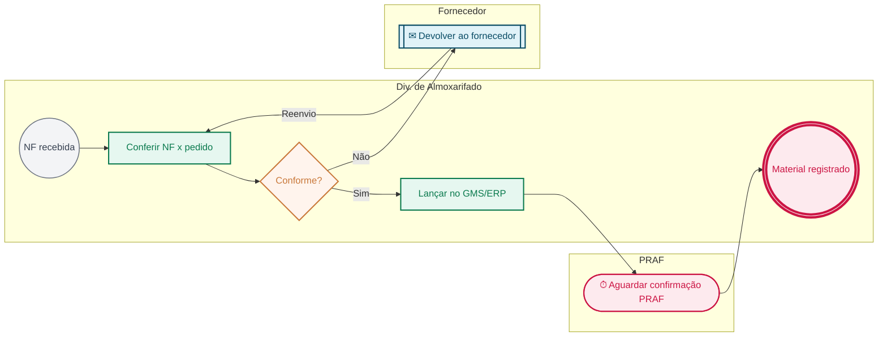

# 04 — Fluxograma BPMN 2.0 (padrão Anne Bail, UNIOESTE Foz)

## Regras obrigatórias (herdadas do Canvas Vivo)

| Elemento | `tipo` | Símbolo | Cor (borda / fundo) | Uso |
|---|---|---|---|---|
| Início | `inicio` | círculo de borda fina | `#6b7280` / `#f3f4f6` (cinza) | evento que dispara o processo (gatilho) |
| Atividade | `atividade` | retângulo | `#0B7A4E` / `#E6F7F0` (verde) | tarefa/ação de um passo |
| Decisão | `decisao` | losango | `#C9783A` / `#FFF4ED` (laranja) | bifurcação com rótulos "Sim"/"Não" nas conexões |
| Fim | `fim` | círculo de borda grossa | `#CC1544` / `#FDEAEE` (vermelho) | encerramento (pode haver mais de um) |
| Pausa/Espera | `pausa` | círculo com relógio ⏱ | `#CC1544` / `#FDEAEE` | espera por retorno externo, prazo, devolução |
| Captura inter-setor | `captura` | círculo com carta ✉ | `#0B4D66` / `#E0F2F8` (azul) | passagem para outro setor/contexto |

- **Uma raia por ator/setor responsável**; a raia proprietária é o contexto delimitado do POP.
- **Não cruzar setas nem sobrepor** elementos; ordenar raias pela ordem de entrada no fluxo.
- Fonte Noto Sans: 14 negrito no nome do processo, 16 negrito no nome da raia (Miro).
- Mínimo de **5 elementos**: 1 início, ≥ 2 atividades, ≥ 1 fim; cada interface do mapa de contexto gera 1 `captura`.
- Ids de elementos: `e1, e2, …`; conexões referenciam ids existentes; decisões saem com rótulos.

## Esquema JSON (`bpmn_spec`, idêntico ao do app)

```json
{
  "raias": ["Div. de Almoxarifado", "Fornecedor", "PRAF"],
  "elementos": [
    {"id": "e1", "tipo": "inicio", "label": "NF recebida", "raia": "Div. de Almoxarifado"},
    {"id": "e2", "tipo": "atividade", "label": "Conferir NF x pedido", "raia": "Div. de Almoxarifado"},
    {"id": "e3", "tipo": "decisao", "label": "Conforme?", "raia": "Div. de Almoxarifado"},
    {"id": "e4", "tipo": "captura", "label": "Devolver ao fornecedor", "raia": "Fornecedor"},
    {"id": "e5", "tipo": "atividade", "label": "Lançar no GMS/ERP", "raia": "Div. de Almoxarifado"},
    {"id": "e6", "tipo": "pausa", "label": "Aguardar confirmação PRAF", "raia": "PRAF"},
    {"id": "e7", "tipo": "fim", "label": "Material registrado", "raia": "Div. de Almoxarifado"}
  ],
  "conexoes": [
    {"de": "e1", "para": "e2"}, {"de": "e2", "para": "e3"},
    {"de": "e3", "para": "e4", "label": "Não"}, {"de": "e3", "para": "e5", "label": "Sim"},
    {"de": "e4", "para": "e2", "label": "Reenvio"}, {"de": "e5", "para": "e6"}, {"de": "e6", "para": "e7"}
  ],
  "observacoes_construcao_miro": "3 raias horizontais; decisão com saídas Sim (direita) e Não (abaixo)."
}
```

## Mapeamento Mermaid (gerado por `scripts/bpmn_mermaid.py` e por `popToMermaidFlow()` no app)

| `tipo` | Sintaxe Mermaid | Classe |
|---|---|---|
| `inicio` | `e1(("NF recebida"))` | `inicio` |
| `atividade` | `e2["Conferir NF x pedido"]` | `atividade` |
| `decisao` | `e3{"Conforme?"}` | `decisao` |
| `fim` | `e7((("Material registrado")))` | `fim` |
| `pausa` | `e6(["⏱ Aguardar confirmação PRAF"])` | `pausa` |
| `captura` | `e4[["✉ Devolver ao fornecedor"]]` | `captura` |



Regras do gerador: um `subgraph` por raia na ordem de primeira aparição; rótulos escapados com aspas; conexões dentro da mesma raia podem ser encadeadas; conexões entre raias ficam fora dos `subgraph`; `classDef` sempre presentes; direção `LR` (fluxograma) e `TD` (organograma).

## Organograma (seção 2)

`graph TD` com o caminho completo Direção Geral → setor nível 1 → setor nível 2 → **processo** (nó destacado com `classDef destaque fill:#FDEAEE,stroke:#CC1544,stroke-width:3px`), incluindo os setores-irmãos do nível 2 apenas quando houver interface no mapa de contexto.

## Regras incorporadas na v1.1 (lições aprovadas em 2026-09-03)

- **Pausa dedicada (L-011).** Todo prazo de espera explícito ("aguardar N dias", "aguardar retorno") gera um elemento `pausa` próprio e, quando houver condição de prosseguimento, uma `decisao` com conexões "Sim"/"Não"; nunca fundir a espera com a atividade seguinte.
- **Fluxo inferido × evidenciado (L-018).** Em POPs sem evidência (rascunho), reconstruir o fluxograma com `bpmn_delta.regenerar_de_passos` (raias derivadas do responsável de cada passo; `captura` a partir do mapa de contexto). A reconstrução manual (`elementos_rm` + `raias_add` + `elementos_add`) fica reservada a POPs evidenciados, pois `raias_add` implica mudança `major`.
- **Ordem das raias.** Para reordenar raias pela ordem de entrada no fluxo, usar `bpmn_delta.raias_ordem`.
