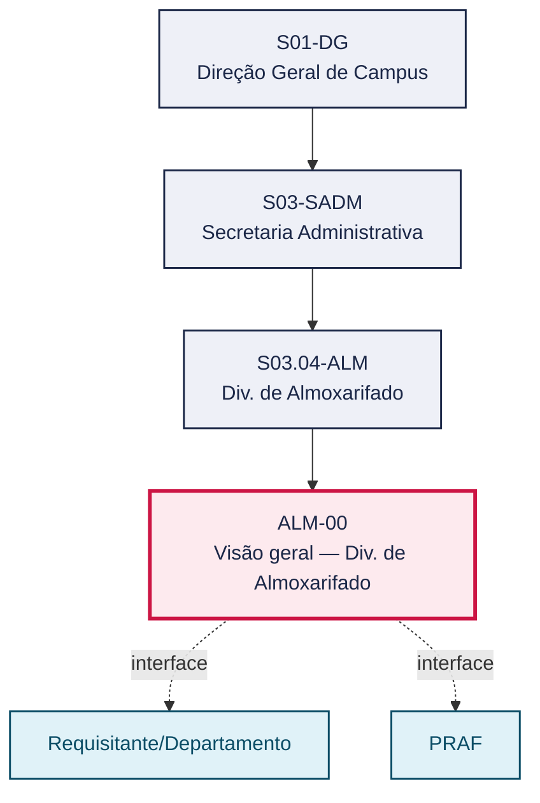

# POP ALM-00 — Visão geral — Div. de Almoxarifado

> **Documento vivo** · ATDG — Assessoria Técnica da Direção Geral · UNIOESTE Campus Foz do Iguaçu · Formato DDD híbrido + BPMN 2.0 padrão Anne Bail · Versão **1.0.0** · Status **em_validacao** · Atualizado em 2026-09-03

## 0. Cabeçalho DDD

| Divisão | Departamento | Descrição |
|---|---|---|
| Secretaria Administrativa | Div. de Almoxarifado | Consolida, para a equipe da Divisão de Almoxarifado e para fins de auditoria (PRAF/TCE-PR), a visão geral dos 8 processos do setor — do recebimento ao desfazimento de materiais de consumo — integrando o Manual de Gestão (regras) e o Manual de Mapeamento de Processos (fluxos e indicadores). |

| Domínio | Subdomínio | Tipo | Contexto delimitado |
|---|---|---|---|
| Suprimentos e Materiais | Visão geral consolidada dos processos do Almoxarifado (playbook) | core | S03.04-ALM |

### 0.3 Linguagem ubíqua (glossário do processo)

| Termo | Definição | Sistema |
|---|---|---|
| GMS/ERP | Sistema de gestão de materiais/ERP institucional usado para registrar recebimento, armazenagem, distribuição, inventário, conciliação e baixa de materiais do Almoxarifado. | GMS/ERP |
| PRAF | Instância responsável pela confirmação e acompanhamento da conformidade dos processos de materiais do Almoxarifado, conforme os Manuais de Gestão e de Mapeamento. | — |
| Playbook do Almoxarifado | Conjunto dos 8 processos operacionais do setor (ALM-01 a ALM-08), descritos em BPMN 2.0 a partir do Manual de Gestão e do Manual de Mapeamento de Processos. | — |

## 1. Identificação

| Campo | Valor |
|---|---|
| Código | ALM-00 |
| Setor | Div. de Almoxarifado (`S03.04-ALM`) |
| Responsável (função) | Chefe da Divisão de Almoxarifado |
| Periodicidade | Consulta contínua; revisão sempre que houver alteração relevante em algum dos 8 processos (ALM-01 a ALM-08) |
| Subordinação | Secretaria Administrativa |
| Normativa | Manuais de Gestão e de Mapeamento do Almoxarifado; legislação federal de materiais; normativas TCE-PR; Lei nº 14.133/2021 (Lei de Licitações e Contratos Administrativos), no que for pertinente às contratações que originam os materiais recebidos e ao desfazimento/alienação de bens |
| Produto ATDG | POP |
| Pasta OneDrive | 03_MAPEAMENTO DE PROCESSOS |
| Fontes (entradas do Canvas) | pb-almoxarifado, 1780963200000, 1780963200001 |
| Lacunas abertas | formulario |
| Agente responsável | — (não moldado) |

## 2. Organograma

## 3. Playbook

### 3.1 Gatilho (evento de domínio)

**Necessidade de orientação consolidada sobre o funcionamento do Almoxarifado (integração de servidor, auditoria, revisão de processo)** — origem: Chefe da Divisão de Almoxarifado, PRAF ou novo servidor do setor

### 3.2 Entrada

- Necessidade de consulta ao funcionamento consolidado do Almoxarifado (integração de servidor, auditoria, revisão de processo)

### 3.3 Passo a passo

| Nº | Ação | Responsável | Sistema | Artefato | Prazo | Evento |
|---|---|---|---|---|---|---|
| 1 | Recebimento de materiais (conferência da NF, quantitativa e qualitativa, lançamento no GMS/ERP) | Chefe da Divisão de Almoxarifado | GMS/ERP | Termo de recebimento / NF conferida (ver ALM-01) | Conforme o POP ALM-01 (a definir) | Material conferido e registrado no GMS/ERP |
| 2 | Armazenagem e guarda | Chefe da Divisão de Almoxarifado | GMS/ERP | Mapa de estoque (ver ALM-02) | Conforme o POP ALM-02 (a definir) | Material armazenado e localizado no mapa de estoque |
| 3 | Distribuição para departamentos | Chefe da Divisão de Almoxarifado | GMS/ERP | Requisição de material atendida (ver ALM-03) | Conforme o POP ALM-03 (a definir) | Material entregue ao requisitante e baixa registrada |
| 4 | Realizar inventário rotativo (contagem periódica por amostragem) do estoque | Chefe da Divisão de Almoxarifado | GMS/ERP | Relatório de inventário rotativo (ver ALM-04) | Mensal, conforme checklist de supervisão (POP ALM-04) | Divergências do inventário rotativo apuradas e regularizadas |
| 5 | Realizar inventário geral anual do estoque físico | Chefe da Divisão de Almoxarifado | GMS/ERP | Relatório de inventário geral (ver ALM-05) | Anual, conforme o POP ALM-05 (a definir) | Inventário geral concluído e relatório emitido |
| 6 | Conciliação físico-contábil | Chefe da Divisão de Almoxarifado | GMS/ERP | Relatório de conciliação físico-contábil (ver ALM-06) | Conforme o POP ALM-06 (a definir) | Saldos físico e contábil conciliados |
| 7 | Desfazimento regulamentado de inservíveis | Chefe da Divisão de Almoxarifado | GMS/ERP | Termo de desfazimento (ver ALM-07) | Conforme necessidade, sob o POP ALM-07 (a definir) | Baixa de material inservível formalizada |
| 8 | Relatórios e prestação de contas | Chefe da Divisão de Almoxarifado | GMS/ERP | Relatório de prestação de contas (ver ALM-08) | Mensal/anual, conforme o POP ALM-08 (a definir) | Relatório de prestação de contas emitido e encaminhado |

### 3.4 Saída (entregáveis)

- Visão consolidada dos 8 processos do Almoxarifado, com remissão aos POPs específicos (ALM-01 a ALM-08)

## 4. Formulários e artefatos (agregados)

| Nome | Tipo | Sistema | Campos-chave | Preenchimento |
|---|---|---|---|---|
| Manual de Gestão do Almoxarifado | documento | — | normas, responsabilidades, procedimentos | Chefe da Divisão de Almoxarifado |
| Manual de Mapeamento de Processos do Almoxarifado | documento | — | fluxos, indicadores, riscos por processo | Chefe da Divisão de Almoxarifado |

## 5. Decisões, exceções e pontos de atenção

| Decisão | Condição | Sim → | Não → |
|---|---|---|---|
| A necessidade envolve um dos 8 processos específicos do Almoxarifado? | Consulta à visão geral (ALM-00) | Consultar o POP específico correspondente (ALM-01 a ALM-08) | Escalar à Chefia da Divisão de Almoxarifado |

**Pontos de atenção**

- Material só vai ao armazenamento definitivo após registro no sistema
- Conhecimento obrigatório de toda a equipe do setor
- Sujeito a auditorias e conformidade TCE-PR/PRAF
- Cada um dos 8 processos específicos (ALM-01 a ALM-08) tem responsável, sistema, artefatos e prazo próprios; este documento é apenas a visão consolidada
- Alterações em qualquer processo específico devem ser refletidas nesta visão geral (ALM-00) para evitar divergência entre os documentos

## 6. Contingência

- Indisponibilidade do GMS/ERP: registrar as movimentações provisoriamente em planilha de controle e lançar retroativamente no sistema assim que restabelecido
- Dúvida sobre qual POP específico se aplica a uma situação concreta: consultar a Chefia da Divisão de Almoxarifado antes de agir
- Divergência entre esta visão geral e um POP específico: prevalece o POP específico (ALM-01 a ALM-08); reportar a divergência à Chefia para atualização deste documento

## 7. Checklist

- ( ) Os 8 processos específicos (ALM-01 a ALM-08) estão referenciados e resumidos nesta visão geral
- ( ) Cada processo específico tem POP próprio vigente e acessível à equipe do setor
- ( ) Equipe do setor conhece o Manual de Gestão e o Manual de Mapeamento de Processos
- ( ) Data de atualização desta visão geral é posterior à última atualização de cada POP específico

## 8. KPI / Indicadores

| Indicador | Fórmula | Meta | Fonte |
|---|---|---|---|
| Percentual de processos do Almoxarifado com POP aprovado | Nº de POPs (ALM-01 a ALM-08) em status aprovado / 8 | A definir | Canvas Vivo ATDG |
| Percentual de conformidade nas auditorias PRAF/TCE-PR sobre o Almoxarifado | Nº de apontamentos sanados / Nº de apontamentos totais no período | A definir | Relatórios de auditoria PRAF/TCE-PR |

## 9. Mapa de contexto (interfaces inter-setoriais)

| Origem | Relação | Destino | Artefato | Canal |
|---|---|---|---|---|
| Requisitante/Departamento | fornece | Div. de Almoxarifado | Requisição de material | GMS/ERP |
| PRAF | informa | Div. de Almoxarifado | Diretrizes e resultados de auditoria | e-Protocolo |

## 10. Fluxograma (BPMN 2.0 — padrão Anne Bail)

## 11. Especificação BPMN para o Miro

**Raias:** Chefe da Divisão de Almoxarifado

| Id | Tipo | Elemento | Raia |
|---|---|---|---|
| e1 | inicio | Necessidade de orientação consolidada sobre o funcionamento do Almoxarifado (integração de servidor, auditoria, revisão de processo) | Chefe da Divisão de Almoxarifado |
| e2 | atividade | Recebimento de materiais (conferência da NF, quantitativa e qualitativa, lançamento no GMS/ERP) | Chefe da Divisão de Almoxarifado |
| e3 | atividade | Armazenagem e guarda | Chefe da Divisão de Almoxarifado |
| e4 | atividade | Distribuição para departamentos | Chefe da Divisão de Almoxarifado |
| e5 | atividade | Realizar inventário rotativo (contagem periódica por amostragem) do estoque | Chefe da Divisão de Almoxarifado |
| e6 | atividade | Realizar inventário geral anual do estoque físico | Chefe da Divisão de Almoxarifado |
| e7 | atividade | Conciliação físico-contábil | Chefe da Divisão de Almoxarifado |
| e8 | atividade | Desfazimento regulamentado de inservíveis | Chefe da Divisão de Almoxarifado |
| e9 | atividade | Relatórios e prestação de contas | Chefe da Divisão de Almoxarifado |
| e10 | fim | Visão consolidada dos 8 processos do Almoxarifado, com remissão aos POPs específicos (ALM-01 a ALM-08) | Chefe da Divisão de Almoxarifado |

| De | Para | Rótulo |
|---|---|---|
| e1 | e2 | — |
| e2 | e3 | — |
| e3 | e4 | — |
| e4 | e5 | — |
| e5 | e6 | — |
| e6 | e7 | — |
| e7 | e8 | — |
| e8 | e9 | — |
| e9 | e10 | — |

_Especificação gerada a partir dos passos do POP; 1 raia(s). Revisar decisões e pausas antes de construir no Miro._

## 12. Histórico de versões

| Versão | Data | Autor | Tipo | Mudanças | Fontes |
|---|---|---|---|---|---|
| 0.1.0 | 2026-09-02 | scripts/scaffold_pops.py | patch | Esqueleto inicial gerado deterministicamente a partir das entradas pb-almoxarifado | pb-almoxarifado |
| 1.0.0 | 2026-09-03 | agente:construtor-pop (lote ALM) | major | Passo 1 alterado (responsavel, sistema, artefato, prazo, evento); Passo 2 alterado (responsavel, sistema, artefato, prazo, evento); Passo 3 alterado (responsavel, sistema, artefato, prazo, evento); Passo 4 alterado (acao, responsavel, sistema, artefato, prazo, evento); Passo 5 alterado (responsavel, sistema, artefato, prazo, evento); Passo 6 alterado (responsavel, sistema, artefato, prazo, evento); Passo 7 alterado (responsavel, sistema, artefato, prazo, evento); Passo adicionado após 4: Realizar inventário geral anual do estoque físico; entrada_nova: +1; saida_nova: +1; artefatos_novos: +2; decisoes_novas: +1; kpis_novos: +2; mapa_contexto_novo: +2; pontos_atencao_novos: +2; contingencia_nova: +3; checklist_novo: +4; glossario_novo: +3; normativa_nova: +1; Campo ddd.descricao atualizado; Campo ddd.subdominio atualizado; Campo identificacao.responsavel atualizado; Campo identificacao.periodicidade atualizado; Campo playbook.gatilho atualizado; Campo observacoes atualizado; Fluxograma regenerado a partir dos passos; Status promovido a em_validacao (≥ 3 passos e responsável definido) | pb-almoxarifado, 1780963200000, 1780963200001 |

## 13. Validação e aprovação

| Papel | Função / unidade | Data |
|---|---|---|
| Elaboração | ATDG — Assessoria Técnica da Direção Geral | 2026-09-02 |
| Revisão | A definir (responsável do setor) | ___/___/______ |
| Aprovação | Direção Geral do Campus | ___/___/______ |

## 14. Lições incorporadas

- **L-001** — Referir sempre função/cargo; nomes apenas no bloco 13 (Validação), com anuência (LGPD).
- **L-004** — Nunca regenerar POP existente: aplicar patch com changelog, fontes e versão.
- **L-006** — Preservar códigos legados como códigos de processo; não renumerar.
- **L-007** — Referência Externa é benchmark; normativa do POP só cita atos da Unioeste, do Estado do Paraná ou federais aplicáveis.
- **L-002** — Um passo = uma ação; ações compostas viram passos distintos.
- **L-003** — Cada linha do mapa de contexto gera um elemento `captura` no BPMN e um passo na raia de destino.

> **Observações:** Inferência a validar com a Chefia do Almoxarifado: (1) atribuição da Chefia como responsável único desta visão geral (os 8 processos específicos podem ter responsáveis distintos, definidos em cada POP ALM-01 a ALM-08); (2) uso do e-Protocolo como canal padrão de comunicação com a PRAF, não citado nominalmente pelos manuais-fonte; (3) desmembramento do passo original "Inventário rotativo e geral" em dois passos distintos (rotativo e geral), para alinhar 1:1 com os POPs ALM-04 e ALM-05.

---
_Canvas Vivo — Base de Conhecimento Institucional · ATDG · UNIOESTE Campus Foz do Iguaçu · gerado por `scripts/render_pop.py` a partir de `pops/ALM/ALM-00.pop.json` (diretrizes v1.0)._
