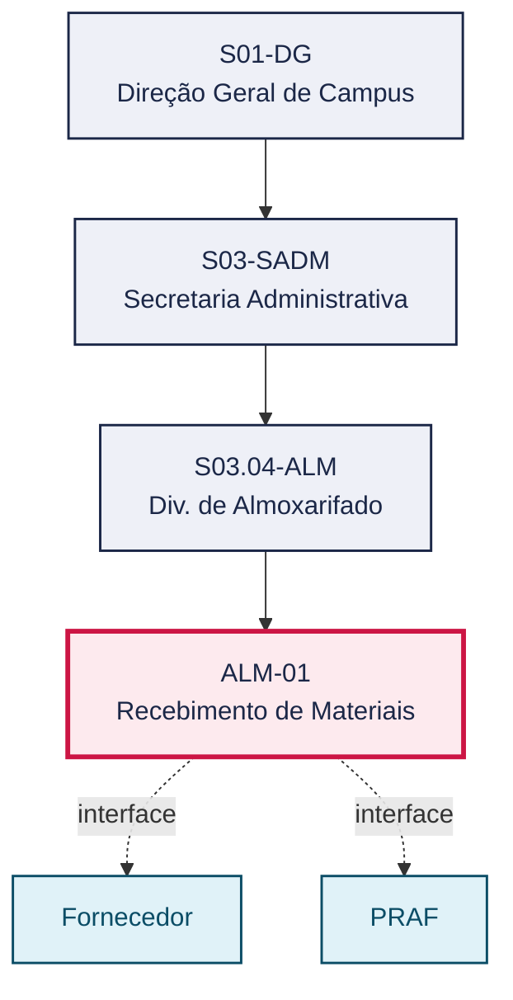
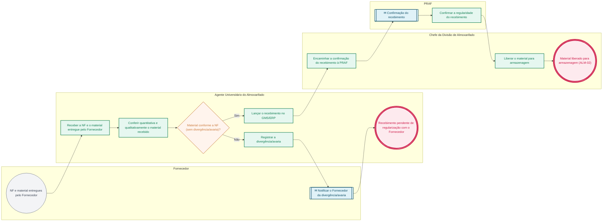

# POP ALM-01 — Recebimento de Materiais

> **Documento vivo** · ATDG — Assessoria Técnica da Direção Geral · UNIOESTE Campus Foz do Iguaçu · Formato DDD híbrido + BPMN 2.0 padrão Anne Bail · Versão **1.1.0** · Status **em_validacao** · Atualizado em 2026-09-03

## 0. Cabeçalho DDD

| Divisão | Departamento | Descrição |
|---|---|---|
| Secretaria Administrativa | Div. de Almoxarifado | Recebe e confere, quantitativa e qualitativamente, os materiais de consumo entregues pelo Fornecedor contra a Nota Fiscal, lança o recebimento no GMS/ERP e obtém a confirmação da PRAF antes do encaminhamento à armazenagem (ALM-02), conforme o Manual de Gestão do Almoxarifado. |

| Domínio | Subdomínio | Tipo | Contexto delimitado |
|---|---|---|---|
| Suprimentos e Materiais | Recebimento e conferência de materiais de consumo | core | S03.04-ALM |

### 0.3 Linguagem ubíqua (glossário do processo)

| Termo | Definição | Sistema |
|---|---|---|
| NF | Nota Fiscal que acompanha o material entregue pelo Fornecedor, base da conferência de recebimento. | — |
| Conferência de recebimento | Verificação quantitativa e qualitativa do material recebido em relação à Nota Fiscal. | GMS/ERP |

## 1. Identificação

| Campo | Valor |
|---|---|
| Código | ALM-01 |
| Setor | Div. de Almoxarifado (`S03.04-ALM`) |
| Responsável (função) | Chefe da Divisão de Almoxarifado |
| Periodicidade | Conforme o recebimento de materiais (sob demanda, contínuo) |
| Subordinação | Secretaria Administrativa |
| Normativa | Manual de Gestão do Almoxarifado — Materiais de Consumo (Unioeste Foz); Manual de Mapeamento de Processos do Almoxarifado (Unioeste Foz); Lei nº 14.133/2021 (Lei de Licitações e Contratos Administrativos), no que for pertinente ao recebimento de materiais decorrentes de contratações públicas |
| Produto ATDG | POP |
| Pasta OneDrive | 03_MAPEAMENTO DE PROCESSOS |
| Fontes (entradas do Canvas) | pb-almoxarifado, 1780963200000, 1780963200001 |
| Lacunas abertas | nenhuma |
| Agente responsável | pop-alm-01 |

## 2. Organograma

## 3. Playbook

### 3.1 Gatilho (evento de domínio)

**Chegada de material acompanhado de Nota Fiscal, entregue pelo Fornecedor no Almoxarifado** — origem: Fornecedor

### 3.2 Entrada

- Nota Fiscal e material entregues pelo Fornecedor

### 3.3 Passo a passo

| Nº | Ação | Responsável | Sistema | Artefato | Prazo | Evento |
|---|---|---|---|---|---|---|
| 1 | Receber a Nota Fiscal (NF) e o material entregue pelo Fornecedor | Agente Universitário do Almoxarifado | — | Nota Fiscal | No ato da entrega | Material e NF recebidos |
| 2 | Conferir quantitativa e qualitativamente o material recebido em relação à NF | Agente Universitário do Almoxarifado | GMS/ERP | Formulário de conferência de recebimento | No ato do recebimento | Conferência registrada |
| 3 | Verificar a conformidade entre o material recebido e a NF | Agente Universitário do Almoxarifado | GMS/ERP | Formulário de conferência de recebimento | No ato do recebimento | Conformidade verificada |
| 4 | Registrar a divergência ou avaria identificada e notificar o Fornecedor para providências | Agente Universitário do Almoxarifado | GMS/ERP | Registro de divergência/avaria | A definir | Divergência registrada e Fornecedor notificado |
| 5 | Lançar o recebimento no GMS/ERP | Agente Universitário do Almoxarifado | GMS/ERP | Termo de recebimento | No ato da conferência | Material registrado no GMS/ERP |
| 6 | Encaminhar a confirmação do recebimento à PRAF | Chefe da Divisão de Almoxarifado | e-Protocolo | Termo de recebimento | A definir | Confirmação encaminhada à PRAF |
| 7 | Confirmar a regularidade do recebimento | PRAF | e-Protocolo | Confirmação da PRAF | A definir | Recebimento confirmado pela PRAF |
| 8 | Liberar o material para encaminhamento à armazenagem | Chefe da Divisão de Almoxarifado | GMS/ERP | — | Após confirmação da PRAF | Material liberado para armazenagem (ALM-02) |

### 3.4 Saída (entregáveis)

- Material registrado no GMS/ERP e liberado para armazenagem (ALM-02)

## 4. Formulários e artefatos (agregados)

| Nome | Tipo | Sistema | Campos-chave | Preenchimento |
|---|---|---|---|---|
| Formulário de conferência de recebimento | formulario | GMS/ERP | nº da NF, quantidade conferida, divergências/avarias | Agente Universitário do Almoxarifado |
| Termo de recebimento | registro | GMS/ERP | nº da NF, Fornecedor, itens recebidos, data | Agente Universitário do Almoxarifado |
| Registro de divergência/avaria | registro | GMS/ERP | descrição da divergência, itens afetados, providência solicitada ao Fornecedor | Agente Universitário do Almoxarifado |

## 5. Decisões, exceções e pontos de atenção

| Decisão | Condição | Sim → | Não → |
|---|---|---|---|
| Material está em conformidade com a NF (sem divergência ou avaria)? | Conferência quantitativa e qualitativa do material recebido | Lançar o recebimento no GMS/ERP e seguir para confirmação da PRAF | Registrar a divergência/avaria e notificar o Fornecedor para providências |

**Pontos de atenção**

- Material só é encaminhado à armazenagem definitiva (ALM-02) após registro no GMS/ERP e confirmação da PRAF
- Toda divergência ou avaria identificada na conferência deve ser registrada antes do lançamento do recebimento

## 6. Contingência

- Indisponibilidade do GMS/ERP no ato do recebimento: registrar a conferência em planilha de controle e lançar no sistema assim que restabelecido
- Fornecedor não localizado para tratativa de divergência/avaria: escalar à Chefia da Divisão de Almoxarifado e, se pertinente, à Div. de Licitação
- PRAF não confirma o recebimento no prazo esperado: a Chefia da Divisão de Almoxarifado reitera a solicitação e registra o atraso

## 7. Checklist

- ( ) NF conferida quantitativa e qualitativamente contra o material recebido
- ( ) Divergências e avarias, quando houver, registradas e comunicadas ao Fornecedor
- ( ) Recebimento lançado no GMS/ERP antes do encaminhamento à armazenagem
- ( ) Confirmação da PRAF obtida e registrada antes da liberação do material

## 8. KPI / Indicadores

| Indicador | Fórmula | Meta | Fonte |
|---|---|---|---|
| Prazo médio de conferência do recebimento | Soma dos tempos entre chegada do material e lançamento no GMS/ERP / nº de recebimentos no período | A definir | GMS/ERP |
| Percentual de recebimentos com divergência/avaria | Nº de recebimentos com divergência ou avaria / nº total de recebimentos no período | A definir | GMS/ERP |

## 9. Mapa de contexto (interfaces inter-setoriais)

| Origem | Relação | Destino | Artefato | Canal |
|---|---|---|---|---|
| Fornecedor | fornece | Div. de Almoxarifado | Nota Fiscal e material | Entrega presencial |
| Div. de Almoxarifado | valida | PRAF | Termo de recebimento | e-Protocolo |
| Div. de Almoxarifado | informa | Fornecedor | Registro de divergência/avaria | Contato direto com o Fornecedor (a definir) |

## 10. Fluxograma (BPMN 2.0 — padrão Anne Bail)

## 11. Especificação BPMN para o Miro

**Raias:** Div. de Almoxarifado · Fornecedor · Agente Universitário do Almoxarifado · Chefe da Divisão de Almoxarifado · PRAF

| Id | Tipo | Elemento | Raia |
|---|---|---|---|
| e1 | inicio | NF e material entregues pelo Fornecedor | Fornecedor |
| e2 | atividade | Receber a NF e o material entregue pelo Fornecedor | Agente Universitário do Almoxarifado |
| e3 | atividade | Conferir quantitativa e qualitativamente o material recebido | Agente Universitário do Almoxarifado |
| e4 | decisao | Material conforme a NF (sem divergência/avaria)? | Agente Universitário do Almoxarifado |
| e5 | atividade | Registrar a divergência/avaria | Agente Universitário do Almoxarifado |
| e6 | captura | Notificar o Fornecedor da divergência/avaria | Fornecedor |
| e7 | fim | Recebimento pendente de regularização com o Fornecedor | Agente Universitário do Almoxarifado |
| e8 | atividade | Lançar o recebimento no GMS/ERP | Agente Universitário do Almoxarifado |
| e9 | atividade | Encaminhar a confirmação do recebimento à PRAF | Chefe da Divisão de Almoxarifado |
| e10 | captura | Confirmação do recebimento | PRAF |
| e11 | atividade | Confirmar a regularidade do recebimento | PRAF |
| e12 | atividade | Liberar o material para armazenagem | Chefe da Divisão de Almoxarifado |
| e13 | fim | Material liberado para armazenagem (ALM-02) | Chefe da Divisão de Almoxarifado |

| De | Para | Rótulo |
|---|---|---|
| e1 | e2 | — |
| e2 | e3 | — |
| e3 | e4 | — |
| e4 | e5 | Não |
| e5 | e6 | — |
| e6 | e7 | — |
| e4 | e8 | Sim |
| e8 | e9 | — |
| e9 | e10 | — |
| e10 | e11 | — |
| e11 | e12 | — |
| e12 | e13 | — |

_Especificação gerada a partir dos passos do POP; 1 raia(s). Revisar decisões e pausas antes de construir no Miro._

## 12. Histórico de versões

| Versão | Data | Autor | Tipo | Mudanças | Fontes |
|---|---|---|---|---|---|
| 0.1.0 | 2026-09-02 | scripts/scaffold_pops.py | patch | Esqueleto inicial gerado deterministicamente a partir do escopo "Entrada, conferência, NF, PRAF" | — |
| 1.0.0 | 2026-09-03 | agente:construtor-pop (lote ALM) | major | Passo adicionado após 7: Liberar o material para encaminhamento à armazenagem; Passo adicionado após 6: Confirmar a regularidade do recebimento; Passo adicionado após 5: Encaminhar a confirmação do recebimento à PRAF; Passo adicionado após 4: Lançar o recebimento conforme no GMS/ERP; Passo adicionado após 3: Registrar a divergência ou avaria identificada e notificar o Fornecedor para pro; Passo adicionado após 2: Verificar a conformidade entre o material recebido e a NF; Passo adicionado após 1: Conferir quantitativa e qualitativamente o material recebido em relação à NF; Passo adicionado após 0: Receber a Nota Fiscal (NF) e o material entregue pelo Fornecedor; entrada_nova: +1; saida_nova: +1; artefatos_novos: +3; decisoes_novas: +1; kpis_novos: +2; mapa_contexto_novo: +3; pontos_atencao_novos: +2; contingencia_nova: +3; checklist_novo: +4; glossario_novo: +2; normativa_nova: +3; Campo ddd.descricao atualizado; Campo ddd.subdominio atualizado; Campo identificacao.responsavel atualizado; Campo identificacao.periodicidade atualizado; Campo playbook.gatilho atualizado; Campo observacoes atualizado; Raias adicionadas: Fornecedor, Agente Universitário do Almoxarifado, Chefe da Divisão de Almoxarifado, PRAF; Elementos BPMN removidos: e1, e2; Elementos BPMN adicionados: 13; Status promovido a em_validacao (≥ 3 passos e responsável definido) | pb-almoxarifado, 1780963200000, 1780963200001 |
| 1.1.0 | 2026-09-03 | agente:construtor-pop (lote ALM) | minor | Passo 2 alterado (acao, responsavel, sistema, artefato, prazo, evento); Passo 3 alterado (acao, responsavel, sistema, artefato, prazo, evento); Passo 4 alterado (acao, responsavel, sistema, artefato, prazo, evento); Passo 5 alterado (acao, responsavel, sistema, artefato, prazo, evento); Passo 6 alterado (acao, responsavel, sistema, artefato, prazo, evento); Passo 7 alterado (acao, responsavel, sistema, artefato, prazo, evento); Passo 8 alterado (acao, responsavel, sistema, artefato, prazo, evento) | pb-almoxarifado, 1780963200000, 1780963200001 |

## 13. Validação e aprovação

| Papel | Função / unidade | Data |
|---|---|---|
| Elaboração | ATDG — Assessoria Técnica da Direção Geral | 2026-09-02 |
| Revisão | A definir (responsável do setor) | ___/___/______ |
| Aprovação | Direção Geral do Campus | ___/___/______ |

## 14. Lições incorporadas

- **L-001** — Referir sempre função/cargo; nomes apenas no bloco 13 (Validação), com anuência (LGPD).
- **L-004** — Nunca regenerar POP existente: aplicar patch com changelog, fontes e versão.
- **L-006** — Preservar códigos legados como códigos de processo; não renumerar.
- **L-007** — Referência Externa é benchmark; normativa do POP só cita atos da Unioeste, do Estado do Paraná ou federais aplicáveis.
- **L-002** — Um passo = uma ação; ações compostas viram passos distintos.
- **L-003** — Cada linha do mapa de contexto gera um elemento `captura` no BPMN e um passo na raia de destino.

> **Observações:** Inferência a validar com a Chefia do Almoxarifado: (1) sequência exata de conferência/lançamento/confirmação PRAF, pois os manuais-fonte descrevem o processo em nível macro, sem passo a passo linha a linha; (2) canal de notificação do Fornecedor em caso de divergência/avaria (e-mail institucional ou outro, a confirmar); (3) prazos internos (contingência, notificação, confirmação PRAF), ainda não normatizados nas fontes disponíveis.

---
_Canvas Vivo — Base de Conhecimento Institucional · ATDG · UNIOESTE Campus Foz do Iguaçu · gerado por `scripts/render_pop.py` a partir de `pops/ALM/ALM-01.pop.json` (diretrizes v1.0)._
