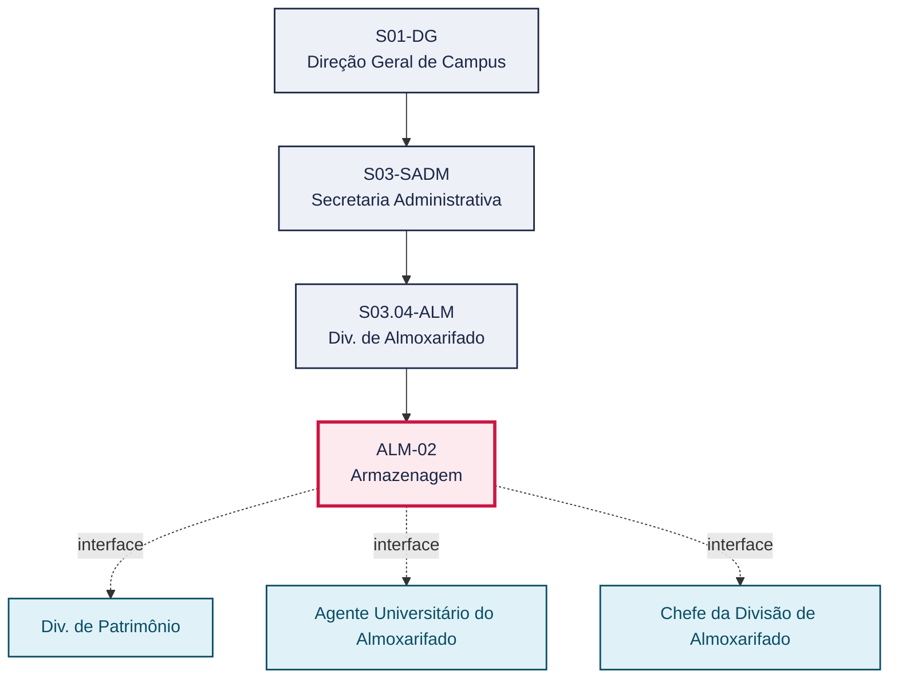
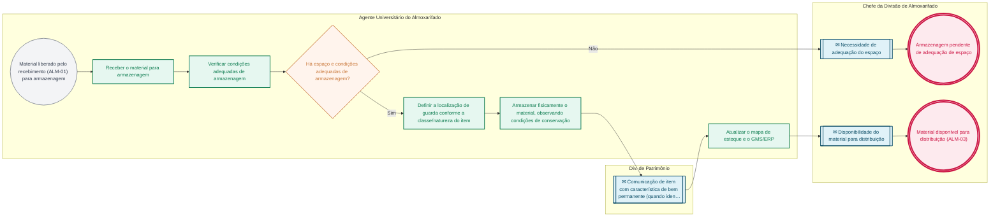

# POP ALM-02 — Armazenagem

> **Documento vivo** · ATDG — Assessoria Técnica da Direção Geral · UNIOESTE Campus Foz do Iguaçu · Formato DDD híbrido + BPMN 2.0 padrão Anne Bail · Versão **1.0.0** · Status **em_validacao** · Atualizado em 2026-09-03

## 0. Cabeçalho DDD

| Divisão | Departamento | Descrição |
|---|---|---|
| Secretaria Administrativa | Div. de Almoxarifado | Organiza, localiza e conserva no espaço físico do Almoxarifado os materiais liberados pelo recebimento (ALM-01), mantendo o mapa de estoque atualizado no GMS/ERP até a distribuição (ALM-03), conforme o Manual de Gestão do Almoxarifado. |

| Domínio | Subdomínio | Tipo | Contexto delimitado |
|---|---|---|---|
| Suprimentos e Materiais | Armazenagem e guarda de materiais de consumo | core | S03.04-ALM |

### 0.3 Linguagem ubíqua (glossário do processo)

| Termo | Definição | Sistema |
|---|---|---|
| Mapa de estoque | Registro que relaciona cada item armazenado à sua localização física e quantidade no Almoxarifado. | GMS/ERP |
| Bem permanente | Item cuja natureza o classifica como patrimônio (bem permanente) em vez de material de consumo, devendo ser comunicado à Div. de Patrimônio. | — |

## 1. Identificação

| Campo | Valor |
|---|---|
| Código | ALM-02 |
| Setor | Div. de Almoxarifado (`S03.04-ALM`) |
| Responsável (função) | Chefe da Divisão de Almoxarifado |
| Periodicidade | Contínua, conforme o fluxo de materiais liberados pelo recebimento (ALM-01) |
| Subordinação | Secretaria Administrativa |
| Normativa | Manual de Gestão do Almoxarifado — Materiais de Consumo (Unioeste Foz); Manual de Mapeamento de Processos do Almoxarifado (Unioeste Foz) |
| Produto ATDG | POP |
| Pasta OneDrive | 03_MAPEAMENTO DE PROCESSOS |
| Fontes (entradas do Canvas) | pb-almoxarifado, 1780963200000, 1780963200001 |
| Lacunas abertas | nenhuma |
| Agente responsável | pop-alm-02 |

## 2. Organograma

## 3. Playbook

### 3.1 Gatilho (evento de domínio)

**Material liberado pelo recebimento (ALM-01), registrado no GMS/ERP** — origem: ALM-01 Recebimento de Materiais

### 3.2 Entrada

- Material liberado pelo recebimento (ALM-01), registrado no GMS/ERP

### 3.3 Passo a passo

| Nº | Ação | Responsável | Sistema | Artefato | Prazo | Evento |
|---|---|---|---|---|---|---|
| 1 | Receber o material liberado pelo recebimento (ALM-01) para armazenagem | Agente Universitário do Almoxarifado | GMS/ERP | — | Após liberação do recebimento (ALM-01) | Material recebido para armazenagem |
| 2 | Verificar se há espaço e condições adequadas de armazenagem para o item (validade, incompatibilidade, umidade) | Agente Universitário do Almoxarifado | — | Formulário de verificação de condições de armazenagem | No ato da armazenagem | Condições de armazenagem verificadas |
| 3 | Sinalizar à Chefia a necessidade de adequação do espaço de armazenagem, quando aplicável | Agente Universitário do Almoxarifado | — | Comunicação interna (a definir) | A definir | Necessidade de adequação sinalizada |
| 4 | Definir a localização de guarda conforme a classe/natureza do item | Agente Universitário do Almoxarifado | planilha de controle | Mapa de estoque | No ato da armazenagem | Localização definida |
| 5 | Armazenar fisicamente o material, observando condições de conservação (validade, empilhamento, umidade, incompatibilidade entre itens) | Agente Universitário do Almoxarifado | — | — | No ato da armazenagem | Material armazenado |
| 6 | Atualizar o mapa de estoque e o GMS/ERP com a localização e a quantidade armazenada | Agente Universitário do Almoxarifado | GMS/ERP | Mapa de estoque | No ato da armazenagem | Mapa de estoque atualizado |
| 7 | Comunicar à Chefia a disponibilidade do material para distribuição | Agente Universitário do Almoxarifado | GMS/ERP | — | Após atualização do mapa de estoque | Material disponível para distribuição (ALM-03) |

### 3.4 Saída (entregáveis)

- Material armazenado, localizado no mapa de estoque e disponível para distribuição (ALM-03)

## 4. Formulários e artefatos (agregados)

| Nome | Tipo | Sistema | Campos-chave | Preenchimento |
|---|---|---|---|---|
| Formulário de verificação de condições de armazenagem | formulario | — | item, validade, condição de conservação, localização sugerida | Agente Universitário do Almoxarifado |
| Mapa de estoque | registro | GMS/ERP | item, localização física, quantidade, data de atualização | Agente Universitário do Almoxarifado |

## 5. Decisões, exceções e pontos de atenção

| Decisão | Condição | Sim → | Não → |
|---|---|---|---|
| Há espaço e condições adequadas de armazenagem para o item (validade, incompatibilidade, umidade)? | Verificação das condições de armazenagem antes da guarda física | Definir a localização de guarda e armazenar o material | Sinalizar à Chefia da Divisão de Almoxarifado a necessidade de adequação do espaço |

**Pontos de atenção**

- Itens com prazo de validade devem ser posicionados observando critério de saída pela ordem de vencimento (a confirmar com a Chefia)
- Itens incompatíveis entre si não devem ser armazenados na mesma localização

## 6. Contingência

- Falta de espaço físico para armazenagem adequada: sinalizar à Chefia da Divisão de Almoxarifado para avaliação de espaço alternativo
- Indisponibilidade do GMS/ERP no ato da armazenagem: atualizar o mapa de estoque em planilha de controle e lançar no sistema assim que restabelecido
- Identificação de avaria durante a armazenagem, não detectada no recebimento: registrar a ocorrência e comunicar à Chefia da Divisão de Almoxarifado

## 7. Checklist

- ( ) Material armazenado apenas após liberação formal do recebimento (ALM-01)
- ( ) Condições de conservação (validade, umidade, incompatibilidade) verificadas antes da guarda física
- ( ) Mapa de estoque atualizado com localização e quantidade a cada armazenagem
- ( ) Itens com característica de bem permanente comunicados à Div. de Patrimônio

## 8. KPI / Indicadores

| Indicador | Fórmula | Meta | Fonte |
|---|---|---|---|
| Percentual de itens com localização registrada no mapa de estoque | Nº de itens localizados / nº total de itens em estoque | A definir | GMS/ERP |
| Percentual de perdas por avaria ou vencimento em estoque | Nº de itens baixados por avaria ou vencimento / nº total de itens armazenados no período | A definir | GMS/ERP |

## 9. Mapa de contexto (interfaces inter-setoriais)

| Origem | Relação | Destino | Artefato | Canal |
|---|---|---|---|---|
| Div. de Almoxarifado | informa | Div. de Patrimônio | Comunicação de item com característica de bem permanente identificado no estoque | e-Protocolo |
| Agente Universitário do Almoxarifado | informa | Chefe da Divisão de Almoxarifado | Disponibilidade do material para distribuição | GMS/ERP |

## 10. Fluxograma (BPMN 2.0 — padrão Anne Bail)

## 11. Especificação BPMN para o Miro

**Raias:** Div. de Almoxarifado · Agente Universitário do Almoxarifado · Chefe da Divisão de Almoxarifado · Div. de Patrimônio

| Id | Tipo | Elemento | Raia |
|---|---|---|---|
| e1 | inicio | Material liberado pelo recebimento (ALM-01) para armazenagem | Agente Universitário do Almoxarifado |
| e2 | atividade | Receber o material para armazenagem | Agente Universitário do Almoxarifado |
| e3 | atividade | Verificar condições adequadas de armazenagem | Agente Universitário do Almoxarifado |
| e4 | decisao | Há espaço e condições adequadas de armazenagem? | Agente Universitário do Almoxarifado |
| e5 | captura | Necessidade de adequação do espaço | Chefe da Divisão de Almoxarifado |
| e6 | fim | Armazenagem pendente de adequação de espaço | Chefe da Divisão de Almoxarifado |
| e7 | atividade | Definir a localização de guarda conforme a classe/natureza do item | Agente Universitário do Almoxarifado |
| e8 | atividade | Armazenar fisicamente o material, observando condições de conservação | Agente Universitário do Almoxarifado |
| e9 | captura | Comunicação de item com característica de bem permanente (quando identificado) | Div. de Patrimônio |
| e10 | atividade | Atualizar o mapa de estoque e o GMS/ERP | Agente Universitário do Almoxarifado |
| e11 | captura | Disponibilidade do material para distribuição | Chefe da Divisão de Almoxarifado |
| e12 | fim | Material disponível para distribuição (ALM-03) | Chefe da Divisão de Almoxarifado |

| De | Para | Rótulo |
|---|---|---|
| e1 | e2 | — |
| e2 | e3 | — |
| e3 | e4 | — |
| e4 | e5 | Não |
| e5 | e6 | — |
| e4 | e7 | Sim |
| e7 | e8 | — |
| e8 | e9 | — |
| e9 | e10 | — |
| e10 | e11 | — |
| e11 | e12 | — |

_Especificação gerada a partir dos passos do POP; 1 raia(s). Revisar decisões e pausas antes de construir no Miro._

## 12. Histórico de versões

| Versão | Data | Autor | Tipo | Mudanças | Fontes |
|---|---|---|---|---|---|
| 0.1.0 | 2026-09-02 | scripts/scaffold_pops.py | patch | Esqueleto inicial gerado deterministicamente a partir do escopo "Organização, localização, conservação" | — |
| 1.0.0 | 2026-09-03 | agente:construtor-pop (lote ALM) | major | Passo adicionado após 1: Receber o material liberado pelo recebimento (ALM-01) para armazenagem; Passo adicionado após 1: Verificar se há espaço e condições adequadas de armazenagem para o item (validad; Passo adicionado após 1: Sinalizar à Chefia a necessidade de adequação do espaço de armazenagem, quando a; Passo adicionado após 1: Definir a localização de guarda conforme a classe/natureza do item; Passo adicionado após 1: Armazenar fisicamente o material, observando condições de conservação (validade,; Passo adicionado após 1: Atualizar o mapa de estoque e o GMS/ERP com a localização e a quantidade armazen; Passo adicionado após 1: Comunicar à Chefia a disponibilidade do material para distribuição; entrada_nova: +1; saida_nova: +1; artefatos_novos: +2; decisoes_novas: +1; kpis_novos: +2; mapa_contexto_novo: +2; pontos_atencao_novos: +2; contingencia_nova: +3; checklist_novo: +4; glossario_novo: +2; normativa_nova: +2; Campo ddd.descricao atualizado; Campo ddd.subdominio atualizado; Campo identificacao.responsavel atualizado; Campo identificacao.periodicidade atualizado; Campo playbook.gatilho atualizado; Campo observacoes atualizado; Raias adicionadas: Agente Universitário do Almoxarifado, Chefe da Divisão de Almoxarifado, Div. de Patrimônio; Elementos BPMN removidos: e1, e2; Elementos BPMN adicionados: 12; Status promovido a em_validacao (≥ 3 passos e responsável definido) | pb-almoxarifado, 1780963200000, 1780963200001 |

## 13. Validação e aprovação

| Papel | Função / unidade | Data |
|---|---|---|
| Elaboração | ATDG — Assessoria Técnica da Direção Geral | 2026-09-02 |
| Revisão | A definir (responsável do setor) | ___/___/______ |
| Aprovação | Direção Geral do Campus | ___/___/______ |

## 14. Lições incorporadas

- **L-001** — Referir sempre função/cargo; nomes apenas no bloco 13 (Validação), com anuência (LGPD).
- **L-004** — Nunca regenerar POP existente: aplicar patch com changelog, fontes e versão.
- **L-006** — Preservar códigos legados como códigos de processo; não renumerar.
- **L-007** — Referência Externa é benchmark; normativa do POP só cita atos da Unioeste, do Estado do Paraná ou federais aplicáveis.
- **L-002** — Um passo = uma ação; ações compostas viram passos distintos.
- **L-003** — Cada linha do mapa de contexto gera um elemento `captura` no BPMN e um passo na raia de destino.

> **Observações:** Inferência a validar com a Chefia do Almoxarifado: (1) critério de posicionamento por ordem de validade (PEPS — primeiro que expira, primeiro que sai) inferido de boas práticas de almoxarifado, não citado explicitamente nas fontes; (2) canal de comunicação interna para sinalizar necessidade de adequação de espaço; (3) fluxo de comunicação de itens com característica de bem permanente à Div. de Patrimônio, inferido da distinção entre materiais de consumo (Almoxarifado) e bens permanentes (Patrimônio).

---
_Canvas Vivo — Base de Conhecimento Institucional · ATDG · UNIOESTE Campus Foz do Iguaçu · gerado por `scripts/render_pop.py` a partir de `pops/ALM/ALM-02.pop.json` (diretrizes v1.0)._
