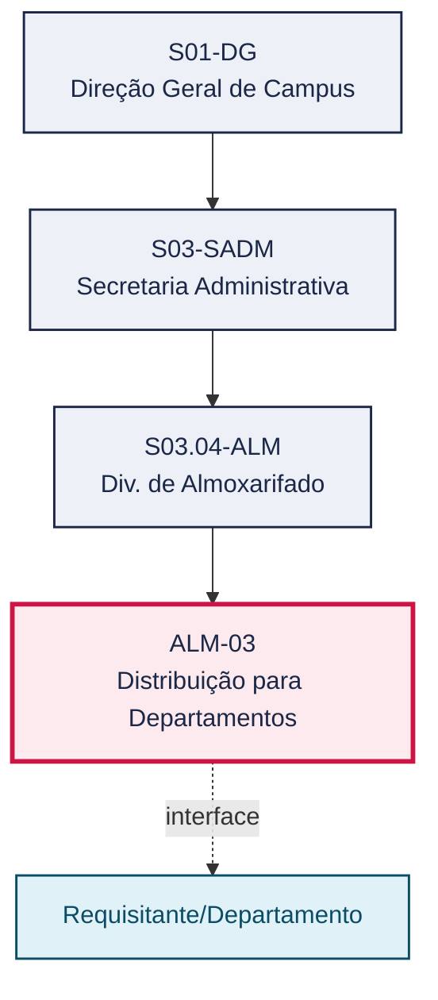
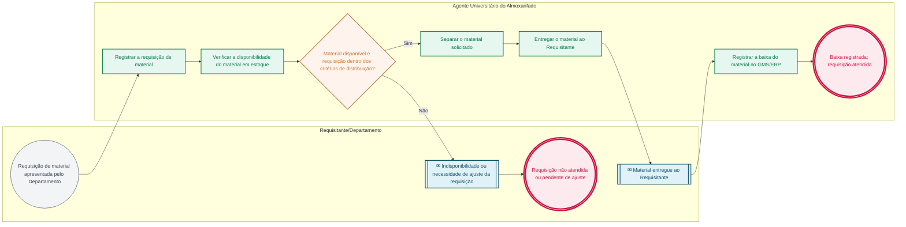

# POP ALM-03 — Distribuição para Departamentos

> **Documento vivo** · ATDG — Assessoria Técnica da Direção Geral · UNIOESTE Campus Foz do Iguaçu · Formato DDD híbrido + BPMN 2.0 padrão Anne Bail · Versão **1.0.0** · Status **em_validacao** · Atualizado em 2026-09-03

## 0. Cabeçalho DDD

| Divisão | Departamento | Descrição |
|---|---|---|
| Secretaria Administrativa | Div. de Almoxarifado | Atende requisições de materiais de consumo dos departamentos do Campus, verifica a disponibilidade em estoque, entrega o material e registra a baixa no GMS/ERP, conforme o Manual de Gestão do Almoxarifado. |

| Domínio | Subdomínio | Tipo | Contexto delimitado |
|---|---|---|---|
| Suprimentos e Materiais | Distribuição de materiais de consumo aos departamentos | core | S03.04-ALM |

### 0.3 Linguagem ubíqua (glossário do processo)

| Termo | Definição | Sistema |
|---|---|---|
| Requisição de material | Documento pelo qual um Departamento solicita materiais de consumo ao Almoxarifado. | GMS/ERP |
| Baixa | Registro da saída de um item do estoque do Almoxarifado no GMS/ERP. | GMS/ERP |

## 1. Identificação

| Campo | Valor |
|---|---|
| Código | ALM-03 |
| Setor | Div. de Almoxarifado (`S03.04-ALM`) |
| Responsável (função) | Chefe da Divisão de Almoxarifado |
| Periodicidade | Conforme requisições dos Departamentos (sob demanda, contínuo) |
| Subordinação | Secretaria Administrativa |
| Normativa | Manual de Gestão do Almoxarifado — Materiais de Consumo (Unioeste Foz); Manual de Mapeamento de Processos do Almoxarifado (Unioeste Foz) |
| Produto ATDG | POP |
| Pasta OneDrive | 03_MAPEAMENTO DE PROCESSOS |
| Fontes (entradas do Canvas) | pb-almoxarifado, 1780963200000, 1780963200001 |
| Lacunas abertas | nenhuma |
| Agente responsável | pop-alm-03 |

## 2. Organograma

## 3. Playbook

### 3.1 Gatilho (evento de domínio)

**Requisição de material de consumo apresentada por um Departamento** — origem: Requisitante/Departamento

### 3.2 Entrada

- Requisição de material apresentada por um Departamento

### 3.3 Passo a passo

| Nº | Ação | Responsável | Sistema | Artefato | Prazo | Evento |
|---|---|---|---|---|---|---|
| 1 | Registrar a requisição de material apresentada pelo Departamento | Requisitante/Departamento | GMS/ERP | Requisição de material | Conforme necessidade do Departamento | Requisição registrada |
| 2 | Verificar a disponibilidade do material em estoque | Agente Universitário do Almoxarifado | GMS/ERP | Mapa de estoque | No ato da análise da requisição | Disponibilidade verificada |
| 3 | Informar ao Requisitante a indisponibilidade ou a necessidade de ajuste da requisição, quando aplicável | Agente Universitário do Almoxarifado | GMS/ERP | — | A definir | Requisitante informado |
| 4 | Separar o material solicitado | Agente Universitário do Almoxarifado | — | — | Após verificação da disponibilidade | Material separado |
| 5 | Entregar o material ao Requisitante | Agente Universitário do Almoxarifado | — | Termo/comprovante de entrega | No ato da entrega | Material entregue |
| 6 | Registrar a baixa (saída) do material no GMS/ERP | Agente Universitário do Almoxarifado | GMS/ERP | Termo/comprovante de entrega | No ato da entrega | Baixa registrada no GMS/ERP |

### 3.4 Saída (entregáveis)

- Material entregue ao Requisitante e baixa registrada no GMS/ERP

## 4. Formulários e artefatos (agregados)

| Nome | Tipo | Sistema | Campos-chave | Preenchimento |
|---|---|---|---|---|
| Requisição de material | formulario | GMS/ERP | departamento requisitante, itens solicitados, quantidade, justificativa | Requisitante/Departamento |
| Termo/comprovante de entrega | registro | GMS/ERP | itens entregues, quantidade, data, requisitante | Agente Universitário do Almoxarifado |

## 5. Decisões, exceções e pontos de atenção

| Decisão | Condição | Sim → | Não → |
|---|---|---|---|
| Material disponível em estoque e requisição dentro dos critérios de distribuição? | Verificação de disponibilidade e de eventuais limites de quantidade por requisição | Separar e entregar o material ao Requisitante | Informar ao Requisitante a indisponibilidade ou a necessidade de ajuste da requisição |

**Pontos de atenção**

- Requisições que excedam eventuais limites de quantidade ou periodicidade devem ser encaminhadas à Chefia da Divisão de Almoxarifado para análise
- A baixa no GMS/ERP deve ocorrer no mesmo ato da entrega, para manter a correspondência entre estoque físico e sistêmico

## 6. Contingência

- Material indisponível em estoque no momento da requisição: informar o Requisitante e registrar a demanda para eventual processo de aquisição (fora do escopo deste POP)
- Indisponibilidade do GMS/ERP no ato da entrega: registrar a saída em planilha de controle e lançar a baixa assim que o sistema for restabelecido
- Divergência entre a quantidade requisitada e a quantidade disponível: entregar parcialmente, registrar o saldo pendente e comunicar o Requisitante

## 7. Checklist

- ( ) Requisição registrada antes da separação do material
- ( ) Disponibilidade em estoque verificada antes da confirmação ao Requisitante
- ( ) Termo/comprovante de entrega emitido e confirmado pelo Requisitante
- ( ) Baixa do material registrada no GMS/ERP no ato da entrega

## 8. KPI / Indicadores

| Indicador | Fórmula | Meta | Fonte |
|---|---|---|---|
| Prazo médio de atendimento da requisição | Soma dos tempos entre registro da requisição e entrega do material / nº de requisições atendidas no período | A definir | GMS/ERP |
| Percentual de requisições atendidas integralmente | Nº de requisições atendidas sem indisponibilidade / nº total de requisições no período | A definir | GMS/ERP |

## 9. Mapa de contexto (interfaces inter-setoriais)

| Origem | Relação | Destino | Artefato | Canal |
|---|---|---|---|---|
| Requisitante/Departamento | fornece | Div. de Almoxarifado | Requisição de material | GMS/ERP |
| Div. de Almoxarifado | informa | Requisitante/Departamento | Termo/comprovante de entrega ou indisponibilidade | GMS/ERP |

## 10. Fluxograma (BPMN 2.0 — padrão Anne Bail)

## 11. Especificação BPMN para o Miro

**Raias:** Div. de Almoxarifado · Requisitante/Departamento · Agente Universitário do Almoxarifado · Chefe da Divisão de Almoxarifado

| Id | Tipo | Elemento | Raia |
|---|---|---|---|
| e1 | inicio | Requisição de material apresentada pelo Departamento | Requisitante/Departamento |
| e2 | atividade | Registrar a requisição de material | Agente Universitário do Almoxarifado |
| e3 | atividade | Verificar a disponibilidade do material em estoque | Agente Universitário do Almoxarifado |
| e4 | decisao | Material disponível e requisição dentro dos critérios de distribuição? | Agente Universitário do Almoxarifado |
| e5 | captura | Indisponibilidade ou necessidade de ajuste da requisição | Requisitante/Departamento |
| e6 | fim | Requisição não atendida ou pendente de ajuste | Requisitante/Departamento |
| e7 | atividade | Separar o material solicitado | Agente Universitário do Almoxarifado |
| e8 | atividade | Entregar o material ao Requisitante | Agente Universitário do Almoxarifado |
| e9 | captura | Material entregue ao Requisitante | Requisitante/Departamento |
| e10 | atividade | Registrar a baixa do material no GMS/ERP | Agente Universitário do Almoxarifado |
| e11 | fim | Baixa registrada; requisição atendida | Agente Universitário do Almoxarifado |

| De | Para | Rótulo |
|---|---|---|
| e1 | e2 | — |
| e2 | e3 | — |
| e3 | e4 | — |
| e4 | e5 | Não |
| e5 | e6 | — |
| e4 | e7 | Sim |
| e7 | e8 | — |
| e8 | e9 | — |
| e9 | e10 | — |
| e10 | e11 | — |

_Especificação gerada a partir dos passos do POP; 1 raia(s). Revisar decisões e pausas antes de construir no Miro._

## 12. Histórico de versões

| Versão | Data | Autor | Tipo | Mudanças | Fontes |
|---|---|---|---|---|---|
| 0.1.0 | 2026-09-02 | scripts/scaffold_pops.py | patch | Esqueleto inicial gerado deterministicamente a partir do escopo "Saída, requisição, entrega, registro" | — |
| 1.0.0 | 2026-09-03 | agente:construtor-pop (lote ALM) | major | Passo adicionado após 1: Registrar a requisição de material apresentada pelo Departamento; Passo adicionado após 1: Verificar a disponibilidade do material em estoque; Passo adicionado após 1: Informar ao Requisitante a indisponibilidade ou a necessidade de ajuste da requi; Passo adicionado após 1: Separar o material solicitado; Passo adicionado após 1: Entregar o material ao Requisitante; Passo adicionado após 1: Registrar a baixa (saída) do material no GMS/ERP; entrada_nova: +1; saida_nova: +1; artefatos_novos: +2; decisoes_novas: +1; kpis_novos: +2; mapa_contexto_novo: +2; pontos_atencao_novos: +2; contingencia_nova: +3; checklist_novo: +4; glossario_novo: +2; normativa_nova: +2; Campo ddd.descricao atualizado; Campo ddd.subdominio atualizado; Campo identificacao.responsavel atualizado; Campo identificacao.periodicidade atualizado; Campo playbook.gatilho atualizado; Campo observacoes atualizado; Raias adicionadas: Requisitante/Departamento, Agente Universitário do Almoxarifado, Chefe da Divisão de Almoxarifado; Elementos BPMN removidos: e1, e2; Elementos BPMN adicionados: 11; Status promovido a em_validacao (≥ 3 passos e responsável definido) | pb-almoxarifado, 1780963200000, 1780963200001 |

## 13. Validação e aprovação

| Papel | Função / unidade | Data |
|---|---|---|
| Elaboração | ATDG — Assessoria Técnica da Direção Geral | 2026-09-02 |
| Revisão | A definir (responsável do setor) | ___/___/______ |
| Aprovação | Direção Geral do Campus | ___/___/______ |

## 14. Lições incorporadas

- **L-001** — Referir sempre função/cargo; nomes apenas no bloco 13 (Validação), com anuência (LGPD).
- **L-004** — Nunca regenerar POP existente: aplicar patch com changelog, fontes e versão.
- **L-006** — Preservar códigos legados como códigos de processo; não renumerar.
- **L-007** — Referência Externa é benchmark; normativa do POP só cita atos da Unioeste, do Estado do Paraná ou federais aplicáveis.
- **L-002** — Um passo = uma ação; ações compostas viram passos distintos.
- **L-003** — Cada linha do mapa de contexto gera um elemento `captura` no BPMN e um passo na raia de destino.

> **Observações:** Inferência a validar com a Chefia do Almoxarifado: (1) existência e valor de eventuais limites de quantidade/periodicidade por requisição, não detalhados nas fontes disponíveis; (2) fluxo de tratamento de requisições atendidas apenas parcialmente por indisponibilidade de estoque.

---
_Canvas Vivo — Base de Conhecimento Institucional · ATDG · UNIOESTE Campus Foz do Iguaçu · gerado por `scripts/render_pop.py` a partir de `pops/ALM/ALM-03.pop.json` (diretrizes v1.0)._
