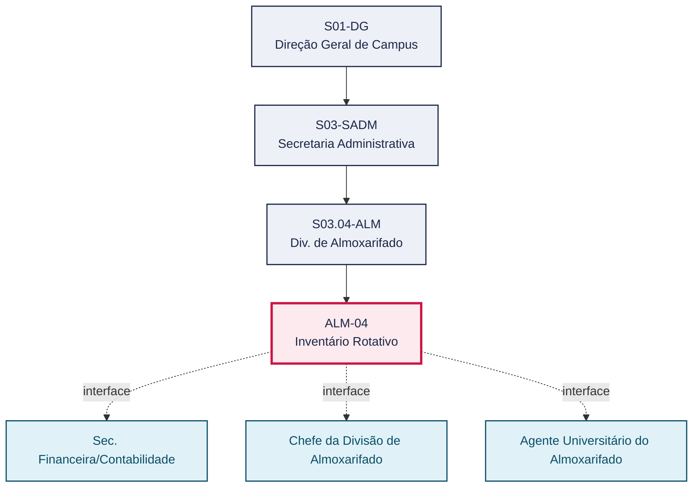
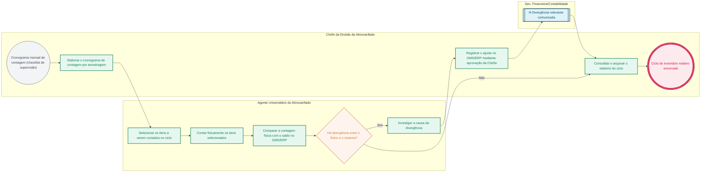

# POP ALM-04 — Inventário Rotativo

> **Documento vivo** · ATDG — Assessoria Técnica da Direção Geral · UNIOESTE Campus Foz do Iguaçu · Formato DDD híbrido + BPMN 2.0 padrão Anne Bail · Versão **1.0.0** · Status **em_validacao** · Atualizado em 2026-09-03

## 0. Cabeçalho DDD

| Divisão | Departamento | Descrição |
|---|---|---|
| Secretaria Administrativa | Div. de Almoxarifado | Realiza contagens periódicas por amostragem dos itens em estoque, comparando o saldo físico ao saldo do GMS/ERP, e ajusta divergências mediante aprovação da Chefia, dentro do checklist de supervisão mensal do Manual de Gestão do Almoxarifado. |

| Domínio | Subdomínio | Tipo | Contexto delimitado |
|---|---|---|---|
| Suprimentos e Materiais | Inventário rotativo por amostragem | core | S03.04-ALM |

### 0.3 Linguagem ubíqua (glossário do processo)

| Termo | Definição | Sistema |
|---|---|---|
| Inventário rotativo | Contagem periódica por amostragem de parte do estoque, para identificar e corrigir divergências entre o físico e o sistema. | GMS/ERP |
| Checklist de supervisão | Instrumento mensal do Manual de Gestão que programa, entre outras verificações, os ciclos de inventário rotativo. | planilha de controle |

## 1. Identificação

| Campo | Valor |
|---|---|
| Código | ALM-04 |
| Setor | Div. de Almoxarifado (`S03.04-ALM`) |
| Responsável (função) | Chefe da Divisão de Almoxarifado |
| Periodicidade | Mensal (ciclos de amostragem), conforme checklist de supervisão do Manual de Gestão |
| Subordinação | Secretaria Administrativa |
| Normativa | Manual de Gestão do Almoxarifado — Materiais de Consumo (Unioeste Foz); Manual de Mapeamento de Processos do Almoxarifado (Unioeste Foz); Normativas do TCE-PR |
| Produto ATDG | POP |
| Pasta OneDrive | 03_MAPEAMENTO DE PROCESSOS |
| Fontes (entradas do Canvas) | pb-almoxarifado, 1780963200000, 1780963200001 |
| Lacunas abertas | nenhuma |
| Agente responsável | pop-alm-04 |

## 2. Organograma

## 3. Playbook

### 3.1 Gatilho (evento de domínio)

**Cronograma mensal de contagem por amostragem (checklist de supervisão)** — origem: Chefe da Divisão de Almoxarifado

### 3.2 Entrada

- Cronograma mensal de contagem por amostragem (checklist de supervisão do Manual de Gestão)

### 3.3 Passo a passo

| Nº | Ação | Responsável | Sistema | Artefato | Prazo | Evento |
|---|---|---|---|---|---|---|
| 1 | Elaborar o cronograma mensal de contagem por amostragem | Chefe da Divisão de Almoxarifado | planilha de controle | Cronograma de inventário rotativo | Mensal | Cronograma definido |
| 2 | Selecionar os itens a serem contados no ciclo (amostragem) | Agente Universitário do Almoxarifado | planilha de controle | — | Conforme cronograma | Itens selecionados |
| 3 | Contar fisicamente os itens selecionados | Agente Universitário do Almoxarifado | — | Formulário de contagem de inventário rotativo | Conforme cronograma | Contagem realizada |
| 4 | Comparar a contagem física com o saldo no GMS/ERP | Agente Universitário do Almoxarifado | GMS/ERP | Relatório de inventário rotativo | Após a contagem | Divergências apuradas |
| 5 | Investigar a causa da divergência identificada, quando houver | Agente Universitário do Almoxarifado | GMS/ERP | Relatório de inventário rotativo | A definir | Causa da divergência apurada |
| 6 | Registrar o ajuste no GMS/ERP mediante aprovação da Chefia | Chefe da Divisão de Almoxarifado | GMS/ERP | Relatório de inventário rotativo | A definir | Ajuste registrado no GMS/ERP |
| 7 | Comunicar divergências relevantes à Sec. Financeira/Contabilidade | Chefe da Divisão de Almoxarifado | e-Protocolo | Relatório de inventário rotativo | A definir | Contabilidade informada |
| 8 | Consolidar e arquivar o relatório do ciclo de inventário rotativo | Chefe da Divisão de Almoxarifado | GMS/ERP | Relatório de inventário rotativo | Ao final do ciclo mensal | Ciclo de inventário rotativo encerrado |

### 3.4 Saída (entregáveis)

- Relatório de inventário rotativo com divergências apuradas e regularizadas

## 4. Formulários e artefatos (agregados)

| Nome | Tipo | Sistema | Campos-chave | Preenchimento |
|---|---|---|---|---|
| Cronograma de inventário rotativo | documento | planilha de controle | itens/categoria do ciclo, data prevista, responsável pela contagem | Chefe da Divisão de Almoxarifado |
| Formulário de contagem de inventário rotativo | formulario | planilha de controle | item, quantidade contada, saldo sistêmico no momento da contagem | Agente Universitário do Almoxarifado |
| Relatório de inventário rotativo | registro | GMS/ERP | itens contados, saldo físico, saldo sistêmico, divergência, ajuste realizado | Agente Universitário do Almoxarifado |

## 5. Decisões, exceções e pontos de atenção

| Decisão | Condição | Sim → | Não → |
|---|---|---|---|
| Há divergência entre a contagem física e o saldo no GMS/ERP? | Comparação entre a contagem física do ciclo e o saldo sistêmico | Investigar a causa, registrar o ajuste mediante aprovação da Chefia e comunicar divergências relevantes à Contabilidade | Consolidar e arquivar o relatório do ciclo sem ajustes |

**Pontos de atenção**

- O ajuste de saldo no GMS/ERP depende de aprovação da Chefia da Divisão de Almoxarifado
- Divergências recorrentes no mesmo item/categoria devem ser tratadas como sinal de risco e escaladas para revisão da armazenagem ou da distribuição

## 6. Contingência

- Divergência não explicada entre físico e sistema: registrar a ocorrência e escalar à Chefia da Divisão de Almoxarifado para apuração
- Indisponibilidade do GMS/ERP durante a contagem: registrar a contagem em planilha de controle e lançar a comparação assim que o sistema for restabelecido
- Impossibilidade de cumprir o cronograma mensal (ex.: falta de pessoal): remarcar o ciclo e registrar o motivo do atraso

## 7. Checklist

- ( ) Cronograma mensal de contagem por amostragem elaborado e cumprido
- ( ) Contagem física comparada ao saldo do GMS/ERP em todos os itens do ciclo
- ( ) Divergências identificadas, investigadas e ajustadas mediante aprovação da Chefia
- ( ) Divergências relevantes comunicadas à Sec. Financeira/Contabilidade

## 8. KPI / Indicadores

| Indicador | Fórmula | Meta | Fonte |
|---|---|---|---|
| Percentual de itens do ciclo com divergência | Nº de itens com divergência / nº de itens contados no ciclo | A definir | GMS/ERP |
| Cumprimento do cronograma mensal de inventário rotativo | Nº de ciclos realizados no prazo / nº de ciclos previstos no período | A definir | Cronograma de inventário rotativo |

## 9. Mapa de contexto (interfaces inter-setoriais)

| Origem | Relação | Destino | Artefato | Canal |
|---|---|---|---|---|
| Div. de Almoxarifado | informa | Sec. Financeira/Contabilidade | Relatório de inventário rotativo (divergências relevantes) | e-Protocolo |
| Chefe da Divisão de Almoxarifado | aprova | Agente Universitário do Almoxarifado | Ajuste de estoque no GMS/ERP | GMS/ERP |

## 10. Fluxograma (BPMN 2.0 — padrão Anne Bail)

## 11. Especificação BPMN para o Miro

**Raias:** Div. de Almoxarifado · Agente Universitário do Almoxarifado · Chefe da Divisão de Almoxarifado · Sec. Financeira/Contabilidade

| Id | Tipo | Elemento | Raia |
|---|---|---|---|
| e1 | inicio | Cronograma mensal de contagem (checklist de supervisão) | Chefe da Divisão de Almoxarifado |
| e2 | atividade | Elaborar o cronograma de contagem por amostragem | Chefe da Divisão de Almoxarifado |
| e3 | atividade | Selecionar os itens a serem contados no ciclo | Agente Universitário do Almoxarifado |
| e4 | atividade | Contar fisicamente os itens selecionados | Agente Universitário do Almoxarifado |
| e5 | atividade | Comparar a contagem física com o saldo no GMS/ERP | Agente Universitário do Almoxarifado |
| e6 | decisao | Há divergência entre o físico e o sistema? | Agente Universitário do Almoxarifado |
| e7 | atividade | Investigar a causa da divergência | Agente Universitário do Almoxarifado |
| e8 | atividade | Registrar o ajuste no GMS/ERP mediante aprovação da Chefia | Chefe da Divisão de Almoxarifado |
| e9 | captura | Divergência relevante comunicada | Sec. Financeira/Contabilidade |
| e10 | atividade | Consolidar e arquivar o relatório do ciclo | Chefe da Divisão de Almoxarifado |
| e11 | fim | Ciclo de inventário rotativo encerrado | Chefe da Divisão de Almoxarifado |

| De | Para | Rótulo |
|---|---|---|
| e1 | e2 | — |
| e2 | e3 | — |
| e3 | e4 | — |
| e4 | e5 | — |
| e5 | e6 | — |
| e6 | e7 | Sim |
| e7 | e8 | — |
| e8 | e9 | — |
| e9 | e10 | — |
| e6 | e10 | Não |
| e10 | e11 | — |

_Especificação gerada a partir dos passos do POP; 1 raia(s). Revisar decisões e pausas antes de construir no Miro._

## 12. Histórico de versões

| Versão | Data | Autor | Tipo | Mudanças | Fontes |
|---|---|---|---|---|---|
| 0.1.0 | 2026-09-02 | scripts/scaffold_pops.py | patch | Esqueleto inicial gerado deterministicamente a partir do escopo "Contagem periódica, conciliação" | — |
| 1.0.0 | 2026-09-03 | agente:construtor-pop (lote ALM) | major | Passo adicionado após 1: Elaborar o cronograma mensal de contagem por amostragem; Passo adicionado após 1: Selecionar os itens a serem contados no ciclo (amostragem); Passo adicionado após 1: Contar fisicamente os itens selecionados; Passo adicionado após 1: Comparar a contagem física com o saldo no GMS/ERP; Passo adicionado após 1: Investigar a causa da divergência identificada, quando houver; Passo adicionado após 1: Registrar o ajuste no GMS/ERP mediante aprovação da Chefia; Passo adicionado após 1: Comunicar divergências relevantes à Sec. Financeira/Contabilidade; Passo adicionado após 1: Consolidar e arquivar o relatório do ciclo de inventário rotativo; entrada_nova: +1; saida_nova: +1; artefatos_novos: +3; decisoes_novas: +1; kpis_novos: +2; mapa_contexto_novo: +2; pontos_atencao_novos: +2; contingencia_nova: +3; checklist_novo: +4; glossario_novo: +2; normativa_nova: +3; Campo ddd.descricao atualizado; Campo ddd.subdominio atualizado; Campo identificacao.responsavel atualizado; Campo identificacao.periodicidade atualizado; Campo playbook.gatilho atualizado; Campo observacoes atualizado; Raias adicionadas: Agente Universitário do Almoxarifado, Chefe da Divisão de Almoxarifado, Sec. Financeira/Contabilidade; Elementos BPMN removidos: e1, e2; Elementos BPMN adicionados: 11; Status promovido a em_validacao (≥ 3 passos e responsável definido) | pb-almoxarifado, 1780963200000, 1780963200001 |

## 13. Validação e aprovação

| Papel | Função / unidade | Data |
|---|---|---|
| Elaboração | ATDG — Assessoria Técnica da Direção Geral | 2026-09-02 |
| Revisão | A definir (responsável do setor) | ___/___/______ |
| Aprovação | Direção Geral do Campus | ___/___/______ |

## 14. Lições incorporadas

- **L-001** — Referir sempre função/cargo; nomes apenas no bloco 13 (Validação), com anuência (LGPD).
- **L-004** — Nunca regenerar POP existente: aplicar patch com changelog, fontes e versão.
- **L-006** — Preservar códigos legados como códigos de processo; não renumerar.
- **L-007** — Referência Externa é benchmark; normativa do POP só cita atos da Unioeste, do Estado do Paraná ou federais aplicáveis.
- **L-002** — Um passo = uma ação; ações compostas viram passos distintos.
- **L-003** — Cada linha do mapa de contexto gera um elemento `captura` no BPMN e um passo na raia de destino.

> **Observações:** Inferência a validar com a Chefia do Almoxarifado: (1) critério de amostragem (percentual/categoria de itens por ciclo) e limiar de divergência que caracteriza escalonamento à Contabilidade, não detalhados nas fontes disponíveis; (2) alçada de aprovação do ajuste de saldo no GMS/ERP.

---
_Canvas Vivo — Base de Conhecimento Institucional · ATDG · UNIOESTE Campus Foz do Iguaçu · gerado por `scripts/render_pop.py` a partir de `pops/ALM/ALM-04.pop.json` (diretrizes v1.0)._
