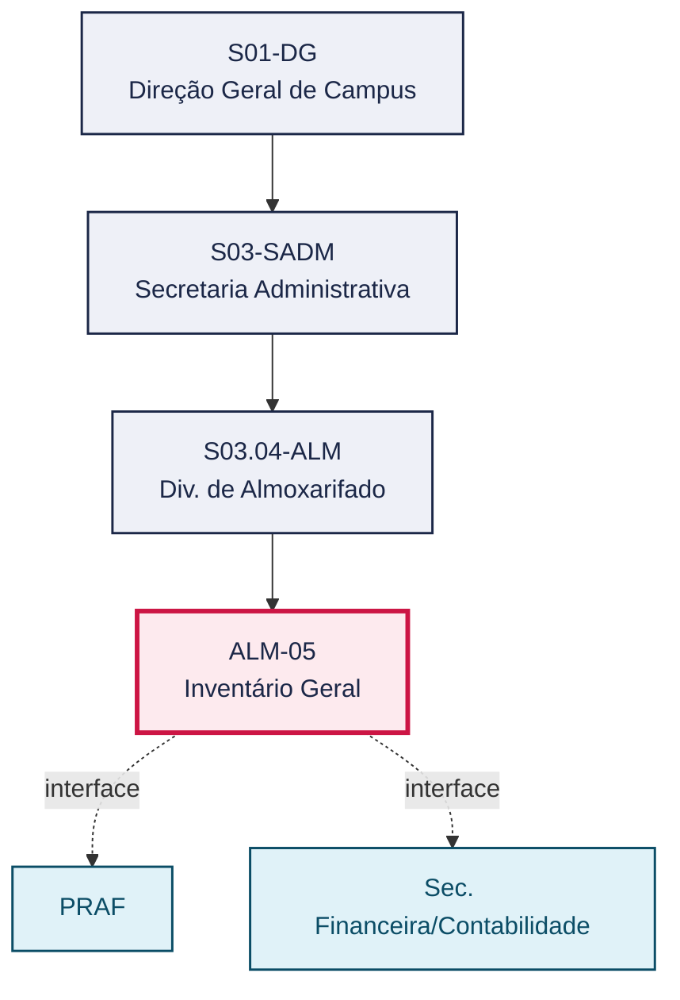

# POP ALM-05 — Inventário Geral

> **Documento vivo** · ATDG — Assessoria Técnica da Direção Geral · UNIOESTE Campus Foz do Iguaçu · Formato DDD híbrido + BPMN 2.0 padrão Anne Bail · Versão **1.0.0** · Status **em_validacao** · Atualizado em 2026-09-03

## 0. Cabeçalho DDD

| Divisão | Departamento | Descrição |
|---|---|---|
| Secretaria Administrativa | Div. de Almoxarifado | Realiza a contagem física total anual de todo o estoque do Almoxarifado, apura e ajusta divergências e obtém aprovação da PRAF antes de encaminhar o relatório para a conciliação físico-contábil (ALM-06) e a prestação de contas (ALM-08). |

| Domínio | Subdomínio | Tipo | Contexto delimitado |
|---|---|---|---|
| Suprimentos e Materiais | Inventário geral anual | core | S03.04-ALM |

### 0.3 Linguagem ubíqua (glossário do processo)

| Termo | Definição | Sistema |
|---|---|---|
| Inventário geral | Contagem física total anual de todo o estoque do Almoxarifado, base da conciliação físico-contábil e da prestação de contas. | GMS/ERP |

## 1. Identificação

| Campo | Valor |
|---|---|
| Código | ALM-05 |
| Setor | Div. de Almoxarifado (`S03.04-ALM`) |
| Responsável (função) | Chefe da Divisão de Almoxarifado |
| Periodicidade | Anual, no encerramento do exercício |
| Subordinação | Secretaria Administrativa |
| Normativa | Manual de Gestão do Almoxarifado — Materiais de Consumo (Unioeste Foz); Manual de Mapeamento de Processos do Almoxarifado (Unioeste Foz); Normativas do TCE-PR |
| Produto ATDG | POP |
| Pasta OneDrive | 03_MAPEAMENTO DE PROCESSOS |
| Fontes (entradas do Canvas) | pb-almoxarifado, 1780963200000, 1780963200001 |
| Lacunas abertas | nenhuma |
| Agente responsável | — (não moldado) |

## 2. Organograma

## 3. Playbook

### 3.1 Gatilho (evento de domínio)

**Cronograma/determinação de inventário geral anual (encerramento do exercício)** — origem: PRAF / Chefia da Divisão de Almoxarifado

### 3.2 Entrada

- Cronograma/determinação de inventário geral anual (encerramento do exercício)

### 3.3 Passo a passo

| Nº | Ação | Responsável | Sistema | Artefato | Prazo | Evento |
|---|---|---|---|---|---|---|
| 1 | Receber o cronograma de inventário geral anual | Chefe da Divisão de Almoxarifado | e-Protocolo | — | Anual | Cronograma de inventário geral recebido |
| 2 | Constituir a comissão/equipe de contagem para o inventário geral | Chefe da Divisão de Almoxarifado | — | — | Antes do início da contagem | Equipe constituída |
| 3 | Realizar a contagem física total de todo o estoque | Agente Universitário do Almoxarifado | — | Formulário de contagem geral | Conforme cronograma anual | Contagem geral concluída |
| 4 | Comparar o resultado da contagem com o saldo do GMS/ERP | Agente Universitário do Almoxarifado | GMS/ERP | Relatório de inventário geral | Após a contagem | Divergências apuradas |
| 5 | Apurar a causa da divergência relevante e propor o ajuste, quando houver | Agente Universitário do Almoxarifado | GMS/ERP | Relatório de inventário geral | A definir | Ajuste proposto |
| 6 | Submeter o resultado do inventário geral, com eventuais ajustes, à aprovação da Chefia | Chefe da Divisão de Almoxarifado | GMS/ERP | Relatório de inventário geral | A definir | Resultado aprovado internamente |
| 7 | Obter a aprovação da PRAF para o resultado do inventário geral | PRAF | e-Protocolo | Relatório de inventário geral | A definir | Inventário geral aprovado pela PRAF |
| 8 | Encaminhar o relatório de inventário geral aprovado à Sec. Financeira/Contabilidade para conciliação (ALM-06) | Chefe da Divisão de Almoxarifado | e-Protocolo | Relatório de inventário geral | Após aprovação da PRAF | Relatório encaminhado para conciliação |

### 3.4 Saída (entregáveis)

- Relatório de inventário geral anual aprovado, encaminhado para conciliação físico-contábil (ALM-06)

## 4. Formulários e artefatos (agregados)

| Nome | Tipo | Sistema | Campos-chave | Preenchimento |
|---|---|---|---|---|
| Formulário de contagem geral | formulario | — | item, quantidade contada, conferente, data | Agente Universitário do Almoxarifado |
| Relatório de inventário geral | registro | GMS/ERP | saldo físico total, saldo sistêmico total, divergências, ajustes, aprovação PRAF | Chefe da Divisão de Almoxarifado |

## 5. Decisões, exceções e pontos de atenção

| Decisão | Condição | Sim → | Não → |
|---|---|---|---|
| Há divergência relevante entre a contagem física geral e o saldo no GMS/ERP? | Comparação entre o resultado da contagem geral e o saldo sistêmico | Apurar a causa, propor o ajuste e submeter à aprovação da Chefia antes de encaminhar à PRAF | Encaminhar o relatório de inventário geral diretamente para aprovação da PRAF |

**Pontos de atenção**

- O inventário geral é a base da conciliação físico-contábil (ALM-06) e da prestação de contas (ALM-08); atrasos afetam todo o encerramento do exercício
- A aprovação da PRAF é condição para o encaminhamento do relatório à Contabilidade

## 6. Contingência

- Impossibilidade de concluir a contagem geral no prazo do cronograma anual: comunicar à Chefia e à PRAF, com novo prazo estimado
- Divergência relevante não explicada: registrar a ocorrência e escalar à Chefia e, se necessário, à PRAF antes da aprovação
- Indisponibilidade de pessoal para compor a comissão de contagem: solicitar apoio de outros setores da Secretaria Administrativa

## 7. Checklist

- ( ) Comissão/equipe de contagem constituída antes do início do inventário
- ( ) Contagem física total registrada em formulário próprio, item a item
- ( ) Divergências apuradas, investigadas e ajustadas mediante aprovação da Chefia
- ( ) Relatório de inventário geral aprovado pela PRAF antes do encaminhamento à Contabilidade

## 8. KPI / Indicadores

| Indicador | Fórmula | Meta | Fonte |
|---|---|---|---|
| Percentual de itens com divergência no inventário geral | Nº de itens com divergência / nº total de itens inventariados | A definir | GMS/ERP |
| Prazo de conclusão do inventário geral em relação ao cronograma anual | Data de conclusão real menos data prevista no cronograma | A definir | Cronograma anual de inventário |

## 9. Mapa de contexto (interfaces inter-setoriais)

| Origem | Relação | Destino | Artefato | Canal |
|---|---|---|---|---|
| Div. de Almoxarifado | valida | PRAF | Relatório de inventário geral | e-Protocolo |
| Div. de Almoxarifado | fornece | Sec. Financeira/Contabilidade | Relatório de inventário geral aprovado | e-Protocolo |

## 10. Fluxograma (BPMN 2.0 — padrão Anne Bail)

```mermaid
flowchart LR
  subgraph R1["Chefe da Divisão de Almoxarifado"]
    direction LR
    e1(("Cronograma/determinação de inventário geral anual"))
    e2["Receber o cronograma de inventário geral"]
    e3["Constituir a comissão/equipe de contagem"]
    e8["Submeter o resultado (com ajustes) à aprovação da Chefia"]
  end
  subgraph R2["Agente Universitário do Almoxarifado"]
    direction LR
    e4["Realizar a contagem física total do estoque"]
    e5["Comparar o resultado da contagem com o saldo no GMS/ERP"]
    e6{"Há divergência relevante entre físico e sistema?"}
    e7["Apurar a causa e propor o ajuste"]
  end
  subgraph R3["PRAF"]
    direction LR
    e9[["✉ Relatório de inventário geral encaminhado à PRAF"]]
    e10(["⏱ Aguardar aprovação da PRAF"])
    e11["Aprovar o resultado do inventário geral"]
  end
  subgraph R4["Sec. Financeira/Contabilidade"]
    direction LR
    e12[["✉ Relatório de inventário geral aprovado"]]
    e13((("Relatório de inventário geral encaminhado para conciliação (ALM-06)")))
  end
  e1 --> e2
  e2 --> e3
  e3 --> e4
  e4 --> e5
  e5 --> e6
  e6 -- Sim --> e7
  e7 --> e8
  e8 --> e9
  e6 -- Não --> e9
  e9 --> e10
  e10 --> e11
  e11 --> e12
  e12 --> e13
  classDef inicio fill:#f3f4f6,stroke:#6b7280,stroke-width:1.5px,color:#374151
  classDef atividade fill:#E6F7F0,stroke:#0B7A4E,stroke-width:2px,color:#0B7A4E
  classDef decisao fill:#FFF4ED,stroke:#C9783A,stroke-width:2px,color:#C9783A
  classDef fim fill:#FDEAEE,stroke:#CC1544,stroke-width:4px,color:#CC1544
  classDef pausa fill:#FDEAEE,stroke:#CC1544,stroke-width:2px,color:#CC1544
  classDef captura fill:#E0F2F8,stroke:#0B4D66,stroke-width:2px,color:#0B4D66
  class e1 inicio
  class e2,e3,e4,e5,e7,e8,e11 atividade
  class e6 decisao
  class e9,e12 captura
  class e10 pausa
  class e13 fim
```

## 11. Especificação BPMN para o Miro

**Raias:** Div. de Almoxarifado · Chefe da Divisão de Almoxarifado · Agente Universitário do Almoxarifado · PRAF · Sec. Financeira/Contabilidade

| Id | Tipo | Elemento | Raia |
|---|---|---|---|
| e1 | inicio | Cronograma/determinação de inventário geral anual | Chefe da Divisão de Almoxarifado |
| e2 | atividade | Receber o cronograma de inventário geral | Chefe da Divisão de Almoxarifado |
| e3 | atividade | Constituir a comissão/equipe de contagem | Chefe da Divisão de Almoxarifado |
| e4 | atividade | Realizar a contagem física total do estoque | Agente Universitário do Almoxarifado |
| e5 | atividade | Comparar o resultado da contagem com o saldo no GMS/ERP | Agente Universitário do Almoxarifado |
| e6 | decisao | Há divergência relevante entre físico e sistema? | Agente Universitário do Almoxarifado |
| e7 | atividade | Apurar a causa e propor o ajuste | Agente Universitário do Almoxarifado |
| e8 | atividade | Submeter o resultado (com ajustes) à aprovação da Chefia | Chefe da Divisão de Almoxarifado |
| e9 | captura | Relatório de inventário geral encaminhado à PRAF | PRAF |
| e10 | pausa | Aguardar aprovação da PRAF | PRAF |
| e11 | atividade | Aprovar o resultado do inventário geral | PRAF |
| e12 | captura | Relatório de inventário geral aprovado | Sec. Financeira/Contabilidade |
| e13 | fim | Relatório de inventário geral encaminhado para conciliação (ALM-06) | Sec. Financeira/Contabilidade |

| De | Para | Rótulo |
|---|---|---|
| e1 | e2 | — |
| e2 | e3 | — |
| e3 | e4 | — |
| e4 | e5 | — |
| e5 | e6 | — |
| e6 | e7 | Sim |
| e7 | e8 | — |
| e8 | e9 | — |
| e6 | e9 | Não |
| e9 | e10 | — |
| e10 | e11 | — |
| e11 | e12 | — |
| e12 | e13 | — |

_Especificação gerada a partir dos passos do POP; 1 raia(s). Revisar decisões e pausas antes de construir no Miro._

## 12. Histórico de versões

| Versão | Data | Autor | Tipo | Mudanças | Fontes |
|---|---|---|---|---|---|
| 0.1.0 | 2026-09-02 | scripts/scaffold_pops.py | patch | Esqueleto inicial gerado deterministicamente a partir do escopo "Inventário anual, TCE-PR" | — |
| 1.0.0 | 2026-09-03 | agente:construtor-pop (lote ALM) | major | Passo adicionado após 1: Receber o cronograma de inventário geral anual; Passo adicionado após 1: Constituir a comissão/equipe de contagem para o inventário geral; Passo adicionado após 1: Realizar a contagem física total de todo o estoque; Passo adicionado após 1: Comparar o resultado da contagem com o saldo do GMS/ERP; Passo adicionado após 1: Apurar a causa da divergência relevante e propor o ajuste, quando houver; Passo adicionado após 1: Submeter o resultado do inventário geral, com eventuais ajustes, à aprovação da ; Passo adicionado após 1: Obter a aprovação da PRAF para o resultado do inventário geral; Passo adicionado após 1: Encaminhar o relatório de inventário geral aprovado à Sec. Financeira/Contabilid; entrada_nova: +1; saida_nova: +1; artefatos_novos: +2; decisoes_novas: +1; kpis_novos: +2; mapa_contexto_novo: +2; pontos_atencao_novos: +2; contingencia_nova: +3; checklist_novo: +4; glossario_novo: +1; normativa_nova: +3; Campo ddd.descricao atualizado; Campo ddd.subdominio atualizado; Campo identificacao.responsavel atualizado; Campo identificacao.periodicidade atualizado; Campo playbook.gatilho atualizado; Campo observacoes atualizado; Raias adicionadas: Chefe da Divisão de Almoxarifado, Agente Universitário do Almoxarifado, PRAF, Sec. Financeira/Contabilidade; Elementos BPMN removidos: e1, e2; Elementos BPMN adicionados: 13; Status promovido a em_validacao (≥ 3 passos e responsável definido) | pb-almoxarifado, 1780963200000, 1780963200001 |

## 13. Validação e aprovação

| Papel | Função / unidade | Data |
|---|---|---|
| Elaboração | ATDG — Assessoria Técnica da Direção Geral | 2026-09-02 |
| Revisão | A definir (responsável do setor) | ___/___/______ |
| Aprovação | Direção Geral do Campus | ___/___/______ |

## 14. Lições incorporadas

- **L-001** — Referir sempre função/cargo; nomes apenas no bloco 13 (Validação), com anuência (LGPD).
- **L-004** — Nunca regenerar POP existente: aplicar patch com changelog, fontes e versão.
- **L-006** — Preservar códigos legados como códigos de processo; não renumerar.
- **L-007** — Referência Externa é benchmark; normativa do POP só cita atos da Unioeste, do Estado do Paraná ou federais aplicáveis.
- **L-002** — Um passo = uma ação; ações compostas viram passos distintos.
- **L-003** — Cada linha do mapa de contexto gera um elemento `captura` no BPMN e um passo na raia de destino.

> **Observações:** Inferência a validar com a Chefia do Almoxarifado: (1) composição e formalização da comissão/equipe de contagem geral; (2) alçada e formato exatos da aprovação da PRAF (despacho, ata, sistema), não detalhados nas fontes disponíveis.

---
_Canvas Vivo — Base de Conhecimento Institucional · ATDG · UNIOESTE Campus Foz do Iguaçu · gerado por `scripts/render_pop.py` a partir de `pops/ALM/ALM-05.pop.json` (diretrizes v1.0)._
