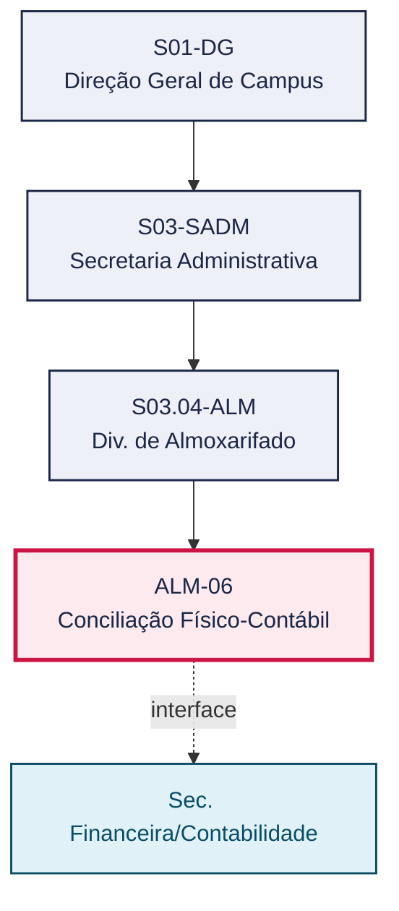
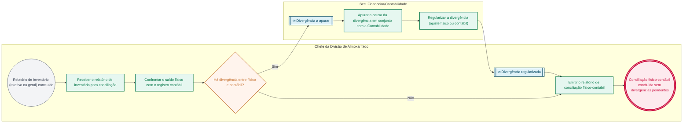

# POP ALM-06 — Conciliação Físico-Contábil

> **Documento vivo** · ATDG — Assessoria Técnica da Direção Geral · UNIOESTE Campus Foz do Iguaçu · Formato DDD híbrido + BPMN 2.0 padrão Anne Bail · Versão **1.0.0** · Status **em_validacao** · Atualizado em 2026-09-03

## 0. Cabeçalho DDD

| Divisão | Departamento | Descrição |
|---|---|---|
| Secretaria Administrativa | Div. de Almoxarifado | Confronta os saldos físicos do Almoxarifado, apurados nos inventários rotativo (ALM-04) e geral (ALM-05), com os registros contábeis, apurando e regularizando divergências junto à Sec. Financeira/Contabilidade. |

| Domínio | Subdomínio | Tipo | Contexto delimitado |
|---|---|---|---|
| Suprimentos e Materiais | Conciliação físico-contábil de materiais de consumo | core | S03.04-ALM |

### 0.3 Linguagem ubíqua (glossário do processo)

| Termo | Definição | Sistema |
|---|---|---|
| Conciliação físico-contábil | Confronto entre o saldo físico do estoque do Almoxarifado e o saldo registrado na contabilidade, com apuração e regularização de eventuais divergências. | GMS/ERP |

## 1. Identificação

| Campo | Valor |
|---|---|
| Código | ALM-06 |
| Setor | Div. de Almoxarifado (`S03.04-ALM`) |
| Responsável (função) | Chefe da Divisão de Almoxarifado |
| Periodicidade | Conforme o fechamento de cada ciclo de inventário (rotativo ou geral) |
| Subordinação | Secretaria Administrativa |
| Normativa | Manual de Gestão do Almoxarifado — Materiais de Consumo (Unioeste Foz); Manual de Mapeamento de Processos do Almoxarifado (Unioeste Foz); Normativas do TCE-PR |
| Produto ATDG | POP |
| Pasta OneDrive | 03_MAPEAMENTO DE PROCESSOS |
| Fontes (entradas do Canvas) | pb-almoxarifado, 1780963200000, 1780963200001 |
| Lacunas abertas | nenhuma |
| Agente responsável | pop-alm-06 |

## 2. Organograma

## 3. Playbook

### 3.1 Gatilho (evento de domínio)

**Fechamento de inventário rotativo ou geral, ou cronograma de conciliação contábil** — origem: ALM-04 Inventário Rotativo / ALM-05 Inventário Geral

### 3.2 Entrada

- Relatório de inventário (rotativo ou geral) concluído

### 3.3 Passo a passo

| Nº | Ação | Responsável | Sistema | Artefato | Prazo | Evento |
|---|---|---|---|---|---|---|
| 1 | Receber o relatório de inventário (rotativo ou geral) para conciliação | Chefe da Divisão de Almoxarifado | GMS/ERP | Relatório de inventário | Após conclusão de ALM-04 ou ALM-05 | Relatório recebido para conciliação |
| 2 | Confrontar o saldo físico do Almoxarifado com o registro contábil | Chefe da Divisão de Almoxarifado | GMS/ERP | Relatório de conciliação físico-contábil | Conforme cronograma de conciliação | Divergência apurada |
| 3 | Apurar a causa da divergência em conjunto com a Sec. Financeira/Contabilidade, quando houver | Sec. Financeira/Contabilidade | e-Protocolo | Formulário de apuração de divergência físico-contábil | A definir | Causa da divergência apurada |
| 4 | Regularizar a divergência (ajuste físico ou contábil, conforme o caso) | Sec. Financeira/Contabilidade | GMS/ERP | Relatório de conciliação físico-contábil | A definir | Divergência regularizada |
| 5 | Emitir o relatório de conciliação físico-contábil sem divergências pendentes | Chefe da Divisão de Almoxarifado | GMS/ERP | Relatório de conciliação físico-contábil | Ao final do ciclo de conciliação | Conciliação concluída |

### 3.4 Saída (entregáveis)

- Relatório de conciliação físico-contábil sem divergências pendentes

## 4. Formulários e artefatos (agregados)

| Nome | Tipo | Sistema | Campos-chave | Preenchimento |
|---|---|---|---|---|
| Relatório de conciliação físico-contábil | registro | GMS/ERP | saldo físico, saldo contábil, divergência, regularização | Chefe da Divisão de Almoxarifado |
| Formulário de apuração de divergência físico-contábil | formulario | — | item/conta, valor físico, valor contábil, causa apontada | Sec. Financeira/Contabilidade |

## 5. Decisões, exceções e pontos de atenção

| Decisão | Condição | Sim → | Não → |
|---|---|---|---|
| Há divergência entre o saldo físico do Almoxarifado e o saldo contábil? | Confronto entre o relatório de inventário e o registro contábil | Apurar a causa em conjunto com a Contabilidade e regularizar a divergência antes de emitir o relatório | Emitir o relatório de conciliação sem divergências pendentes |

**Pontos de atenção**

- A conciliação físico-contábil depende da conclusão prévia do inventário rotativo (ALM-04) ou geral (ALM-05)
- Divergências não regularizadas até o encerramento do exercício constituem risco direto de apontamento em auditoria do TCE-PR

## 6. Contingência

- Divergência não regularizada dentro do prazo de encerramento do exercício: registrar a pendência e comunicar formalmente à PRAF e à Contabilidade
- Discordância entre o Almoxarifado e a Contabilidade quanto à causa da divergência: escalar à Chefia da Divisão de Almoxarifado e à Div. de Finanças para decisão conjunta
- Indisponibilidade do GMS/ERP para o confronto de saldos: realizar a conciliação com base no último relatório de inventário disponível e registrar a ressalva

## 7. Checklist

- ( ) Relatório de inventário (rotativo ou geral) recebido antes do início da conciliação
- ( ) Saldo físico confrontado com o saldo contábil em todos os itens relevantes
- ( ) Divergências apuradas em conjunto com a Sec. Financeira/Contabilidade
- ( ) Relatório de conciliação emitido sem divergências pendentes ao final do ciclo

## 8. KPI / Indicadores

| Indicador | Fórmula | Meta | Fonte |
|---|---|---|---|
| Percentual de divergências físico-contábeis regularizadas no prazo | Nº de divergências regularizadas até o encerramento do ciclo / nº total de divergências apuradas | A definir | Relatório de conciliação |
| Tempo médio de regularização de divergência físico-contábil | Soma dos tempos entre apuração e regularização da divergência / nº de divergências regularizadas | A definir | Relatório de conciliação |

## 9. Mapa de contexto (interfaces inter-setoriais)

| Origem | Relação | Destino | Artefato | Canal |
|---|---|---|---|---|
| Div. de Almoxarifado | informa | Sec. Financeira/Contabilidade | Relatório de conciliação físico-contábil | e-Protocolo |
| Sec. Financeira/Contabilidade | informa | Div. de Almoxarifado | Regularização contábil da divergência | e-Protocolo |

## 10. Fluxograma (BPMN 2.0 — padrão Anne Bail)

## 11. Especificação BPMN para o Miro

**Raias:** Div. de Almoxarifado · Chefe da Divisão de Almoxarifado · Sec. Financeira/Contabilidade

| Id | Tipo | Elemento | Raia |
|---|---|---|---|
| e1 | inicio | Relatório de inventário (rotativo ou geral) concluído | Chefe da Divisão de Almoxarifado |
| e2 | atividade | Receber o relatório de inventário para conciliação | Chefe da Divisão de Almoxarifado |
| e3 | atividade | Confrontar o saldo físico com o registro contábil | Chefe da Divisão de Almoxarifado |
| e4 | decisao | Há divergência entre físico e contábil? | Chefe da Divisão de Almoxarifado |
| e5 | captura | Divergência a apurar | Sec. Financeira/Contabilidade |
| e6 | atividade | Apurar a causa da divergência em conjunto com a Contabilidade | Sec. Financeira/Contabilidade |
| e7 | atividade | Regularizar a divergência (ajuste físico ou contábil) | Sec. Financeira/Contabilidade |
| e8 | captura | Divergência regularizada | Chefe da Divisão de Almoxarifado |
| e9 | atividade | Emitir o relatório de conciliação físico-contábil | Chefe da Divisão de Almoxarifado |
| e10 | fim | Conciliação físico-contábil concluída sem divergências pendentes | Chefe da Divisão de Almoxarifado |

| De | Para | Rótulo |
|---|---|---|
| e1 | e2 | — |
| e2 | e3 | — |
| e3 | e4 | — |
| e4 | e5 | Sim |
| e5 | e6 | — |
| e6 | e7 | — |
| e7 | e8 | — |
| e8 | e9 | — |
| e4 | e9 | Não |
| e9 | e10 | — |

_Especificação gerada a partir dos passos do POP; 1 raia(s). Revisar decisões e pausas antes de construir no Miro._

## 12. Histórico de versões

| Versão | Data | Autor | Tipo | Mudanças | Fontes |
|---|---|---|---|---|---|
| 0.1.0 | 2026-09-02 | scripts/scaffold_pops.py | patch | Esqueleto inicial gerado deterministicamente a partir do escopo "Comparação física x PRAF" | — |
| 1.0.0 | 2026-09-03 | agente:construtor-pop (lote ALM) | major | Passo adicionado após 1: Receber o relatório de inventário (rotativo ou geral) para conciliação; Passo adicionado após 1: Confrontar o saldo físico do Almoxarifado com o registro contábil; Passo adicionado após 1: Apurar a causa da divergência em conjunto com a Sec. Financeira/Contabilidade, q; Passo adicionado após 1: Regularizar a divergência (ajuste físico ou contábil, conforme o caso); Passo adicionado após 1: Emitir o relatório de conciliação físico-contábil sem divergências pendentes; entrada_nova: +1; saida_nova: +1; artefatos_novos: +2; decisoes_novas: +1; kpis_novos: +2; mapa_contexto_novo: +2; pontos_atencao_novos: +2; contingencia_nova: +3; checklist_novo: +4; glossario_novo: +1; normativa_nova: +3; Campo ddd.descricao atualizado; Campo ddd.subdominio atualizado; Campo identificacao.responsavel atualizado; Campo identificacao.periodicidade atualizado; Campo playbook.gatilho atualizado; Campo observacoes atualizado; Raias adicionadas: Chefe da Divisão de Almoxarifado, Sec. Financeira/Contabilidade; Elementos BPMN removidos: e1, e2; Elementos BPMN adicionados: 10; Status promovido a em_validacao (≥ 3 passos e responsável definido) | pb-almoxarifado, 1780963200000, 1780963200001 |

## 13. Validação e aprovação

| Papel | Função / unidade | Data |
|---|---|---|
| Elaboração | ATDG — Assessoria Técnica da Direção Geral | 2026-09-02 |
| Revisão | A definir (responsável do setor) | ___/___/______ |
| Aprovação | Direção Geral do Campus | ___/___/______ |

## 14. Lições incorporadas

- **L-001** — Referir sempre função/cargo; nomes apenas no bloco 13 (Validação), com anuência (LGPD).
- **L-004** — Nunca regenerar POP existente: aplicar patch com changelog, fontes e versão.
- **L-006** — Preservar códigos legados como códigos de processo; não renumerar.
- **L-007** — Referência Externa é benchmark; normativa do POP só cita atos da Unioeste, do Estado do Paraná ou federais aplicáveis.
- **L-002** — Um passo = uma ação; ações compostas viram passos distintos.
- **L-003** — Cada linha do mapa de contexto gera um elemento `captura` no BPMN e um passo na raia de destino.

> **Observações:** Inferência a validar com a Chefia do Almoxarifado: (1) periodicidade exata da conciliação (mensal, trimestral, ou apenas após cada inventário), não detalhada nas fontes disponíveis; (2) rito de decisão conjunta com a Contabilidade em caso de discordância sobre a causa da divergência.

---
_Canvas Vivo — Base de Conhecimento Institucional · ATDG · UNIOESTE Campus Foz do Iguaçu · gerado por `scripts/render_pop.py` a partir de `pops/ALM/ALM-06.pop.json` (diretrizes v1.0)._
