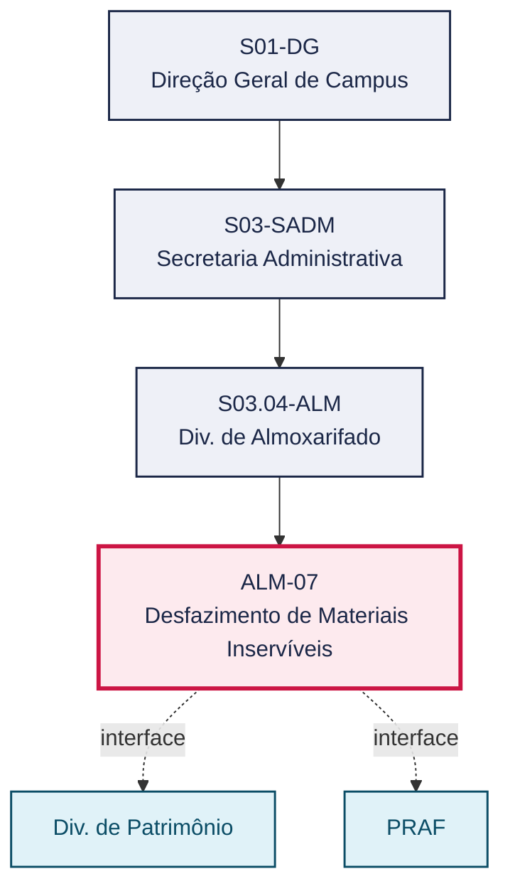
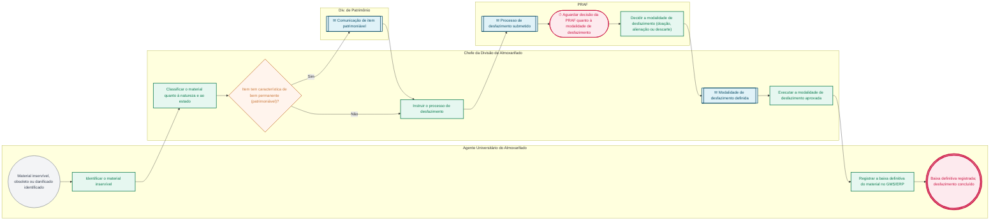

# POP ALM-07 — Desfazimento de Materiais Inservíveis

> **Documento vivo** · ATDG — Assessoria Técnica da Direção Geral · UNIOESTE Campus Foz do Iguaçu · Formato DDD híbrido + BPMN 2.0 padrão Anne Bail · Versão **1.0.0** · Status **em_validacao** · Atualizado em 2026-09-03

## 0. Cabeçalho DDD

| Divisão | Departamento | Descrição |
|---|---|---|
| Secretaria Administrativa | Div. de Almoxarifado | Identifica, classifica e regulariza a baixa de materiais inservíveis, obsoletos ou danificados, por meio de desfazimento regulamentado (doação, alienação ou descarte), com aprovação da PRAF e, quando pertinente, articulação com a Div. de Patrimônio. |

| Domínio | Subdomínio | Tipo | Contexto delimitado |
|---|---|---|---|
| Suprimentos e Materiais | Desfazimento regulamentado de materiais inservíveis | core | S03.04-ALM |

### 0.3 Linguagem ubíqua (glossário do processo)

| Termo | Definição | Sistema |
|---|---|---|
| Desfazimento | Processo regulamentado de baixa de material inservível, obsoleto ou danificado, por doação, alienação ou descarte. | GMS/ERP |
| Material inservível | Item que perdeu utilidade para a Administração por avaria, obsolescência, ociosidade ou antieconomicidade. | — |

## 1. Identificação

| Campo | Valor |
|---|---|
| Código | ALM-07 |
| Setor | Div. de Almoxarifado (`S03.04-ALM`) |
| Responsável (função) | Chefe da Divisão de Almoxarifado |
| Periodicidade | Conforme necessidade (identificação de material inservível) |
| Subordinação | Secretaria Administrativa |
| Normativa | Manual de Gestão do Almoxarifado — Materiais de Consumo (Unioeste Foz); Manual de Mapeamento de Processos do Almoxarifado (Unioeste Foz); Normativas do TCE-PR; Lei nº 14.133/2021 (Lei de Licitações e Contratos Administrativos), no que for pertinente ao desfazimento/alienação de bens da Administração Pública |
| Produto ATDG | POP |
| Pasta OneDrive | 03_MAPEAMENTO DE PROCESSOS |
| Fontes (entradas do Canvas) | pb-almoxarifado, 1780963200000, 1780963200001 |
| Lacunas abertas | formulario |
| Agente responsável | pop-alm-07 |

## 2. Organograma

## 3. Playbook

### 3.1 Gatilho (evento de domínio)

**Identificação de material inservível, obsoleto ou danificado (por inventário, avaria ou obsolescência)** — origem: Agente Universitário do Almoxarifado / ALM-04 Inventário Rotativo / ALM-05 Inventário Geral

### 3.2 Entrada

- Material identificado como inservível, obsoleto ou danificado (por inventário, avaria ou obsolescência)

### 3.3 Passo a passo

| Nº | Ação | Responsável | Sistema | Artefato | Prazo | Evento |
|---|---|---|---|---|---|---|
| 1 | Identificar o material inservível, obsoleto ou danificado | Agente Universitário do Almoxarifado | GMS/ERP | Registro de material inservível | Conforme identificação | Material inservível identificado |
| 2 | Classificar o material quanto à natureza (consumo/patrimônio) e ao estado | Chefe da Divisão de Almoxarifado | GMS/ERP | Registro de material inservível | A definir | Material classificado |
| 3 | Comunicar à Div. de Patrimônio quando o item tiver característica de bem permanente | Chefe da Divisão de Almoxarifado | e-Protocolo | Registro de material inservível | A definir | Div. de Patrimônio comunicada |
| 4 | Instruir o processo de desfazimento (justificativa, classificação, relação de itens) | Chefe da Divisão de Almoxarifado | e-Protocolo | Processo de desfazimento | A definir | Processo de desfazimento instruído |
| 5 | Submeter o processo de desfazimento à aprovação da PRAF | Chefe da Divisão de Almoxarifado | e-Protocolo | Processo de desfazimento | A definir | Processo submetido à PRAF |
| 6 | Aguardar a decisão da PRAF quanto à modalidade de desfazimento (doação, alienação ou descarte) | PRAF | e-Protocolo | Processo de desfazimento | A definir | Modalidade de desfazimento definida |
| 7 | Executar a modalidade de desfazimento aprovada | Chefe da Divisão de Almoxarifado | e-Protocolo | Termo de desfazimento | Conforme decisão da PRAF | Desfazimento executado |
| 8 | Registrar a baixa definitiva do material no GMS/ERP | Agente Universitário do Almoxarifado | GMS/ERP | Termo de desfazimento | Após execução do desfazimento | Baixa definitiva registrada |

### 3.4 Saída (entregáveis)

- Termo de desfazimento emitido e baixa definitiva registrada no GMS/ERP

## 4. Formulários e artefatos (agregados)

| Nome | Tipo | Sistema | Campos-chave | Preenchimento |
|---|---|---|---|---|
| Registro de material inservível | registro | GMS/ERP | item, motivo (avaria/obsolescência/inservibilidade), classificação, natureza (consumo/patrimônio) | Agente Universitário do Almoxarifado |
| Processo de desfazimento | documento | e-Protocolo | justificativa, relação de itens, classificação, modalidade proposta | Chefe da Divisão de Almoxarifado |
| Termo de desfazimento | registro | GMS/ERP | modalidade executada (doação/alienação/descarte), itens, data, destinatário, quando houver | Chefe da Divisão de Almoxarifado |

## 5. Decisões, exceções e pontos de atenção

| Decisão | Condição | Sim → | Não → |
|---|---|---|---|
| O item tem característica de bem permanente (patrimoniável)? | Classificação do material inservível quanto à natureza | Comunicar e tramitar o desfazimento em conjunto com a Div. de Patrimônio | Tramitar o desfazimento diretamente como material de consumo |

**Pontos de atenção**

- O desfazimento de item com característica de bem permanente deve ser conduzido em conjunto com a Div. de Patrimônio
- A execução do desfazimento (doação, alienação ou descarte) depende de decisão prévia da PRAF quanto à modalidade

## 6. Contingência

- PRAF não se manifesta sobre a modalidade de desfazimento no prazo esperado: a Chefia da Divisão de Almoxarifado reitera a solicitação e registra o atraso
- Material classificado incorretamente quanto à natureza (consumo/patrimônio): corrigir a classificação junto à Div. de Patrimônio antes de prosseguir
- Ausência de destinatário para doação ou de interessado em alienação: reencaminhar o processo à PRAF para definição de nova modalidade (ex.: descarte)

## 7. Checklist

- ( ) Material inservível identificado e classificado quanto à natureza e ao estado
- ( ) Itens patrimoniáveis comunicados à Div. de Patrimônio antes da instrução do processo
- ( ) Processo de desfazimento aprovado pela PRAF antes da execução de qualquer modalidade
- ( ) Baixa definitiva registrada no GMS/ERP após a execução do desfazimento

## 8. KPI / Indicadores

| Indicador | Fórmula | Meta | Fonte |
|---|---|---|---|
| Tempo médio de tramitação do processo de desfazimento | Soma dos tempos entre instrução e execução do desfazimento / nº de processos concluídos | A definir | e-Protocolo |
| Percentual de itens inservíveis com desfazimento concluído no exercício | Nº de itens com baixa definitiva / nº total de itens identificados como inservíveis no período | A definir | GMS/ERP |

## 9. Mapa de contexto (interfaces inter-setoriais)

| Origem | Relação | Destino | Artefato | Canal |
|---|---|---|---|---|
| Div. de Almoxarifado | informa | Div. de Patrimônio | Comunicação de item patrimoniável para desfazimento conjunto | e-Protocolo |
| Div. de Almoxarifado | aprova | PRAF | Processo de desfazimento | e-Protocolo |

## 10. Fluxograma (BPMN 2.0 — padrão Anne Bail)

## 11. Especificação BPMN para o Miro

**Raias:** Div. de Almoxarifado · Agente Universitário do Almoxarifado · Chefe da Divisão de Almoxarifado · Div. de Patrimônio · PRAF

| Id | Tipo | Elemento | Raia |
|---|---|---|---|
| e1 | inicio | Material inservível, obsoleto ou danificado identificado | Agente Universitário do Almoxarifado |
| e2 | atividade | Identificar o material inservível | Agente Universitário do Almoxarifado |
| e3 | atividade | Classificar o material quanto à natureza e ao estado | Chefe da Divisão de Almoxarifado |
| e4 | decisao | Item tem característica de bem permanente (patrimoniável)? | Chefe da Divisão de Almoxarifado |
| e5 | captura | Comunicação de item patrimoniável | Div. de Patrimônio |
| e6 | atividade | Instruir o processo de desfazimento | Chefe da Divisão de Almoxarifado |
| e7 | captura | Processo de desfazimento submetido | PRAF |
| e8 | pausa | Aguardar decisão da PRAF quanto à modalidade de desfazimento | PRAF |
| e9 | atividade | Decidir a modalidade de desfazimento (doação, alienação ou descarte) | PRAF |
| e10 | captura | Modalidade de desfazimento definida | Chefe da Divisão de Almoxarifado |
| e11 | atividade | Executar a modalidade de desfazimento aprovada | Chefe da Divisão de Almoxarifado |
| e12 | atividade | Registrar a baixa definitiva do material no GMS/ERP | Agente Universitário do Almoxarifado |
| e13 | fim | Baixa definitiva registrada; desfazimento concluído | Agente Universitário do Almoxarifado |

| De | Para | Rótulo |
|---|---|---|
| e1 | e2 | — |
| e2 | e3 | — |
| e3 | e4 | — |
| e4 | e5 | Sim |
| e5 | e6 | — |
| e4 | e6 | Não |
| e6 | e7 | — |
| e7 | e8 | — |
| e8 | e9 | — |
| e9 | e10 | — |
| e10 | e11 | — |
| e11 | e12 | — |
| e12 | e13 | — |

_Especificação gerada a partir dos passos do POP; 1 raia(s). Revisar decisões e pausas antes de construir no Miro._

## 12. Histórico de versões

| Versão | Data | Autor | Tipo | Mudanças | Fontes |
|---|---|---|---|---|---|
| 0.1.0 | 2026-09-02 | scripts/scaffold_pops.py | patch | Esqueleto inicial gerado deterministicamente a partir do escopo "Descarte, doação, leilão, baixa" | — |
| 1.0.0 | 2026-09-03 | agente:construtor-pop (lote ALM) | major | Passo adicionado após 1: Identificar o material inservível, obsoleto ou danificado; Passo adicionado após 1: Classificar o material quanto à natureza (consumo/patrimônio) e ao estado; Passo adicionado após 1: Comunicar à Div. de Patrimônio quando o item tiver característica de bem permane; Passo adicionado após 1: Instruir o processo de desfazimento (justificativa, classificação, relação de it; Passo adicionado após 1: Submeter o processo de desfazimento à aprovação da PRAF; Passo adicionado após 1: Aguardar a decisão da PRAF quanto à modalidade de desfazimento (doação, alienaçã; Passo adicionado após 1: Executar a modalidade de desfazimento aprovada; Passo adicionado após 1: Registrar a baixa definitiva do material no GMS/ERP; entrada_nova: +1; saida_nova: +1; artefatos_novos: +3; decisoes_novas: +1; kpis_novos: +2; mapa_contexto_novo: +2; pontos_atencao_novos: +2; contingencia_nova: +3; checklist_novo: +4; glossario_novo: +2; normativa_nova: +4; Campo ddd.descricao atualizado; Campo ddd.subdominio atualizado; Campo identificacao.responsavel atualizado; Campo identificacao.periodicidade atualizado; Campo playbook.gatilho atualizado; Campo observacoes atualizado; Raias adicionadas: Agente Universitário do Almoxarifado, Chefe da Divisão de Almoxarifado, Div. de Patrimônio, PRAF; Elementos BPMN removidos: e1, e2; Elementos BPMN adicionados: 13; Status promovido a em_validacao (≥ 3 passos e responsável definido) | pb-almoxarifado, 1780963200000, 1780963200001 |

## 13. Validação e aprovação

| Papel | Função / unidade | Data |
|---|---|---|
| Elaboração | ATDG — Assessoria Técnica da Direção Geral | 2026-09-02 |
| Revisão | A definir (responsável do setor) | ___/___/______ |
| Aprovação | Direção Geral do Campus | ___/___/______ |

## 14. Lições incorporadas

- **L-001** — Referir sempre função/cargo; nomes apenas no bloco 13 (Validação), com anuência (LGPD).
- **L-004** — Nunca regenerar POP existente: aplicar patch com changelog, fontes e versão.
- **L-006** — Preservar códigos legados como códigos de processo; não renumerar.
- **L-007** — Referência Externa é benchmark; normativa do POP só cita atos da Unioeste, do Estado do Paraná ou federais aplicáveis.
- **L-002** — Um passo = uma ação; ações compostas viram passos distintos.
- **L-003** — Cada linha do mapa de contexto gera um elemento `captura` no BPMN e um passo na raia de destino.

> **Observações:** Inferência a validar com a Chefia do Almoxarifado: (1) rito exato de classificação do material (ocioso, recuperável, antieconômico, irrecuperável) e critérios de escolha da modalidade de desfazimento, inferidos de prática comum de gestão patrimonial pública e não detalhados nas fontes disponíveis; (2) fluxo de articulação com a Div. de Patrimônio para itens com característica de bem permanente.

---
_Canvas Vivo — Base de Conhecimento Institucional · ATDG · UNIOESTE Campus Foz do Iguaçu · gerado por `scripts/render_pop.py` a partir de `pops/ALM/ALM-07.pop.json` (diretrizes v1.0)._
