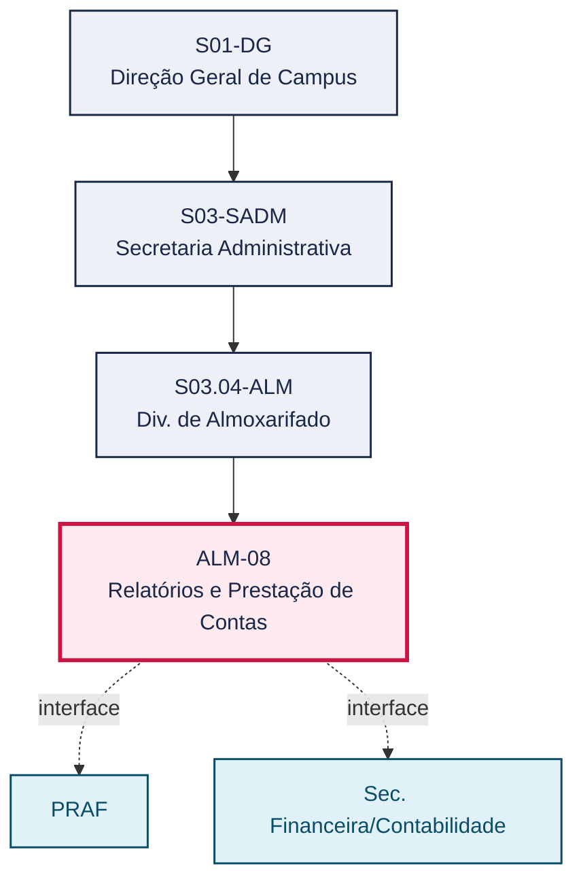
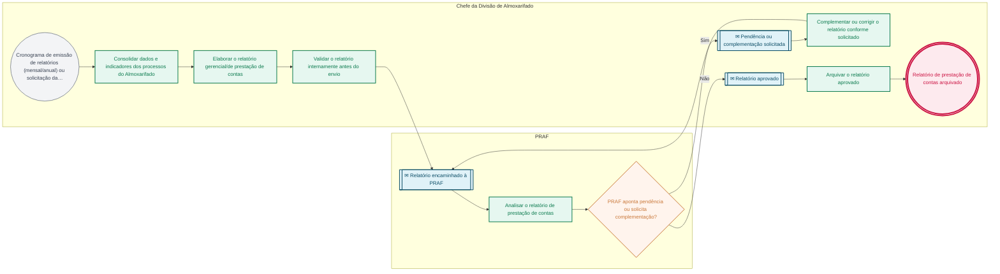

# POP ALM-08 — Relatórios e Prestação de Contas

> **Documento vivo** · ATDG — Assessoria Técnica da Direção Geral · UNIOESTE Campus Foz do Iguaçu · Formato DDD híbrido + BPMN 2.0 padrão Anne Bail · Versão **1.0.0** · Status **em_validacao** · Atualizado em 2026-09-03

## 0. Cabeçalho DDD

| Divisão | Departamento | Descrição |
|---|---|---|
| Secretaria Administrativa | Div. de Almoxarifado | Consolida indicadores e resultados dos demais processos do Almoxarifado (recebimento, armazenagem, distribuição, inventários, conciliação e desfazimento) em relatórios gerenciais e de prestação de contas, submetidos à aprovação da PRAF. |

| Domínio | Subdomínio | Tipo | Contexto delimitado |
|---|---|---|---|
| Suprimentos e Materiais | Relatórios gerenciais e prestação de contas do Almoxarifado | core | S03.04-ALM |

### 0.3 Linguagem ubíqua (glossário do processo)

| Termo | Definição | Sistema |
|---|---|---|
| Relatório de prestação de contas | Documento que consolida indicadores e resultados dos processos do Almoxarifado em um período, submetido à aprovação da PRAF. | GMS/ERP |

## 1. Identificação

| Campo | Valor |
|---|---|
| Código | ALM-08 |
| Setor | Div. de Almoxarifado (`S03.04-ALM`) |
| Responsável (função) | Chefe da Divisão de Almoxarifado |
| Periodicidade | Mensal e anual, conforme cronograma de relatórios |
| Subordinação | Secretaria Administrativa |
| Normativa | Manual de Gestão do Almoxarifado — Materiais de Consumo (Unioeste Foz); Manual de Mapeamento de Processos do Almoxarifado (Unioeste Foz); Normativas do TCE-PR |
| Produto ATDG | POP |
| Pasta OneDrive | 03_MAPEAMENTO DE PROCESSOS |
| Fontes (entradas do Canvas) | pb-almoxarifado, 1780963200000, 1780963200001 |
| Lacunas abertas | nenhuma |
| Agente responsável | pop-alm-08 |

## 2. Organograma

## 3. Playbook

### 3.1 Gatilho (evento de domínio)

**Cronograma de emissão de relatórios (mensal/anual) ou solicitação da PRAF** — origem: Chefia da Divisão de Almoxarifado / PRAF

### 3.2 Entrada

- Dados e indicadores dos processos do Almoxarifado (ALM-01 a ALM-07) do período de referência

### 3.3 Passo a passo

| Nº | Ação | Responsável | Sistema | Artefato | Prazo | Evento |
|---|---|---|---|---|---|---|
| 1 | Consolidar os dados e indicadores dos processos do Almoxarifado do período | Chefe da Divisão de Almoxarifado | GMS/ERP | Formulário de consolidação de indicadores | Mensal/anual, conforme cronograma | Dados consolidados |
| 2 | Elaborar o relatório gerencial/de prestação de contas do período | Chefe da Divisão de Almoxarifado | GMS/ERP | Relatório de prestação de contas | Conforme cronograma | Relatório elaborado |
| 3 | Validar o relatório internamente antes do envio | Chefe da Divisão de Almoxarifado | — | Relatório de prestação de contas | Antes do envio | Relatório validado |
| 4 | Encaminhar o relatório à PRAF | Chefe da Divisão de Almoxarifado | e-Protocolo | Relatório de prestação de contas | Conforme cronograma | Relatório encaminhado à PRAF |
| 5 | Complementar ou corrigir o relatório conforme pendência apontada pela PRAF, quando houver | Chefe da Divisão de Almoxarifado | e-Protocolo | Relatório de prestação de contas | A definir | Relatório complementado |
| 6 | Arquivar o relatório de prestação de contas aprovado | Chefe da Divisão de Almoxarifado | GMS/ERP | Relatório de prestação de contas | Após aprovação da PRAF | Relatório arquivado |

### 3.4 Saída (entregáveis)

- Relatório de prestação de contas aprovado pela PRAF e arquivado

## 4. Formulários e artefatos (agregados)

| Nome | Tipo | Sistema | Campos-chave | Preenchimento |
|---|---|---|---|---|
| Relatório de prestação de contas | registro | GMS/ERP | indicadores por processo, período de referência, pendências, aprovação PRAF | Chefe da Divisão de Almoxarifado |
| Formulário de consolidação de indicadores | formulario | planilha de controle | processo, indicador, valor no período, meta | Chefe da Divisão de Almoxarifado |

## 5. Decisões, exceções e pontos de atenção

| Decisão | Condição | Sim → | Não → |
|---|---|---|---|
| A PRAF aponta pendência ou solicita complementação do relatório? | Análise do relatório de prestação de contas pela PRAF | Complementar ou corrigir o relatório conforme solicitado e reencaminhar | Arquivar o relatório de prestação de contas aprovado |

**Pontos de atenção**

- O relatório de prestação de contas consolida indicadores de todos os demais processos do Almoxarifado; atrasos nos processos anteriores afetam o cumprimento do cronograma de relatórios
- Pendências apontadas pela PRAF devem ser complementadas antes do arquivamento definitivo do relatório

## 6. Contingência

- Dados de algum processo (ALM-01 a ALM-07) indisponíveis no prazo de consolidação: registrar a pendência e emitir o relatório com ressalva, complementando posteriormente
- PRAF não se manifesta sobre o relatório no prazo esperado: a Chefia da Divisão de Almoxarifado reitera a solicitação e registra o atraso
- Indisponibilidade do GMS/ERP para consolidação de indicadores: consolidar com base em planilha de controle e conferir os dados assim que o sistema for restabelecido

## 7. Checklist

- ( ) Dados e indicadores de todos os processos do período consolidados antes da elaboração do relatório
- ( ) Relatório validado internamente pela Chefia antes do envio à PRAF
- ( ) Pendências apontadas pela PRAF complementadas antes do arquivamento definitivo
- ( ) Relatório aprovado arquivado e disponível para consulta e auditoria

## 8. KPI / Indicadores

| Indicador | Fórmula | Meta | Fonte |
|---|---|---|---|
| Cumprimento do cronograma de emissão de relatórios | Nº de relatórios emitidos no prazo / nº de relatórios previstos no período | A definir | Cronograma de relatórios |
| Percentual de relatórios aprovados pela PRAF sem pendência | Nº de relatórios aprovados sem complementação / nº total de relatórios enviados no período | A definir | e-Protocolo |

## 9. Mapa de contexto (interfaces inter-setoriais)

| Origem | Relação | Destino | Artefato | Canal |
|---|---|---|---|---|
| Div. de Almoxarifado | fornece | PRAF | Relatório de prestação de contas | e-Protocolo |
| Div. de Almoxarifado | informa | Sec. Financeira/Contabilidade | Indicadores consolidados de materiais de consumo | e-Protocolo |

## 10. Fluxograma (BPMN 2.0 — padrão Anne Bail)

## 11. Especificação BPMN para o Miro

**Raias:** Div. de Almoxarifado · Chefe da Divisão de Almoxarifado · PRAF

| Id | Tipo | Elemento | Raia |
|---|---|---|---|
| e1 | inicio | Cronograma de emissão de relatórios (mensal/anual) ou solicitação da PRAF | Chefe da Divisão de Almoxarifado |
| e2 | atividade | Consolidar dados e indicadores dos processos do Almoxarifado | Chefe da Divisão de Almoxarifado |
| e3 | atividade | Elaborar o relatório gerencial/de prestação de contas | Chefe da Divisão de Almoxarifado |
| e4 | atividade | Validar o relatório internamente antes do envio | Chefe da Divisão de Almoxarifado |
| e5 | captura | Relatório encaminhado à PRAF | PRAF |
| e6 | atividade | Analisar o relatório de prestação de contas | PRAF |
| e7 | decisao | PRAF aponta pendência ou solicita complementação? | PRAF |
| e8 | captura | Pendência ou complementação solicitada | Chefe da Divisão de Almoxarifado |
| e9 | atividade | Complementar ou corrigir o relatório conforme solicitado | Chefe da Divisão de Almoxarifado |
| e10 | captura | Relatório aprovado | Chefe da Divisão de Almoxarifado |
| e11 | atividade | Arquivar o relatório aprovado | Chefe da Divisão de Almoxarifado |
| e12 | fim | Relatório de prestação de contas arquivado | Chefe da Divisão de Almoxarifado |

| De | Para | Rótulo |
|---|---|---|
| e1 | e2 | — |
| e2 | e3 | — |
| e3 | e4 | — |
| e4 | e5 | — |
| e5 | e6 | — |
| e6 | e7 | — |
| e7 | e8 | Sim |
| e8 | e9 | — |
| e9 | e5 | — |
| e7 | e10 | Não |
| e10 | e11 | — |
| e11 | e12 | — |

_Especificação gerada a partir dos passos do POP; 1 raia(s). Revisar decisões e pausas antes de construir no Miro._

## 12. Histórico de versões

| Versão | Data | Autor | Tipo | Mudanças | Fontes |
|---|---|---|---|---|---|
| 0.1.0 | 2026-09-02 | scripts/scaffold_pops.py | patch | Esqueleto inicial gerado deterministicamente a partir do escopo "Relatórios gerenciais e de prestação de contas" | — |
| 1.0.0 | 2026-09-03 | agente:construtor-pop (lote ALM) | major | Passo adicionado após 1: Consolidar os dados e indicadores dos processos do Almoxarifado do período; Passo adicionado após 1: Elaborar o relatório gerencial/de prestação de contas do período; Passo adicionado após 1: Validar o relatório internamente antes do envio; Passo adicionado após 1: Encaminhar o relatório à PRAF; Passo adicionado após 1: Complementar ou corrigir o relatório conforme pendência apontada pela PRAF, quan; Passo adicionado após 1: Arquivar o relatório de prestação de contas aprovado; entrada_nova: +1; saida_nova: +1; artefatos_novos: +2; decisoes_novas: +1; kpis_novos: +2; mapa_contexto_novo: +2; pontos_atencao_novos: +2; contingencia_nova: +3; checklist_novo: +4; glossario_novo: +1; normativa_nova: +3; Campo ddd.descricao atualizado; Campo ddd.subdominio atualizado; Campo identificacao.responsavel atualizado; Campo identificacao.periodicidade atualizado; Campo playbook.gatilho atualizado; Campo observacoes atualizado; Raias adicionadas: Chefe da Divisão de Almoxarifado, PRAF; Elementos BPMN removidos: e1, e2; Elementos BPMN adicionados: 12; Status promovido a em_validacao (≥ 3 passos e responsável definido) | pb-almoxarifado, 1780963200000, 1780963200001 |

## 13. Validação e aprovação

| Papel | Função / unidade | Data |
|---|---|---|
| Elaboração | ATDG — Assessoria Técnica da Direção Geral | 2026-09-02 |
| Revisão | A definir (responsável do setor) | ___/___/______ |
| Aprovação | Direção Geral do Campus | ___/___/______ |

## 14. Lições incorporadas

- **L-001** — Referir sempre função/cargo; nomes apenas no bloco 13 (Validação), com anuência (LGPD).
- **L-004** — Nunca regenerar POP existente: aplicar patch com changelog, fontes e versão.
- **L-006** — Preservar códigos legados como códigos de processo; não renumerar.
- **L-007** — Referência Externa é benchmark; normativa do POP só cita atos da Unioeste, do Estado do Paraná ou federais aplicáveis.
- **L-002** — Um passo = uma ação; ações compostas viram passos distintos.
- **L-003** — Cada linha do mapa de contexto gera um elemento `captura` no BPMN e um passo na raia de destino.

> **Observações:** Inferência a validar com a Chefia do Almoxarifado: (1) periodicidade exata dos relatórios gerenciais (mensal, trimestral) além do relatório anual, não detalhada nas fontes disponíveis; (2) rito de prazo para tratamento de pendências apontadas pela PRAF.

---
_Canvas Vivo — Base de Conhecimento Institucional · ATDG · UNIOESTE Campus Foz do Iguaçu · gerado por `scripts/render_pop.py` a partir de `pops/ALM/ALM-08.pop.json` (diretrizes v1.0)._
