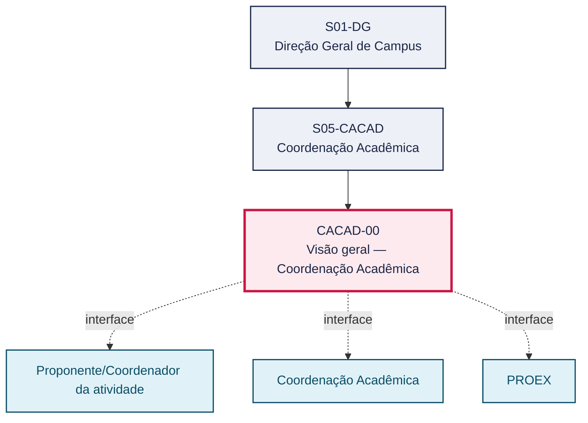

# POP CACAD-00 — Visão geral — Coordenação Acadêmica

> **Documento vivo** · ATDG — Assessoria Técnica da Direção Geral · UNIOESTE Campus Foz do Iguaçu · Formato DDD híbrido + BPMN 2.0 padrão Anne Bail · Versão **1.0.0** · Status **em_validacao** · Atualizado em 2026-09-03

## 0. Cabeçalho DDD

| Divisão | Departamento | Descrição |
|---|---|---|
| Coordenação Acadêmica | Coordenação Acadêmica | Guia da tramitação das atividades de extensão no e-Protocolo (PROEX): programas, projetos, cursos e eventos, com e sem recursos e com fomento externo. |

| Domínio | Subdomínio | Tipo | Contexto delimitado |
|---|---|---|---|
| Gestão Acadêmica | Visão geral do setor (playbook) | core | S05-CACAD |

### 0.3 Linguagem ubíqua (glossário do processo)

| Termo | Definição | Sistema |
|---|---|---|
| e-Protocolo | Sistema institucional de tramitação eletrônica de processos e documentos da Unioeste. | e-Protocolo |
| PROEX | Pró-Reitoria de Extensão da Unioeste, responsável por aprovar e acompanhar as atividades de extensão (programas, projetos, cursos e eventos). | — |
| Fomento externo | Financiamento de atividade de extensão por agência ou instituição externa à Unioeste, que segue fluxo próprio de tramitação no e-Protocolo. | — |
| Atividade de extensão | Programa, projeto, curso ou evento de extensão universitária, com ou sem recursos financeiros, proposto por docente ou agente universitário. | — |

## 1. Identificação

| Campo | Valor |
|---|---|
| Código | CACAD-00 |
| Setor | Coordenação Acadêmica — Geral (`S05-CACAD`) |
| Responsável (função) | Coordenação Acadêmica |
| Periodicidade | A definir |
| Subordinação | Direção Geral de Campus |
| Normativa | Manual de Fluxos e-Protocolo — PROEX; Manual de Fluxos e-Protocolo — PROEX (fluxos consolidados de programas, projetos, cursos, eventos e fomento externo) |
| Produto ATDG | POP |
| Pasta OneDrive | 03_MAPEAMENTO DE PROCESSOS |
| Fontes (entradas do Canvas) | pb-coord-academica |
| Lacunas abertas | interface_setorial, versao_documento |
| Agente responsável | — (não moldado) |

## 2. Organograma

## 3. Playbook

### 3.1 Gatilho (evento de domínio)

**Proposição de atividade de extensão (programa, projeto, curso ou evento)** — origem: Proponente/Coordenador da atividade

### 3.2 Entrada

- Proposta de atividade de extensão (programa, projeto, curso ou evento)

### 3.3 Passo a passo

| Nº | Ação | Responsável | Sistema | Artefato | Prazo | Evento |
|---|---|---|---|---|---|---|
| 1 | Classificar a atividade de extensão quanto à modalidade (programa, projeto, curso ou evento) | Proponente/Coordenador da atividade | e-Protocolo | Formulário de Atividade de Extensão | Antes da abertura do e-Protocolo | Atividade classificada |
| 2 | Verificar se a atividade prevê recursos financeiros | Proponente/Coordenador da atividade | e-Protocolo | Formulário de Atividade de Extensão | A definir | Recursos verificados |
| 3 | Verificar se há fomento externo à atividade | Proponente/Coordenador da atividade | e-Protocolo | Formulário de Atividade de Extensão | A definir | Fomento externo verificado |
| 4 | Abrir o e-Protocolo conforme o fluxo da modalidade identificada | Proponente/Coordenador da atividade | e-Protocolo | Processo e-Protocolo | A definir | e-Protocolo aberto |
| 5 | Anexar a documentação exigida pela modalidade | Proponente/Coordenador da atividade | e-Protocolo | Documentação da atividade de extensão | Antes do encaminhamento à Coordenação Acadêmica | Documentação anexada |
| 6 | Encaminhar o processo às instâncias previstas para a modalidade | Coordenação Acadêmica | e-Protocolo | Processo e-Protocolo | A definir | Processo encaminhado |
| 7 | Acompanhar a aprovação e eventuais pendências na PROEX | Coordenação Acadêmica | e-Protocolo | Processo e-Protocolo | A definir | Aprovação acompanhada |
| 8 | Registrar o resultado (deferimento, indeferimento ou pendência) e comunicar ao proponente | Coordenação Acadêmica | e-Protocolo | Processo e-Protocolo | A definir | Resultado comunicado |
| 9 | Arquivar o processo concluído | Coordenação Acadêmica | e-Protocolo | Processo e-Protocolo | A definir | Processo arquivado |

### 3.4 Saída (entregáveis)

- Atividade de extensão aprovada/registrada na PROEX

## 4. Formulários e artefatos (agregados)

| Nome | Tipo | Sistema | Campos-chave | Preenchimento |
|---|---|---|---|---|
| Formulário de Atividade de Extensão | formulario | e-Protocolo | modalidade (programa/projeto/curso/evento), proponente, com/sem recursos, fomento externo (S/N) | Proponente/Coordenador da atividade |
| Documentação da atividade de extensão | documento | e-Protocolo | projeto/plano de trabalho, cronograma, público-alvo | Proponente/Coordenador da atividade |

## 5. Decisões, exceções e pontos de atenção

| Decisão | Condição | Sim → | Não → |
|---|---|---|---|
| Atividade com recursos financeiros? | A atividade de extensão prevê captação/uso de recursos financeiros | Instruir o e-Protocolo pelo fluxo de atividade COM recursos (inclui análise orçamentária/financeira) | Instruir o e-Protocolo pelo fluxo de atividade SEM recursos |
| Há fomento externo? | A atividade é financiada por agência de fomento externa à Unioeste | Seguir o fluxo próprio de atividades com fomento externo | Seguir o fluxo padrão da modalidade (programa/projeto/curso/evento) |

**Pontos de atenção**

- Distinguir corretamente atividades com e sem recursos financeiros
- Atividades com fomento externo têm fluxo próprio

## 6. Contingência

- Se o e-Protocolo estiver indisponível, registrar a solicitação em meio alternativo e regularizar a tramitação eletrônica assim que o sistema for restabelecido.
- Se a documentação estiver incompleta, devolver ao proponente/coordenador com a relação de pendências antes de encaminhar à PROEX.
- Em caso de dúvida sobre o fluxo aplicável à modalidade, consultar a Comissão e-Protocolo ou a PROEX antes de tramitar.
- Atividades com fomento externo abertas erroneamente pelo fluxo padrão devem ser reclassificadas e reabertas pelo fluxo próprio de fomento externo.

## 7. Checklist

- ( ) Modalidade da atividade de extensão corretamente identificada (programa, projeto, curso ou evento)
- ( ) Classificação quanto a recursos financeiros e fomento externo definida
- ( ) e-Protocolo aberto conforme o fluxo específico da modalidade
- ( ) Documentação obrigatória anexada
- ( ) Encaminhamento às instâncias na ordem prevista

## 8. KPI / Indicadores

| Indicador | Fórmula | Meta | Fonte |
|---|---|---|---|
| Tempo médio de tramitação (abertura no e-Protocolo → deliberação da PROEX) | Σ(data da deliberação − data de abertura) / nº de processos no período | A definir | e-Protocolo |
| Percentual de processos devolvidos por pendência documental ou fluxo incorreto | processos devolvidos / total de processos abertos × 100 | A definir | e-Protocolo |

## 9. Mapa de contexto (interfaces inter-setoriais)

| Origem | Relação | Destino | Artefato | Canal |
|---|---|---|---|---|
| Proponente/Coordenador da atividade | fornece | Coordenação Acadêmica | Proposta de atividade de extensão | e-Protocolo |
| Coordenação Acadêmica | aprova | PROEX | Processo de extensão instruído | e-Protocolo |
| PROEX | informa | Coordenação Acadêmica | Decisão da PROEX sobre a atividade | e-Protocolo |

## 10. Fluxograma (BPMN 2.0 — padrão Anne Bail)

```mermaid
flowchart LR
  subgraph R1["Proponente/Coordenador da atividade"]
    direction LR
    e1(("Proposição de atividade de extensão"))
    e2["Classificar a modalidade da atividade (programa/projeto/curso/evento)"]
    e3{"Atividade com recursos financeiros?"}
    e4{"Há fomento externo?"}
    e6["Abrir o e-Protocolo conforme o fluxo da modalidade"]
    e7["Anexar a documentação exigida pela modalidade"]
  end
  subgraph R2["PROEX"]
    direction LR
    e5[["✉ Encaminhar pelo fluxo de fomento externo"]]
    e10[["✉ Encaminhar à PROEX para aprovação"]]
    e11(["⏱ Aguardar deliberação da PROEX"])
  end
  subgraph R3["Coordenação Acadêmica"]
    direction LR
    e8[["✉ Encaminhar à Coordenação Acadêmica"]]
    e9["Encaminhar o processo às instâncias previstas para a modalidade"]
    e12[["✉ Informar resultado à Coordenação Acadêmica"]]
    e13["Registrar o resultado e comunicar ao proponente"]
    e14((("Atividade de extensão aprovada/registrada")))
  end
  e1 --> e2
  e2 --> e3
  e3 -- Sim --> e4
  e3 -- Não --> e6
  e4 -- Sim --> e5
  e4 -- Não --> e6
  e5 --> e7
  e6 --> e7
  e7 --> e8
  e8 --> e9
  e9 --> e10
  e10 --> e11
  e11 --> e12
  e12 --> e13
  e13 --> e14
  classDef inicio fill:#f3f4f6,stroke:#6b7280,stroke-width:1.5px,color:#374151
  classDef atividade fill:#E6F7F0,stroke:#0B7A4E,stroke-width:2px,color:#0B7A4E
  classDef decisao fill:#FFF4ED,stroke:#C9783A,stroke-width:2px,color:#C9783A
  classDef fim fill:#FDEAEE,stroke:#CC1544,stroke-width:4px,color:#CC1544
  classDef pausa fill:#FDEAEE,stroke:#CC1544,stroke-width:2px,color:#CC1544
  classDef captura fill:#E0F2F8,stroke:#0B4D66,stroke-width:2px,color:#0B4D66
  class e1 inicio
  class e2,e6,e7,e9,e13 atividade
  class e3,e4 decisao
  class e5,e8,e10,e12 captura
  class e11 pausa
  class e14 fim
```

## 11. Especificação BPMN para o Miro

**Raias:** Proponente/Coordenador da atividade · PROEX · Coordenação Acadêmica

| Id | Tipo | Elemento | Raia |
|---|---|---|---|
| e1 | inicio | Proposição de atividade de extensão | Proponente/Coordenador da atividade |
| e2 | atividade | Classificar a modalidade da atividade (programa/projeto/curso/evento) | Proponente/Coordenador da atividade |
| e3 | decisao | Atividade com recursos financeiros? | Proponente/Coordenador da atividade |
| e4 | decisao | Há fomento externo? | Proponente/Coordenador da atividade |
| e5 | captura | Encaminhar pelo fluxo de fomento externo | PROEX |
| e6 | atividade | Abrir o e-Protocolo conforme o fluxo da modalidade | Proponente/Coordenador da atividade |
| e7 | atividade | Anexar a documentação exigida pela modalidade | Proponente/Coordenador da atividade |
| e8 | captura | Encaminhar à Coordenação Acadêmica | Coordenação Acadêmica |
| e9 | atividade | Encaminhar o processo às instâncias previstas para a modalidade | Coordenação Acadêmica |
| e10 | captura | Encaminhar à PROEX para aprovação | PROEX |
| e11 | pausa | Aguardar deliberação da PROEX | PROEX |
| e12 | captura | Informar resultado à Coordenação Acadêmica | Coordenação Acadêmica |
| e13 | atividade | Registrar o resultado e comunicar ao proponente | Coordenação Acadêmica |
| e14 | fim | Atividade de extensão aprovada/registrada | Coordenação Acadêmica |

| De | Para | Rótulo |
|---|---|---|
| e1 | e2 | — |
| e2 | e3 | — |
| e3 | e4 | Sim |
| e3 | e6 | Não |
| e4 | e5 | Sim |
| e4 | e6 | Não |
| e5 | e7 | — |
| e6 | e7 | — |
| e7 | e8 | — |
| e8 | e9 | — |
| e9 | e10 | — |
| e10 | e11 | — |
| e11 | e12 | — |
| e12 | e13 | — |
| e13 | e14 | — |

_Especificação gerada a partir dos passos do POP; 1 raia(s). Revisar decisões e pausas antes de construir no Miro._

## 12. Histórico de versões

| Versão | Data | Autor | Tipo | Mudanças | Fontes |
|---|---|---|---|---|---|
| 0.1.0 | 2026-09-02 | scripts/scaffold_pops.py | patch | Esqueleto inicial gerado deterministicamente a partir das entradas pb-coord-academica | pb-coord-academica |
| 1.0.0 | 2026-09-03 | agente:construtor-pop (lote D1) | major | Passo 1 alterado (acao, responsavel, sistema, artefato, prazo, evento); Passo 2 alterado (acao, responsavel, sistema, artefato, prazo, evento); Passo 3 alterado (acao, responsavel, sistema, artefato, prazo, evento); Passo 4 alterado (acao, responsavel, sistema, artefato, prazo, evento); Passo adicionado após 1: Verificar se a atividade prevê recursos financeiros; Passo adicionado após 1: Verificar se há fomento externo à atividade; Passo adicionado após 3: Encaminhar o processo às instâncias previstas para a modalidade; Passo adicionado após 4: Registrar o resultado (deferimento, indeferimento ou pendência) e comunicar ao p; Passo adicionado após 4: Arquivar o processo concluído; entrada_nova: +1; saida_nova: +1; artefatos_novos: +2; decisoes_novas: +2; kpis_novos: +2; mapa_contexto_novo: +3; pontos_atencao_novos: +2; contingencia_nova: +4; checklist_novo: +5; glossario_novo: +4; normativa_nova: +1; Campo identificacao.responsavel atualizado; Campo playbook.gatilho atualizado; Raias adicionadas: Proponente/Coordenador da atividade, PROEX, Coordenação Acadêmica; Elementos BPMN removidos: e1, e2, e3, e4, e5, e6; Elementos BPMN adicionados: 14; Status promovido a em_validacao (≥ 3 passos e responsável definido) | pb-coord-academica |

## 13. Validação e aprovação

| Papel | Função / unidade | Data |
|---|---|---|
| Elaboração | ATDG — Assessoria Técnica da Direção Geral | 2026-09-02 |
| Revisão | A definir (responsável do setor) | ___/___/______ |
| Aprovação | Direção Geral do Campus | ___/___/______ |

## 14. Lições incorporadas

- **L-001** — Referir sempre função/cargo; nomes apenas no bloco 13 (Validação), com anuência (LGPD).
- **L-004** — Nunca regenerar POP existente: aplicar patch com changelog, fontes e versão.
- **L-006** — Preservar códigos legados como códigos de processo; não renumerar.
- **L-007** — Referência Externa é benchmark; normativa do POP só cita atos da Unioeste, do Estado do Paraná ou federais aplicáveis.
- **L-002** — Um passo = uma ação; ações compostas viram passos distintos.
- **L-003** — Cada linha do mapa de contexto gera um elemento `captura` no BPMN e um passo na raia de destino.

---
_Canvas Vivo — Base de Conhecimento Institucional · ATDG · UNIOESTE Campus Foz do Iguaçu · gerado por `scripts/render_pop.py` a partir de `pops/CACAD/CACAD-00.pop.json` (diretrizes v1.2)._
