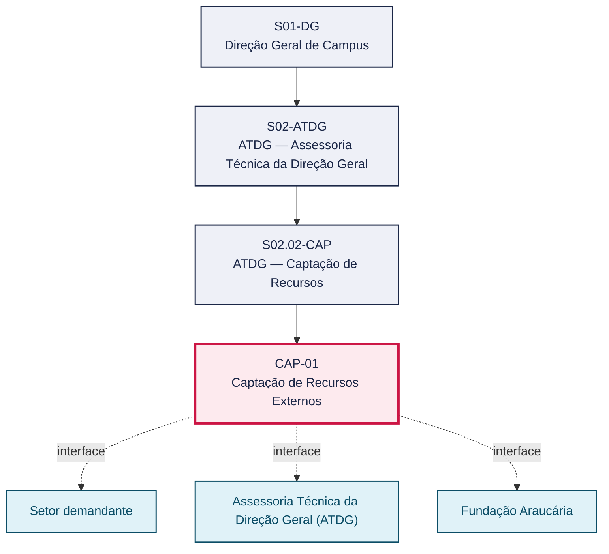

# POP CAP-01 — Captação de Recursos Externos

> **Documento vivo** · ATDG — Assessoria Técnica da Direção Geral · UNIOESTE Campus Foz do Iguaçu · Formato DDD híbrido + BPMN 2.0 padrão Anne Bail · Versão **0.2.1** · Status **rascunho** · Atualizado em 2026-09-03

## 0. Cabeçalho DDD

| Divisão | Departamento | Descrição |
|---|---|---|
| ATDG — Assessoria Técnica da Direção Geral | ATDG — Captação de Recursos | Captação de Recursos Externos — Editais, Fundação Araucária, SETI. Processo codificado no manual institucional da ATDG (jun/2026); conteúdo operacional a documentar. |

| Domínio | Subdomínio | Tipo | Contexto delimitado |
|---|---|---|---|
| Convênios, Parcerias e Captação | Captação de Recursos Externos | core | S02.02-CAP |

### 0.3 Linguagem ubíqua (glossário do processo)

| Termo | Definição | Sistema |
|---|---|---|
| Fundação Araucária | Fundação de apoio ao desenvolvimento científico e tecnológico do Estado do Paraná, financiadora de editais de fomento à pesquisa e extensão. | — |

## 1. Identificação

| Campo | Valor |
|---|---|
| Código | CAP-01 |
| Setor | ATDG — Assessoria Técnica da Direção Geral (`S02.02-CAP`) |
| Responsável (função) | A definir |
| Periodicidade | Conforme calendário de editais de fomento |
| Subordinação | ATDG — Assessoria Técnica da Direção Geral |
| Normativa | A definir |
| Produto ATDG | POP |
| Pasta OneDrive | 01_ADMINISTRATIVO |
| Fontes (entradas do Canvas) | — |
| Lacunas abertas | responsavel, kpi, formulario, prazo, normativa |
| Agente responsável | pop-cap-01 |

## 2. Organograma

## 3. Playbook

### 3.1 Gatilho (evento de domínio)

**Publicação de edital de fomento (Fundação Araucária, SETI ou outro órgão) de interesse do Campus** — origem: Fundação Araucária

### 3.2 Entrada

- Edital de fomento publicado
- Proposta técnica do setor demandante

### 3.3 Passo a passo

| Nº | Ação | Responsável | Sistema | Artefato | Prazo | Evento |
|---|---|---|---|---|---|---|
| 1 | Identificar e divulgar editais de fomento de interesse do Campus | Assessoria Técnica da Direção Geral (ATDG) | A definir | Edital de fomento | A definir | Edital identificado e divulgado |
| 2 | Receber a manifestação de interesse do setor demandante em submeter proposta | Assessoria Técnica da Direção Geral (ATDG) | e-Protocolo | Manifestação de interesse | A definir | Manifestação recebida |
| 3 | Orientar a elaboração da proposta técnica conforme as exigências do edital | Assessoria Técnica da Direção Geral (ATDG) | e-Protocolo | Proposta técnica | A definir | Proposta orientada |
| 4 | Conferir a documentação exigida pelo edital antes da submissão | Assessoria Técnica da Direção Geral (ATDG) | e-Protocolo | Checklist de exigências do edital | A definir | Documentação conferida |
| 5 | Submeter a proposta ao órgão de fomento (Fundação Araucária/SETI) | Assessoria Técnica da Direção Geral (ATDG) | A definir | Proposta submetida | A definir | Proposta submetida |
| 6 | Acompanhar o resultado da análise do órgão de fomento | Assessoria Técnica da Direção Geral (ATDG) | A definir | Resultado da análise | A definir | Resultado acompanhado |
| 7 | Registrar o resultado da submissão e comunicar ao setor demandante | Assessoria Técnica da Direção Geral (ATDG) | OneDrive ATDG | Registro de captação de recursos | A definir | Resultado registrado e comunicado |

### 3.4 Saída (entregáveis)

- Proposta submetida ao edital
- Registro de resultado da submissão (aprovação/reprovação)

## 4. Formulários e artefatos (agregados)

| Nome | Tipo | Sistema | Campos-chave | Preenchimento |
|---|---|---|---|---|
| Checklist de exigências do edital | formulario | e-Protocolo | item exigido, documento correspondente, situação | Assessoria Técnica da Direção Geral (ATDG) |
| Registro de captação de recursos externos | registro | OneDrive ATDG | edital, órgão de fomento, situação, valor pleiteado | Assessoria Técnica da Direção Geral (ATDG) |

## 5. Decisões, exceções e pontos de atenção

| Decisão | Condição | Sim → | Não → |
|---|---|---|---|
| A documentação da proposta atende integralmente às exigências do edital? | Checklist de exigências do edital conferido antes da submissão | Submeter a proposta ao órgão de fomento | Devolver ao setor demandante para complementação da proposta |

**Pontos de atenção**

- Editais de fomento têm prazos improrrogáveis de submissão — monitorar datas-limite
- Confirmar contrapartida institucional exigida pelo edital antes da submissão

## 6. Contingência

- Prazo do edital próximo do vencimento sem proposta concluída: priorizar a conclusão ou desistir formalmente da submissão
- Documentação exigida pelo edital incompleta: devolver ao setor demandante com prazo interno de regularização
- Proposta reprovada pelo órgão de fomento: registrar os motivos e avaliar nova submissão em edital futuro

## 7. Checklist

- ( ) Edital de fomento identificado e divulgado ao Campus
- ( ) Manifestação de interesse do setor demandante registrada
- ( ) Proposta técnica elaborada conforme exigências do edital
- ( ) Documentação conferida antes da submissão
- ( ) Resultado da submissão registrado e comunicado

## 8. KPI / Indicadores

| Indicador | Fórmula | Meta | Fonte |
|---|---|---|---|
| Percentual de propostas submetidas dentro do prazo do edital | (Propostas submetidas no prazo / total de propostas iniciadas) × 100 | A definir | e-Protocolo |
| Taxa de aprovação de propostas submetidas a editais de fomento | (Propostas aprovadas / total de propostas submetidas) × 100 | A definir | OneDrive ATDG |

## 9. Mapa de contexto (interfaces inter-setoriais)

| Origem | Relação | Destino | Artefato | Canal |
|---|---|---|---|---|
| Setor demandante | fornece | Assessoria Técnica da Direção Geral (ATDG) | Proposta técnica para o edital de fomento | e-Protocolo |
| Assessoria Técnica da Direção Geral (ATDG) | informa | Fundação Araucária | Proposta submetida ao edital | A definir |
| Fundação Araucária | informa | Assessoria Técnica da Direção Geral (ATDG) | Resultado da análise da proposta | A definir |

## 10. Fluxograma (BPMN 2.0 — padrão Anne Bail)

```mermaid
flowchart LR
  subgraph R1["Assessoria Técnica da Direção Geral (ATDG)"]
    direction LR
    e1(("Publicação de edital de fomento (Fundação Araucária, SETI ou outro ór…"))
    e2["Identificar e divulgar editais de fomento de interesse do Campus"]
    e3["Receber a manifestação de interesse do setor demandante em submeter p…"]
    e4["Orientar a elaboração da proposta técnica conforme as exigências do e…"]
    e5["Conferir a documentação exigida pelo edital antes da submissão"]
    e6["Submeter a proposta ao órgão de fomento (Fundação Araucária/SETI)"]
    e7["Acompanhar o resultado da análise do órgão de fomento"]
    e8["Registrar o resultado da submissão e comunicar ao setor demandante"]
    e9[["✉ Encaminhar a Assessoria Técnica da Direção Geral (ATDG)"]]
    e11[["✉ Informar Assessoria Técnica da Direção Geral (ATDG)"]]
    e12((("Proposta submetida ao edital")))
  end
  subgraph R2["Fundação Araucária"]
    direction LR
    e10[["✉ Informar Fundação Araucária"]]
  end
  e1 --> e2
  e2 --> e3
  e3 --> e4
  e4 --> e5
  e5 --> e6
  e6 --> e7
  e7 --> e8
  e8 --> e9
  e9 --> e10
  e10 --> e11
  e11 --> e12
  classDef inicio fill:#f3f4f6,stroke:#6b7280,stroke-width:1.5px,color:#374151
  classDef atividade fill:#E6F7F0,stroke:#0B7A4E,stroke-width:2px,color:#0B7A4E
  classDef decisao fill:#FFF4ED,stroke:#C9783A,stroke-width:2px,color:#C9783A
  classDef fim fill:#FDEAEE,stroke:#CC1544,stroke-width:4px,color:#CC1544
  classDef pausa fill:#FDEAEE,stroke:#CC1544,stroke-width:2px,color:#CC1544
  classDef captura fill:#E0F2F8,stroke:#0B4D66,stroke-width:2px,color:#0B4D66
  class e1 inicio
  class e2,e3,e4,e5,e6,e7,e8 atividade
  class e9,e10,e11 captura
  class e12 fim
```

## 11. Especificação BPMN para o Miro

**Raias:** Assessoria Técnica da Direção Geral (ATDG) · Fundação Araucária

| Id | Tipo | Elemento | Raia |
|---|---|---|---|
| e1 | inicio | Publicação de edital de fomento (Fundação Araucária, SETI ou outro órgão) de interesse do Campus | Assessoria Técnica da Direção Geral (ATDG) |
| e2 | atividade | Identificar e divulgar editais de fomento de interesse do Campus | Assessoria Técnica da Direção Geral (ATDG) |
| e3 | atividade | Receber a manifestação de interesse do setor demandante em submeter proposta | Assessoria Técnica da Direção Geral (ATDG) |
| e4 | atividade | Orientar a elaboração da proposta técnica conforme as exigências do edital | Assessoria Técnica da Direção Geral (ATDG) |
| e5 | atividade | Conferir a documentação exigida pelo edital antes da submissão | Assessoria Técnica da Direção Geral (ATDG) |
| e6 | atividade | Submeter a proposta ao órgão de fomento (Fundação Araucária/SETI) | Assessoria Técnica da Direção Geral (ATDG) |
| e7 | atividade | Acompanhar o resultado da análise do órgão de fomento | Assessoria Técnica da Direção Geral (ATDG) |
| e8 | atividade | Registrar o resultado da submissão e comunicar ao setor demandante | Assessoria Técnica da Direção Geral (ATDG) |
| e9 | captura | Encaminhar a Assessoria Técnica da Direção Geral (ATDG) | Assessoria Técnica da Direção Geral (ATDG) |
| e10 | captura | Informar Fundação Araucária | Fundação Araucária |
| e11 | captura | Informar Assessoria Técnica da Direção Geral (ATDG) | Assessoria Técnica da Direção Geral (ATDG) |
| e12 | fim | Proposta submetida ao edital | Assessoria Técnica da Direção Geral (ATDG) |

| De | Para | Rótulo |
|---|---|---|
| e1 | e2 | — |
| e2 | e3 | — |
| e3 | e4 | — |
| e4 | e5 | — |
| e5 | e6 | — |
| e6 | e7 | — |
| e7 | e8 | — |
| e8 | e9 | — |
| e9 | e10 | — |
| e10 | e11 | — |
| e11 | e12 | — |

_Especificação gerada a partir dos passos do POP; 2 raia(s). Revisar decisões e pausas antes de construir no Miro._

## 12. Histórico de versões

| Versão | Data | Autor | Tipo | Mudanças | Fontes |
|---|---|---|---|---|---|
| 0.1.0 | 2026-09-02 | scripts/scaffold_pops.py | patch | Esqueleto inicial gerado deterministicamente a partir do escopo "Editais, Fundação Araucária, SETI" | — |
| 0.2.0 | 2026-09-03 | agente:construtor-pop (lote B) | minor | Passo adicionado após 0: Identificar e divulgar editais de fomento de interesse do Campus; Passo adicionado após 1: Receber a manifestação de interesse do setor demandante em submeter proposta; Passo adicionado após 2: Orientar a elaboração da proposta técnica conforme as exigências do edital; Passo adicionado após 3: Conferir a documentação exigida pelo edital antes da submissão; Passo adicionado após 4: Submeter a proposta ao órgão de fomento (Fundação Araucária/SETI); Passo adicionado após 5: Acompanhar o resultado da análise do órgão de fomento; Passo adicionado após 6: Registrar o resultado da submissão e comunicar ao setor demandante; entrada_nova: +2; saida_nova: +2; artefatos_novos: +2; decisoes_novas: +1; kpis_novos: +2; mapa_contexto_novo: +3; pontos_atencao_novos: +2; contingencia_nova: +3; checklist_novo: +5; glossario_novo: +1; Campo identificacao.periodicidade atualizado; Campo playbook.gatilho atualizado; Campo observacoes atualizado; Fluxograma regenerado a partir dos passos | — |
| 0.2.1 | 2026-09-03 | agente:curador-diretrizes | patch | Fluxograma regenerado a partir dos passos | — |

## 13. Validação e aprovação

| Papel | Função / unidade | Data |
|---|---|---|
| Elaboração | ATDG — Assessoria Técnica da Direção Geral | 2026-09-02 |
| Revisão | A definir (responsável do setor) | ___/___/______ |
| Aprovação | Direção Geral do Campus | ___/___/______ |

## 14. Lições incorporadas

- **L-001** — Referir sempre função/cargo; nomes apenas no bloco 13 (Validação), com anuência (LGPD).
- **L-004** — Nunca regenerar POP existente: aplicar patch com changelog, fontes e versão.
- **L-006** — Preservar códigos legados como códigos de processo; não renumerar.
- **L-007** — Referência Externa é benchmark; normativa do POP só cita atos da Unioeste, do Estado do Paraná ou federais aplicáveis.
- **L-002** — Um passo = uma ação; ações compostas viram passos distintos.
- **L-003** — Cada linha do mapa de contexto gera um elemento `captura` no BPMN e um passo na raia de destino.

> **Observações:** Inferência a validar com a ATDG: playbook construído a partir do escopo do manual institucional da ATDG (jun/2026) e da prática administrativa geral de captação de recursos e parcerias em universidades estaduais do Paraná, sem entradas do Canvas Vivo para este processo; validar papéis, sistemas, prazos, normativa específica e fluxo de aprovação junto à ATDG.

---
_Canvas Vivo — Base de Conhecimento Institucional · ATDG · UNIOESTE Campus Foz do Iguaçu · gerado por `scripts/render_pop.py` a partir de `pops/CAP/CAP-01.pop.json` (diretrizes v1.12)._
