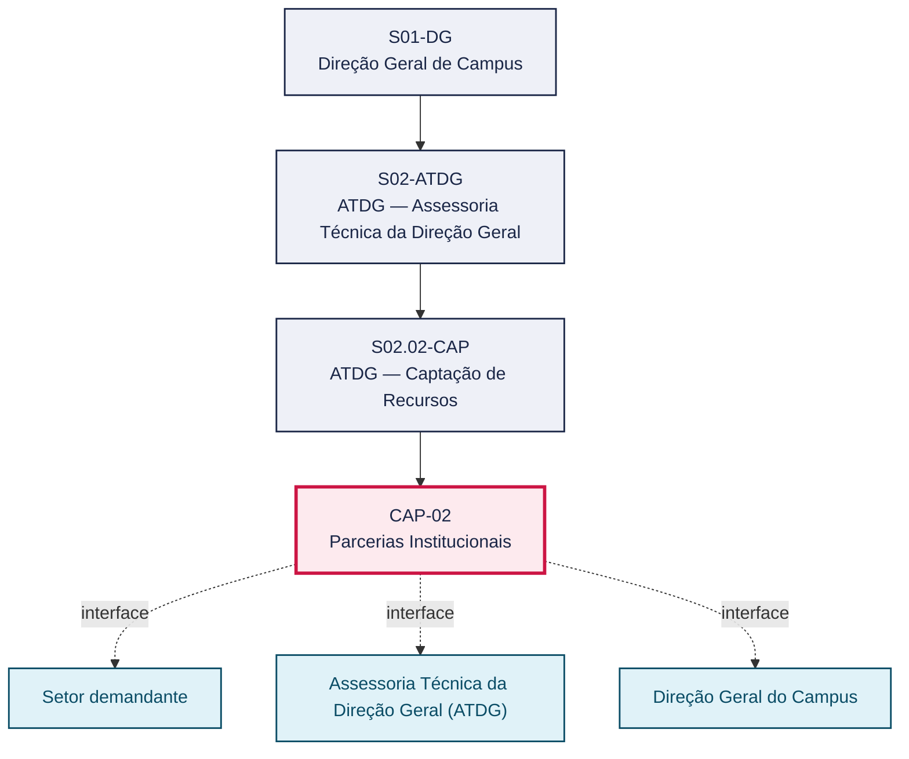
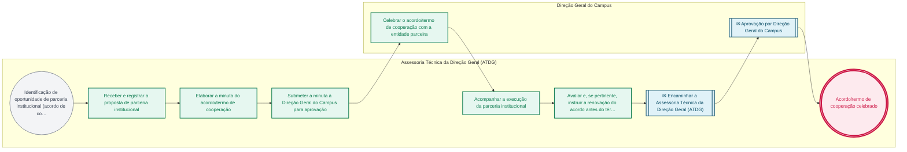

# POP CAP-02 — Parcerias Institucionais

> **Documento vivo** · ATDG — Assessoria Técnica da Direção Geral · UNIOESTE Campus Foz do Iguaçu · Formato DDD híbrido + BPMN 2.0 padrão Anne Bail · Versão **0.2.1** · Status **rascunho** · Atualizado em 2026-09-03

## 0. Cabeçalho DDD

| Divisão | Departamento | Descrição |
|---|---|---|
| ATDG — Assessoria Técnica da Direção Geral | ATDG — Captação de Recursos | Parcerias Institucionais — Instrução, acompanhamento, renovação. Processo codificado no manual institucional da ATDG (jun/2026); conteúdo operacional a documentar. |

| Domínio | Subdomínio | Tipo | Contexto delimitado |
|---|---|---|---|
| Convênios, Parcerias e Captação | Parcerias Institucionais | core | S02.02-CAP |

### 0.3 Linguagem ubíqua (glossário do processo)

| Termo | Definição | Sistema |
|---|---|---|
| Acordo de cooperação técnica | Instrumento que formaliza parceria institucional sem necessariamente envolver repasse de recursos financeiros entre os partícipes. | — |

## 1. Identificação

| Campo | Valor |
|---|---|
| Código | CAP-02 |
| Setor | ATDG — Assessoria Técnica da Direção Geral (`S02.02-CAP`) |
| Responsável (função) | A definir |
| Periodicidade | Sob demanda |
| Subordinação | ATDG — Assessoria Técnica da Direção Geral |
| Normativa | A definir |
| Produto ATDG | POP |
| Pasta OneDrive | 01_ADMINISTRATIVO |
| Fontes (entradas do Canvas) | — |
| Lacunas abertas | responsavel, kpi, formulario, prazo, normativa |
| Agente responsável | pop-cap-02 |

## 2. Organograma

## 3. Playbook

### 3.1 Gatilho (evento de domínio)

**Identificação de oportunidade de parceria institucional (acordo de cooperação técnica) com entidade pública ou privada** — origem: Setor demandante

### 3.2 Entrada

- Proposta/manifestação de interesse em parceria institucional
- Minuta de acordo de cooperação

### 3.3 Passo a passo

| Nº | Ação | Responsável | Sistema | Artefato | Prazo | Evento |
|---|---|---|---|---|---|---|
| 1 | Receber e registrar a proposta de parceria institucional | Assessoria Técnica da Direção Geral (ATDG) | e-Protocolo | Proposta de parceria | A definir | Proposta registrada |
| 2 | Elaborar a minuta do acordo/termo de cooperação | Assessoria Técnica da Direção Geral (ATDG) | e-Protocolo | Minuta de acordo de cooperação | A definir | Minuta elaborada |
| 3 | Submeter a minuta à Direção Geral do Campus para aprovação | Assessoria Técnica da Direção Geral (ATDG) | e-Protocolo | Minuta de acordo de cooperação | A definir | Minuta submetida |
| 4 | Celebrar o acordo/termo de cooperação com a entidade parceira | Direção Geral do Campus | e-Protocolo | Acordo de cooperação assinado | A definir | Acordo celebrado |
| 5 | Acompanhar a execução da parceria institucional | Assessoria Técnica da Direção Geral (ATDG) | OneDrive ATDG | Registro de acompanhamento de parcerias | A definir | Parceria acompanhada |
| 6 | Avaliar e, se pertinente, instruir a renovação do acordo antes do término da vigência | Assessoria Técnica da Direção Geral (ATDG) | e-Protocolo | Processo de renovação | A definir | Renovação avaliada |

### 3.4 Saída (entregáveis)

- Acordo/termo de cooperação celebrado
- Parceria acompanhada e, quando aplicável, renovada

## 4. Formulários e artefatos (agregados)

| Nome | Tipo | Sistema | Campos-chave | Preenchimento |
|---|---|---|---|---|
| Acordo/termo de cooperação técnica | documento | e-Protocolo | partícipes, objeto, vigência, obrigações | Assessoria Técnica da Direção Geral (ATDG) |
| Registro de acompanhamento de parcerias institucionais | registro | OneDrive ATDG | parceria, vigência, situação, data da última renovação | Assessoria Técnica da Direção Geral (ATDG) |

## 5. Decisões, exceções e pontos de atenção

| Decisão | Condição | Sim → | Não → |
|---|---|---|---|
| Há interesse institucional na renovação do acordo de cooperação antes do término da vigência? | Avaliação do acompanhamento da parceria próximo ao final da vigência | Instruir o processo de renovação do acordo | Encerrar a parceria ao término da vigência e arquivar o processo |

**Pontos de atenção**

- Monitorar o prazo de vigência do acordo com antecedência suficiente para decidir sobre a renovação
- Verificar se a parceria envolve repasse de recursos, hipótese em que se aplicam também os fluxos de convênio (CON)

## 6. Contingência

- Entidade parceira não responde à proposta de renovação: reiterar contato e, na ausência de resposta, encerrar a parceria
- Minuta de acordo rejeitada pela Direção Geral: revisar conforme as observações e reencaminhar
- Parceria em execução sem acompanhamento registrado: retomar o registro a partir dos documentos disponíveis

## 7. Checklist

- ( ) Proposta de parceria registrada
- ( ) Minuta de acordo de cooperação elaborada e aprovada
- ( ) Acordo celebrado e assinado pelas partes
- ( ) Execução da parceria acompanhada periodicamente
- ( ) Renovação avaliada antes do término da vigência

## 8. KPI / Indicadores

| Indicador | Fórmula | Meta | Fonte |
|---|---|---|---|
| Percentual de parcerias com acompanhamento registrado no período | (Parcerias com registro de acompanhamento / total de parcerias ativas) × 100 | A definir | OneDrive ATDG |
| Percentual de parcerias renovadas antes do término da vigência | (Parcerias renovadas no prazo / total de parcerias elegíveis à renovação) × 100 | A definir | OneDrive ATDG |

## 9. Mapa de contexto (interfaces inter-setoriais)

| Origem | Relação | Destino | Artefato | Canal |
|---|---|---|---|---|
| Setor demandante | fornece | Assessoria Técnica da Direção Geral (ATDG) | Proposta de parceria institucional | e-Protocolo |
| Assessoria Técnica da Direção Geral (ATDG) | aprova | Direção Geral do Campus | Minuta de acordo de cooperação | e-Protocolo |

## 10. Fluxograma (BPMN 2.0 — padrão Anne Bail)

## 11. Especificação BPMN para o Miro

**Raias:** Assessoria Técnica da Direção Geral (ATDG) · Direção Geral do Campus

| Id | Tipo | Elemento | Raia |
|---|---|---|---|
| e1 | inicio | Identificação de oportunidade de parceria institucional (acordo de cooperação técnica) com entidade pública ou privada | Assessoria Técnica da Direção Geral (ATDG) |
| e2 | atividade | Receber e registrar a proposta de parceria institucional | Assessoria Técnica da Direção Geral (ATDG) |
| e3 | atividade | Elaborar a minuta do acordo/termo de cooperação | Assessoria Técnica da Direção Geral (ATDG) |
| e4 | atividade | Submeter a minuta à Direção Geral do Campus para aprovação | Assessoria Técnica da Direção Geral (ATDG) |
| e5 | atividade | Celebrar o acordo/termo de cooperação com a entidade parceira | Direção Geral do Campus |
| e6 | atividade | Acompanhar a execução da parceria institucional | Assessoria Técnica da Direção Geral (ATDG) |
| e7 | atividade | Avaliar e, se pertinente, instruir a renovação do acordo antes do término da vigência | Assessoria Técnica da Direção Geral (ATDG) |
| e8 | captura | Encaminhar a Assessoria Técnica da Direção Geral (ATDG) | Assessoria Técnica da Direção Geral (ATDG) |
| e9 | captura | Aprovação por Direção Geral do Campus | Direção Geral do Campus |
| e10 | fim | Acordo/termo de cooperação celebrado | Assessoria Técnica da Direção Geral (ATDG) |

| De | Para | Rótulo |
|---|---|---|
| e1 | e2 | — |
| e2 | e3 | — |
| e3 | e4 | — |
| e4 | e5 | — |
| e5 | e6 | — |
| e6 | e7 | — |
| e7 | e8 | — |
| e8 | e9 | — |
| e9 | e10 | — |

_Especificação gerada a partir dos passos do POP; 2 raia(s). Revisar decisões e pausas antes de construir no Miro._

## 12. Histórico de versões

| Versão | Data | Autor | Tipo | Mudanças | Fontes |
|---|---|---|---|---|---|
| 0.1.0 | 2026-09-02 | scripts/scaffold_pops.py | patch | Esqueleto inicial gerado deterministicamente a partir do escopo "Instrução, acompanhamento, renovação" | — |
| 0.2.0 | 2026-09-03 | agente:construtor-pop (lote B) | minor | Passo adicionado após 0: Receber e registrar a proposta de parceria institucional; Passo adicionado após 1: Elaborar a minuta do acordo/termo de cooperação; Passo adicionado após 2: Submeter a minuta à Direção Geral do Campus para aprovação; Passo adicionado após 3: Celebrar o acordo/termo de cooperação com a entidade parceira; Passo adicionado após 4: Acompanhar a execução da parceria institucional; Passo adicionado após 5: Avaliar e, se pertinente, instruir a renovação do acordo antes do término da vig; entrada_nova: +2; saida_nova: +2; artefatos_novos: +2; decisoes_novas: +1; kpis_novos: +2; mapa_contexto_novo: +2; pontos_atencao_novos: +2; contingencia_nova: +3; checklist_novo: +5; glossario_novo: +1; Campo identificacao.periodicidade atualizado; Campo playbook.gatilho atualizado; Campo observacoes atualizado; Fluxograma regenerado a partir dos passos | — |
| 0.2.1 | 2026-09-03 | agente:curador-diretrizes | patch | Fluxograma regenerado a partir dos passos | — |

## 13. Validação e aprovação

| Papel | Função / unidade | Data |
|---|---|---|
| Elaboração | ATDG — Assessoria Técnica da Direção Geral | 2026-09-02 |
| Revisão | A definir (responsável do setor) | ___/___/______ |
| Aprovação | Direção Geral do Campus | ___/___/______ |

## 14. Lições incorporadas

- **L-001** — Referir sempre função/cargo; nomes apenas no bloco 13 (Validação), com anuência (LGPD).
- **L-004** — Nunca regenerar POP existente: aplicar patch com changelog, fontes e versão.
- **L-006** — Preservar códigos legados como códigos de processo; não renumerar.
- **L-007** — Referência Externa é benchmark; normativa do POP só cita atos da Unioeste, do Estado do Paraná ou federais aplicáveis.
- **L-002** — Um passo = uma ação; ações compostas viram passos distintos.
- **L-003** — Cada linha do mapa de contexto gera um elemento `captura` no BPMN e um passo na raia de destino.

> **Observações:** Inferência a validar com a ATDG: playbook construído a partir do escopo do manual institucional da ATDG (jun/2026) e da prática administrativa geral de captação de recursos e parcerias em universidades estaduais do Paraná, sem entradas do Canvas Vivo para este processo; validar papéis, sistemas, prazos, normativa específica e fluxo de aprovação junto à ATDG.

---
_Canvas Vivo — Base de Conhecimento Institucional · ATDG · UNIOESTE Campus Foz do Iguaçu · gerado por `scripts/render_pop.py` a partir de `pops/CAP/CAP-02.pop.json` (diretrizes v1.12)._
