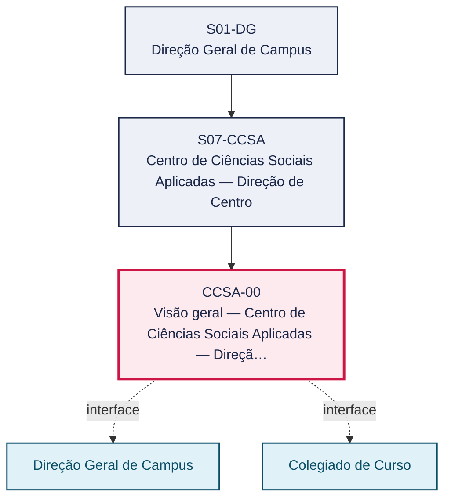

# POP CCSA-00 — Visão geral — Centro de Ciências Sociais Aplicadas — Direção de Centro

> **Documento vivo** · ATDG — Assessoria Técnica da Direção Geral · UNIOESTE Campus Foz do Iguaçu · Formato DDD híbrido + BPMN 2.0 padrão Anne Bail · Versão **1.0.0** · Status **em_validacao** · Atualizado em 2026-09-03

## 0. Cabeçalho DDD

| Divisão | Departamento | Descrição |
|---|---|---|
| Centro de Ciências Sociais Aplicadas — Direção de Centro | Centro de Ciências Sociais Aplicadas — Direção de Centro | Consolida a visão geral do Centro de Ciências Sociais Aplicadas — Direção de Centro: a articulação da Direção com os colegiados de Administração, Ciências Contábeis, Direito, Hotelaria e Turismo e com os núcleos NPJ, NUTUR e NUPESA, a manutenção da base de contatos por função e o encaminhamento e acompanhamento das demandas do Centro, nos termos dos arts. 37 e 41 do Estatuto (Res. 017/99-COU). |

| Domínio | Subdomínio | Tipo | Contexto delimitado |
|---|---|---|---|
| Ensino, Pesquisa e Extensão (Centro) | Articulação e governança do Centro de Ciências Sociais Aplicadas | core | S07-CCSA |

### 0.3 Linguagem ubíqua (glossário do processo)

| Termo | Definição | Sistema |
|---|---|---|
| NPJ | Núcleo do CCSA vinculado ao curso de Direito (sigla não expandida nas fontes consultadas — a confirmar). | — |
| NUTUR | Núcleo do CCSA vinculado à área de Turismo (sigla não expandida nas fontes consultadas — a confirmar). | — |
| NUPESA | Núcleo do CCSA (sigla não expandida nas fontes consultadas — a confirmar). | — |

## 1. Identificação

| Campo | Valor |
|---|---|
| Código | CCSA-00 |
| Setor | CCSA — Direção de Centro (`S07-CCSA`) |
| Responsável (função) | Diretor(a) de Centro |
| Periodicidade | Contínua, conforme calendário acadêmico e demandas dos colegiados e núcleos do Centro |
| Subordinação | Direção Geral de Campus |
| Normativa | Estatuto (Res. 017/99-COU) art. 37 e 41 |
| Produto ATDG | POP |
| Pasta OneDrive | 03_MAPEAMENTO DE PROCESSOS |
| Fontes (entradas do Canvas) | pb-ccsa, 1780963200012 |
| Lacunas abertas | formulario, dados_pessoais_lgpd |
| Agente responsável | pop-ccsa-00 |

## 2. Organograma

## 3. Playbook

### 3.1 Gatilho (evento de domínio)

**Necessidade de articulação entre a Direção de Centro e os colegiados/núcleos, atualização da base de contatos ou encaminhamento de demanda do Centro** — origem: Diretor(a) de Centro, Coordenador(a) de Curso, Colegiado/NDE ou núcleos (NPJ, NUTUR, NUPESA)

### 3.2 Entrada

- Solicitação ou demanda de colegiado, núcleo, coordenação ou órgão superior
- Comunicado de troca de coordenação, direção ou responsável de núcleo

### 3.3 Passo a passo

| Nº | Ação | Responsável | Sistema | Artefato | Prazo | Evento |
|---|---|---|---|---|---|---|
| 1 | Articular a Direção de Centro com os colegiados de curso e as coordenações de Administração, Ciências Contábeis, Direito, Hotelaria e Turismo | Diretor(a) de Centro | e-Protocolo | Ata/registro de articulação | Conforme demanda | Colegiados e coordenações articulados |
| 2 | Articular a Direção de Centro com os núcleos NPJ, NUTUR e NUPESA | Diretor(a) de Centro | e-Protocolo | Ata/registro de articulação | Conforme demanda | Núcleos articulados |
| 3 | Manter atualizada a base de contatos por função do Centro (coordenadores de curso, de estágio e de TCC, agentes universitários e núcleos) | Diretor(a) de Centro | — | Lista de contatos por função do CCSA | A cada troca de coordenação, direção ou responsável de núcleo | Base de contatos atualizada |
| 4 | Validar com cada colegiado e núcleo a exatidão dos contatos informados | Coordenador(a) de Curso | — | Confirmação de contatos | Anual ou a cada alteração | Contatos validados |
| 5 | Encaminhar as demandas do Centro aos colegiados, núcleos ou órgãos superiores via e-Protocolo | Diretor(a) de Centro | e-Protocolo | Ofício/memorando de encaminhamento | Conforme demanda | Demanda encaminhada |
| 6 | Acompanhar a tramitação e a resposta às demandas encaminhadas | Diretor(a) de Centro | e-Protocolo | Registro de acompanhamento | Conforme prazo da demanda | Demanda respondida ou pendência identificada |

### 3.4 Saída (entregáveis)

- Base de contatos por função do Centro atualizada
- Demanda do Centro encaminhada e acompanhada até a resposta

## 4. Formulários e artefatos (agregados)

| Nome | Tipo | Sistema | Campos-chave | Preenchimento |
|---|---|---|---|---|
| Lista de contatos por função do CCSA | registro | — | colegiado/núcleo, função, e-mail institucional | Diretor(a) de Centro |
| Ofício/memorando de encaminhamento de demanda do Centro | documento | e-Protocolo | assunto, destinatário, prazo de resposta | Diretor(a) de Centro |

## 5. Decisões, exceções e pontos de atenção

| Decisão | Condição | Sim → | Não → |
|---|---|---|---|
| A demanda encaminhada foi respondida no prazo? | Acompanhamento da tramitação no e-Protocolo | Registrar a resposta e encerrar o acompanhamento | Reiterar a demanda ao destinatário e, se necessário, escalar à Direção Geral de Campus |

**Pontos de atenção**

- Contatos institucionais — uso interno (LGPD)
- Atualizar a cada troca de coordenação/direção
- Contatos institucionais dos colegiados e núcleos são dados pessoais de uso interno (LGPD); não divulgar externamente sem anonimização.
- Atualizar a base de contatos a cada troca de coordenação, direção ou responsável de núcleo, sob pena de falha de comunicação.
- As competências gerais da Direção de Centro (representação, indicação de representantes, condução do Conselho de Centro, articulação com PROGRAD/PROEX) seguem o POP transversal DCEN-00; este documento trata das particularidades do CCSA.

## 6. Contingência

- Se o contato informado por um colegiado ou núcleo estiver desatualizado, o Diretor(a) de Centro solicita a atualização diretamente à coordenação responsável antes de reencaminhar a demanda.
- Se uma demanda encaminhada via e-Protocolo não for respondida no prazo, reiterar ao destinatário e, persistindo a omissão, escalar à Direção Geral de Campus.
- Se um colegiado, coordenação ou núcleo estiver temporariamente sem responsável designado, encaminhar a demanda à Direção de Centro para indicação de responsável interino.

## 7. Checklist

- ( ) Lista de contatos por função do CCSA revisada e atualizada
- ( ) Demandas do Centro registradas e encaminhadas via e-Protocolo
- ( ) Tramitação das demandas acompanhada até a resposta
- ( ) Colegiados e núcleos (NPJ, NUTUR, NUPESA) cientes das articulações e decisões da Direção de Centro

## 8. KPI / Indicadores

| Indicador | Fórmula | Meta | Fonte |
|---|---|---|---|
| Percentual da lista de contatos do CCSA atualizada no semestre | Contatos confirmados no período / total de funções mapeadas × 100 | A definir | Lista de contatos por função do CCSA |
| Prazo médio de resposta às demandas encaminhadas pela Direção de Centro | Média (data de resposta − data de encaminhamento) | A definir | e-Protocolo |

## 9. Mapa de contexto (interfaces inter-setoriais)

| Origem | Relação | Destino | Artefato | Canal |
|---|---|---|---|---|
| CCSA — Direção de Centro | informa | Direção Geral de Campus | Demandas e deliberações do Centro | e-Protocolo |
| CCSA — Direção de Centro | informa | Colegiado de Curso | Diretrizes e demandas da Direção de Centro aos colegiados de Administração, Ciências Contábeis, Direito, Hotelaria e Turismo | e-Protocolo/e-mail institucional |
| Colegiado de Curso | fornece | CCSA — Direção de Centro | Solicitações e demandas dos colegiados de curso do Centro | e-Protocolo |

## 10. Fluxograma (BPMN 2.0 — padrão Anne Bail)

```mermaid
flowchart LR
  subgraph R1["Diretor(a) de Centro"]
    direction LR
    e1(("Necessidade de articulação entre a Direção de Centro e os colegiados/…"))
    e2["Articular a Direção de Centro com os colegiados de curso e as coorden…"]
    e3["Articular a Direção de Centro com os núcleos NPJ, NUTUR e NUPESA"]
    e4["Manter atualizada a base de contatos por função do Centro (coordenado…"]
    e6["Encaminhar as demandas do Centro aos colegiados, núcleos ou órgãos su…"]
    e7["Acompanhar a tramitação e a resposta às demandas encaminhadas"]
    e10((("Base de contatos por função do Centro atualizada")))
  end
  subgraph R2["Coordenador(a) de Curso"]
    direction LR
    e5["Validar com cada colegiado e núcleo a exatidão dos contatos informados"]
  end
  subgraph R3["Direção Geral de Campus"]
    direction LR
    e8[["✉ Informar Direção Geral de Campus"]]
  end
  subgraph R4["Colegiado de Curso"]
    direction LR
    e9[["✉ Informar Colegiado de Curso"]]
  end
  e1 --> e2
  e2 --> e3
  e3 --> e4
  e4 --> e5
  e5 --> e6
  e6 --> e7
  e7 --> e8
  e8 --> e9
  e9 --> e10
  classDef inicio fill:#f3f4f6,stroke:#6b7280,stroke-width:1.5px,color:#374151
  classDef atividade fill:#E6F7F0,stroke:#0B7A4E,stroke-width:2px,color:#0B7A4E
  classDef decisao fill:#FFF4ED,stroke:#C9783A,stroke-width:2px,color:#C9783A
  classDef fim fill:#FDEAEE,stroke:#CC1544,stroke-width:4px,color:#CC1544
  classDef pausa fill:#FDEAEE,stroke:#CC1544,stroke-width:2px,color:#CC1544
  classDef captura fill:#E0F2F8,stroke:#0B4D66,stroke-width:2px,color:#0B4D66
  class e1 inicio
  class e2,e3,e4,e5,e6,e7 atividade
  class e8,e9 captura
  class e10 fim
```

## 11. Especificação BPMN para o Miro

**Raias:** Diretor(a) de Centro · Coordenador(a) de Curso · Direção Geral de Campus · Colegiado de Curso

| Id | Tipo | Elemento | Raia |
|---|---|---|---|
| e1 | inicio | Necessidade de articulação entre a Direção de Centro e os colegiados/núcleos, atualização da base de contatos ou encaminhamento de demanda do Centro | Diretor(a) de Centro |
| e2 | atividade | Articular a Direção de Centro com os colegiados de curso e as coordenações de Administração, Ciências Contábeis, Direito, Hotelaria e Turismo | Diretor(a) de Centro |
| e3 | atividade | Articular a Direção de Centro com os núcleos NPJ, NUTUR e NUPESA | Diretor(a) de Centro |
| e4 | atividade | Manter atualizada a base de contatos por função do Centro (coordenadores de curso, de estágio e de TCC, agentes universitários e núcleos) | Diretor(a) de Centro |
| e5 | atividade | Validar com cada colegiado e núcleo a exatidão dos contatos informados | Coordenador(a) de Curso |
| e6 | atividade | Encaminhar as demandas do Centro aos colegiados, núcleos ou órgãos superiores via e-Protocolo | Diretor(a) de Centro |
| e7 | atividade | Acompanhar a tramitação e a resposta às demandas encaminhadas | Diretor(a) de Centro |
| e8 | captura | Informar Direção Geral de Campus | Direção Geral de Campus |
| e9 | captura | Informar Colegiado de Curso | Colegiado de Curso |
| e10 | fim | Base de contatos por função do Centro atualizada | Diretor(a) de Centro |

| De | Para | Rótulo |
|---|---|---|
| e1 | e2 | — |
| e2 | e3 | — |
| e3 | e4 | — |
| e4 | e5 | — |
| e5 | e6 | — |
| e6 | e7 | — |
| e7 | e8 | — |
| e8 | e9 | — |
| e9 | e10 | — |

_Especificação gerada a partir dos passos do POP; 4 raia(s). Revisar decisões e pausas antes de construir no Miro._

## 12. Histórico de versões

| Versão | Data | Autor | Tipo | Mudanças | Fontes |
|---|---|---|---|---|---|
| 0.1.0 | 2026-09-02 | scripts/scaffold_pops.py | patch | Esqueleto inicial gerado deterministicamente a partir das entradas pb-ccsa | pb-ccsa |
| 1.0.0 | 2026-09-03 | agente:construtor-pop (lote D2) | major | Passo 1 alterado (acao, responsavel, sistema, artefato, prazo, evento); Passo 2 alterado (acao, responsavel, sistema, artefato, prazo, evento); Passo 3 alterado (acao, responsavel, sistema, artefato, prazo, evento); Passo adicionado após 3: Acompanhar a tramitação e a resposta às demandas encaminhadas; Passo adicionado após 2: Validar com cada colegiado e núcleo a exatidão dos contatos informados; Passo adicionado após 1: Articular a Direção de Centro com os núcleos NPJ, NUTUR e NUPESA; entrada_nova: +2; saida_nova: +2; artefatos_novos: +2; decisoes_novas: +1; kpis_novos: +2; mapa_contexto_novo: +3; pontos_atencao_novos: +3; contingencia_nova: +3; checklist_novo: +4; glossario_novo: +3; Campo ddd.descricao atualizado; Campo ddd.subdominio atualizado; Campo identificacao.responsavel atualizado; Campo identificacao.periodicidade atualizado; Campo playbook.gatilho atualizado; Campo observacoes atualizado; Fluxograma regenerado a partir dos passos; Status promovido a em_validacao (≥ 3 passos e responsável definido) | pb-ccsa, 1780963200012 |

## 13. Validação e aprovação

| Papel | Função / unidade | Data |
|---|---|---|
| Elaboração | ATDG — Assessoria Técnica da Direção Geral | 2026-09-02 |
| Revisão | A definir (responsável do setor) | ___/___/______ |
| Aprovação | Direção Geral do Campus | ___/___/______ |

## 14. Lições incorporadas

- **L-001** — Referir sempre função/cargo; nomes apenas no bloco 13 (Validação), com anuência (LGPD).
- **L-004** — Nunca regenerar POP existente: aplicar patch com changelog, fontes e versão.
- **L-006** — Preservar códigos legados como códigos de processo; não renumerar.
- **L-007** — Referência Externa é benchmark; normativa do POP só cita atos da Unioeste, do Estado do Paraná ou federais aplicáveis.
- **L-002** — Um passo = uma ação; ações compostas viram passos distintos.
- **L-003** — Cada linha do mapa de contexto gera um elemento `captura` no BPMN e um passo na raia de destino.
- **L-005** — No diagnóstico, agrupar versões do mesmo documento e registrar lacuna `versao_documento`.

> **Observações:** Visão geral elaborada a partir da lista de contatos dos colegiados do CCSA (Administração, Ciências Contábeis, Direito, Hotelaria e Turismo) e dos núcleos NPJ, NUTUR e NUPESA. As rotinas específicas de gestão acadêmica, estágio e TCC de cada colegiado são detalhadas no POP transversal COLEG-00; as competências gerais da Direção de Centro seguem o POP transversal DCEN-00. Siglas NPJ/NUTUR/NUPESA não expandidas nas fontes consultadas — a confirmar com a Direção de Centro.

---
_Canvas Vivo — Base de Conhecimento Institucional · ATDG · UNIOESTE Campus Foz do Iguaçu · gerado por `scripts/render_pop.py` a partir de `pops/CCSA/CCSA-00.pop.json` (diretrizes v1.0)._
