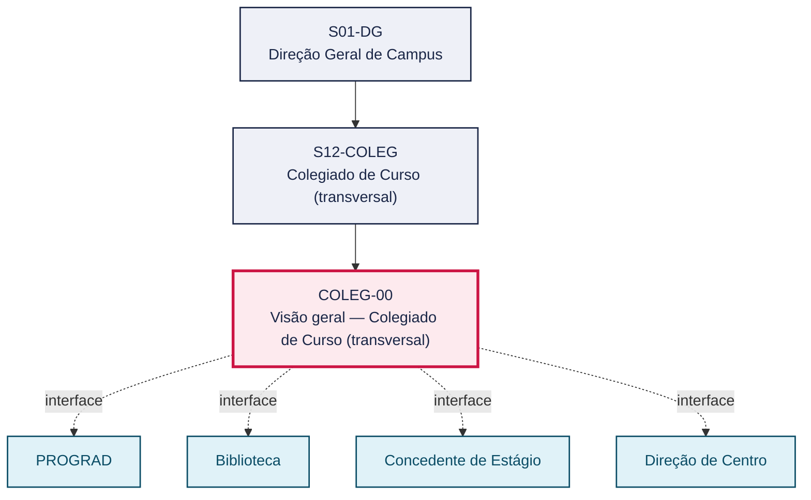

# POP COLEG-00 — Visão geral — Colegiado de Curso (transversal)

> **Documento vivo** · ATDG — Assessoria Técnica da Direção Geral · UNIOESTE Campus Foz do Iguaçu · Formato DDD híbrido + BPMN 2.0 padrão Anne Bail · Versão **1.0.0** · Status **em_validacao** · Atualizado em 2026-09-03

## 0. Cabeçalho DDD

| Divisão | Departamento | Descrição |
|---|---|---|
| Colegiado de Curso (transversal) | Colegiado de Curso (transversal) | Consolida as rotinas dos colegiados e coordenações de curso, estágio e TCC e do agente universitário: comunicação e protocolo, condução do Colegiado e do NDE, gestão acadêmica no Academus, formalização de termos e bancas de estágio, e orientação, bancas e envio de TCC à Biblioteca, nos termos do art. 41 do Estatuto (Res. 017/99-COU), do Regimento de Cursos, da Lei nº 11.788/2008 e dos regulamentos de estágio e de TCC de cada curso. |

| Domínio | Subdomínio | Tipo | Contexto delimitado |
|---|---|---|---|
| Colegiados e Cursos | Gestão acadêmica e órgãos colegiados do curso | core | S12-COLEG |

### 0.3 Linguagem ubíqua (glossário do processo)

| Termo | Definição | Sistema |
|---|---|---|
| NDE | Núcleo Docente Estruturante do curso, atuante em conjunto com o Colegiado na condução pedagógica do curso. | — |
| Agente Universitário | Servidor técnico-administrativo que apoia a coordenação do curso/colegiado nas rotinas de comunicação, protocolo e apoio acadêmico. | — |

## 1. Identificação

| Campo | Valor |
|---|---|
| Código | COLEG-00 |
| Setor | Colegiado de Curso (`S12-COLEG`) |
| Responsável (função) | Coordenador(a) de Curso |
| Periodicidade | Contínua, conforme calendário acadêmico e cronograma de estágio/TCC de cada curso |
| Subordinação | Direção Geral de Campus |
| Normativa | Estatuto (Res. 017/99-COU) art. 41; Lei nº 11.788/2008; Regulamentos de Estágio e TCC dos cursos; Regimento de Cursos |
| Produto ATDG | POP |
| Pasta OneDrive | 03_MAPEAMENTO DE PROCESSOS |
| Fontes (entradas do Canvas) | pb-colegiado, 1780963200002, 1780963200003, 1780963200004, 1780963200005, 1780963200006, 1780963200007, 1780963200008, 1780963200009, 1780963200010, 1780963200018, 1780963200019, 1780963200020, 1780963200021, 1780963200032 |
| Lacunas abertas | versao_documento, dados_pessoais_lgpd |
| Agente responsável | pop-coleg-00 |

## 2. Organograma

## 3. Playbook

### 3.1 Gatilho (evento de domínio)

**Solicitação de discente, docente ou concedente, pauta de reunião do Colegiado/NDE, ou marco do calendário acadêmico/cronograma de estágio e TCC** — origem: Discente, docente, concedente de estágio, Agente Universitário do Colegiado ou coordenações de curso, estágio e TCC

### 3.2 Entrada

- Solicitação de discente, docente ou concedente (atendimento, matrícula, estágio, TCC)
- Calendário acadêmico e cronograma de estágio/TCC do curso
- Demanda de deliberação para o Colegiado/NDE

### 3.3 Passo a passo

| Nº | Ação | Responsável | Sistema | Artefato | Prazo | Evento |
|---|---|---|---|---|---|---|
| 1 | Realizar o atendimento e a comunicação com discentes, docentes e concedentes, e protocolar os documentos recebidos | Agente Universitário do Colegiado | e-Protocolo | Protocolo/registro de atendimento | Contínuo, conforme demanda | Atendimento realizado e documento protocolado |
| 2 | Convocar e presidir as reuniões do Colegiado e do NDE, com pauta e ata | Coordenador(a) de Curso | e-Protocolo | Pauta e ata do Colegiado/NDE | A definir (periodicidade regimental) | Colegiado/NDE reunido |
| 3 | Deliberar sobre as matérias em pauta no Colegiado (transferências, segunda chamada, dispensa, exercício domiciliar, entre outras) | Colegiado/NDE | e-Protocolo | Ata de deliberação | Na sessão convocada | Matéria deliberada |
| 4 | Realizar a gestão acadêmica no Academus (planos de ensino, matrícula, notas, horários e distribuição de disciplinas) | Coordenador(a) de Curso | Academus | Plano de ensino; horários; registros de notas e matrícula | Conforme calendário acadêmico | Gestão acadêmica do período concluída |
| 5 | Articular com as instituições concedentes e formalizar os termos de compromisso e os aditivos de estágio | Coordenador(a) de Estágio | Academus | Termo de compromisso de estágio; aditivo | Conforme calendário do estágio e a Lei nº 11.788/2008 | Termo de compromisso/aditivo formalizado |
| 6 | Organizar e realizar as bancas de estágio supervisionado | Coordenador(a) de Estágio | — | Ata de banca de estágio | Conforme calendário do estágio | Banca de estágio realizada |
| 7 | Indicar orientadores e organizar as bancas e defesas de TCC | Coordenador(a) de TCC | Academus | Edital de TCC; ata de banca de defesa | Conforme cronograma anual de TCC | Defesa de TCC realizada |
| 8 | Lançar as notas e frequências de TCC no Academus e enviar a versão final à Biblioteca | Coordenador(a) de TCC | Academus | Versão final do TCC; declaração de entrega à Biblioteca | Até o prazo do calendário acadêmico para encerramento do período | TCC lançado no Academus e enviado à Biblioteca |

### 3.4 Saída (entregáveis)

- Atendimento realizado e documentos protocolados
- Deliberações do Colegiado/NDE registradas em ata
- Gestão acadêmica do período concluída no Academus
- Termos de compromisso e aditivos de estágio formalizados
- TCC defendido, lançado no Academus e enviado à Biblioteca

## 4. Formulários e artefatos (agregados)

| Nome | Tipo | Sistema | Campos-chave | Preenchimento |
|---|---|---|---|---|
| Pauta e ata do Colegiado/NDE | documento | e-Protocolo | data, matérias, deliberações | Coordenador(a) de Curso |
| Termo de compromisso de estágio | formulario | Academus | discente, concedente, plano de atividades, vigência | Coordenador(a) de Estágio |
| Aditivo de termo de compromisso de estágio | formulario | Academus | termo original, alteração, vigência | Coordenador(a) de Estágio |
| Ata de banca de TCC | registro | Academus | discente, orientador, banca, resultado | Coordenador(a) de TCC |

## 5. Decisões, exceções e pontos de atenção

| Decisão | Condição | Sim → | Não → |
|---|---|---|---|
| A matéria (transferência, segunda chamada, dispensa, exercício domiciliar etc.) é deferida pelo Colegiado? | Análise do Colegiado/NDE quanto aos requisitos regimentais | Registrar o deferimento em ata e providenciar os efeitos acadêmicos no Academus | Registrar o indeferimento em ata, com a motivação, e comunicar ao interessado |
| A documentação do termo de compromisso de estágio está completa? | Conferência dos documentos exigidos pelo Regulamento de Estágio do curso e pela Lei nº 11.788/2008 | Assinar e protocolar o termo de compromisso/aditivo | Devolver ao discente/concedente para complementação da documentação |

**Pontos de atenção**

- Forte vínculo com prazos do calendário acadêmico
- Observar a Lei de Estágio (11.788/2008) e os regulamentos dos cursos
- Manter vínculos corretos no Academus; LGPD
- Forte vínculo com prazos do calendário acadêmico e com o cronograma anual de estágio e de TCC.
- Observar a Lei de Estágio (11.788/2008) e os regulamentos de estágio e de TCC de cada curso, que podem variar entre os colegiados do CCSA e do CECE.
- Manter os vínculos corretos no Academus (matrícula, orientação, banca); dados de discentes e docentes sujeitos à LGPD.

## 6. Contingência

- Se a documentação do termo de compromisso de estágio estiver incompleta, o Coordenador(a) de Estágio devolve ao discente/concedente e suspende a assinatura até a regularização.
- Se a concedente de estágio descumprir o plano de atividades, o Coordenador(a) de Estágio comunica o fato e avalia a rescisão do termo, conforme a Lei nº 11.788/2008.
- Se um membro da banca de TCC não puder comparecer, o Coordenador(a) de TCC substitui o membro conforme o Regulamento de TCC do curso e reagenda a sessão, se necessário.
- Se o Colegiado não atingir quórum, registrar a ausência de quórum em ata e reconvocar a sessão.

## 7. Checklist

- ( ) Pauta e ata do Colegiado/NDE registradas e arquivadas
- ( ) Planos de ensino, horários e matrícula do período lançados no Academus
- ( ) Termos de compromisso e aditivos de estágio assinados e protocolados
- ( ) Bancas de TCC realizadas, notas lançadas no Academus e versão final enviada à Biblioteca

## 8. KPI / Indicadores

| Indicador | Fórmula | Meta | Fonte |
|---|---|---|---|
| Percentual de termos de compromisso de estágio formalizados antes do início da atividade | Termos assinados antes do início / total de estágios iniciados × 100 | A definir | Academus |
| Percentual de TCCs com versão final entregue à Biblioteca no prazo do calendário acadêmico | TCCs entregues no prazo / total de TCCs defendidos × 100 | A definir | Registro do Coordenador(a) de TCC |

## 9. Mapa de contexto (interfaces inter-setoriais)

| Origem | Relação | Destino | Artefato | Canal |
|---|---|---|---|---|
| Colegiado de Curso | informa | PROGRAD | Planos de ensino e decisões acadêmicas do Colegiado | Academus/e-Protocolo |
| Colegiado de Curso | fornece | Biblioteca | Versão final de TCC | e-mail institucional/sistema de bibliotecas |
| Concedente de Estágio | fornece | Colegiado de Curso | Plano de atividades e avaliação do estagiário | Termo de compromisso |
| Colegiado de Curso | informa | Direção de Centro | Demandas e decisões do Colegiado encaminhadas à Direção de Centro | e-Protocolo |

## 10. Fluxograma (BPMN 2.0 — padrão Anne Bail)

```mermaid
flowchart LR
  subgraph R1["Coordenador(a) de Curso"]
    direction LR
    e1(("Solicitação de discente, docente ou concedente, pauta de reunião do C…"))
    e3["Convocar e presidir as reuniões do Colegiado e do NDE, com pauta e ata"]
    e5["Realizar a gestão acadêmica no Academus (planos de ensino, matrícula,…"]
    e13((("Atendimento realizado e documentos protocolados")))
  end
  subgraph R2["Agente Universitário do Colegiado"]
    direction LR
    e2["Realizar o atendimento e a comunicação com discentes, docentes e conc…"]
  end
  subgraph R3["Colegiado/NDE"]
    direction LR
    e4["Deliberar sobre as matérias em pauta no Colegiado (transferências, se…"]
  end
  subgraph R4["Coordenador(a) de Estágio"]
    direction LR
    e6["Articular com as instituições concedentes e formalizar os termos de c…"]
    e7["Organizar e realizar as bancas de estágio supervisionado"]
  end
  subgraph R5["Coordenador(a) de TCC"]
    direction LR
    e8["Indicar orientadores e organizar as bancas e defesas de TCC"]
    e9["Lançar as notas e frequências de TCC no Academus e enviar a versão fi…"]
  end
  subgraph R6["PROGRAD"]
    direction LR
    e10[["✉ Informar PROGRAD"]]
  end
  subgraph R7["Biblioteca"]
    direction LR
    e11[["✉ Encaminhar a Biblioteca"]]
  end
  subgraph R8["Direção de Centro"]
    direction LR
    e12[["✉ Informar Direção de Centro"]]
  end
  e1 --> e2
  e2 --> e3
  e3 --> e4
  e4 --> e5
  e5 --> e6
  e6 --> e7
  e7 --> e8
  e8 --> e9
  e9 --> e10
  e10 --> e11
  e11 --> e12
  e12 --> e13
  classDef inicio fill:#f3f4f6,stroke:#6b7280,stroke-width:1.5px,color:#374151
  classDef atividade fill:#E6F7F0,stroke:#0B7A4E,stroke-width:2px,color:#0B7A4E
  classDef decisao fill:#FFF4ED,stroke:#C9783A,stroke-width:2px,color:#C9783A
  classDef fim fill:#FDEAEE,stroke:#CC1544,stroke-width:4px,color:#CC1544
  classDef pausa fill:#FDEAEE,stroke:#CC1544,stroke-width:2px,color:#CC1544
  classDef captura fill:#E0F2F8,stroke:#0B4D66,stroke-width:2px,color:#0B4D66
  class e1 inicio
  class e2,e3,e4,e5,e6,e7,e8,e9 atividade
  class e10,e11,e12 captura
  class e13 fim
```

## 11. Especificação BPMN para o Miro

**Raias:** Coordenador(a) de Curso · Agente Universitário do Colegiado · Colegiado/NDE · Coordenador(a) de Estágio · Coordenador(a) de TCC · PROGRAD · Biblioteca · Direção de Centro

| Id | Tipo | Elemento | Raia |
|---|---|---|---|
| e1 | inicio | Solicitação de discente, docente ou concedente, pauta de reunião do Colegiado/NDE, ou marco do calendário acadêmico/cronograma de estágio e TCC | Coordenador(a) de Curso |
| e2 | atividade | Realizar o atendimento e a comunicação com discentes, docentes e concedentes, e protocolar os documentos recebidos | Agente Universitário do Colegiado |
| e3 | atividade | Convocar e presidir as reuniões do Colegiado e do NDE, com pauta e ata | Coordenador(a) de Curso |
| e4 | atividade | Deliberar sobre as matérias em pauta no Colegiado (transferências, segunda chamada, dispensa, exercício domiciliar, entre outras) | Colegiado/NDE |
| e5 | atividade | Realizar a gestão acadêmica no Academus (planos de ensino, matrícula, notas, horários e distribuição de disciplinas) | Coordenador(a) de Curso |
| e6 | atividade | Articular com as instituições concedentes e formalizar os termos de compromisso e os aditivos de estágio | Coordenador(a) de Estágio |
| e7 | atividade | Organizar e realizar as bancas de estágio supervisionado | Coordenador(a) de Estágio |
| e8 | atividade | Indicar orientadores e organizar as bancas e defesas de TCC | Coordenador(a) de TCC |
| e9 | atividade | Lançar as notas e frequências de TCC no Academus e enviar a versão final à Biblioteca | Coordenador(a) de TCC |
| e10 | captura | Informar PROGRAD | PROGRAD |
| e11 | captura | Encaminhar a Biblioteca | Biblioteca |
| e12 | captura | Informar Direção de Centro | Direção de Centro |
| e13 | fim | Atendimento realizado e documentos protocolados | Coordenador(a) de Curso |

| De | Para | Rótulo |
|---|---|---|
| e1 | e2 | — |
| e2 | e3 | — |
| e3 | e4 | — |
| e4 | e5 | — |
| e5 | e6 | — |
| e6 | e7 | — |
| e7 | e8 | — |
| e8 | e9 | — |
| e9 | e10 | — |
| e10 | e11 | — |
| e11 | e12 | — |
| e12 | e13 | — |

_Especificação gerada a partir dos passos do POP; 8 raia(s). Revisar decisões e pausas antes de construir no Miro._

## 12. Histórico de versões

| Versão | Data | Autor | Tipo | Mudanças | Fontes |
|---|---|---|---|---|---|
| 0.1.0 | 2026-09-02 | scripts/scaffold_pops.py | patch | Esqueleto inicial gerado deterministicamente a partir das entradas pb-colegiado | pb-colegiado |
| 1.0.0 | 2026-09-03 | agente:construtor-pop (lote D2) | major | Passo 1 alterado (acao, responsavel, sistema, artefato, prazo, evento); Passo 2 alterado (acao, responsavel, sistema, artefato, prazo, evento); Passo 3 alterado (acao, responsavel, sistema, artefato, prazo, evento); Passo 4 alterado (acao, responsavel, sistema, artefato, prazo, evento); Passo 5 alterado (acao, responsavel, sistema, artefato, prazo, evento); Passo adicionado após 5: Lançar as notas e frequências de TCC no Academus e enviar a versão final à Bibli; Passo adicionado após 4: Organizar e realizar as bancas de estágio supervisionado; Passo adicionado após 2: Deliberar sobre as matérias em pauta no Colegiado (transferências, segunda chama; entrada_nova: +3; saida_nova: +5; artefatos_novos: +4; decisoes_novas: +2; kpis_novos: +2; mapa_contexto_novo: +4; pontos_atencao_novos: +3; contingencia_nova: +4; checklist_novo: +4; glossario_novo: +2; normativa_nova: +1; Campo ddd.descricao atualizado; Campo ddd.subdominio atualizado; Campo identificacao.responsavel atualizado; Campo identificacao.periodicidade atualizado; Campo playbook.gatilho atualizado; Campo observacoes atualizado; Fluxograma regenerado a partir dos passos; Status promovido a em_validacao (≥ 3 passos e responsável definido) | pb-colegiado, 1780963200002, 1780963200003, 1780963200004, 1780963200005, 1780963200006, 1780963200007, 1780963200008, 1780963200009, 1780963200010, 1780963200018, 1780963200019, 1780963200020, 1780963200021, 1780963200032 |

## 13. Validação e aprovação

| Papel | Função / unidade | Data |
|---|---|---|
| Elaboração | ATDG — Assessoria Técnica da Direção Geral | 2026-09-02 |
| Revisão | A definir (responsável do setor) | ___/___/______ |
| Aprovação | Direção Geral do Campus | ___/___/______ |

## 14. Lições incorporadas

- **L-001** — Referir sempre função/cargo; nomes apenas no bloco 13 (Validação), com anuência (LGPD).
- **L-004** — Nunca regenerar POP existente: aplicar patch com changelog, fontes e versão.
- **L-006** — Preservar códigos legados como códigos de processo; não renumerar.
- **L-007** — Referência Externa é benchmark; normativa do POP só cita atos da Unioeste, do Estado do Paraná ou federais aplicáveis.
- **L-002** — Um passo = uma ação; ações compostas viram passos distintos.
- **L-003** — Cada linha do mapa de contexto gera um elemento `captura` no BPMN e um passo na raia de destino.
- **L-005** — No diagnóstico, agrupar versões do mesmo documento e registrar lacuna `versao_documento`.

> **Observações:** POP transversal aplicável a todos os colegiados de curso do Campus; consolida os quatro perfis de atuação levantados nos questionários de mapeamento (agente universitário, coordenador de curso, coordenador de estágio e coordenador de TCC) e nos fluxogramas correspondentes, além do mapeamento de tarefas da coordenação (art. 41 do Estatuto). Cópias, versões e planilhas de resposta vazias do mesmo questionário foram tratadas como uma única evidência por função (lição L-005).

---
_Canvas Vivo — Base de Conhecimento Institucional · ATDG · UNIOESTE Campus Foz do Iguaçu · gerado por `scripts/render_pop.py` a partir de `pops/COLEG/COLEG-00.pop.json` (diretrizes v1.0)._
