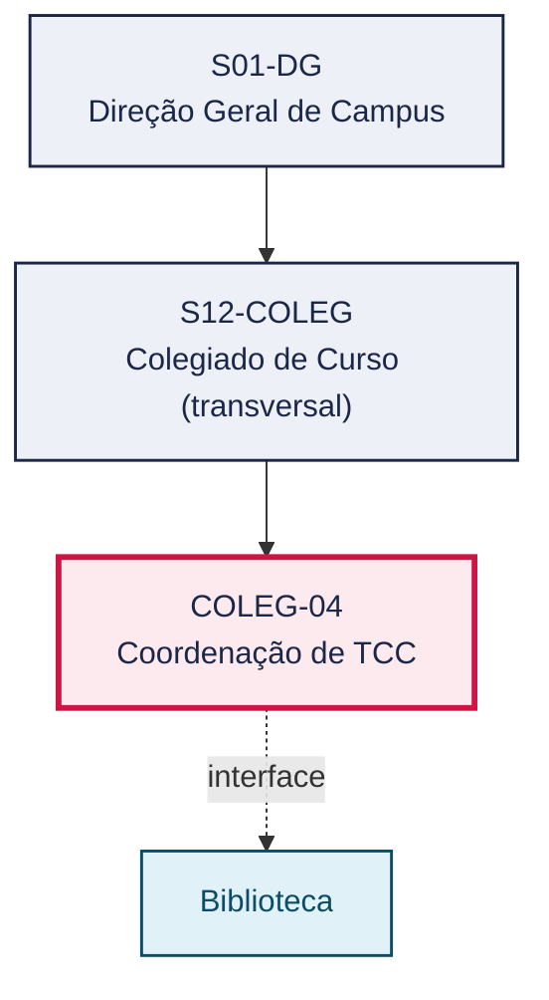
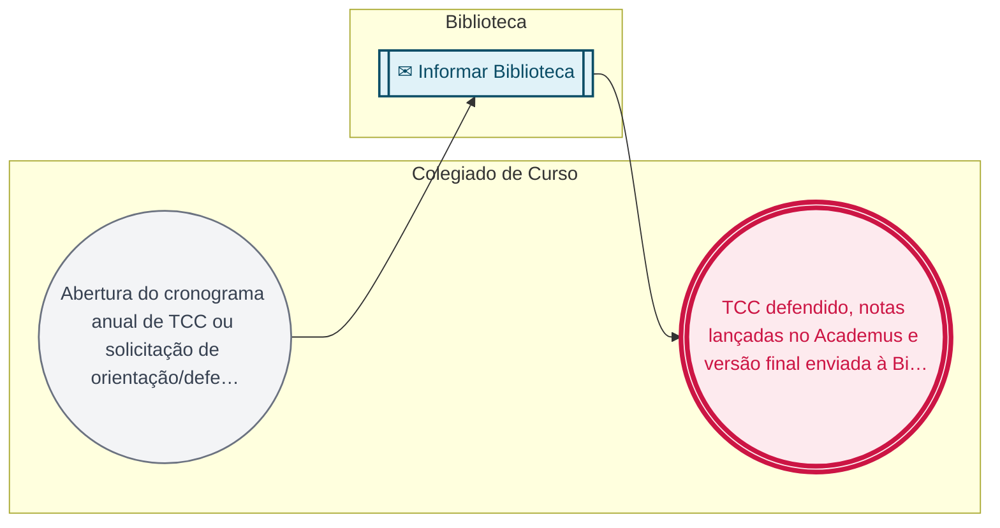

# POP COLEG-04 — Coordenação de TCC

> **Documento vivo** · ATDG — Assessoria Técnica da Direção Geral · UNIOESTE Campus Foz do Iguaçu · Formato DDD híbrido + BPMN 2.0 padrão Anne Bail · Versão **0.1.0** · Status **rascunho** · Atualizado em 2026-09-03

## 0. Cabeçalho DDD

| Divisão | Departamento | Descrição |
|---|---|---|
| Colegiado de Curso (transversal) | Colegiado de Curso (transversal) | Indicação de orientadores, organização de bancas e defesas, editais, atas e declarações, lançamento de notas e frequências no Academus, envio da versão final à Biblioteca e cronograma anual de TCC. |

| Domínio | Subdomínio | Tipo | Contexto delimitado |
|---|---|---|---|
| Colegiados e Cursos | Coordenação de TCC | core | S12-COLEG |

### 0.3 Linguagem ubíqua (glossário do processo)

Herda integralmente o glossário institucional (`diretrizes/09-glossario-institucional.md`); sem termos locais adicionais.

## 1. Identificação

| Campo | Valor |
|---|---|
| Código | COLEG-04 |
| Setor | Colegiado de Curso (`S12-COLEG`) |
| Responsável (função) | A definir |
| Periodicidade | A definir |
| Subordinação | Direção Geral de Campus |
| Normativa | A definir |
| Produto ATDG | POP |
| Pasta OneDrive | 03_MAPEAMENTO DE PROCESSOS |
| Fontes (entradas do Canvas) | 1780963200009, 1780963200010, 1780963200021 |
| Lacunas abertas | passos, responsavel, entrada, kpi, contingencia, formulario, prazo, normativa, sistema, interface_setorial |
| Agente responsável | pop-coleg-04 |

## 2. Organograma

## 3. Playbook

### 3.1 Gatilho (evento de domínio)

**Abertura do cronograma anual de TCC ou solicitação de orientação/defesa de discente**

### 3.2 Entrada

— A definir

### 3.3 Passo a passo

— A documentar (nenhum passo registrado)

### 3.4 Saída (entregáveis)

- TCC defendido, notas lançadas no Academus e versão final enviada à Biblioteca

## 4. Formulários e artefatos (agregados)

| Nome | Tipo | Sistema | Campos-chave | Preenchimento |
|---|---|---|---|---|
| Edital de TCC | documento | — | — | — |
| Ata de banca de defesa | documento | — | — | — |
| Declaração de entrega à Biblioteca | documento | — | — | — |

## 5. Decisões, exceções e pontos de atenção

— Sem decisões registradas

**Pontos de atenção**

— Nenhum registrado

## 6. Contingência

— A definir

## 7. Checklist

— A definir

## 8. KPI / Indicadores

— A definir

## 9. Mapa de contexto (interfaces inter-setoriais)

| Origem | Relação | Destino | Artefato | Canal |
|---|---|---|---|---|
| Colegiado de Curso | informa | Biblioteca | — | A definir |

## 10. Fluxograma (BPMN 2.0 — padrão Anne Bail)

## 11. Especificação BPMN para o Miro

**Raias:** Colegiado de Curso · Biblioteca

| Id | Tipo | Elemento | Raia |
|---|---|---|---|
| e1 | inicio | Abertura do cronograma anual de TCC ou solicitação de orientação/defesa de discente | Colegiado de Curso |
| e2 | captura | Informar Biblioteca | Biblioteca |
| e3 | fim | TCC defendido, notas lançadas no Academus e versão final enviada à Biblioteca | Colegiado de Curso |

| De | Para | Rótulo |
|---|---|---|
| e1 | e2 | — |
| e2 | e3 | — |

_Especificação gerada a partir dos passos do POP; 2 raia(s). Revisar decisões e pausas antes de construir no Miro._

## 12. Histórico de versões

| Versão | Data | Autor | Tipo | Mudanças | Fontes |
|---|---|---|---|---|---|
| 0.1.0 | 2026-09-03 | scripts/scaffold_pops.py | patch | Esqueleto gerado a partir do diagnóstico diag-coleg-20260903 (recomendação: coletar_mais) | 1780963200009, 1780963200010, 1780963200021 |

## 13. Validação e aprovação

| Papel | Função / unidade | Data |
|---|---|---|
| Elaboração | ATDG — Assessoria Técnica da Direção Geral | 2026-09-03 |
| Revisão | A definir (responsável do setor) | ___/___/______ |
| Aprovação | Direção Geral do Campus | ___/___/______ |

## 14. Lições incorporadas

- **L-001** — Referir sempre função/cargo; nomes apenas no bloco 13 (Validação), com anuência (LGPD).
- **L-004** — Nunca regenerar POP existente: aplicar patch com changelog, fontes e versão.
- **L-006** — Preservar códigos legados como códigos de processo; não renumerar.
- **L-007** — Referência Externa é benchmark; normativa do POP só cita atos da Unioeste, do Estado do Paraná ou federais aplicáveis.

> **Observações:** Esqueleto herdado do diagnóstico diag-coleg-20260903 (processo identificado sem POP); gatilho, saída, artefatos e interfaces provisórios — inferência a validar (lição L-008).

---
_Canvas Vivo — Base de Conhecimento Institucional · ATDG · UNIOESTE Campus Foz do Iguaçu · gerado por `scripts/render_pop.py` a partir de `pops/COLEG/COLEG-04.pop.json` (diretrizes v1.12)._
