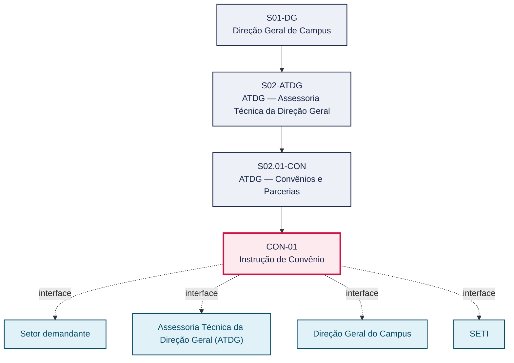
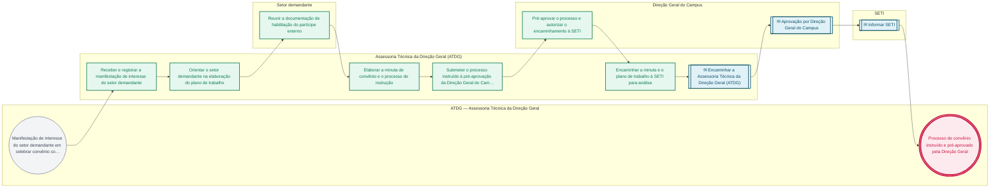

# POP CON-01 — Instrução de Convênio

> **Documento vivo** · ATDG — Assessoria Técnica da Direção Geral · UNIOESTE Campus Foz do Iguaçu · Formato DDD híbrido + BPMN 2.0 padrão Anne Bail · Versão **0.2.0** · Status **rascunho** · Atualizado em 2026-09-03

## 0. Cabeçalho DDD

| Divisão | Departamento | Descrição |
|---|---|---|
| ATDG — Assessoria Técnica da Direção Geral | ATDG — Convênios e Parcerias | Instrução de Convênio — Pré-aprovação, documentação, SETI. Processo codificado no manual institucional da ATDG (jun/2026); conteúdo operacional a documentar. |

| Domínio | Subdomínio | Tipo | Contexto delimitado |
|---|---|---|---|
| Convênios, Parcerias e Captação | Instrução de Convênio | core | S02.01-CON |

### 0.3 Linguagem ubíqua (glossário do processo)

| Termo | Definição | Sistema |
|---|---|---|
| SETI | Secretaria de Estado da Ciência, Tecnologia e Ensino Superior do Paraná, que analisa e acompanha convênios das universidades estaduais. | — |
| Plano de trabalho | Documento que detalha objeto, metas, cronograma e recursos de um convênio, exigido para sua instrução. | e-Protocolo |

## 1. Identificação

| Campo | Valor |
|---|---|
| Código | CON-01 |
| Setor | ATDG — Assessoria Técnica da Direção Geral (`S02.01-CON`) |
| Responsável (função) | A definir |
| Periodicidade | Sob demanda |
| Subordinação | ATDG — Assessoria Técnica da Direção Geral |
| Normativa | Lei nº 14.133/2021 (Lei de Licitações e Contratos Administrativos), no que for pertinente à formalização de convênios |
| Produto ATDG | POP |
| Pasta OneDrive | 01_ADMINISTRATIVO |
| Fontes (entradas do Canvas) | — |
| Lacunas abertas | responsavel, kpi, formulario, prazo, normativa |
| Agente responsável | — (não moldado) |

## 2. Organograma

## 3. Playbook

### 3.1 Gatilho (evento de domínio)

**Manifestação de interesse do setor demandante em celebrar convênio com órgão/entidade externa, ou publicação de edital/chamamento que enseje convênio** — origem: Setor demandante

### 3.2 Entrada

- Manifestação de interesse do setor demandante
- Plano de trabalho proposto
- Documentação de habilitação do partícipe externo

### 3.3 Passo a passo

| Nº | Ação | Responsável | Sistema | Artefato | Prazo | Evento |
|---|---|---|---|---|---|---|
| 1 | Receber e registrar a manifestação de interesse do setor demandante | Assessoria Técnica da Direção Geral (ATDG) | e-Protocolo | Ofício/memorando de manifestação de interesse | A definir | Manifestação registrada |
| 2 | Orientar o setor demandante na elaboração do plano de trabalho | Assessoria Técnica da Direção Geral (ATDG) | e-Protocolo | Plano de trabalho | A definir | Plano de trabalho orientado |
| 3 | Reunir a documentação de habilitação do partícipe externo | Setor demandante | e-Protocolo | Documentação de habilitação | A definir | Documentação reunida |
| 4 | Elaborar a minuta de convênio e o processo de instrução | Assessoria Técnica da Direção Geral (ATDG) | e-Protocolo | Minuta de convênio | A definir | Minuta elaborada |
| 5 | Submeter o processo instruído à pré-aprovação da Direção Geral do Campus | Assessoria Técnica da Direção Geral (ATDG) | e-Protocolo | Processo de convênio instruído | A definir | Processo submetido |
| 6 | Pré-aprovar o processo e autorizar o encaminhamento à SETI | Direção Geral do Campus | e-Protocolo | Despacho de pré-aprovação | A definir | Processo pré-aprovado |
| 7 | Encaminhar a minuta e o plano de trabalho à SETI para análise | Assessoria Técnica da Direção Geral (ATDG) | e-Protocolo | Ofício de encaminhamento à SETI | A definir | Processo encaminhado à SETI |

### 3.4 Saída (entregáveis)

- Processo de convênio instruído e pré-aprovado pela Direção Geral
- Minuta de convênio e plano de trabalho encaminhados à SETI para análise

## 4. Formulários e artefatos (agregados)

| Nome | Tipo | Sistema | Campos-chave | Preenchimento |
|---|---|---|---|---|
| Plano de trabalho | documento | e-Protocolo | objeto, metas, cronograma físico-financeiro, partícipes | Setor demandante |
| Minuta de convênio | documento | e-Protocolo | partícipes, objeto, vigência, cláusulas | Assessoria Técnica da Direção Geral (ATDG) |

## 5. Decisões, exceções e pontos de atenção

| Decisão | Condição | Sim → | Não → |
|---|---|---|---|
| A documentação de habilitação do partícipe externo está completa? | Documentação de habilitação reunida pelo setor demandante | Elaborar a minuta de convênio e o processo de instrução | Devolver ao setor demandante para complementação da documentação |

**Pontos de atenção**

- Confirmar exigências específicas da SETI para instrução de convênios antes do encaminhamento
- Verificar completude da documentação de habilitação para evitar devolução do processo

## 6. Contingência

- Documentação de habilitação incompleta: devolver ao setor demandante com prazo para regularização
- Processo devolvido pela SETI para ajustes: revisar a minuta/plano de trabalho e reencaminhar
- Setor demandante não atende à orientação da ATDG dentro do prazo: escalar à Direção Geral do Campus

## 7. Checklist

- ( ) Manifestação de interesse registrada no e-Protocolo
- ( ) Plano de trabalho elaborado com orientação da ATDG
- ( ) Documentação de habilitação do partícipe externo conferida
- ( ) Processo pré-aprovado pela Direção Geral do Campus
- ( ) Processo encaminhado à SETI com toda a documentação exigida

## 8. KPI / Indicadores

| Indicador | Fórmula | Meta | Fonte |
|---|---|---|---|
| Tempo médio de instrução do processo até o encaminhamento à SETI | Média (data de encaminhamento à SETI − data de registro da manifestação) | A definir | e-Protocolo |
| Percentual de processos devolvidos pela SETI por documentação incompleta | (Processos devolvidos / total de processos encaminhados) × 100 | A definir | e-Protocolo |

## 9. Mapa de contexto (interfaces inter-setoriais)

| Origem | Relação | Destino | Artefato | Canal |
|---|---|---|---|---|
| Setor demandante | fornece | Assessoria Técnica da Direção Geral (ATDG) | Manifestação de interesse e plano de trabalho | e-Protocolo |
| Assessoria Técnica da Direção Geral (ATDG) | aprova | Direção Geral do Campus | Processo de convênio instruído | e-Protocolo |
| Assessoria Técnica da Direção Geral (ATDG) | informa | SETI | Minuta de convênio e plano de trabalho | e-Protocolo |

## 10. Fluxograma (BPMN 2.0 — padrão Anne Bail)

## 11. Especificação BPMN para o Miro

**Raias:** ATDG — Assessoria Técnica da Direção Geral · Assessoria Técnica da Direção Geral (ATDG) · Setor demandante · Direção Geral do Campus · SETI

| Id | Tipo | Elemento | Raia |
|---|---|---|---|
| e1 | inicio | Manifestação de interesse do setor demandante em celebrar convênio com órgão/entidade externa, ou publicação de edital/chamamento que enseje convênio | ATDG — Assessoria Técnica da Direção Geral |
| e2 | atividade | Receber e registrar a manifestação de interesse do setor demandante | Assessoria Técnica da Direção Geral (ATDG) |
| e3 | atividade | Orientar o setor demandante na elaboração do plano de trabalho | Assessoria Técnica da Direção Geral (ATDG) |
| e4 | atividade | Reunir a documentação de habilitação do partícipe externo | Setor demandante |
| e5 | atividade | Elaborar a minuta de convênio e o processo de instrução | Assessoria Técnica da Direção Geral (ATDG) |
| e6 | atividade | Submeter o processo instruído à pré-aprovação da Direção Geral do Campus | Assessoria Técnica da Direção Geral (ATDG) |
| e7 | atividade | Pré-aprovar o processo e autorizar o encaminhamento à SETI | Direção Geral do Campus |
| e8 | atividade | Encaminhar a minuta e o plano de trabalho à SETI para análise | Assessoria Técnica da Direção Geral (ATDG) |
| e9 | captura | Encaminhar a Assessoria Técnica da Direção Geral (ATDG) | Assessoria Técnica da Direção Geral (ATDG) |
| e10 | captura | Aprovação por Direção Geral do Campus | Direção Geral do Campus |
| e11 | captura | Informar SETI | SETI |
| e12 | fim | Processo de convênio instruído e pré-aprovado pela Direção Geral | ATDG — Assessoria Técnica da Direção Geral |

| De | Para | Rótulo |
|---|---|---|
| e1 | e2 | — |
| e2 | e3 | — |
| e3 | e4 | — |
| e4 | e5 | — |
| e5 | e6 | — |
| e6 | e7 | — |
| e7 | e8 | — |
| e8 | e9 | — |
| e9 | e10 | — |
| e10 | e11 | — |
| e11 | e12 | — |

_Especificação gerada a partir dos passos do POP; 5 raia(s). Revisar decisões e pausas antes de construir no Miro._

## 12. Histórico de versões

| Versão | Data | Autor | Tipo | Mudanças | Fontes |
|---|---|---|---|---|---|
| 0.1.0 | 2026-09-02 | scripts/scaffold_pops.py | patch | Esqueleto inicial gerado deterministicamente a partir do escopo "Pré-aprovação, documentação, SETI" | — |
| 0.2.0 | 2026-09-03 | agente:construtor-pop (lote B) | minor | Passo adicionado após 0: Receber e registrar a manifestação de interesse do setor demandante; Passo adicionado após 1: Orientar o setor demandante na elaboração do plano de trabalho; Passo adicionado após 2: Reunir a documentação de habilitação do partícipe externo; Passo adicionado após 3: Elaborar a minuta de convênio e o processo de instrução; Passo adicionado após 4: Submeter o processo instruído à pré-aprovação da Direção Geral do Campus; Passo adicionado após 5: Pré-aprovar o processo e autorizar o encaminhamento à SETI; Passo adicionado após 6: Encaminhar a minuta e o plano de trabalho à SETI para análise; entrada_nova: +3; saida_nova: +2; artefatos_novos: +2; decisoes_novas: +1; kpis_novos: +2; mapa_contexto_novo: +3; pontos_atencao_novos: +2; contingencia_nova: +3; checklist_novo: +5; glossario_novo: +2; normativa_nova: +1; Campo identificacao.periodicidade atualizado; Campo playbook.gatilho atualizado; Campo observacoes atualizado; Fluxograma regenerado a partir dos passos | — |

## 13. Validação e aprovação

| Papel | Função / unidade | Data |
|---|---|---|
| Elaboração | ATDG — Assessoria Técnica da Direção Geral | 2026-09-02 |
| Revisão | A definir (responsável do setor) | ___/___/______ |
| Aprovação | Direção Geral do Campus | ___/___/______ |

## 14. Lições incorporadas

- **L-001** — Referir sempre função/cargo; nomes apenas no bloco 13 (Validação), com anuência (LGPD).
- **L-004** — Nunca regenerar POP existente: aplicar patch com changelog, fontes e versão.
- **L-006** — Preservar códigos legados como códigos de processo; não renumerar.
- **L-007** — Referência Externa é benchmark; normativa do POP só cita atos da Unioeste, do Estado do Paraná ou federais aplicáveis.
- **L-002** — Um passo = uma ação; ações compostas viram passos distintos.
- **L-003** — Cada linha do mapa de contexto gera um elemento `captura` no BPMN e um passo na raia de destino.

> **Observações:** Inferência a validar com a ATDG: playbook construído a partir do escopo do manual institucional da ATDG (jun/2026) e da prática administrativa geral de convênios em universidades estaduais do Paraná, sem entradas do Canvas Vivo para este processo; validar papéis, sistemas, prazos, normativa específica e fluxo de aprovação junto à ATDG.

---
_Canvas Vivo — Base de Conhecimento Institucional · ATDG · UNIOESTE Campus Foz do Iguaçu · gerado por `scripts/render_pop.py` a partir de `pops/CON/CON-01.pop.json` (diretrizes v1.8)._
