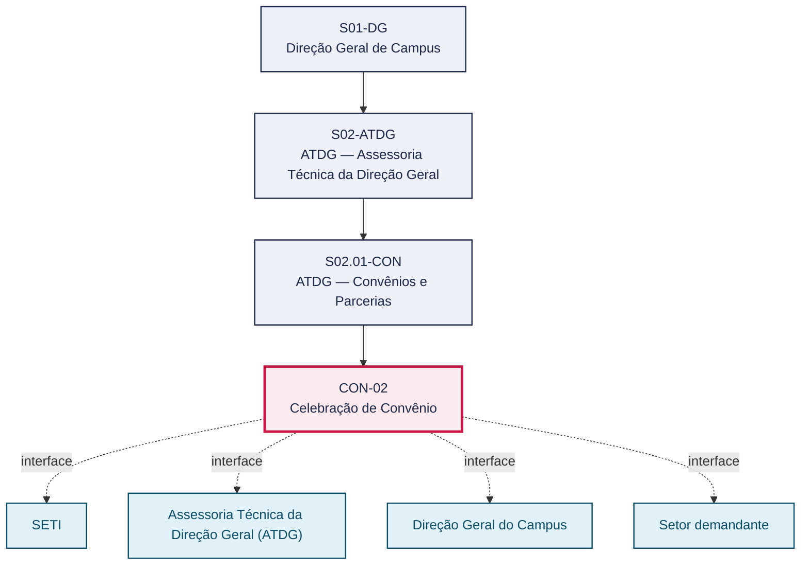

# POP CON-02 — Celebração de Convênio

> **Documento vivo** · ATDG — Assessoria Técnica da Direção Geral · UNIOESTE Campus Foz do Iguaçu · Formato DDD híbrido + BPMN 2.0 padrão Anne Bail · Versão **0.2.1** · Status **rascunho** · Atualizado em 2026-09-03

## 0. Cabeçalho DDD

| Divisão | Departamento | Descrição |
|---|---|---|
| ATDG — Assessoria Técnica da Direção Geral | ATDG — Convênios e Parcerias | Celebração de Convênio — Assinaturas, publicação, registro. Processo codificado no manual institucional da ATDG (jun/2026); conteúdo operacional a documentar. |

| Domínio | Subdomínio | Tipo | Contexto delimitado |
|---|---|---|---|
| Convênios, Parcerias e Captação | Celebração de Convênio | core | S02.01-CON |

### 0.3 Linguagem ubíqua (glossário do processo)

| Termo | Definição | Sistema |
|---|---|---|
| Extrato de convênio | Resumo do instrumento de convênio publicado para conferir eficácia e publicidade ao ato. | — |

## 1. Identificação

| Campo | Valor |
|---|---|
| Código | CON-02 |
| Setor | ATDG — Assessoria Técnica da Direção Geral (`S02.01-CON`) |
| Responsável (função) | A definir |
| Periodicidade | Sob demanda |
| Subordinação | ATDG — Assessoria Técnica da Direção Geral |
| Normativa | Lei nº 14.133/2021 (Lei de Licitações e Contratos Administrativos), no que for pertinente à formalização de convênios |
| Produto ATDG | POP |
| Pasta OneDrive | 01_ADMINISTRATIVO |
| Fontes (entradas do Canvas) | — |
| Lacunas abertas | responsavel, kpi, formulario, prazo, normativa |
| Agente responsável | pop-con-02 |

## 2. Organograma

## 3. Playbook

### 3.1 Gatilho (evento de domínio)

**Aprovação da minuta de convênio pela SETI (ou órgão concedente) recebida** — origem: SETI

### 3.2 Entrada

- Minuta de convênio aprovada pela SETI
- Plano de trabalho aprovado

### 3.3 Passo a passo

| Nº | Ação | Responsável | Sistema | Artefato | Prazo | Evento |
|---|---|---|---|---|---|---|
| 1 | Receber a aprovação da minuta de convênio pela SETI | Assessoria Técnica da Direção Geral (ATDG) | e-Protocolo | Ofício de aprovação da SETI | A definir | Aprovação recebida |
| 2 | Preparar a via definitiva do convênio para assinatura | Assessoria Técnica da Direção Geral (ATDG) | e-Protocolo | Convênio (via definitiva) | A definir | Via definitiva preparada |
| 3 | Colher a assinatura da Direção Geral do Campus (ou autoridade competente) | Direção Geral do Campus | e-Protocolo | Convênio assinado pela Unioeste | A definir | Convênio assinado pela Unioeste |
| 4 | Colher a assinatura do partícipe externo | Assessoria Técnica da Direção Geral (ATDG) | e-Protocolo | Convênio assinado por ambas as partes | A definir | Convênio assinado por ambas as partes |
| 5 | Publicar o extrato do convênio | Assessoria Técnica da Direção Geral (ATDG) | A definir | Extrato de publicação | A definir | Extrato publicado |
| 6 | Registrar o convênio celebrado no controle da ATDG | Assessoria Técnica da Direção Geral (ATDG) | OneDrive ATDG | Registro de convênios | A definir | Convênio registrado |

### 3.4 Saída (entregáveis)

- Convênio assinado pelos partícipes
- Extrato de convênio publicado
- Convênio registrado no controle da ATDG

## 4. Formulários e artefatos (agregados)

| Nome | Tipo | Sistema | Campos-chave | Preenchimento |
|---|---|---|---|---|
| Convênio (instrumento assinado) | documento | e-Protocolo | partícipes, objeto, vigência, assinaturas | Assessoria Técnica da Direção Geral (ATDG) |
| Registro de convênios | registro | OneDrive ATDG | número do convênio, partícipes, vigência, status | Assessoria Técnica da Direção Geral (ATDG) |

## 5. Decisões, exceções e pontos de atenção

| Decisão | Condição | Sim → | Não → |
|---|---|---|---|
| Os partícipes assinaram o convênio sem alterações em relação à minuta aprovada pela SETI? | Convênio preparado para assinatura após aprovação da SETI | Publicar o extrato e registrar o convênio celebrado | Reencaminhar o convênio à SETI para nova análise antes da publicação |

**Pontos de atenção**

- Confirmar o veículo oficial de publicação do extrato de convênio antes de formalizar o registro
- Verificar se há necessidade de designação de gestor/fiscal do convênio nesta etapa

## 6. Contingência

- Partícipe externo não assina no prazo previsto: reiterar contato e comunicar a Direção Geral do Campus
- Divergência entre o texto assinado e a minuta aprovada pela SETI: suspender a publicação e consultar a SETI
- Falha na publicação do extrato: reemitir a publicação e registrar a ocorrência

## 7. Checklist

- ( ) Aprovação da SETI recebida e conferida
- ( ) Via definitiva do convênio preparada sem divergências da minuta aprovada
- ( ) Assinaturas de ambos os partícipes colhidas
- ( ) Extrato de convênio publicado
- ( ) Convênio registrado no controle da ATDG

## 8. KPI / Indicadores

| Indicador | Fórmula | Meta | Fonte |
|---|---|---|---|
| Tempo médio entre a aprovação da SETI e a assinatura do convênio | Média (data de assinatura − data de aprovação da SETI) | A definir | e-Protocolo |
| Percentual de convênios publicados dentro do prazo institucional | (Convênios publicados no prazo / total de convênios celebrados) × 100 | A definir | OneDrive ATDG |

## 9. Mapa de contexto (interfaces inter-setoriais)

| Origem | Relação | Destino | Artefato | Canal |
|---|---|---|---|---|
| SETI | informa | Assessoria Técnica da Direção Geral (ATDG) | Aprovação da minuta de convênio | e-Protocolo |
| Assessoria Técnica da Direção Geral (ATDG) | aprova | Direção Geral do Campus | Convênio para assinatura | e-Protocolo |
| Assessoria Técnica da Direção Geral (ATDG) | informa | Setor demandante | Convênio celebrado e publicado | e-Protocolo/OneDrive ATDG |

## 10. Fluxograma (BPMN 2.0 — padrão Anne Bail)

```mermaid
flowchart LR
  subgraph R1["Assessoria Técnica da Direção Geral (ATDG)"]
    direction LR
    e1(("Aprovação da minuta de convênio pela SETI (ou órgão concedente) receb…"))
    e2["Receber a aprovação da minuta de convênio pela SETI"]
    e3["Preparar a via definitiva do convênio para assinatura"]
    e5["Colher a assinatura do partícipe externo"]
    e6["Publicar o extrato do convênio"]
    e7["Registrar o convênio celebrado no controle da ATDG"]
    e8[["✉ Informar Assessoria Técnica da Direção Geral (ATDG)"]]
    e11((("Convênio assinado pelos partícipes")))
  end
  subgraph R2["Direção Geral do Campus"]
    direction LR
    e4["Colher a assinatura da Direção Geral do Campus (ou autoridade compete…"]
    e9[["✉ Aprovação por Direção Geral do Campus"]]
  end
  subgraph R3["Setor demandante"]
    direction LR
    e10[["✉ Informar Setor demandante"]]
  end
  e1 --> e2
  e2 --> e3
  e3 --> e4
  e4 --> e5
  e5 --> e6
  e6 --> e7
  e7 --> e8
  e8 --> e9
  e9 --> e10
  e10 --> e11
  classDef inicio fill:#f3f4f6,stroke:#6b7280,stroke-width:1.5px,color:#374151
  classDef atividade fill:#E6F7F0,stroke:#0B7A4E,stroke-width:2px,color:#0B7A4E
  classDef decisao fill:#FFF4ED,stroke:#C9783A,stroke-width:2px,color:#C9783A
  classDef fim fill:#FDEAEE,stroke:#CC1544,stroke-width:4px,color:#CC1544
  classDef pausa fill:#FDEAEE,stroke:#CC1544,stroke-width:2px,color:#CC1544
  classDef captura fill:#E0F2F8,stroke:#0B4D66,stroke-width:2px,color:#0B4D66
  class e1 inicio
  class e2,e3,e4,e5,e6,e7 atividade
  class e8,e9,e10 captura
  class e11 fim
```

## 11. Especificação BPMN para o Miro

**Raias:** Assessoria Técnica da Direção Geral (ATDG) · Direção Geral do Campus · Setor demandante

| Id | Tipo | Elemento | Raia |
|---|---|---|---|
| e1 | inicio | Aprovação da minuta de convênio pela SETI (ou órgão concedente) recebida | Assessoria Técnica da Direção Geral (ATDG) |
| e2 | atividade | Receber a aprovação da minuta de convênio pela SETI | Assessoria Técnica da Direção Geral (ATDG) |
| e3 | atividade | Preparar a via definitiva do convênio para assinatura | Assessoria Técnica da Direção Geral (ATDG) |
| e4 | atividade | Colher a assinatura da Direção Geral do Campus (ou autoridade competente) | Direção Geral do Campus |
| e5 | atividade | Colher a assinatura do partícipe externo | Assessoria Técnica da Direção Geral (ATDG) |
| e6 | atividade | Publicar o extrato do convênio | Assessoria Técnica da Direção Geral (ATDG) |
| e7 | atividade | Registrar o convênio celebrado no controle da ATDG | Assessoria Técnica da Direção Geral (ATDG) |
| e8 | captura | Informar Assessoria Técnica da Direção Geral (ATDG) | Assessoria Técnica da Direção Geral (ATDG) |
| e9 | captura | Aprovação por Direção Geral do Campus | Direção Geral do Campus |
| e10 | captura | Informar Setor demandante | Setor demandante |
| e11 | fim | Convênio assinado pelos partícipes | Assessoria Técnica da Direção Geral (ATDG) |

| De | Para | Rótulo |
|---|---|---|
| e1 | e2 | — |
| e2 | e3 | — |
| e3 | e4 | — |
| e4 | e5 | — |
| e5 | e6 | — |
| e6 | e7 | — |
| e7 | e8 | — |
| e8 | e9 | — |
| e9 | e10 | — |
| e10 | e11 | — |

_Especificação gerada a partir dos passos do POP; 3 raia(s). Revisar decisões e pausas antes de construir no Miro._

## 12. Histórico de versões

| Versão | Data | Autor | Tipo | Mudanças | Fontes |
|---|---|---|---|---|---|
| 0.1.0 | 2026-09-02 | scripts/scaffold_pops.py | patch | Esqueleto inicial gerado deterministicamente a partir do escopo "Assinaturas, publicação, registro" | — |
| 0.2.0 | 2026-09-03 | agente:construtor-pop (lote B) | minor | Passo adicionado após 0: Receber a aprovação da minuta de convênio pela SETI; Passo adicionado após 1: Preparar a via definitiva do convênio para assinatura; Passo adicionado após 2: Colher a assinatura da Direção Geral do Campus (ou autoridade competente); Passo adicionado após 3: Colher a assinatura do partícipe externo; Passo adicionado após 4: Publicar o extrato do convênio; Passo adicionado após 5: Registrar o convênio celebrado no controle da ATDG; entrada_nova: +2; saida_nova: +3; artefatos_novos: +2; decisoes_novas: +1; kpis_novos: +2; mapa_contexto_novo: +3; pontos_atencao_novos: +2; contingencia_nova: +3; checklist_novo: +5; glossario_novo: +1; normativa_nova: +1; Campo identificacao.periodicidade atualizado; Campo playbook.gatilho atualizado; Campo observacoes atualizado; Fluxograma regenerado a partir dos passos | — |
| 0.2.1 | 2026-09-03 | agente:curador-diretrizes | patch | Fluxograma regenerado a partir dos passos | — |

## 13. Validação e aprovação

| Papel | Função / unidade | Data |
|---|---|---|
| Elaboração | ATDG — Assessoria Técnica da Direção Geral | 2026-09-02 |
| Revisão | A definir (responsável do setor) | ___/___/______ |
| Aprovação | Direção Geral do Campus | ___/___/______ |

## 14. Lições incorporadas

- **L-001** — Referir sempre função/cargo; nomes apenas no bloco 13 (Validação), com anuência (LGPD).
- **L-004** — Nunca regenerar POP existente: aplicar patch com changelog, fontes e versão.
- **L-006** — Preservar códigos legados como códigos de processo; não renumerar.
- **L-007** — Referência Externa é benchmark; normativa do POP só cita atos da Unioeste, do Estado do Paraná ou federais aplicáveis.
- **L-002** — Um passo = uma ação; ações compostas viram passos distintos.
- **L-003** — Cada linha do mapa de contexto gera um elemento `captura` no BPMN e um passo na raia de destino.

> **Observações:** Inferência a validar com a ATDG: playbook construído a partir do escopo do manual institucional da ATDG (jun/2026) e da prática administrativa geral de convênios em universidades estaduais do Paraná, sem entradas do Canvas Vivo para este processo; validar papéis, sistemas, prazos, normativa específica e fluxo de aprovação junto à ATDG.

---
_Canvas Vivo — Base de Conhecimento Institucional · ATDG · UNIOESTE Campus Foz do Iguaçu · gerado por `scripts/render_pop.py` a partir de `pops/CON/CON-02.pop.json` (diretrizes v1.12)._
