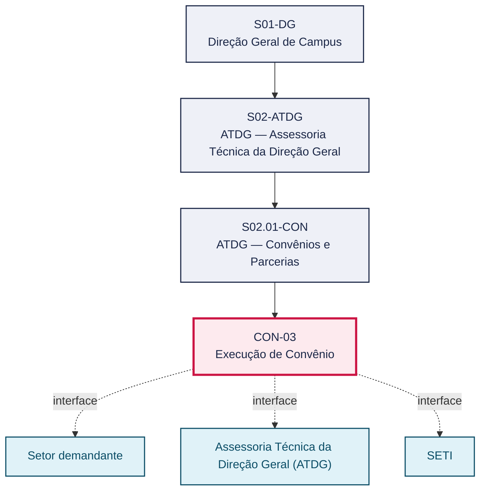
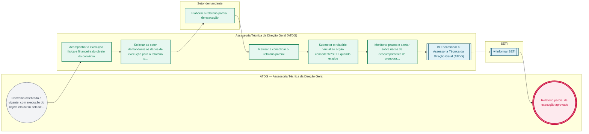

# POP CON-03 — Execução de Convênio

> **Documento vivo** · ATDG — Assessoria Técnica da Direção Geral · UNIOESTE Campus Foz do Iguaçu · Formato DDD híbrido + BPMN 2.0 padrão Anne Bail · Versão **0.2.0** · Status **rascunho** · Atualizado em 2026-09-03

## 0. Cabeçalho DDD

| Divisão | Departamento | Descrição |
|---|---|---|
| ATDG — Assessoria Técnica da Direção Geral | ATDG — Convênios e Parcerias | Execução de Convênio — Acompanhamento, relatórios parciais. Processo codificado no manual institucional da ATDG (jun/2026); conteúdo operacional a documentar. |

| Domínio | Subdomínio | Tipo | Contexto delimitado |
|---|---|---|---|
| Convênios, Parcerias e Captação | Execução de Convênio | core | S02.01-CON |

### 0.3 Linguagem ubíqua (glossário do processo)

| Termo | Definição | Sistema |
|---|---|---|
| Cronograma físico-financeiro | Instrumento do plano de trabalho que detalha metas e desembolsos previstos ao longo da execução do convênio. | — |

## 1. Identificação

| Campo | Valor |
|---|---|
| Código | CON-03 |
| Setor | ATDG — Assessoria Técnica da Direção Geral (`S02.01-CON`) |
| Responsável (função) | A definir |
| Periodicidade | Sob demanda |
| Subordinação | ATDG — Assessoria Técnica da Direção Geral |
| Normativa | A definir |
| Produto ATDG | POP |
| Pasta OneDrive | 01_ADMINISTRATIVO |
| Fontes (entradas do Canvas) | — |
| Lacunas abertas | responsavel, kpi, formulario, prazo, normativa |
| Agente responsável | — (não moldado) |

## 2. Organograma

## 3. Playbook

### 3.1 Gatilho (evento de domínio)

**Convênio celebrado e vigente, com execução do objeto em curso pelo setor demandante/partícipe** — origem: Setor demandante

### 3.2 Entrada

- Convênio celebrado e plano de trabalho aprovado
- Registros de execução física e financeira do objeto

### 3.3 Passo a passo

| Nº | Ação | Responsável | Sistema | Artefato | Prazo | Evento |
|---|---|---|---|---|---|---|
| 1 | Acompanhar a execução física e financeira do objeto do convênio | Assessoria Técnica da Direção Geral (ATDG) | OneDrive ATDG | Registro de acompanhamento | A definir | Execução acompanhada |
| 2 | Solicitar ao setor demandante os dados de execução para o relatório parcial | Assessoria Técnica da Direção Geral (ATDG) | e-Protocolo | Solicitação de dados de execução | A definir | Dados solicitados |
| 3 | Elaborar o relatório parcial de execução | Setor demandante | e-Protocolo | Relatório parcial | A definir | Relatório elaborado |
| 4 | Revisar e consolidar o relatório parcial | Assessoria Técnica da Direção Geral (ATDG) | e-Protocolo | Relatório parcial consolidado | A definir | Relatório consolidado |
| 5 | Submeter o relatório parcial ao órgão concedente/SETI, quando exigido | Assessoria Técnica da Direção Geral (ATDG) | e-Protocolo | Relatório parcial | A definir | Relatório submetido |
| 6 | Monitorar prazos e alertar sobre riscos de descumprimento do cronograma físico-financeiro | Assessoria Técnica da Direção Geral (ATDG) | OneDrive ATDG | Alerta de prazo/risco | A definir | Risco monitorado |

### 3.4 Saída (entregáveis)

- Relatório parcial de execução aprovado
- Registro de acompanhamento do convênio atualizado

## 4. Formulários e artefatos (agregados)

| Nome | Tipo | Sistema | Campos-chave | Preenchimento |
|---|---|---|---|---|
| Relatório parcial de execução | documento | e-Protocolo | período, metas executadas, valores executados, pendências | Setor demandante |
| Registro de acompanhamento do convênio | registro | OneDrive ATDG | convênio, data, situação, riscos identificados | Assessoria Técnica da Direção Geral (ATDG) |

## 5. Decisões, exceções e pontos de atenção

| Decisão | Condição | Sim → | Não → |
|---|---|---|---|
| A execução está em conformidade com o cronograma físico-financeiro do plano de trabalho? | Acompanhamento da execução física e financeira do convênio | Elaborar e submeter o relatório parcial de execução | Registrar o desvio, notificar o setor demandante e avaliar necessidade de termo aditivo |

**Pontos de atenção**

- Desvios do cronograma físico-financeiro podem exigir termo aditivo ou justificativa formal ao órgão concedente
- Relatórios parciais em atraso expõem o convênio a risco de suspensão de repasses

## 6. Contingência

- Execução em desconformidade com o plano de trabalho: notificar o setor demandante e avaliar termo aditivo
- Setor demandante não fornece dados de execução no prazo: escalar à Direção Geral do Campus
- Relatório parcial rejeitado pelo órgão concedente/SETI: revisar e reencaminhar com as correções apontadas

## 7. Checklist

- ( ) Execução física e financeira acompanhada periodicamente
- ( ) Dados de execução solicitados e recebidos do setor demandante
- ( ) Relatório parcial elaborado e consolidado
- ( ) Relatório submetido ao órgão concedente/SETI quando exigido
- ( ) Riscos de descumprimento do cronograma monitorados

## 8. KPI / Indicadores

| Indicador | Fórmula | Meta | Fonte |
|---|---|---|---|
| Percentual de relatórios parciais entregues dentro do prazo | (Relatórios entregues no prazo / total de relatórios exigidos) × 100 | A definir | e-Protocolo |
| Percentual de execução física do cronograma do plano de trabalho | (Metas físicas executadas / metas físicas previstas) × 100 | A definir | OneDrive ATDG |

## 9. Mapa de contexto (interfaces inter-setoriais)

| Origem | Relação | Destino | Artefato | Canal |
|---|---|---|---|---|
| Setor demandante | fornece | Assessoria Técnica da Direção Geral (ATDG) | Dados de execução física e financeira | e-Protocolo |
| Assessoria Técnica da Direção Geral (ATDG) | informa | SETI | Relatório parcial de execução | e-Protocolo |

## 10. Fluxograma (BPMN 2.0 — padrão Anne Bail)

## 11. Especificação BPMN para o Miro

**Raias:** ATDG — Assessoria Técnica da Direção Geral · Assessoria Técnica da Direção Geral (ATDG) · Setor demandante · SETI

| Id | Tipo | Elemento | Raia |
|---|---|---|---|
| e1 | inicio | Convênio celebrado e vigente, com execução do objeto em curso pelo setor demandante/partícipe | ATDG — Assessoria Técnica da Direção Geral |
| e2 | atividade | Acompanhar a execução física e financeira do objeto do convênio | Assessoria Técnica da Direção Geral (ATDG) |
| e3 | atividade | Solicitar ao setor demandante os dados de execução para o relatório parcial | Assessoria Técnica da Direção Geral (ATDG) |
| e4 | atividade | Elaborar o relatório parcial de execução | Setor demandante |
| e5 | atividade | Revisar e consolidar o relatório parcial | Assessoria Técnica da Direção Geral (ATDG) |
| e6 | atividade | Submeter o relatório parcial ao órgão concedente/SETI, quando exigido | Assessoria Técnica da Direção Geral (ATDG) |
| e7 | atividade | Monitorar prazos e alertar sobre riscos de descumprimento do cronograma físico-financeiro | Assessoria Técnica da Direção Geral (ATDG) |
| e8 | captura | Encaminhar a Assessoria Técnica da Direção Geral (ATDG) | Assessoria Técnica da Direção Geral (ATDG) |
| e9 | captura | Informar SETI | SETI |
| e10 | fim | Relatório parcial de execução aprovado | ATDG — Assessoria Técnica da Direção Geral |

| De | Para | Rótulo |
|---|---|---|
| e1 | e2 | — |
| e2 | e3 | — |
| e3 | e4 | — |
| e4 | e5 | — |
| e5 | e6 | — |
| e6 | e7 | — |
| e7 | e8 | — |
| e8 | e9 | — |
| e9 | e10 | — |

_Especificação gerada a partir dos passos do POP; 4 raia(s). Revisar decisões e pausas antes de construir no Miro._

## 12. Histórico de versões

| Versão | Data | Autor | Tipo | Mudanças | Fontes |
|---|---|---|---|---|---|
| 0.1.0 | 2026-09-02 | scripts/scaffold_pops.py | patch | Esqueleto inicial gerado deterministicamente a partir do escopo "Acompanhamento, relatórios parciais" | — |
| 0.2.0 | 2026-09-03 | agente:construtor-pop (lote B) | minor | Passo adicionado após 0: Acompanhar a execução física e financeira do objeto do convênio; Passo adicionado após 1: Solicitar ao setor demandante os dados de execução para o relatório parcial; Passo adicionado após 2: Elaborar o relatório parcial de execução; Passo adicionado após 3: Revisar e consolidar o relatório parcial; Passo adicionado após 4: Submeter o relatório parcial ao órgão concedente/SETI, quando exigido; Passo adicionado após 5: Monitorar prazos e alertar sobre riscos de descumprimento do cronograma físico-f; entrada_nova: +2; saida_nova: +2; artefatos_novos: +2; decisoes_novas: +1; kpis_novos: +2; mapa_contexto_novo: +2; pontos_atencao_novos: +2; contingencia_nova: +3; checklist_novo: +5; glossario_novo: +1; Campo identificacao.periodicidade atualizado; Campo playbook.gatilho atualizado; Campo observacoes atualizado; Fluxograma regenerado a partir dos passos | — |

## 13. Validação e aprovação

| Papel | Função / unidade | Data |
|---|---|---|
| Elaboração | ATDG — Assessoria Técnica da Direção Geral | 2026-09-02 |
| Revisão | A definir (responsável do setor) | ___/___/______ |
| Aprovação | Direção Geral do Campus | ___/___/______ |

## 14. Lições incorporadas

- **L-001** — Referir sempre função/cargo; nomes apenas no bloco 13 (Validação), com anuência (LGPD).
- **L-004** — Nunca regenerar POP existente: aplicar patch com changelog, fontes e versão.
- **L-006** — Preservar códigos legados como códigos de processo; não renumerar.
- **L-007** — Referência Externa é benchmark; normativa do POP só cita atos da Unioeste, do Estado do Paraná ou federais aplicáveis.
- **L-002** — Um passo = uma ação; ações compostas viram passos distintos.
- **L-003** — Cada linha do mapa de contexto gera um elemento `captura` no BPMN e um passo na raia de destino.

> **Observações:** Inferência a validar com a ATDG: playbook construído a partir do escopo do manual institucional da ATDG (jun/2026) e da prática administrativa geral de convênios em universidades estaduais do Paraná, sem entradas do Canvas Vivo para este processo; validar papéis, sistemas, prazos, normativa específica e fluxo de aprovação junto à ATDG.

---
_Canvas Vivo — Base de Conhecimento Institucional · ATDG · UNIOESTE Campus Foz do Iguaçu · gerado por `scripts/render_pop.py` a partir de `pops/CON/CON-03.pop.json` (diretrizes v1.8)._
