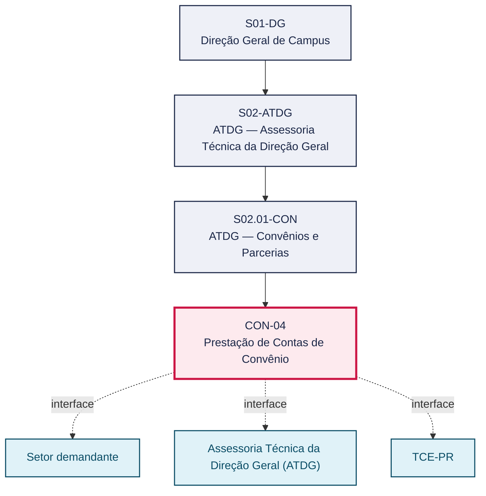
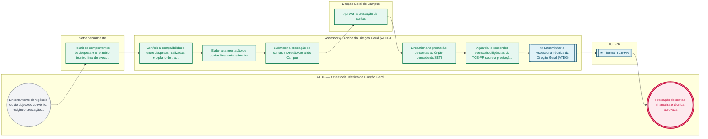

# POP CON-04 — Prestação de Contas de Convênio

> **Documento vivo** · ATDG — Assessoria Técnica da Direção Geral · UNIOESTE Campus Foz do Iguaçu · Formato DDD híbrido + BPMN 2.0 padrão Anne Bail · Versão **0.2.0** · Status **rascunho** · Atualizado em 2026-09-03

## 0. Cabeçalho DDD

| Divisão | Departamento | Descrição |
|---|---|---|
| ATDG — Assessoria Técnica da Direção Geral | ATDG — Convênios e Parcerias | Prestação de Contas de Convênio — Financeira e técnica, TCE-PR. Processo codificado no manual institucional da ATDG (jun/2026); conteúdo operacional a documentar. |

| Domínio | Subdomínio | Tipo | Contexto delimitado |
|---|---|---|---|
| Convênios, Parcerias e Captação | Prestação de Contas de Convênio | core | S02.01-CON |

### 0.3 Linguagem ubíqua (glossário do processo)

| Termo | Definição | Sistema |
|---|---|---|
| TCE-PR | Tribunal de Contas do Estado do Paraná, órgão de controle externo responsável pela fiscalização da aplicação de recursos públicos, incluindo convênios. | — |

## 1. Identificação

| Campo | Valor |
|---|---|
| Código | CON-04 |
| Setor | ATDG — Assessoria Técnica da Direção Geral (`S02.01-CON`) |
| Responsável (função) | A definir |
| Periodicidade | Sob demanda |
| Subordinação | ATDG — Assessoria Técnica da Direção Geral |
| Normativa | A definir |
| Produto ATDG | POP |
| Pasta OneDrive | 01_ADMINISTRATIVO |
| Fontes (entradas do Canvas) | — |
| Lacunas abertas | responsavel, kpi, formulario, prazo, normativa |
| Agente responsável | — (não moldado) |

## 2. Organograma

## 3. Playbook

### 3.1 Gatilho (evento de domínio)

**Encerramento da vigência ou do objeto do convênio, exigindo prestação de contas financeira e técnica** — origem: Setor demandante

### 3.2 Entrada

- Convênio encerrado ou em fase final de execução
- Comprovantes de despesas e relatório técnico de execução

### 3.3 Passo a passo

| Nº | Ação | Responsável | Sistema | Artefato | Prazo | Evento |
|---|---|---|---|---|---|---|
| 1 | Reunir os comprovantes de despesa e o relatório técnico final de execução | Setor demandante | e-Protocolo | Comprovantes de despesa e relatório técnico | A definir | Documentação reunida |
| 2 | Conferir a compatibilidade entre despesas realizadas e o plano de trabalho aprovado | Assessoria Técnica da Direção Geral (ATDG) | e-Protocolo | Planilha de conferência financeira | A definir | Despesas conferidas |
| 3 | Elaborar a prestação de contas financeira e técnica | Assessoria Técnica da Direção Geral (ATDG) | e-Protocolo | Prestação de contas | A definir | Prestação de contas elaborada |
| 4 | Submeter a prestação de contas à Direção Geral do Campus | Assessoria Técnica da Direção Geral (ATDG) | e-Protocolo | Prestação de contas | A definir | Prestação submetida |
| 5 | Aprovar a prestação de contas | Direção Geral do Campus | e-Protocolo | Despacho de aprovação | A definir | Prestação aprovada |
| 6 | Encaminhar a prestação de contas ao órgão concedente/SETI | Assessoria Técnica da Direção Geral (ATDG) | e-Protocolo | Prestação de contas | A definir | Prestação encaminhada |
| 7 | Aguardar e responder eventuais diligências do TCE-PR sobre a prestação de contas | Assessoria Técnica da Direção Geral (ATDG) | e-Protocolo | Resposta a diligência | A definir | Diligência respondida |

### 3.4 Saída (entregáveis)

- Prestação de contas financeira e técnica aprovada
- Prestação de contas registrada e disponível para o TCE-PR

## 4. Formulários e artefatos (agregados)

| Nome | Tipo | Sistema | Campos-chave | Preenchimento |
|---|---|---|---|---|
| Prestação de contas financeira e técnica | documento | e-Protocolo | despesas realizadas, metas executadas, conclusão | Assessoria Técnica da Direção Geral (ATDG) |
| Planilha de conferência financeira | registro | e-Protocolo | item de despesa, valor previsto, valor executado, compatibilidade | Assessoria Técnica da Direção Geral (ATDG) |

## 5. Decisões, exceções e pontos de atenção

| Decisão | Condição | Sim → | Não → |
|---|---|---|---|
| As despesas realizadas são compatíveis com o plano de trabalho aprovado? | Conferência financeira da prestação de contas | Elaborar e submeter a prestação de contas para aprovação | Solicitar esclarecimentos ou complementação ao setor demandante antes de prosseguir |

**Pontos de atenção**

- Prestação de contas com pendências pode motivar diligência do TCE-PR e risco de imputação de responsabilidade
- Prazo de guarda da documentação financeira deve observar as exigências do órgão concedente e do TCE-PR

## 6. Contingência

- Despesa incompatível com o plano de trabalho: solicitar justificativa ao setor demandante ou glosar o valor
- Comprovantes de despesa incompletos: notificar o setor demandante para regularização antes do envio
- Diligência do TCE-PR não respondida no prazo: escalar à Direção Geral do Campus para providências imediatas

## 7. Checklist

- ( ) Comprovantes de despesa e relatório técnico reunidos
- ( ) Despesas conferidas com o plano de trabalho aprovado
- ( ) Prestação de contas elaborada e aprovada pela Direção Geral
- ( ) Prestação de contas encaminhada ao órgão concedente/SETI
- ( ) Eventuais diligências do TCE-PR respondidas dentro do prazo

## 8. KPI / Indicadores

| Indicador | Fórmula | Meta | Fonte |
|---|---|---|---|
| Percentual de prestações de contas aprovadas sem diligência do TCE-PR | (Prestações aprovadas sem diligência / total de prestações de contas) × 100 | A definir | e-Protocolo |
| Tempo médio de resposta a diligências do TCE-PR | Média (data da resposta − data de recebimento da diligência) | A definir | e-Protocolo |

## 9. Mapa de contexto (interfaces inter-setoriais)

| Origem | Relação | Destino | Artefato | Canal |
|---|---|---|---|---|
| Setor demandante | fornece | Assessoria Técnica da Direção Geral (ATDG) | Comprovantes de despesa e relatório técnico final | e-Protocolo |
| Assessoria Técnica da Direção Geral (ATDG) | informa | TCE-PR | Prestação de contas financeira e técnica | e-Protocolo |

## 10. Fluxograma (BPMN 2.0 — padrão Anne Bail)

## 11. Especificação BPMN para o Miro

**Raias:** ATDG — Assessoria Técnica da Direção Geral · Setor demandante · Assessoria Técnica da Direção Geral (ATDG) · Direção Geral do Campus · TCE-PR

| Id | Tipo | Elemento | Raia |
|---|---|---|---|
| e1 | inicio | Encerramento da vigência ou do objeto do convênio, exigindo prestação de contas financeira e técnica | ATDG — Assessoria Técnica da Direção Geral |
| e2 | atividade | Reunir os comprovantes de despesa e o relatório técnico final de execução | Setor demandante |
| e3 | atividade | Conferir a compatibilidade entre despesas realizadas e o plano de trabalho aprovado | Assessoria Técnica da Direção Geral (ATDG) |
| e4 | atividade | Elaborar a prestação de contas financeira e técnica | Assessoria Técnica da Direção Geral (ATDG) |
| e5 | atividade | Submeter a prestação de contas à Direção Geral do Campus | Assessoria Técnica da Direção Geral (ATDG) |
| e6 | atividade | Aprovar a prestação de contas | Direção Geral do Campus |
| e7 | atividade | Encaminhar a prestação de contas ao órgão concedente/SETI | Assessoria Técnica da Direção Geral (ATDG) |
| e8 | atividade | Aguardar e responder eventuais diligências do TCE-PR sobre a prestação de contas | Assessoria Técnica da Direção Geral (ATDG) |
| e9 | captura | Encaminhar a Assessoria Técnica da Direção Geral (ATDG) | Assessoria Técnica da Direção Geral (ATDG) |
| e10 | captura | Informar TCE-PR | TCE-PR |
| e11 | fim | Prestação de contas financeira e técnica aprovada | ATDG — Assessoria Técnica da Direção Geral |

| De | Para | Rótulo |
|---|---|---|
| e1 | e2 | — |
| e2 | e3 | — |
| e3 | e4 | — |
| e4 | e5 | — |
| e5 | e6 | — |
| e6 | e7 | — |
| e7 | e8 | — |
| e8 | e9 | — |
| e9 | e10 | — |
| e10 | e11 | — |

_Especificação gerada a partir dos passos do POP; 5 raia(s). Revisar decisões e pausas antes de construir no Miro._

## 12. Histórico de versões

| Versão | Data | Autor | Tipo | Mudanças | Fontes |
|---|---|---|---|---|---|
| 0.1.0 | 2026-09-02 | scripts/scaffold_pops.py | patch | Esqueleto inicial gerado deterministicamente a partir do escopo "Financeira e técnica, TCE-PR" | — |
| 0.2.0 | 2026-09-03 | agente:construtor-pop (lote B) | minor | Passo adicionado após 0: Reunir os comprovantes de despesa e o relatório técnico final de execução; Passo adicionado após 1: Conferir a compatibilidade entre despesas realizadas e o plano de trabalho aprov; Passo adicionado após 2: Elaborar a prestação de contas financeira e técnica; Passo adicionado após 3: Submeter a prestação de contas à Direção Geral do Campus; Passo adicionado após 4: Aprovar a prestação de contas; Passo adicionado após 5: Encaminhar a prestação de contas ao órgão concedente/SETI; Passo adicionado após 6: Aguardar e responder eventuais diligências do TCE-PR sobre a prestação de contas; entrada_nova: +2; saida_nova: +2; artefatos_novos: +2; decisoes_novas: +1; kpis_novos: +2; mapa_contexto_novo: +2; pontos_atencao_novos: +2; contingencia_nova: +3; checklist_novo: +5; glossario_novo: +1; Campo identificacao.periodicidade atualizado; Campo playbook.gatilho atualizado; Campo observacoes atualizado; Fluxograma regenerado a partir dos passos | — |

## 13. Validação e aprovação

| Papel | Função / unidade | Data |
|---|---|---|
| Elaboração | ATDG — Assessoria Técnica da Direção Geral | 2026-09-02 |
| Revisão | A definir (responsável do setor) | ___/___/______ |
| Aprovação | Direção Geral do Campus | ___/___/______ |

## 14. Lições incorporadas

- **L-001** — Referir sempre função/cargo; nomes apenas no bloco 13 (Validação), com anuência (LGPD).
- **L-004** — Nunca regenerar POP existente: aplicar patch com changelog, fontes e versão.
- **L-006** — Preservar códigos legados como códigos de processo; não renumerar.
- **L-007** — Referência Externa é benchmark; normativa do POP só cita atos da Unioeste, do Estado do Paraná ou federais aplicáveis.
- **L-002** — Um passo = uma ação; ações compostas viram passos distintos.
- **L-003** — Cada linha do mapa de contexto gera um elemento `captura` no BPMN e um passo na raia de destino.

> **Observações:** Inferência a validar com a ATDG: playbook construído a partir do escopo do manual institucional da ATDG (jun/2026) e da prática administrativa geral de convênios em universidades estaduais do Paraná, sem entradas do Canvas Vivo para este processo; validar papéis, sistemas, prazos, normativa específica e fluxo de aprovação junto à ATDG.

---
_Canvas Vivo — Base de Conhecimento Institucional · ATDG · UNIOESTE Campus Foz do Iguaçu · gerado por `scripts/render_pop.py` a partir de `pops/CON/CON-04.pop.json` (diretrizes v1.8)._
