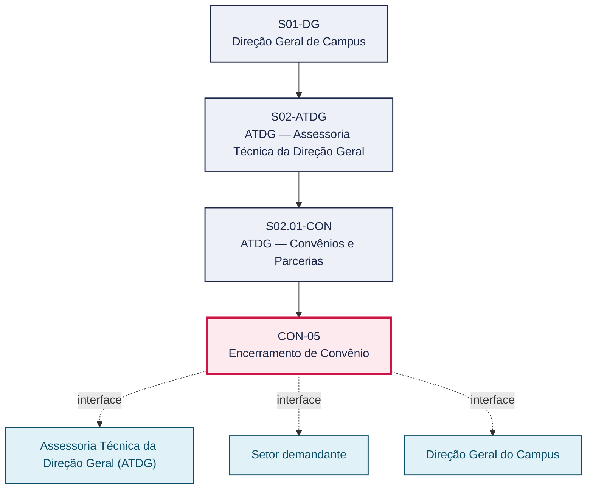
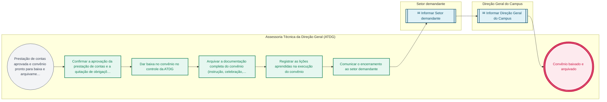

# POP CON-05 — Encerramento de Convênio

> **Documento vivo** · ATDG — Assessoria Técnica da Direção Geral · UNIOESTE Campus Foz do Iguaçu · Formato DDD híbrido + BPMN 2.0 padrão Anne Bail · Versão **0.2.1** · Status **rascunho** · Atualizado em 2026-09-03

## 0. Cabeçalho DDD

| Divisão | Departamento | Descrição |
|---|---|---|
| ATDG — Assessoria Técnica da Direção Geral | ATDG — Convênios e Parcerias | Encerramento de Convênio — Baixa, arquivo, lições aprendidas. Processo codificado no manual institucional da ATDG (jun/2026); conteúdo operacional a documentar. |

| Domínio | Subdomínio | Tipo | Contexto delimitado |
|---|---|---|---|
| Convênios, Parcerias e Captação | Encerramento de Convênio | core | S02.01-CON |

### 0.3 Linguagem ubíqua (glossário do processo)

Herda integralmente o glossário institucional (`diretrizes/09-glossario-institucional.md`); sem termos locais adicionais.

## 1. Identificação

| Campo | Valor |
|---|---|
| Código | CON-05 |
| Setor | ATDG — Assessoria Técnica da Direção Geral (`S02.01-CON`) |
| Responsável (função) | A definir |
| Periodicidade | Sob demanda |
| Subordinação | ATDG — Assessoria Técnica da Direção Geral |
| Normativa | A definir |
| Produto ATDG | POP |
| Pasta OneDrive | 01_ADMINISTRATIVO |
| Fontes (entradas do Canvas) | — |
| Lacunas abertas | responsavel, kpi, formulario, prazo, normativa |
| Agente responsável | pop-con-05 |

## 2. Organograma

## 3. Playbook

### 3.1 Gatilho (evento de domínio)

**Prestação de contas aprovada e convênio pronto para baixa e arquivamento** — origem: Assessoria Técnica da Direção Geral (ATDG)

### 3.2 Entrada

- Prestação de contas aprovada (CON-04)
- Registro de acompanhamento do convênio

### 3.3 Passo a passo

| Nº | Ação | Responsável | Sistema | Artefato | Prazo | Evento |
|---|---|---|---|---|---|---|
| 1 | Confirmar a aprovação da prestação de contas e a quitação de obrigações do convênio | Assessoria Técnica da Direção Geral (ATDG) | e-Protocolo | Despacho de aprovação da prestação de contas | A definir | Aprovação confirmada |
| 2 | Dar baixa no convênio no controle da ATDG | Assessoria Técnica da Direção Geral (ATDG) | OneDrive ATDG | Registro de convênios | A definir | Convênio baixado |
| 3 | Arquivar a documentação completa do convênio (instrução, celebração, execução e prestação de contas) | Assessoria Técnica da Direção Geral (ATDG) | OneDrive ATDG | Processo de convênio arquivado | A definir | Documentação arquivada |
| 4 | Registrar as lições aprendidas na execução do convênio | Assessoria Técnica da Direção Geral (ATDG) | OneDrive ATDG | Registro de lições aprendidas | A definir | Lições registradas |
| 5 | Comunicar o encerramento ao setor demandante | Assessoria Técnica da Direção Geral (ATDG) | e-Protocolo | Ofício de encerramento | A definir | Encerramento comunicado |

### 3.4 Saída (entregáveis)

- Convênio baixado e arquivado
- Registro de lições aprendidas do convênio

## 4. Formulários e artefatos (agregados)

| Nome | Tipo | Sistema | Campos-chave | Preenchimento |
|---|---|---|---|---|
| Registro de lições aprendidas do convênio | registro | OneDrive ATDG | convênio, dificuldades identificadas, recomendações | Assessoria Técnica da Direção Geral (ATDG) |
| Processo de convênio arquivado | registro | OneDrive ATDG | convênio, documentos anexados, prazo de guarda | Assessoria Técnica da Direção Geral (ATDG) |

## 5. Decisões, exceções e pontos de atenção

| Decisão | Condição | Sim → | Não → |
|---|---|---|---|
| Há pendências financeiras ou técnicas registradas no convênio antes do arquivamento? | Verificação final de pendências do convênio | Regularizar as pendências antes de dar baixa e arquivar o convênio | Dar baixa no convênio e arquivar a documentação |

**Pontos de atenção**

- Arquivar a documentação completa do convênio pelo prazo mínimo exigido para eventual fiscalização do TCE-PR
- Registrar lições aprendidas de forma padronizada para subsidiar novos convênios

## 6. Contingência

- Pendência financeira ou técnica identificada antes do arquivamento: suspender a baixa até a regularização
- Documentação do convênio incompleta no arquivo: reconstituir a partir do e-Protocolo antes de arquivar definitivamente
- Prazo de guarda documental não identificado: consultar a Direção Geral do Campus antes de eliminar qualquer via

## 7. Checklist

- ( ) Aprovação da prestação de contas confirmada
- ( ) Ausência de pendências financeiras ou técnicas verificada
- ( ) Convênio baixado no controle da ATDG
- ( ) Documentação completa arquivada
- ( ) Lições aprendidas registradas e setor demandante comunicado

## 8. KPI / Indicadores

| Indicador | Fórmula | Meta | Fonte |
|---|---|---|---|
| Tempo médio entre a aprovação da prestação de contas e a baixa do convênio | Média (data da baixa − data de aprovação da prestação de contas) | A definir | OneDrive ATDG |
| Percentual de convênios encerrados com registro de lições aprendidas | (Convênios com lições registradas / total de convênios encerrados) × 100 | A definir | OneDrive ATDG |

## 9. Mapa de contexto (interfaces inter-setoriais)

| Origem | Relação | Destino | Artefato | Canal |
|---|---|---|---|---|
| Assessoria Técnica da Direção Geral (ATDG) | informa | Setor demandante | Ofício de encerramento do convênio | e-Protocolo |
| Assessoria Técnica da Direção Geral (ATDG) | informa | Direção Geral do Campus | Registro de lições aprendidas do convênio | OneDrive ATDG |

## 10. Fluxograma (BPMN 2.0 — padrão Anne Bail)

## 11. Especificação BPMN para o Miro

**Raias:** Assessoria Técnica da Direção Geral (ATDG) · Setor demandante · Direção Geral do Campus

| Id | Tipo | Elemento | Raia |
|---|---|---|---|
| e1 | inicio | Prestação de contas aprovada e convênio pronto para baixa e arquivamento | Assessoria Técnica da Direção Geral (ATDG) |
| e2 | atividade | Confirmar a aprovação da prestação de contas e a quitação de obrigações do convênio | Assessoria Técnica da Direção Geral (ATDG) |
| e3 | atividade | Dar baixa no convênio no controle da ATDG | Assessoria Técnica da Direção Geral (ATDG) |
| e4 | atividade | Arquivar a documentação completa do convênio (instrução, celebração, execução e prestação de contas) | Assessoria Técnica da Direção Geral (ATDG) |
| e5 | atividade | Registrar as lições aprendidas na execução do convênio | Assessoria Técnica da Direção Geral (ATDG) |
| e6 | atividade | Comunicar o encerramento ao setor demandante | Assessoria Técnica da Direção Geral (ATDG) |
| e7 | captura | Informar Setor demandante | Setor demandante |
| e8 | captura | Informar Direção Geral do Campus | Direção Geral do Campus |
| e9 | fim | Convênio baixado e arquivado | Assessoria Técnica da Direção Geral (ATDG) |

| De | Para | Rótulo |
|---|---|---|
| e1 | e2 | — |
| e2 | e3 | — |
| e3 | e4 | — |
| e4 | e5 | — |
| e5 | e6 | — |
| e6 | e7 | — |
| e7 | e8 | — |
| e8 | e9 | — |

_Especificação gerada a partir dos passos do POP; 3 raia(s). Revisar decisões e pausas antes de construir no Miro._

## 12. Histórico de versões

| Versão | Data | Autor | Tipo | Mudanças | Fontes |
|---|---|---|---|---|---|
| 0.1.0 | 2026-09-02 | scripts/scaffold_pops.py | patch | Esqueleto inicial gerado deterministicamente a partir do escopo "Baixa, arquivo, lições aprendidas" | — |
| 0.2.0 | 2026-09-03 | agente:construtor-pop (lote B) | minor | Passo adicionado após 0: Confirmar a aprovação da prestação de contas e a quitação de obrigações do convê; Passo adicionado após 1: Dar baixa no convênio no controle da ATDG; Passo adicionado após 2: Arquivar a documentação completa do convênio (instrução, celebração, execução e ; Passo adicionado após 3: Registrar as lições aprendidas na execução do convênio; Passo adicionado após 4: Comunicar o encerramento ao setor demandante; entrada_nova: +2; saida_nova: +2; artefatos_novos: +2; decisoes_novas: +1; kpis_novos: +2; mapa_contexto_novo: +2; pontos_atencao_novos: +2; contingencia_nova: +3; checklist_novo: +5; Campo identificacao.periodicidade atualizado; Campo playbook.gatilho atualizado; Campo observacoes atualizado; Fluxograma regenerado a partir dos passos | — |
| 0.2.1 | 2026-09-03 | agente:curador-diretrizes | patch | Fluxograma regenerado a partir dos passos | — |

## 13. Validação e aprovação

| Papel | Função / unidade | Data |
|---|---|---|
| Elaboração | ATDG — Assessoria Técnica da Direção Geral | 2026-09-02 |
| Revisão | A definir (responsável do setor) | ___/___/______ |
| Aprovação | Direção Geral do Campus | ___/___/______ |

## 14. Lições incorporadas

- **L-001** — Referir sempre função/cargo; nomes apenas no bloco 13 (Validação), com anuência (LGPD).
- **L-004** — Nunca regenerar POP existente: aplicar patch com changelog, fontes e versão.
- **L-006** — Preservar códigos legados como códigos de processo; não renumerar.
- **L-007** — Referência Externa é benchmark; normativa do POP só cita atos da Unioeste, do Estado do Paraná ou federais aplicáveis.
- **L-002** — Um passo = uma ação; ações compostas viram passos distintos.
- **L-003** — Cada linha do mapa de contexto gera um elemento `captura` no BPMN e um passo na raia de destino.

> **Observações:** Inferência a validar com a ATDG: playbook construído a partir do escopo do manual institucional da ATDG (jun/2026) e da prática administrativa geral de convênios em universidades estaduais do Paraná, sem entradas do Canvas Vivo para este processo; validar papéis, sistemas, prazos, normativa específica e fluxo de aprovação junto à ATDG.

---
_Canvas Vivo — Base de Conhecimento Institucional · ATDG · UNIOESTE Campus Foz do Iguaçu · gerado por `scripts/render_pop.py` a partir de `pops/CON/CON-05.pop.json` (diretrizes v1.12)._
