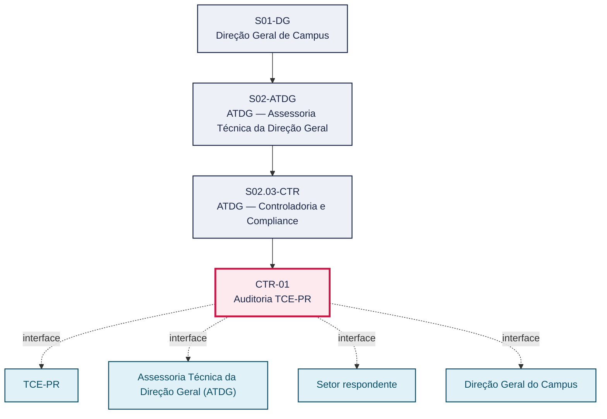

# POP CTR-01 — Auditoria TCE-PR

> **Documento vivo** · ATDG — Assessoria Técnica da Direção Geral · UNIOESTE Campus Foz do Iguaçu · Formato DDD híbrido + BPMN 2.0 padrão Anne Bail · Versão **0.2.1** · Status **rascunho** · Atualizado em 2026-09-03

## 0. Cabeçalho DDD

| Divisão | Departamento | Descrição |
|---|---|---|
| ATDG — Assessoria Técnica da Direção Geral | ATDG — Controladoria e Compliance | Auditoria TCE-PR — Demandas, prazos, respostas formais. Processo codificado no manual institucional da ATDG (jun/2026); conteúdo operacional a documentar. |

| Domínio | Subdomínio | Tipo | Contexto delimitado |
|---|---|---|---|
| Controladoria, Compliance e Riscos | Auditoria TCE-PR | core | S02.03-CTR |

### 0.3 Linguagem ubíqua (glossário do processo)

| Termo | Definição | Sistema |
|---|---|---|
| Diligência | Solicitação formal de informações, documentos ou esclarecimentos feita por órgão de controle, como o TCE-PR. | — |

## 1. Identificação

| Campo | Valor |
|---|---|
| Código | CTR-01 |
| Setor | ATDG — Assessoria Técnica da Direção Geral (`S02.03-CTR`) |
| Responsável (função) | A definir |
| Periodicidade | Sob demanda |
| Subordinação | ATDG — Assessoria Técnica da Direção Geral |
| Normativa | A definir |
| Produto ATDG | POP |
| Pasta OneDrive | 02_CONTROLADORIA |
| Fontes (entradas do Canvas) | — |
| Lacunas abertas | responsavel, kpi, formulario, prazo, normativa |
| Agente responsável | pop-ctr-01 |

## 2. Organograma

## 3. Playbook

### 3.1 Gatilho (evento de domínio)

**Recebimento de demanda, notificação ou diligência do TCE-PR dirigida ao Campus** — origem: TCE-PR

### 3.2 Entrada

- Notificação/diligência do TCE-PR
- Documentação e informações solicitadas

### 3.3 Passo a passo

| Nº | Ação | Responsável | Sistema | Artefato | Prazo | Evento |
|---|---|---|---|---|---|---|
| 1 | Receber e registrar a demanda/diligência do TCE-PR | Assessoria Técnica da Direção Geral (ATDG) | e-Protocolo | Notificação/diligência do TCE-PR | A definir | Demanda registrada |
| 2 | Identificar o(s) setor(es) responsável(is) pelas informações solicitadas | Assessoria Técnica da Direção Geral (ATDG) | e-Protocolo | Notificação/diligência do TCE-PR | A definir | Setor(es) identificado(s) |
| 3 | Solicitar aos setores responsáveis a documentação e as informações exigidas | Assessoria Técnica da Direção Geral (ATDG) | e-Protocolo | Solicitação de informações | A definir | Informações solicitadas |
| 4 | Reunir e conferir a documentação e as informações recebidas | Setor respondente | e-Protocolo | Documentação e informações | A definir | Documentação reunida |
| 5 | Elaborar a resposta formal à demanda do TCE-PR | Assessoria Técnica da Direção Geral (ATDG) | e-Protocolo | Minuta de resposta ao TCE-PR | A definir | Resposta elaborada |
| 6 | Submeter a resposta à Direção Geral do Campus para validação | Assessoria Técnica da Direção Geral (ATDG) | e-Protocolo | Minuta de resposta ao TCE-PR | A definir | Resposta submetida |
| 7 | Encaminhar a resposta formal ao TCE-PR dentro do prazo estabelecido | Direção Geral do Campus | e-Protocolo | Resposta formal ao TCE-PR | A definir | Resposta encaminhada |

### 3.4 Saída (entregáveis)

- Resposta formal encaminhada ao TCE-PR dentro do prazo
- Registro da demanda e da resposta arquivado

## 4. Formulários e artefatos (agregados)

| Nome | Tipo | Sistema | Campos-chave | Preenchimento |
|---|---|---|---|---|
| Registro de demandas do TCE-PR | registro | OneDrive ATDG | demanda, data de recebimento, prazo, situação | Assessoria Técnica da Direção Geral (ATDG) |
| Resposta formal ao TCE-PR | documento | e-Protocolo | demanda respondida, fundamentação, documentos anexados | Assessoria Técnica da Direção Geral (ATDG) |

## 5. Decisões, exceções e pontos de atenção

| Decisão | Condição | Sim → | Não → |
|---|---|---|---|
| A documentação reunida atende integralmente ao solicitado pelo TCE-PR? | Conferência da documentação e das informações recebidas dos setores | Elaborar a resposta formal e submetê-la à validação da Direção Geral | Solicitar complementação aos setores responsáveis antes de elaborar a resposta |

**Pontos de atenção**

- Prazos do TCE-PR são improrrogáveis, salvo pedido de prorrogação tempestivo e fundamentado
- Manter registro centralizado de todas as demandas do TCE-PR para consulta em auditorias futuras

## 6. Contingência

- Setor não responde à solicitação de informações no prazo interno: escalar à Direção Geral do Campus
- Prazo do TCE-PR insuficiente para reunir toda a documentação: protocolar pedido de prorrogação antes do vencimento
- Resposta formal devolvida pelo TCE-PR para complementação: revisar e reencaminhar dentro do novo prazo fixado

## 7. Checklist

- ( ) Demanda/diligência do TCE-PR registrada no e-Protocolo
- ( ) Setores responsáveis identificados e acionados
- ( ) Documentação e informações conferidas antes da resposta
- ( ) Resposta formal validada pela Direção Geral do Campus
- ( ) Resposta encaminhada ao TCE-PR dentro do prazo

## 8. KPI / Indicadores

| Indicador | Fórmula | Meta | Fonte |
|---|---|---|---|
| Percentual de respostas ao TCE-PR entregues dentro do prazo | (Respostas entregues no prazo / total de demandas recebidas) × 100 | A definir | e-Protocolo |
| Tempo médio de elaboração da resposta formal ao TCE-PR | Média (data de encaminhamento da resposta − data de registro da demanda) | A definir | e-Protocolo |

## 9. Mapa de contexto (interfaces inter-setoriais)

| Origem | Relação | Destino | Artefato | Canal |
|---|---|---|---|---|
| TCE-PR | informa | Assessoria Técnica da Direção Geral (ATDG) | Notificação/diligência | e-Protocolo |
| Setor respondente | fornece | Assessoria Técnica da Direção Geral (ATDG) | Documentação e informações solicitadas | e-Protocolo |
| Direção Geral do Campus | informa | TCE-PR | Resposta formal | e-Protocolo |

## 10. Fluxograma (BPMN 2.0 — padrão Anne Bail)

```mermaid
flowchart LR
  subgraph R1["Assessoria Técnica da Direção Geral (ATDG)"]
    direction LR
    e1(("Recebimento de demanda, notificação ou diligência do TCE-PR dirigida…"))
    e2["Receber e registrar a demanda/diligência do TCE-PR"]
    e3["Identificar o(s) setor(es) responsável(is) pelas informações solicita…"]
    e4["Solicitar aos setores responsáveis a documentação e as informações ex…"]
    e6["Elaborar a resposta formal à demanda do TCE-PR"]
    e7["Submeter a resposta à Direção Geral do Campus para validação"]
    e9[["✉ Informar Assessoria Técnica da Direção Geral (ATDG)"]]
    e10[["✉ Encaminhar a Assessoria Técnica da Direção Geral (ATDG)"]]
    e12((("Resposta formal encaminhada ao TCE-PR dentro do prazo")))
  end
  subgraph R2["Setor respondente"]
    direction LR
    e5["Reunir e conferir a documentação e as informações recebidas"]
  end
  subgraph R3["Direção Geral do Campus"]
    direction LR
    e8["Encaminhar a resposta formal ao TCE-PR dentro do prazo estabelecido"]
  end
  subgraph R4["TCE-PR"]
    direction LR
    e11[["✉ Informar TCE-PR"]]
  end
  e1 --> e2
  e2 --> e3
  e3 --> e4
  e4 --> e5
  e5 --> e6
  e6 --> e7
  e7 --> e8
  e8 --> e9
  e9 --> e10
  e10 --> e11
  e11 --> e12
  classDef inicio fill:#f3f4f6,stroke:#6b7280,stroke-width:1.5px,color:#374151
  classDef atividade fill:#E6F7F0,stroke:#0B7A4E,stroke-width:2px,color:#0B7A4E
  classDef decisao fill:#FFF4ED,stroke:#C9783A,stroke-width:2px,color:#C9783A
  classDef fim fill:#FDEAEE,stroke:#CC1544,stroke-width:4px,color:#CC1544
  classDef pausa fill:#FDEAEE,stroke:#CC1544,stroke-width:2px,color:#CC1544
  classDef captura fill:#E0F2F8,stroke:#0B4D66,stroke-width:2px,color:#0B4D66
  class e1 inicio
  class e2,e3,e4,e5,e6,e7,e8 atividade
  class e9,e10,e11 captura
  class e12 fim
```

## 11. Especificação BPMN para o Miro

**Raias:** Assessoria Técnica da Direção Geral (ATDG) · Setor respondente · Direção Geral do Campus · TCE-PR

| Id | Tipo | Elemento | Raia |
|---|---|---|---|
| e1 | inicio | Recebimento de demanda, notificação ou diligência do TCE-PR dirigida ao Campus | Assessoria Técnica da Direção Geral (ATDG) |
| e2 | atividade | Receber e registrar a demanda/diligência do TCE-PR | Assessoria Técnica da Direção Geral (ATDG) |
| e3 | atividade | Identificar o(s) setor(es) responsável(is) pelas informações solicitadas | Assessoria Técnica da Direção Geral (ATDG) |
| e4 | atividade | Solicitar aos setores responsáveis a documentação e as informações exigidas | Assessoria Técnica da Direção Geral (ATDG) |
| e5 | atividade | Reunir e conferir a documentação e as informações recebidas | Setor respondente |
| e6 | atividade | Elaborar a resposta formal à demanda do TCE-PR | Assessoria Técnica da Direção Geral (ATDG) |
| e7 | atividade | Submeter a resposta à Direção Geral do Campus para validação | Assessoria Técnica da Direção Geral (ATDG) |
| e8 | atividade | Encaminhar a resposta formal ao TCE-PR dentro do prazo estabelecido | Direção Geral do Campus |
| e9 | captura | Informar Assessoria Técnica da Direção Geral (ATDG) | Assessoria Técnica da Direção Geral (ATDG) |
| e10 | captura | Encaminhar a Assessoria Técnica da Direção Geral (ATDG) | Assessoria Técnica da Direção Geral (ATDG) |
| e11 | captura | Informar TCE-PR | TCE-PR |
| e12 | fim | Resposta formal encaminhada ao TCE-PR dentro do prazo | Assessoria Técnica da Direção Geral (ATDG) |

| De | Para | Rótulo |
|---|---|---|
| e1 | e2 | — |
| e2 | e3 | — |
| e3 | e4 | — |
| e4 | e5 | — |
| e5 | e6 | — |
| e6 | e7 | — |
| e7 | e8 | — |
| e8 | e9 | — |
| e9 | e10 | — |
| e10 | e11 | — |
| e11 | e12 | — |

_Especificação gerada a partir dos passos do POP; 4 raia(s). Revisar decisões e pausas antes de construir no Miro._

## 12. Histórico de versões

| Versão | Data | Autor | Tipo | Mudanças | Fontes |
|---|---|---|---|---|---|
| 0.1.0 | 2026-09-02 | scripts/scaffold_pops.py | patch | Esqueleto inicial gerado deterministicamente a partir do escopo "Demandas, prazos, respostas formais" | — |
| 0.2.0 | 2026-09-03 | agente:construtor-pop (lote B) | minor | Passo adicionado após 0: Receber e registrar a demanda/diligência do TCE-PR; Passo adicionado após 1: Identificar o(s) setor(es) responsável(is) pelas informações solicitadas; Passo adicionado após 2: Solicitar aos setores responsáveis a documentação e as informações exigidas; Passo adicionado após 3: Reunir e conferir a documentação e as informações recebidas; Passo adicionado após 4: Elaborar a resposta formal à demanda do TCE-PR; Passo adicionado após 5: Submeter a resposta à Direção Geral do Campus para validação; Passo adicionado após 6: Encaminhar a resposta formal ao TCE-PR dentro do prazo estabelecido; entrada_nova: +2; saida_nova: +2; artefatos_novos: +2; decisoes_novas: +1; kpis_novos: +2; mapa_contexto_novo: +3; pontos_atencao_novos: +2; contingencia_nova: +3; checklist_novo: +5; glossario_novo: +1; Campo identificacao.periodicidade atualizado; Campo playbook.gatilho atualizado; Campo observacoes atualizado; Fluxograma regenerado a partir dos passos | — |
| 0.2.1 | 2026-09-03 | agente:curador-diretrizes | patch | Fluxograma regenerado a partir dos passos | — |

## 13. Validação e aprovação

| Papel | Função / unidade | Data |
|---|---|---|
| Elaboração | ATDG — Assessoria Técnica da Direção Geral | 2026-09-02 |
| Revisão | A definir (responsável do setor) | ___/___/______ |
| Aprovação | Direção Geral do Campus | ___/___/______ |

## 14. Lições incorporadas

- **L-001** — Referir sempre função/cargo; nomes apenas no bloco 13 (Validação), com anuência (LGPD).
- **L-004** — Nunca regenerar POP existente: aplicar patch com changelog, fontes e versão.
- **L-006** — Preservar códigos legados como códigos de processo; não renumerar.
- **L-007** — Referência Externa é benchmark; normativa do POP só cita atos da Unioeste, do Estado do Paraná ou federais aplicáveis.
- **L-002** — Um passo = uma ação; ações compostas viram passos distintos.
- **L-003** — Cada linha do mapa de contexto gera um elemento `captura` no BPMN e um passo na raia de destino.

> **Observações:** Inferência a validar com a ATDG: playbook construído a partir do escopo do manual institucional da ATDG (jun/2026) e da prática administrativa geral de controladoria, compliance e gestão de riscos em universidades estaduais do Paraná, sem entradas do Canvas Vivo para este processo; validar papéis, sistemas, prazos, normativa específica e fluxo de aprovação junto à ATDG.

---
_Canvas Vivo — Base de Conhecimento Institucional · ATDG · UNIOESTE Campus Foz do Iguaçu · gerado por `scripts/render_pop.py` a partir de `pops/CTR/CTR-01.pop.json` (diretrizes v1.12)._
