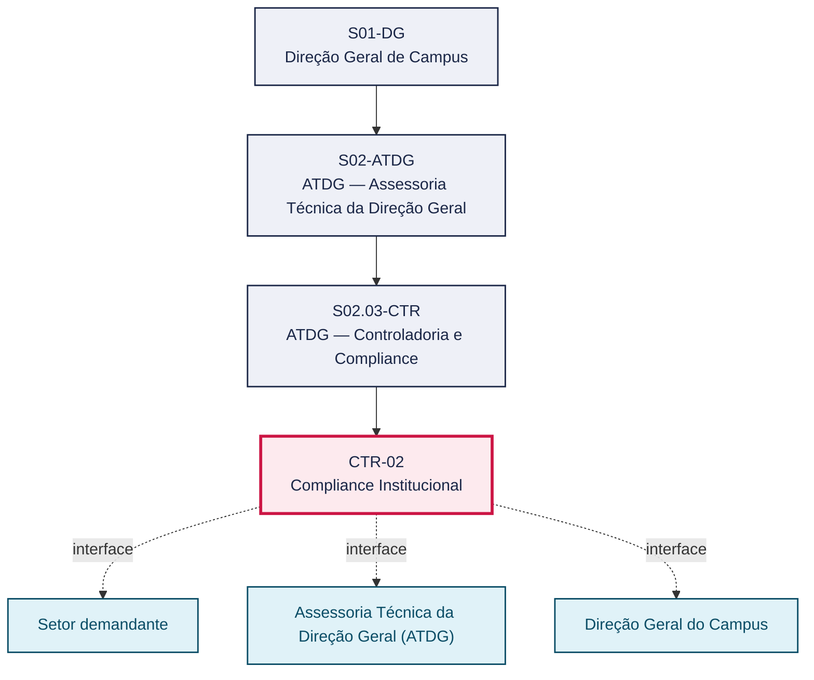
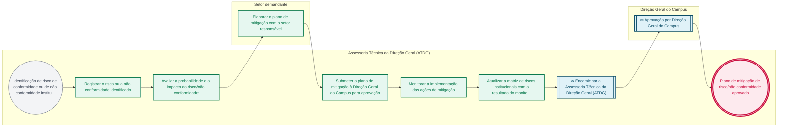

# POP CTR-02 — Compliance Institucional

> **Documento vivo** · ATDG — Assessoria Técnica da Direção Geral · UNIOESTE Campus Foz do Iguaçu · Formato DDD híbrido + BPMN 2.0 padrão Anne Bail · Versão **0.2.1** · Status **rascunho** · Atualizado em 2026-09-03

## 0. Cabeçalho DDD

| Divisão | Departamento | Descrição |
|---|---|---|
| ATDG — Assessoria Técnica da Direção Geral | ATDG — Controladoria e Compliance | Compliance Institucional — Riscos, planos de mitigação, monitoramento. Processo codificado no manual institucional da ATDG (jun/2026); conteúdo operacional a documentar. |

| Domínio | Subdomínio | Tipo | Contexto delimitado |
|---|---|---|---|
| Controladoria, Compliance e Riscos | Compliance Institucional | core | S02.03-CTR |

### 0.3 Linguagem ubíqua (glossário do processo)

| Termo | Definição | Sistema |
|---|---|---|
| Matriz de riscos | Instrumento que registra, classifica por probabilidade e impacto, e acompanha os riscos de conformidade institucional. | OneDrive ATDG |
| Compliance institucional | Conjunto de práticas voltadas à conformidade da instituição com normas legais e institucionais. | — |

## 1. Identificação

| Campo | Valor |
|---|---|
| Código | CTR-02 |
| Setor | ATDG — Assessoria Técnica da Direção Geral (`S02.03-CTR`) |
| Responsável (função) | A definir |
| Periodicidade | Contínuo/sob demanda |
| Subordinação | ATDG — Assessoria Técnica da Direção Geral |
| Normativa | A definir |
| Produto ATDG | POP |
| Pasta OneDrive | 02_CONTROLADORIA |
| Fontes (entradas do Canvas) | — |
| Lacunas abertas | responsavel, kpi, formulario, prazo, normativa |
| Agente responsável | pop-ctr-02 |

## 2. Organograma

## 3. Playbook

### 3.1 Gatilho (evento de domínio)

**Identificação de risco de conformidade ou de não conformidade institucional pela ATDG, por setor ou por órgão de controle** — origem: Assessoria Técnica da Direção Geral (ATDG)

### 3.2 Entrada

- Risco ou não conformidade identificado
- Matriz de riscos institucionais vigente

### 3.3 Passo a passo

| Nº | Ação | Responsável | Sistema | Artefato | Prazo | Evento |
|---|---|---|---|---|---|---|
| 1 | Registrar o risco ou a não conformidade identificado | Assessoria Técnica da Direção Geral (ATDG) | OneDrive ATDG | Matriz de riscos | A definir | Risco registrado |
| 2 | Avaliar a probabilidade e o impacto do risco/não conformidade | Assessoria Técnica da Direção Geral (ATDG) | OneDrive ATDG | Matriz de riscos | A definir | Risco avaliado |
| 3 | Elaborar o plano de mitigação com o setor responsável | Setor demandante | e-Protocolo | Plano de mitigação | A definir | Plano elaborado |
| 4 | Submeter o plano de mitigação à Direção Geral do Campus para aprovação | Assessoria Técnica da Direção Geral (ATDG) | e-Protocolo | Plano de mitigação | A definir | Plano submetido |
| 5 | Monitorar a implementação das ações de mitigação | Assessoria Técnica da Direção Geral (ATDG) | OneDrive ATDG | Registro de monitoramento | A definir | Implementação monitorada |
| 6 | Atualizar a matriz de riscos institucionais com o resultado do monitoramento | Assessoria Técnica da Direção Geral (ATDG) | OneDrive ATDG | Matriz de riscos | A definir | Matriz atualizada |

### 3.4 Saída (entregáveis)

- Plano de mitigação de risco/não conformidade aprovado
- Matriz de riscos institucionais atualizada

## 4. Formulários e artefatos (agregados)

| Nome | Tipo | Sistema | Campos-chave | Preenchimento |
|---|---|---|---|---|
| Matriz de riscos institucionais | registro | OneDrive ATDG | risco, probabilidade, impacto, criticidade, status | Assessoria Técnica da Direção Geral (ATDG) |
| Plano de mitigação de risco | documento | e-Protocolo | risco, ações de mitigação, responsável, prazo | Setor demandante |

## 5. Decisões, exceções e pontos de atenção

| Decisão | Condição | Sim → | Não → |
|---|---|---|---|
| O plano de mitigação foi implementado dentro do prazo definido? | Monitoramento da implementação das ações de mitigação | Atualizar a matriz de riscos como risco mitigado/monitorado | Notificar o setor responsável e reavaliar o plano de mitigação |

**Pontos de atenção**

- Priorizar riscos de maior probabilidade e impacto na alocação de esforços de mitigação
- Compliance institucional deve dialogar com os achados de auditorias do TCE-PR (CTR-01) e da fiscalização externa (CTR-04)

## 6. Contingência

- Setor responsável não implementa o plano de mitigação no prazo: escalar à Direção Geral do Campus
- Risco se concretiza antes da conclusão da mitigação: acionar plano de contingência específico e comunicar a Direção Geral
- Matriz de riscos desatualizada em relação à estrutura do Campus: revisar em conjunto com o mapeamento de processos (MAP)

## 7. Checklist

- ( ) Risco ou não conformidade registrado na matriz de riscos
- ( ) Probabilidade e impacto do risco avaliados
- ( ) Plano de mitigação elaborado com o setor responsável
- ( ) Plano de mitigação aprovado pela Direção Geral
- ( ) Implementação monitorada e matriz de riscos atualizada

## 8. KPI / Indicadores

| Indicador | Fórmula | Meta | Fonte |
|---|---|---|---|
| Percentual de riscos com plano de mitigação implementado no prazo | (Riscos mitigados no prazo / total de riscos com plano aprovado) × 100 | A definir | OneDrive ATDG |
| Número de riscos de alta criticidade em aberto na matriz de riscos | Contagem de riscos com criticidade alta e status em aberto | A definir | OneDrive ATDG |

## 9. Mapa de contexto (interfaces inter-setoriais)

| Origem | Relação | Destino | Artefato | Canal |
|---|---|---|---|---|
| Setor demandante | fornece | Assessoria Técnica da Direção Geral (ATDG) | Informações sobre o risco/não conformidade identificado | e-Protocolo |
| Assessoria Técnica da Direção Geral (ATDG) | aprova | Direção Geral do Campus | Plano de mitigação de risco | e-Protocolo |

## 10. Fluxograma (BPMN 2.0 — padrão Anne Bail)

## 11. Especificação BPMN para o Miro

**Raias:** Assessoria Técnica da Direção Geral (ATDG) · Setor demandante · Direção Geral do Campus

| Id | Tipo | Elemento | Raia |
|---|---|---|---|
| e1 | inicio | Identificação de risco de conformidade ou de não conformidade institucional pela ATDG, por setor ou por órgão de controle | Assessoria Técnica da Direção Geral (ATDG) |
| e2 | atividade | Registrar o risco ou a não conformidade identificado | Assessoria Técnica da Direção Geral (ATDG) |
| e3 | atividade | Avaliar a probabilidade e o impacto do risco/não conformidade | Assessoria Técnica da Direção Geral (ATDG) |
| e4 | atividade | Elaborar o plano de mitigação com o setor responsável | Setor demandante |
| e5 | atividade | Submeter o plano de mitigação à Direção Geral do Campus para aprovação | Assessoria Técnica da Direção Geral (ATDG) |
| e6 | atividade | Monitorar a implementação das ações de mitigação | Assessoria Técnica da Direção Geral (ATDG) |
| e7 | atividade | Atualizar a matriz de riscos institucionais com o resultado do monitoramento | Assessoria Técnica da Direção Geral (ATDG) |
| e8 | captura | Encaminhar a Assessoria Técnica da Direção Geral (ATDG) | Assessoria Técnica da Direção Geral (ATDG) |
| e9 | captura | Aprovação por Direção Geral do Campus | Direção Geral do Campus |
| e10 | fim | Plano de mitigação de risco/não conformidade aprovado | Assessoria Técnica da Direção Geral (ATDG) |

| De | Para | Rótulo |
|---|---|---|
| e1 | e2 | — |
| e2 | e3 | — |
| e3 | e4 | — |
| e4 | e5 | — |
| e5 | e6 | — |
| e6 | e7 | — |
| e7 | e8 | — |
| e8 | e9 | — |
| e9 | e10 | — |

_Especificação gerada a partir dos passos do POP; 3 raia(s). Revisar decisões e pausas antes de construir no Miro._

## 12. Histórico de versões

| Versão | Data | Autor | Tipo | Mudanças | Fontes |
|---|---|---|---|---|---|
| 0.1.0 | 2026-09-02 | scripts/scaffold_pops.py | patch | Esqueleto inicial gerado deterministicamente a partir do escopo "Riscos, planos de mitigação, monitoramento" | — |
| 0.2.0 | 2026-09-03 | agente:construtor-pop (lote B) | minor | Passo adicionado após 0: Registrar o risco ou a não conformidade identificado; Passo adicionado após 1: Avaliar a probabilidade e o impacto do risco/não conformidade; Passo adicionado após 2: Elaborar o plano de mitigação com o setor responsável; Passo adicionado após 3: Submeter o plano de mitigação à Direção Geral do Campus para aprovação; Passo adicionado após 4: Monitorar a implementação das ações de mitigação; Passo adicionado após 5: Atualizar a matriz de riscos institucionais com o resultado do monitoramento; entrada_nova: +2; saida_nova: +2; artefatos_novos: +2; decisoes_novas: +1; kpis_novos: +2; mapa_contexto_novo: +2; pontos_atencao_novos: +2; contingencia_nova: +3; checklist_novo: +5; glossario_novo: +2; Campo identificacao.periodicidade atualizado; Campo playbook.gatilho atualizado; Campo observacoes atualizado; Fluxograma regenerado a partir dos passos | — |
| 0.2.1 | 2026-09-03 | agente:curador-diretrizes | patch | Fluxograma regenerado a partir dos passos | — |

## 13. Validação e aprovação

| Papel | Função / unidade | Data |
|---|---|---|
| Elaboração | ATDG — Assessoria Técnica da Direção Geral | 2026-09-02 |
| Revisão | A definir (responsável do setor) | ___/___/______ |
| Aprovação | Direção Geral do Campus | ___/___/______ |

## 14. Lições incorporadas

- **L-001** — Referir sempre função/cargo; nomes apenas no bloco 13 (Validação), com anuência (LGPD).
- **L-004** — Nunca regenerar POP existente: aplicar patch com changelog, fontes e versão.
- **L-006** — Preservar códigos legados como códigos de processo; não renumerar.
- **L-007** — Referência Externa é benchmark; normativa do POP só cita atos da Unioeste, do Estado do Paraná ou federais aplicáveis.
- **L-002** — Um passo = uma ação; ações compostas viram passos distintos.
- **L-003** — Cada linha do mapa de contexto gera um elemento `captura` no BPMN e um passo na raia de destino.

> **Observações:** Inferência a validar com a ATDG: playbook construído a partir do escopo do manual institucional da ATDG (jun/2026) e da prática administrativa geral de controladoria, compliance e gestão de riscos em universidades estaduais do Paraná, sem entradas do Canvas Vivo para este processo; validar papéis, sistemas, prazos, normativa específica e fluxo de aprovação junto à ATDG.

---
_Canvas Vivo — Base de Conhecimento Institucional · ATDG · UNIOESTE Campus Foz do Iguaçu · gerado por `scripts/render_pop.py` a partir de `pops/CTR/CTR-02.pop.json` (diretrizes v1.12)._
