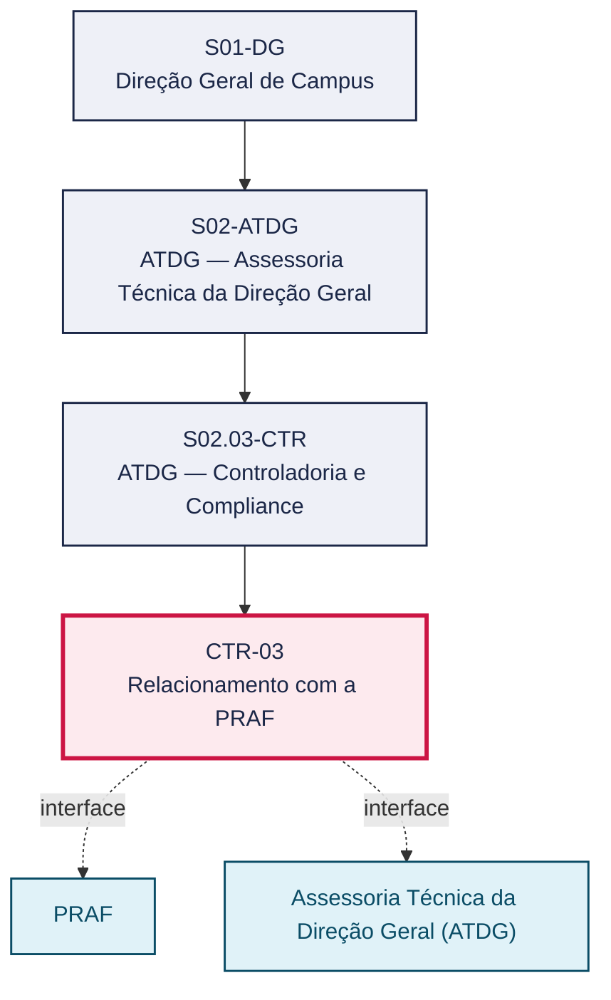
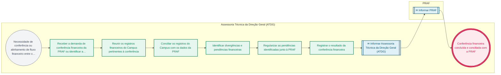

# POP CTR-03 — Relacionamento com a PRAF

> **Documento vivo** · ATDG — Assessoria Técnica da Direção Geral · UNIOESTE Campus Foz do Iguaçu · Formato DDD híbrido + BPMN 2.0 padrão Anne Bail · Versão **0.2.1** · Status **rascunho** · Atualizado em 2026-09-03

## 0. Cabeçalho DDD

| Divisão | Departamento | Descrição |
|---|---|---|
| ATDG — Assessoria Técnica da Direção Geral | ATDG — Controladoria e Compliance | Relacionamento com a PRAF — Fluxos financeiros, conferências. Processo codificado no manual institucional da ATDG (jun/2026); conteúdo operacional a documentar. |

| Domínio | Subdomínio | Tipo | Contexto delimitado |
|---|---|---|---|
| Controladoria, Compliance e Riscos | Relacionamento com a PRAF | core | S02.03-CTR |

### 0.3 Linguagem ubíqua (glossário do processo)

| Termo | Definição | Sistema |
|---|---|---|
| PRAF | Pró-Reitoria de Administração e Finanças da Unioeste, responsável pela gestão financeira e orçamentária da universidade. | — |

## 1. Identificação

| Campo | Valor |
|---|---|
| Código | CTR-03 |
| Setor | ATDG — Assessoria Técnica da Direção Geral (`S02.03-CTR`) |
| Responsável (função) | A definir |
| Periodicidade | Periódica — A definir (conforme calendário de conferências financeiras) |
| Subordinação | ATDG — Assessoria Técnica da Direção Geral |
| Normativa | A definir |
| Produto ATDG | POP |
| Pasta OneDrive | 02_CONTROLADORIA |
| Fontes (entradas do Canvas) | — |
| Lacunas abertas | responsavel, kpi, formulario, prazo, normativa |
| Agente responsável | pop-ctr-03 |

## 2. Organograma

## 3. Playbook

### 3.1 Gatilho (evento de domínio)

**Necessidade de conferência ou alinhamento de fluxo financeiro entre o Campus e a Pró-Reitoria de Administração e Finanças (PRAF)** — origem: PRAF

### 3.2 Entrada

- Demanda de conferência financeira da PRAF ou do Campus
- Registros financeiros do Campus (empenhos, repasses, prestações)

### 3.3 Passo a passo

| Nº | Ação | Responsável | Sistema | Artefato | Prazo | Evento |
|---|---|---|---|---|---|---|
| 1 | Receber a demanda de conferência financeira da PRAF ou identificar a necessidade de conferência pelo Campus | Assessoria Técnica da Direção Geral (ATDG) | e-Protocolo | Demanda de conferência financeira | A definir | Demanda registrada |
| 2 | Reunir os registros financeiros do Campus pertinentes à conferência | Assessoria Técnica da Direção Geral (ATDG) | A definir | Registros financeiros | A definir | Registros reunidos |
| 3 | Conciliar os registros do Campus com os dados da PRAF | Assessoria Técnica da Direção Geral (ATDG) | A definir | Planilha de conciliação | A definir | Registros conciliados |
| 4 | Identificar divergências e pendências financeiras | Assessoria Técnica da Direção Geral (ATDG) | A definir | Relatório de divergências | A definir | Divergências identificadas |
| 5 | Regularizar as pendências identificadas junto à PRAF | Assessoria Técnica da Direção Geral (ATDG) | e-Protocolo | Ofício de regularização | A definir | Pendências regularizadas |
| 6 | Registrar o resultado da conferência financeira | Assessoria Técnica da Direção Geral (ATDG) | OneDrive ATDG | Registro de conferências financeiras | A definir | Resultado registrado |

### 3.4 Saída (entregáveis)

- Conferência financeira concluída e conciliada com a PRAF
- Pendências financeiras identificadas e regularizadas

## 4. Formulários e artefatos (agregados)

| Nome | Tipo | Sistema | Campos-chave | Preenchimento |
|---|---|---|---|---|
| Planilha de conciliação financeira | registro | A definir | item financeiro, valor Campus, valor PRAF, divergência | Assessoria Técnica da Direção Geral (ATDG) |
| Registro de conferências financeiras com a PRAF | registro | OneDrive ATDG | período, resultado, pendências regularizadas | Assessoria Técnica da Direção Geral (ATDG) |

## 5. Decisões, exceções e pontos de atenção

| Decisão | Condição | Sim → | Não → |
|---|---|---|---|
| Os registros financeiros do Campus estão conciliados com os dados da PRAF, sem divergências? | Conciliação dos registros financeiros do Campus com a PRAF | Registrar o resultado da conferência financeira | Identificar as divergências e regularizar as pendências junto à PRAF |

**Pontos de atenção**

- Divergências financeiras não regularizadas podem impactar prestações de contas de convênios (CON-04) e auditorias do TCE-PR (CTR-01)
- Confirmar o sistema financeiro utilizado pela PRAF para conciliação de dados

## 6. Contingência

- Divergência financeira não esclarecida pela PRAF no prazo: escalar à Direção Geral do Campus
- Registro financeiro do Campus incompleto para a conferência: reconstituir a partir do e-Protocolo e dos sistemas disponíveis
- Prazo da PRAF para resposta a pendência expira sem retorno: reiterar formalmente por ofício

## 7. Checklist

- ( ) Demanda de conferência financeira registrada
- ( ) Registros financeiros do Campus reunidos
- ( ) Conciliação com os dados da PRAF realizada
- ( ) Divergências identificadas e pendências regularizadas
- ( ) Resultado da conferência registrado

## 8. KPI / Indicadores

| Indicador | Fórmula | Meta | Fonte |
|---|---|---|---|
| Percentual de conferências financeiras concluídas sem divergência pendente | (Conferências sem pendência / total de conferências realizadas) × 100 | A definir | OneDrive ATDG |
| Tempo médio de regularização de pendências financeiras junto à PRAF | Média (data de regularização − data de identificação da divergência) | A definir | e-Protocolo |

## 9. Mapa de contexto (interfaces inter-setoriais)

| Origem | Relação | Destino | Artefato | Canal |
|---|---|---|---|---|
| PRAF | informa | Assessoria Técnica da Direção Geral (ATDG) | Demanda ou dados de conferência financeira | A definir |
| Assessoria Técnica da Direção Geral (ATDG) | informa | PRAF | Resultado da conciliação e regularização de pendências | e-Protocolo |

## 10. Fluxograma (BPMN 2.0 — padrão Anne Bail)

## 11. Especificação BPMN para o Miro

**Raias:** Assessoria Técnica da Direção Geral (ATDG) · PRAF

| Id | Tipo | Elemento | Raia |
|---|---|---|---|
| e1 | inicio | Necessidade de conferência ou alinhamento de fluxo financeiro entre o Campus e a Pró-Reitoria de Administração e Finanças (PRAF) | Assessoria Técnica da Direção Geral (ATDG) |
| e2 | atividade | Receber a demanda de conferência financeira da PRAF ou identificar a necessidade de conferência pelo Campus | Assessoria Técnica da Direção Geral (ATDG) |
| e3 | atividade | Reunir os registros financeiros do Campus pertinentes à conferência | Assessoria Técnica da Direção Geral (ATDG) |
| e4 | atividade | Conciliar os registros do Campus com os dados da PRAF | Assessoria Técnica da Direção Geral (ATDG) |
| e5 | atividade | Identificar divergências e pendências financeiras | Assessoria Técnica da Direção Geral (ATDG) |
| e6 | atividade | Regularizar as pendências identificadas junto à PRAF | Assessoria Técnica da Direção Geral (ATDG) |
| e7 | atividade | Registrar o resultado da conferência financeira | Assessoria Técnica da Direção Geral (ATDG) |
| e8 | captura | Informar Assessoria Técnica da Direção Geral (ATDG) | Assessoria Técnica da Direção Geral (ATDG) |
| e9 | captura | Informar PRAF | PRAF |
| e10 | fim | Conferência financeira concluída e conciliada com a PRAF | Assessoria Técnica da Direção Geral (ATDG) |

| De | Para | Rótulo |
|---|---|---|
| e1 | e2 | — |
| e2 | e3 | — |
| e3 | e4 | — |
| e4 | e5 | — |
| e5 | e6 | — |
| e6 | e7 | — |
| e7 | e8 | — |
| e8 | e9 | — |
| e9 | e10 | — |

_Especificação gerada a partir dos passos do POP; 2 raia(s). Revisar decisões e pausas antes de construir no Miro._

## 12. Histórico de versões

| Versão | Data | Autor | Tipo | Mudanças | Fontes |
|---|---|---|---|---|---|
| 0.1.0 | 2026-09-02 | scripts/scaffold_pops.py | patch | Esqueleto inicial gerado deterministicamente a partir do escopo "Fluxos financeiros, conferências" | — |
| 0.2.0 | 2026-09-03 | agente:construtor-pop (lote B) | minor | Passo adicionado após 0: Receber a demanda de conferência financeira da PRAF ou identificar a necessidade; Passo adicionado após 1: Reunir os registros financeiros do Campus pertinentes à conferência; Passo adicionado após 2: Conciliar os registros do Campus com os dados da PRAF; Passo adicionado após 3: Identificar divergências e pendências financeiras; Passo adicionado após 4: Regularizar as pendências identificadas junto à PRAF; Passo adicionado após 5: Registrar o resultado da conferência financeira; entrada_nova: +2; saida_nova: +2; artefatos_novos: +2; decisoes_novas: +1; kpis_novos: +2; mapa_contexto_novo: +2; pontos_atencao_novos: +2; contingencia_nova: +3; checklist_novo: +5; glossario_novo: +1; Campo identificacao.periodicidade atualizado; Campo playbook.gatilho atualizado; Campo observacoes atualizado; Fluxograma regenerado a partir dos passos | — |
| 0.2.1 | 2026-09-03 | agente:curador-diretrizes | patch | Fluxograma regenerado a partir dos passos | — |

## 13. Validação e aprovação

| Papel | Função / unidade | Data |
|---|---|---|
| Elaboração | ATDG — Assessoria Técnica da Direção Geral | 2026-09-02 |
| Revisão | A definir (responsável do setor) | ___/___/______ |
| Aprovação | Direção Geral do Campus | ___/___/______ |

## 14. Lições incorporadas

- **L-001** — Referir sempre função/cargo; nomes apenas no bloco 13 (Validação), com anuência (LGPD).
- **L-004** — Nunca regenerar POP existente: aplicar patch com changelog, fontes e versão.
- **L-006** — Preservar códigos legados como códigos de processo; não renumerar.
- **L-007** — Referência Externa é benchmark; normativa do POP só cita atos da Unioeste, do Estado do Paraná ou federais aplicáveis.
- **L-002** — Um passo = uma ação; ações compostas viram passos distintos.
- **L-003** — Cada linha do mapa de contexto gera um elemento `captura` no BPMN e um passo na raia de destino.

> **Observações:** Inferência a validar com a ATDG: playbook construído a partir do escopo do manual institucional da ATDG (jun/2026) e da prática administrativa geral de controladoria, compliance e gestão de riscos em universidades estaduais do Paraná, sem entradas do Canvas Vivo para este processo; validar papéis, sistemas, prazos, normativa específica e fluxo de aprovação junto à ATDG.

---
_Canvas Vivo — Base de Conhecimento Institucional · ATDG · UNIOESTE Campus Foz do Iguaçu · gerado por `scripts/render_pop.py` a partir de `pops/CTR/CTR-03.pop.json` (diretrizes v1.12)._
