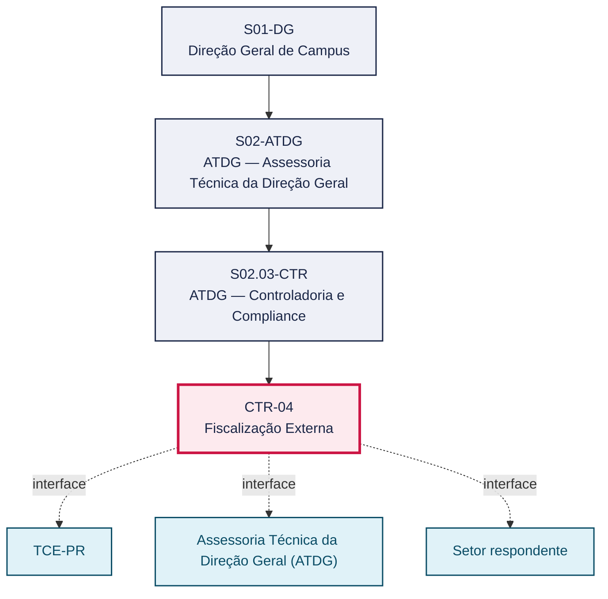
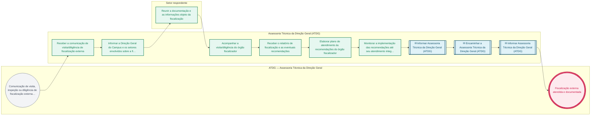

# POP CTR-04 — Fiscalização Externa

> **Documento vivo** · ATDG — Assessoria Técnica da Direção Geral · UNIOESTE Campus Foz do Iguaçu · Formato DDD híbrido + BPMN 2.0 padrão Anne Bail · Versão **0.2.0** · Status **rascunho** · Atualizado em 2026-09-03

## 0. Cabeçalho DDD

| Divisão | Departamento | Descrição |
|---|---|---|
| ATDG — Assessoria Técnica da Direção Geral | ATDG — Controladoria e Compliance | Fiscalização Externa — Visitas, diligências, relatórios. Processo codificado no manual institucional da ATDG (jun/2026); conteúdo operacional a documentar. |

| Domínio | Subdomínio | Tipo | Contexto delimitado |
|---|---|---|---|
| Controladoria, Compliance e Riscos | Fiscalização Externa | core | S02.03-CTR |

### 0.3 Linguagem ubíqua (glossário do processo)

Herda integralmente o glossário institucional (`diretrizes/09-glossario-institucional.md`); sem termos locais adicionais.

## 1. Identificação

| Campo | Valor |
|---|---|
| Código | CTR-04 |
| Setor | ATDG — Assessoria Técnica da Direção Geral (`S02.03-CTR`) |
| Responsável (função) | A definir |
| Periodicidade | Sob demanda |
| Subordinação | ATDG — Assessoria Técnica da Direção Geral |
| Normativa | A definir |
| Produto ATDG | POP |
| Pasta OneDrive | 02_CONTROLADORIA |
| Fontes (entradas do Canvas) | — |
| Lacunas abertas | responsavel, kpi, formulario, prazo, normativa |
| Agente responsável | — (não moldado) |

## 2. Organograma

## 3. Playbook

### 3.1 Gatilho (evento de domínio)

**Comunicação de visita, inspeção ou diligência de fiscalização externa (TCE-PR, SETI ou outro órgão) ao Campus** — origem: TCE-PR

### 3.2 Entrada

- Comunicação de visita/diligência de fiscalização externa
- Documentação e informações objeto da fiscalização

### 3.3 Passo a passo

| Nº | Ação | Responsável | Sistema | Artefato | Prazo | Evento |
|---|---|---|---|---|---|---|
| 1 | Receber a comunicação de visita/diligência de fiscalização externa | Assessoria Técnica da Direção Geral (ATDG) | e-Protocolo | Comunicação de fiscalização | A definir | Comunicação registrada |
| 2 | Informar a Direção Geral do Campus e os setores envolvidos sobre a fiscalização | Assessoria Técnica da Direção Geral (ATDG) | e-Protocolo | Comunicação interna | A definir | Setores informados |
| 3 | Reunir a documentação e as informações objeto da fiscalização | Setor respondente | e-Protocolo | Documentação solicitada | A definir | Documentação reunida |
| 4 | Acompanhar a visita/diligência do órgão fiscalizador | Assessoria Técnica da Direção Geral (ATDG) | A definir | Ata/registro de acompanhamento | A definir | Visita acompanhada |
| 5 | Receber o relatório de fiscalização e as eventuais recomendações | Assessoria Técnica da Direção Geral (ATDG) | e-Protocolo | Relatório de fiscalização | A definir | Relatório recebido |
| 6 | Elaborar plano de atendimento às recomendações do órgão fiscalizador | Assessoria Técnica da Direção Geral (ATDG) | e-Protocolo | Plano de atendimento às recomendações | A definir | Plano elaborado |
| 7 | Monitorar a implementação das recomendações até seu atendimento integral | Assessoria Técnica da Direção Geral (ATDG) | OneDrive ATDG | Registro de monitoramento de recomendações | A definir | Recomendações monitoradas |

### 3.4 Saída (entregáveis)

- Fiscalização externa atendida e documentada
- Relatório de fiscalização e eventuais recomendações registrados

## 4. Formulários e artefatos (agregados)

| Nome | Tipo | Sistema | Campos-chave | Preenchimento |
|---|---|---|---|---|
| Plano de atendimento às recomendações de fiscalização | documento | e-Protocolo | recomendação, ação de atendimento, responsável, prazo | Assessoria Técnica da Direção Geral (ATDG) |
| Registro de fiscalizações externas | registro | OneDrive ATDG | órgão fiscalizador, data, objeto, situação das recomendações | Assessoria Técnica da Direção Geral (ATDG) |

## 5. Decisões, exceções e pontos de atenção

| Decisão | Condição | Sim → | Não → |
|---|---|---|---|
| O relatório de fiscalização aponta recomendações a serem atendidas pelo Campus? | Recebimento do relatório de fiscalização externa | Elaborar e monitorar o plano de atendimento às recomendações | Arquivar o relatório e encerrar o acompanhamento da fiscalização |

**Pontos de atenção**

- Fiscalizações externas podem gerar recomendações com prazo de atendimento e possível reincidência em auditorias futuras (CTR-01)
- Manter interlocução única (ATDG) com o órgão fiscalizador para evitar respostas divergentes entre setores

## 6. Contingência

- Setor não reúne a documentação solicitada a tempo da visita: comunicar o atraso ao órgão fiscalizador e à Direção Geral
- Recomendação do relatório de fiscalização não atendida no prazo: justificar formalmente ao órgão fiscalizador e reavaliar o plano
- Divergência entre a versão do Campus e o relatório do órgão fiscalizador: registrar manifestação formal de contestação

## 7. Checklist

- ( ) Comunicação de fiscalização registrada e setores informados
- ( ) Documentação objeto da fiscalização reunida
- ( ) Visita/diligência acompanhada e registrada
- ( ) Relatório de fiscalização e recomendações recebidos
- ( ) Plano de atendimento às recomendações elaborado e monitorado

## 8. KPI / Indicadores

| Indicador | Fórmula | Meta | Fonte |
|---|---|---|---|
| Percentual de recomendações de fiscalização externa atendidas no prazo | (Recomendações atendidas no prazo / total de recomendações recebidas) × 100 | A definir | OneDrive ATDG |
| Tempo médio de resposta às recomendações de fiscalização externa | Média (data de atendimento − data de recebimento do relatório) | A definir | e-Protocolo |

## 9. Mapa de contexto (interfaces inter-setoriais)

| Origem | Relação | Destino | Artefato | Canal |
|---|---|---|---|---|
| TCE-PR | informa | Assessoria Técnica da Direção Geral (ATDG) | Comunicação de visita/diligência de fiscalização | e-Protocolo |
| Setor respondente | fornece | Assessoria Técnica da Direção Geral (ATDG) | Documentação objeto da fiscalização | e-Protocolo |
| TCE-PR | informa | Assessoria Técnica da Direção Geral (ATDG) | Relatório de fiscalização e recomendações | e-Protocolo |

## 10. Fluxograma (BPMN 2.0 — padrão Anne Bail)

## 11. Especificação BPMN para o Miro

**Raias:** ATDG — Assessoria Técnica da Direção Geral · Assessoria Técnica da Direção Geral (ATDG) · Setor respondente

| Id | Tipo | Elemento | Raia |
|---|---|---|---|
| e1 | inicio | Comunicação de visita, inspeção ou diligência de fiscalização externa (TCE-PR, SETI ou outro órgão) ao Campus | ATDG — Assessoria Técnica da Direção Geral |
| e2 | atividade | Receber a comunicação de visita/diligência de fiscalização externa | Assessoria Técnica da Direção Geral (ATDG) |
| e3 | atividade | Informar a Direção Geral do Campus e os setores envolvidos sobre a fiscalização | Assessoria Técnica da Direção Geral (ATDG) |
| e4 | atividade | Reunir a documentação e as informações objeto da fiscalização | Setor respondente |
| e5 | atividade | Acompanhar a visita/diligência do órgão fiscalizador | Assessoria Técnica da Direção Geral (ATDG) |
| e6 | atividade | Receber o relatório de fiscalização e as eventuais recomendações | Assessoria Técnica da Direção Geral (ATDG) |
| e7 | atividade | Elaborar plano de atendimento às recomendações do órgão fiscalizador | Assessoria Técnica da Direção Geral (ATDG) |
| e8 | atividade | Monitorar a implementação das recomendações até seu atendimento integral | Assessoria Técnica da Direção Geral (ATDG) |
| e9 | captura | Informar Assessoria Técnica da Direção Geral (ATDG) | Assessoria Técnica da Direção Geral (ATDG) |
| e10 | captura | Encaminhar a Assessoria Técnica da Direção Geral (ATDG) | Assessoria Técnica da Direção Geral (ATDG) |
| e11 | captura | Informar Assessoria Técnica da Direção Geral (ATDG) | Assessoria Técnica da Direção Geral (ATDG) |
| e12 | fim | Fiscalização externa atendida e documentada | ATDG — Assessoria Técnica da Direção Geral |

| De | Para | Rótulo |
|---|---|---|
| e1 | e2 | — |
| e2 | e3 | — |
| e3 | e4 | — |
| e4 | e5 | — |
| e5 | e6 | — |
| e6 | e7 | — |
| e7 | e8 | — |
| e8 | e9 | — |
| e9 | e10 | — |
| e10 | e11 | — |
| e11 | e12 | — |

_Especificação gerada a partir dos passos do POP; 3 raia(s). Revisar decisões e pausas antes de construir no Miro._

## 12. Histórico de versões

| Versão | Data | Autor | Tipo | Mudanças | Fontes |
|---|---|---|---|---|---|
| 0.1.0 | 2026-09-02 | scripts/scaffold_pops.py | patch | Esqueleto inicial gerado deterministicamente a partir do escopo "Visitas, diligências, relatórios" | — |
| 0.2.0 | 2026-09-03 | agente:construtor-pop (lote B) | minor | Passo adicionado após 0: Receber a comunicação de visita/diligência de fiscalização externa; Passo adicionado após 1: Informar a Direção Geral do Campus e os setores envolvidos sobre a fiscalização; Passo adicionado após 2: Reunir a documentação e as informações objeto da fiscalização; Passo adicionado após 3: Acompanhar a visita/diligência do órgão fiscalizador; Passo adicionado após 4: Receber o relatório de fiscalização e as eventuais recomendações; Passo adicionado após 5: Elaborar plano de atendimento às recomendações do órgão fiscalizador; Passo adicionado após 6: Monitorar a implementação das recomendações até seu atendimento integral; entrada_nova: +2; saida_nova: +2; artefatos_novos: +2; decisoes_novas: +1; kpis_novos: +2; mapa_contexto_novo: +3; pontos_atencao_novos: +2; contingencia_nova: +3; checklist_novo: +5; Campo identificacao.periodicidade atualizado; Campo playbook.gatilho atualizado; Campo observacoes atualizado; Fluxograma regenerado a partir dos passos | — |

## 13. Validação e aprovação

| Papel | Função / unidade | Data |
|---|---|---|
| Elaboração | ATDG — Assessoria Técnica da Direção Geral | 2026-09-02 |
| Revisão | A definir (responsável do setor) | ___/___/______ |
| Aprovação | Direção Geral do Campus | ___/___/______ |

## 14. Lições incorporadas

- **L-001** — Referir sempre função/cargo; nomes apenas no bloco 13 (Validação), com anuência (LGPD).
- **L-004** — Nunca regenerar POP existente: aplicar patch com changelog, fontes e versão.
- **L-006** — Preservar códigos legados como códigos de processo; não renumerar.
- **L-007** — Referência Externa é benchmark; normativa do POP só cita atos da Unioeste, do Estado do Paraná ou federais aplicáveis.
- **L-002** — Um passo = uma ação; ações compostas viram passos distintos.
- **L-003** — Cada linha do mapa de contexto gera um elemento `captura` no BPMN e um passo na raia de destino.

> **Observações:** Inferência a validar com a ATDG: playbook construído a partir do escopo do manual institucional da ATDG (jun/2026) e da prática administrativa geral de controladoria, compliance e gestão de riscos em universidades estaduais do Paraná, sem entradas do Canvas Vivo para este processo; validar papéis, sistemas, prazos, normativa específica e fluxo de aprovação junto à ATDG.

---
_Canvas Vivo — Base de Conhecimento Institucional · ATDG · UNIOESTE Campus Foz do Iguaçu · gerado por `scripts/render_pop.py` a partir de `pops/CTR/CTR-04.pop.json` (diretrizes v1.8)._
