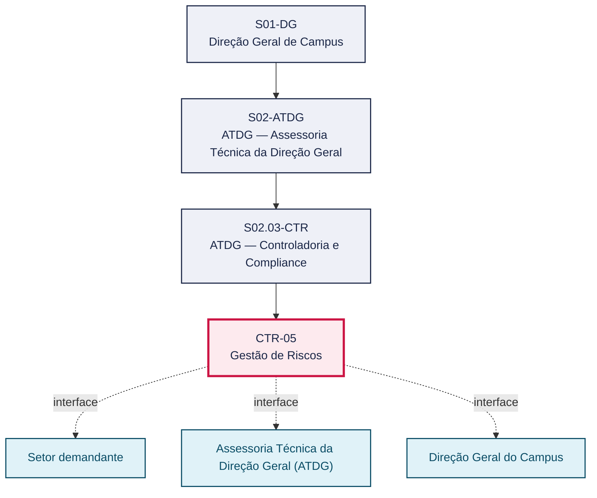
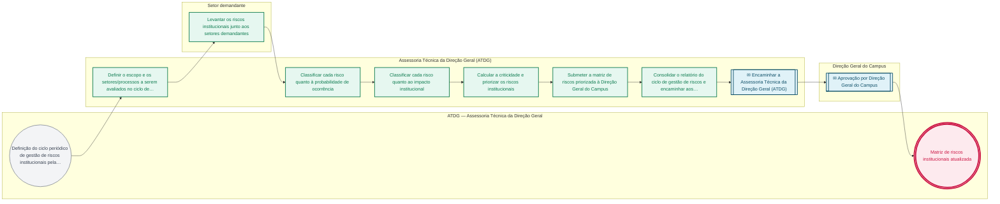

# POP CTR-05 — Gestão de Riscos

> **Documento vivo** · ATDG — Assessoria Técnica da Direção Geral · UNIOESTE Campus Foz do Iguaçu · Formato DDD híbrido + BPMN 2.0 padrão Anne Bail · Versão **0.2.0** · Status **rascunho** · Atualizado em 2026-09-03

## 0. Cabeçalho DDD

| Divisão | Departamento | Descrição |
|---|---|---|
| ATDG — Assessoria Técnica da Direção Geral | ATDG — Controladoria e Compliance | Gestão de Riscos — Mapeamento, probabilidade, impacto. Processo codificado no manual institucional da ATDG (jun/2026); conteúdo operacional a documentar. |

| Domínio | Subdomínio | Tipo | Contexto delimitado |
|---|---|---|---|
| Controladoria, Compliance e Riscos | Gestão de Riscos | core | S02.03-CTR |

### 0.3 Linguagem ubíqua (glossário do processo)

| Termo | Definição | Sistema |
|---|---|---|
| Criticidade | Medida que combina probabilidade e impacto para priorizar riscos institucionais na matriz de riscos. | OneDrive ATDG |

## 1. Identificação

| Campo | Valor |
|---|---|
| Código | CTR-05 |
| Setor | ATDG — Assessoria Técnica da Direção Geral (`S02.03-CTR`) |
| Responsável (função) | A definir |
| Periodicidade | Periódica — A definir (ciclo anual proposto) |
| Subordinação | ATDG — Assessoria Técnica da Direção Geral |
| Normativa | A definir |
| Produto ATDG | POP |
| Pasta OneDrive | 02_CONTROLADORIA |
| Fontes (entradas do Canvas) | — |
| Lacunas abertas | responsavel, kpi, formulario, prazo, normativa |
| Agente responsável | — (não moldado) |

## 2. Organograma

## 3. Playbook

### 3.1 Gatilho (evento de domínio)

**Definição do ciclo periódico de gestão de riscos institucionais pela Direção Geral/ATDG** — origem: Direção Geral do Campus

### 3.2 Entrada

- Estrutura de setores e processos do Campus (mapeamento de processos — MAP)
- Histórico de riscos e não conformidades anteriores

### 3.3 Passo a passo

| Nº | Ação | Responsável | Sistema | Artefato | Prazo | Evento |
|---|---|---|---|---|---|---|
| 1 | Definir o escopo e os setores/processos a serem avaliados no ciclo de gestão de riscos | Assessoria Técnica da Direção Geral (ATDG) | OneDrive ATDG | Escopo do ciclo de gestão de riscos | A definir | Escopo definido |
| 2 | Levantar os riscos institucionais junto aos setores demandantes | Setor demandante | e-Protocolo | Relação de riscos identificados | A definir | Riscos levantados |
| 3 | Classificar cada risco quanto à probabilidade de ocorrência | Assessoria Técnica da Direção Geral (ATDG) | OneDrive ATDG | Matriz de riscos | A definir | Probabilidade classificada |
| 4 | Classificar cada risco quanto ao impacto institucional | Assessoria Técnica da Direção Geral (ATDG) | OneDrive ATDG | Matriz de riscos | A definir | Impacto classificado |
| 5 | Calcular a criticidade e priorizar os riscos institucionais | Assessoria Técnica da Direção Geral (ATDG) | OneDrive ATDG | Matriz de riscos priorizada | A definir | Riscos priorizados |
| 6 | Submeter a matriz de riscos priorizada à Direção Geral do Campus | Assessoria Técnica da Direção Geral (ATDG) | e-Protocolo | Matriz de riscos | A definir | Matriz submetida |
| 7 | Consolidar o relatório do ciclo de gestão de riscos e encaminhar aos setores para os planos de mitigação (CTR-02) | Assessoria Técnica da Direção Geral (ATDG) | OneDrive ATDG | Relatório de gestão de riscos | A definir | Relatório consolidado |

### 3.4 Saída (entregáveis)

- Matriz de riscos institucionais atualizada
- Relatório de gestão de riscos do ciclo

## 4. Formulários e artefatos (agregados)

| Nome | Tipo | Sistema | Campos-chave | Preenchimento |
|---|---|---|---|---|
| Matriz de riscos institucionais (ciclo de mapeamento) | registro | OneDrive ATDG | setor, risco, probabilidade, impacto, criticidade | Assessoria Técnica da Direção Geral (ATDG) |
| Relatório de gestão de riscos do ciclo | documento | OneDrive ATDG | ciclo, riscos priorizados, recomendações | Assessoria Técnica da Direção Geral (ATDG) |

## 5. Decisões, exceções e pontos de atenção

| Decisão | Condição | Sim → | Não → |
|---|---|---|---|
| A Direção Geral do Campus aprova a priorização de riscos da matriz? | Matriz de riscos priorizada submetida pela ATDG | Consolidar o relatório do ciclo e encaminhar aos setores para os planos de mitigação | Revisar os critérios de classificação e priorização com a ATDG |

**Pontos de atenção**

- Alinhar o ciclo de gestão de riscos com o cronograma do projeto de Mapeamento de Processos (MAP) para reaproveitar o levantamento de processos por setor
- Riscos de alta criticidade identificados neste mapeamento alimentam os planos de mitigação de CTR-02

## 6. Contingência

- Setor não levanta seus riscos dentro do prazo do ciclo: estimar com base no histórico e sinalizar como lacuna a validar
- Critério de classificação de probabilidade/impacto gerar resultados inconsistentes entre setores: padronizar a escala com apoio da Direção Geral
- Matriz de riscos desatualizada em relação à estrutura vigente do Campus: revisar junto ao mapeamento de processos (MAP-01)

## 7. Checklist

- ( ) Escopo do ciclo de gestão de riscos definido
- ( ) Riscos levantados junto aos setores demandantes
- ( ) Riscos classificados por probabilidade e impacto
- ( ) Matriz de riscos priorizada e aprovada pela Direção Geral
- ( ) Relatório do ciclo consolidado e encaminhado para os planos de mitigação

## 8. KPI / Indicadores

| Indicador | Fórmula | Meta | Fonte |
|---|---|---|---|
| Percentual de setores com riscos institucionais mapeados no ciclo | (Setores com riscos mapeados / total de setores do escopo) × 100 | A definir | OneDrive ATDG |
| Número de riscos de criticidade alta identificados por ciclo | Contagem de riscos com criticidade alta na matriz do ciclo | A definir | OneDrive ATDG |

## 9. Mapa de contexto (interfaces inter-setoriais)

| Origem | Relação | Destino | Artefato | Canal |
|---|---|---|---|---|
| Setor demandante | fornece | Assessoria Técnica da Direção Geral (ATDG) | Relação de riscos identificados pelo setor | e-Protocolo |
| Assessoria Técnica da Direção Geral (ATDG) | aprova | Direção Geral do Campus | Matriz de riscos priorizada | e-Protocolo |

## 10. Fluxograma (BPMN 2.0 — padrão Anne Bail)

## 11. Especificação BPMN para o Miro

**Raias:** ATDG — Assessoria Técnica da Direção Geral · Assessoria Técnica da Direção Geral (ATDG) · Setor demandante · Direção Geral do Campus

| Id | Tipo | Elemento | Raia |
|---|---|---|---|
| e1 | inicio | Definição do ciclo periódico de gestão de riscos institucionais pela Direção Geral/ATDG | ATDG — Assessoria Técnica da Direção Geral |
| e2 | atividade | Definir o escopo e os setores/processos a serem avaliados no ciclo de gestão de riscos | Assessoria Técnica da Direção Geral (ATDG) |
| e3 | atividade | Levantar os riscos institucionais junto aos setores demandantes | Setor demandante |
| e4 | atividade | Classificar cada risco quanto à probabilidade de ocorrência | Assessoria Técnica da Direção Geral (ATDG) |
| e5 | atividade | Classificar cada risco quanto ao impacto institucional | Assessoria Técnica da Direção Geral (ATDG) |
| e6 | atividade | Calcular a criticidade e priorizar os riscos institucionais | Assessoria Técnica da Direção Geral (ATDG) |
| e7 | atividade | Submeter a matriz de riscos priorizada à Direção Geral do Campus | Assessoria Técnica da Direção Geral (ATDG) |
| e8 | atividade | Consolidar o relatório do ciclo de gestão de riscos e encaminhar aos setores para os planos de mitigação (CTR-02) | Assessoria Técnica da Direção Geral (ATDG) |
| e9 | captura | Encaminhar a Assessoria Técnica da Direção Geral (ATDG) | Assessoria Técnica da Direção Geral (ATDG) |
| e10 | captura | Aprovação por Direção Geral do Campus | Direção Geral do Campus |
| e11 | fim | Matriz de riscos institucionais atualizada | ATDG — Assessoria Técnica da Direção Geral |

| De | Para | Rótulo |
|---|---|---|
| e1 | e2 | — |
| e2 | e3 | — |
| e3 | e4 | — |
| e4 | e5 | — |
| e5 | e6 | — |
| e6 | e7 | — |
| e7 | e8 | — |
| e8 | e9 | — |
| e9 | e10 | — |
| e10 | e11 | — |

_Especificação gerada a partir dos passos do POP; 4 raia(s). Revisar decisões e pausas antes de construir no Miro._

## 12. Histórico de versões

| Versão | Data | Autor | Tipo | Mudanças | Fontes |
|---|---|---|---|---|---|
| 0.1.0 | 2026-09-02 | scripts/scaffold_pops.py | patch | Esqueleto inicial gerado deterministicamente a partir do escopo "Mapeamento, probabilidade, impacto" | — |
| 0.2.0 | 2026-09-03 | agente:construtor-pop (lote B) | minor | Passo adicionado após 0: Definir o escopo e os setores/processos a serem avaliados no ciclo de gestão de ; Passo adicionado após 1: Levantar os riscos institucionais junto aos setores demandantes; Passo adicionado após 2: Classificar cada risco quanto à probabilidade de ocorrência; Passo adicionado após 3: Classificar cada risco quanto ao impacto institucional; Passo adicionado após 4: Calcular a criticidade e priorizar os riscos institucionais; Passo adicionado após 5: Submeter a matriz de riscos priorizada à Direção Geral do Campus; Passo adicionado após 6: Consolidar o relatório do ciclo de gestão de riscos e encaminhar aos setores par; entrada_nova: +2; saida_nova: +2; artefatos_novos: +2; decisoes_novas: +1; kpis_novos: +2; mapa_contexto_novo: +2; pontos_atencao_novos: +2; contingencia_nova: +3; checklist_novo: +5; glossario_novo: +1; Campo identificacao.periodicidade atualizado; Campo playbook.gatilho atualizado; Campo observacoes atualizado; Fluxograma regenerado a partir dos passos | — |

## 13. Validação e aprovação

| Papel | Função / unidade | Data |
|---|---|---|
| Elaboração | ATDG — Assessoria Técnica da Direção Geral | 2026-09-02 |
| Revisão | A definir (responsável do setor) | ___/___/______ |
| Aprovação | Direção Geral do Campus | ___/___/______ |

## 14. Lições incorporadas

- **L-001** — Referir sempre função/cargo; nomes apenas no bloco 13 (Validação), com anuência (LGPD).
- **L-004** — Nunca regenerar POP existente: aplicar patch com changelog, fontes e versão.
- **L-006** — Preservar códigos legados como códigos de processo; não renumerar.
- **L-007** — Referência Externa é benchmark; normativa do POP só cita atos da Unioeste, do Estado do Paraná ou federais aplicáveis.
- **L-002** — Um passo = uma ação; ações compostas viram passos distintos.
- **L-003** — Cada linha do mapa de contexto gera um elemento `captura` no BPMN e um passo na raia de destino.

> **Observações:** Inferência a validar com a ATDG: playbook construído a partir do escopo do manual institucional da ATDG (jun/2026) e da prática administrativa geral de controladoria, compliance e gestão de riscos em universidades estaduais do Paraná, sem entradas do Canvas Vivo para este processo; validar papéis, sistemas, prazos, normativa específica e fluxo de aprovação junto à ATDG.

---
_Canvas Vivo — Base de Conhecimento Institucional · ATDG · UNIOESTE Campus Foz do Iguaçu · gerado por `scripts/render_pop.py` a partir de `pops/CTR/CTR-05.pop.json` (diretrizes v1.8)._
