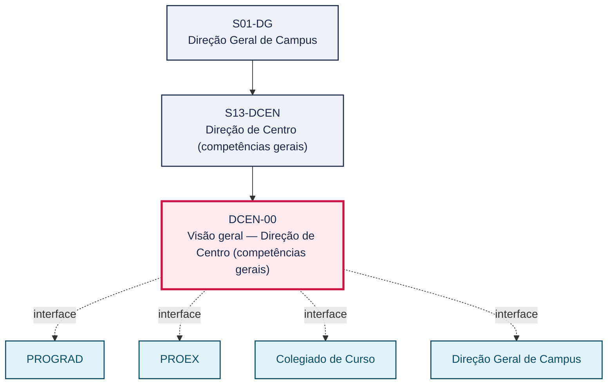

# POP DCEN-00 — Visão geral — Direção de Centro (competências gerais)

> **Documento vivo** · ATDG — Assessoria Técnica da Direção Geral · UNIOESTE Campus Foz do Iguaçu · Formato DDD híbrido + BPMN 2.0 padrão Anne Bail · Versão **1.0.0** · Status **em_validacao** · Atualizado em 2026-09-03

## 0. Cabeçalho DDD

| Divisão | Departamento | Descrição |
|---|---|---|
| Direção de Centro (competências gerais) | Direção de Centro (competências gerais) | Estabelece as competências do(a) Diretor(a) de Centro e das Assessorias de área, de ensino e de extensão na condução do Centro, incluindo representação institucional, indicação de representantes, delegação de atividades, condução e deliberação do Conselho de Centro e articulação do ensino com a PROGRAD e da extensão com a PROEX, nos termos do art. 37 do Estatuto (Res. 017/99-COU). Aplica-se de forma transversal às Direções dos Centros do Campus (CCSA e CECE), que mantêm playbooks próprios (CCSA-00, CECE-00) para as particularidades de cada Centro. |

| Domínio | Subdomínio | Tipo | Contexto delimitado |
|---|---|---|---|
| Ensino, Pesquisa e Extensão (Centro) | Competências e governança da Direção de Centro | core | S13-DCEN |

### 0.3 Linguagem ubíqua (glossário do processo)

| Termo | Definição | Sistema |
|---|---|---|
| Conselho de Centro | Órgão colegiado do Centro, convocado e presidido pelo Diretor(a) de Centro, responsável por deliberar sobre as matérias de sua competência regimental. | — |
| Assessoria de Ensino/Extensão do Centro | Função exercida por delegação do Diretor(a) de Centro para conduzir as atividades de ensino ou de extensão do Centro, conforme o mapeamento de tarefas da Direção de Centro. | — |

## 1. Identificação

| Campo | Valor |
|---|---|
| Código | DCEN-00 |
| Setor | Direção de Centro (`S13-DCEN`) |
| Responsável (função) | Diretor(a) de Centro |
| Periodicidade | Contínua, com convocação do Conselho de Centro conforme demanda (periodicidade formal a definir em regimento) |
| Subordinação | Direção Geral de Campus |
| Normativa | Estatuto (Res. 017/99-COU) art. 37 |
| Produto ATDG | POP |
| Pasta OneDrive | 03_MAPEAMENTO DE PROCESSOS |
| Fontes (entradas do Canvas) | pb-direcao-centro, 1780963200033 |
| Lacunas abertas | formulario |
| Agente responsável | — (não moldado) |

## 2. Organograma

## 3. Playbook

### 3.1 Gatilho (evento de domínio)

**Necessidade de representação do Centro, de indicação de representante, de delegação de atividade ou de deliberação de matéria de competência do Conselho de Centro** — origem: Diretor(a) de Centro, Assessorias do Centro, Colegiados de Curso ou Direção Geral de Campus

### 3.2 Entrada

- Convocação ou demanda de representação, indicação ou deliberação
- Mapeamento de tarefas da Direção de Centro (art. 37 do Estatuto)
- Pauta ou matéria a ser submetida ao Conselho de Centro

### 3.3 Passo a passo

| Nº | Ação | Responsável | Sistema | Artefato | Prazo | Evento |
|---|---|---|---|---|---|---|
| 1 | Representar o Centro em eventos, reuniões e atos oficiais internos e externos | Diretor(a) de Centro | — | Registro/ata de representação | Conforme convocação do evento | Centro representado |
| 2 | Nomear representantes do Centro para comitês, conselhos e grupos de trabalho | Diretor(a) de Centro | e-Protocolo | Portaria ou ofício de designação | Conforme demanda | Representante designado |
| 3 | Delegar às Assessorias de área, de ensino e de extensão as atividades correspondentes, conforme o mapeamento de tarefas da Direção de Centro | Diretor(a) de Centro | — | Mapeamento de tarefas da Direção de Centro | No início da gestão e sempre que alterado | Atividades delegadas às Assessorias |
| 4 | Executar as atividades de ensino e de extensão delegadas pelo Diretor(a) de Centro | Assessoria de Ensino/Extensão do Centro | e-Protocolo | Relatório/registro de execução | Conforme cronograma do Centro | Atividade delegada executada |
| 5 | Convocar e presidir as reuniões do Conselho de Centro | Diretor(a) de Centro | e-Protocolo | Edital de convocação e pauta | A definir (periodicidade do Regimento do Conselho de Centro) | Conselho de Centro convocado |
| 6 | Deliberar sobre as matérias constantes da pauta do Conselho de Centro | Conselho de Centro | — | Ata do Conselho de Centro | Na sessão convocada | Matéria deliberada |
| 7 | Registrar a deliberação em ata e dar encaminhamento aos setores envolvidos | Diretor(a) de Centro | e-Protocolo | Ata do Conselho de Centro assinada | A definir (prazo regimental de lavratura da ata) | Deliberação registrada e encaminhada |
| 8 | Articular o ensino do Centro com a PROGRAD e a extensão com a PROEX | Diretor(a) de Centro | e-Protocolo | Ofício/memorando de articulação | Conforme demanda | Demanda articulada com PROGRAD/PROEX |

### 3.4 Saída (entregáveis)

- Centro representado nos eventos, reuniões e órgãos colegiados
- Representantes designados para comitês, conselhos e grupos de trabalho
- Ata do Conselho de Centro com as deliberações registradas
- Demanda de ensino ou de extensão articulada com a PROGRAD/PROEX

## 4. Formulários e artefatos (agregados)

| Nome | Tipo | Sistema | Campos-chave | Preenchimento |
|---|---|---|---|---|
| Mapeamento de tarefas da Direção de Centro | documento | — | competência, responsável (Diretor/Assessoria), base normativa | Diretor(a) de Centro |
| Edital de convocação do Conselho de Centro | documento | e-Protocolo | data, pauta, convocados | Diretor(a) de Centro |
| Ata do Conselho de Centro | registro | e-Protocolo | deliberações, votação, encaminhamentos | Diretor(a) de Centro |
| Portaria/ofício de designação de representante | documento | e-Protocolo | representante designado, comitê/conselho/GT, vigência | Diretor(a) de Centro |

## 5. Decisões, exceções e pontos de atenção

| Decisão | Condição | Sim → | Não → |
|---|---|---|---|
| A matéria é aprovada pelo Conselho de Centro? | Votação em reunião do Conselho de Centro, observado o quórum regimental | Registrar a aprovação em ata e encaminhar aos setores executores (Assessorias, PROGRAD, PROEX, Colegiados) | Registrar a rejeição em ata, com a justificativa, e devolver ao proponente |

**Pontos de atenção**

- Distribuição de tarefas deve respeitar o art. 37 do Estatuto
- Assessorias atuam por delegação do Diretor de Centro
- A distribuição de competências entre Diretor(a) de Centro e Assessorias deve observar o art. 37 do Estatuto e não substitui a responsabilidade final do Diretor(a) de Centro.
- Assessorias atuam por delegação; a delegação não desonera o Diretor(a) de Centro da supervisão dos atos delegados.
- Convocação, quórum e periodicidade do Conselho de Centro seguem regimento próprio — ainda não evidenciados neste levantamento (A definir).

## 6. Contingência

- Se o Diretor(a) de Centro estiver impedido de presidir o Conselho de Centro, aplicar as regras de substituição previstas no Estatuto/Regimento do Centro (instrumento específico a definir).
- Se a pauta do Conselho de Centro não atingir quórum, registrar a ausência de quórum em ata e reconvocar a sessão.
- Se a Assessoria delegada não executar a atividade no prazo, o Diretor(a) de Centro reassume a condução direta e comunica à Direção Geral de Campus, quando aplicável.

## 7. Checklist

- ( ) Pauta e edital de convocação do Conselho de Centro emitidos com antecedência
- ( ) Ata da reunião do Conselho de Centro registrada e assinada
- ( ) Delegações às Assessorias formalizadas e comunicadas
- ( ) Demandas de ensino e de extensão encaminhadas à PROGRAD/PROEX, quando aplicável

## 8. KPI / Indicadores

| Indicador | Fórmula | Meta | Fonte |
|---|---|---|---|
| Percentual de reuniões do Conselho de Centro com ata registrada | (reuniões com ata registrada / reuniões realizadas) × 100 | A definir | Atas do Conselho de Centro |
| Prazo médio de resposta às demandas de articulação com PROGRAD/PROEX | Média (data de resposta − data de encaminhamento) | A definir | e-Protocolo |

## 9. Mapa de contexto (interfaces inter-setoriais)

| Origem | Relação | Destino | Artefato | Canal |
|---|---|---|---|---|
| Direção de Centro | fornece | PROGRAD | Demanda de articulação de ensino | e-Protocolo |
| Direção de Centro | fornece | PROEX | Demanda de articulação de extensão | e-Protocolo |
| Colegiado de Curso | fornece | Direção de Centro | Matéria/demanda para pauta do Conselho de Centro | e-Protocolo |
| Direção de Centro | informa | Direção Geral de Campus | Ata do Conselho de Centro e decisões relevantes | e-Protocolo |

## 10. Fluxograma (BPMN 2.0 — padrão Anne Bail)

```mermaid
flowchart LR
  subgraph R1["Diretor(a) de Centro"]
    direction LR
    e1(("Necessidade de representação do Centro, de indicação de representante…"))
    e2["Representar o Centro em eventos, reuniões e atos oficiais internos e…"]
    e3["Nomear representantes do Centro para comitês, conselhos e grupos de t…"]
    e4["Delegar às Assessorias de área, de ensino e de extensão as atividades…"]
    e6["Convocar e presidir as reuniões do Conselho de Centro"]
    e8["Registrar a deliberação em ata e dar encaminhamento aos setores envol…"]
    e9["Articular o ensino do Centro com a PROGRAD e a extensão com a PROEX"]
    e13((("Centro representado nos eventos, reuniões e órgãos colegiados")))
  end
  subgraph R2["Assessoria de Ensino/Extensão do Centro"]
    direction LR
    e5["Executar as atividades de ensino e de extensão delegadas pelo Diretor…"]
  end
  subgraph R3["Conselho de Centro"]
    direction LR
    e7["Deliberar sobre as matérias constantes da pauta do Conselho de Centro"]
  end
  subgraph R4["PROGRAD"]
    direction LR
    e10[["✉ Encaminhar a PROGRAD"]]
  end
  subgraph R5["PROEX"]
    direction LR
    e11[["✉ Encaminhar a PROEX"]]
  end
  subgraph R6["Direção Geral de Campus"]
    direction LR
    e12[["✉ Informar Direção Geral de Campus"]]
  end
  e1 --> e2
  e2 --> e3
  e3 --> e4
  e4 --> e5
  e5 --> e6
  e6 --> e7
  e7 --> e8
  e8 --> e9
  e9 --> e10
  e10 --> e11
  e11 --> e12
  e12 --> e13
  classDef inicio fill:#f3f4f6,stroke:#6b7280,stroke-width:1.5px,color:#374151
  classDef atividade fill:#E6F7F0,stroke:#0B7A4E,stroke-width:2px,color:#0B7A4E
  classDef decisao fill:#FFF4ED,stroke:#C9783A,stroke-width:2px,color:#C9783A
  classDef fim fill:#FDEAEE,stroke:#CC1544,stroke-width:4px,color:#CC1544
  classDef pausa fill:#FDEAEE,stroke:#CC1544,stroke-width:2px,color:#CC1544
  classDef captura fill:#E0F2F8,stroke:#0B4D66,stroke-width:2px,color:#0B4D66
  class e1 inicio
  class e2,e3,e4,e5,e6,e7,e8,e9 atividade
  class e10,e11,e12 captura
  class e13 fim
```

## 11. Especificação BPMN para o Miro

**Raias:** Diretor(a) de Centro · Assessoria de Ensino/Extensão do Centro · Conselho de Centro · PROGRAD · PROEX · Direção Geral de Campus

| Id | Tipo | Elemento | Raia |
|---|---|---|---|
| e1 | inicio | Necessidade de representação do Centro, de indicação de representante, de delegação de atividade ou de deliberação de matéria de competência do Conselho de Centro | Diretor(a) de Centro |
| e2 | atividade | Representar o Centro em eventos, reuniões e atos oficiais internos e externos | Diretor(a) de Centro |
| e3 | atividade | Nomear representantes do Centro para comitês, conselhos e grupos de trabalho | Diretor(a) de Centro |
| e4 | atividade | Delegar às Assessorias de área, de ensino e de extensão as atividades correspondentes, conforme o mapeamento de tarefas da Direção de Centro | Diretor(a) de Centro |
| e5 | atividade | Executar as atividades de ensino e de extensão delegadas pelo Diretor(a) de Centro | Assessoria de Ensino/Extensão do Centro |
| e6 | atividade | Convocar e presidir as reuniões do Conselho de Centro | Diretor(a) de Centro |
| e7 | atividade | Deliberar sobre as matérias constantes da pauta do Conselho de Centro | Conselho de Centro |
| e8 | atividade | Registrar a deliberação em ata e dar encaminhamento aos setores envolvidos | Diretor(a) de Centro |
| e9 | atividade | Articular o ensino do Centro com a PROGRAD e a extensão com a PROEX | Diretor(a) de Centro |
| e10 | captura | Encaminhar a PROGRAD | PROGRAD |
| e11 | captura | Encaminhar a PROEX | PROEX |
| e12 | captura | Informar Direção Geral de Campus | Direção Geral de Campus |
| e13 | fim | Centro representado nos eventos, reuniões e órgãos colegiados | Diretor(a) de Centro |

| De | Para | Rótulo |
|---|---|---|
| e1 | e2 | — |
| e2 | e3 | — |
| e3 | e4 | — |
| e4 | e5 | — |
| e5 | e6 | — |
| e6 | e7 | — |
| e7 | e8 | — |
| e8 | e9 | — |
| e9 | e10 | — |
| e10 | e11 | — |
| e11 | e12 | — |
| e12 | e13 | — |

_Especificação gerada a partir dos passos do POP; 6 raia(s). Revisar decisões e pausas antes de construir no Miro._

## 12. Histórico de versões

| Versão | Data | Autor | Tipo | Mudanças | Fontes |
|---|---|---|---|---|---|
| 0.1.0 | 2026-09-02 | scripts/scaffold_pops.py | patch | Esqueleto inicial gerado deterministicamente a partir das entradas pb-direcao-centro | pb-direcao-centro |
| 1.0.0 | 2026-09-03 | agente:construtor-pop (lote D2) | major | Passo 1 alterado (acao, responsavel, sistema, artefato, prazo, evento); Passo 2 alterado (acao, responsavel, sistema, artefato, prazo, evento); Passo 3 alterado (acao, responsavel, sistema, artefato, prazo, evento); Passo 4 alterado (acao, responsavel, sistema, artefato, prazo, evento); Passo adicionado após 3: Registrar a deliberação em ata e dar encaminhamento aos setores envolvidos; Passo adicionado após 3: Deliberar sobre as matérias constantes da pauta do Conselho de Centro; Passo adicionado após 2: Executar as atividades de ensino e de extensão delegadas pelo Diretor(a) de Cent; Passo adicionado após 2: Delegar às Assessorias de área, de ensino e de extensão as atividades correspond; entrada_nova: +3; saida_nova: +4; artefatos_novos: +4; decisoes_novas: +1; kpis_novos: +2; mapa_contexto_novo: +4; pontos_atencao_novos: +3; contingencia_nova: +3; checklist_novo: +4; glossario_novo: +2; Campo ddd.descricao atualizado; Campo ddd.subdominio atualizado; Campo identificacao.responsavel atualizado; Campo identificacao.periodicidade atualizado; Campo playbook.gatilho atualizado; Campo observacoes atualizado; Fluxograma regenerado a partir dos passos; Status promovido a em_validacao (≥ 3 passos e responsável definido) | pb-direcao-centro, 1780963200033 |

## 13. Validação e aprovação

| Papel | Função / unidade | Data |
|---|---|---|
| Elaboração | ATDG — Assessoria Técnica da Direção Geral | 2026-09-02 |
| Revisão | A definir (responsável do setor) | ___/___/______ |
| Aprovação | Direção Geral do Campus | ___/___/______ |

## 14. Lições incorporadas

- **L-001** — Referir sempre função/cargo; nomes apenas no bloco 13 (Validação), com anuência (LGPD).
- **L-004** — Nunca regenerar POP existente: aplicar patch com changelog, fontes e versão.
- **L-006** — Preservar códigos legados como códigos de processo; não renumerar.
- **L-007** — Referência Externa é benchmark; normativa do POP só cita atos da Unioeste, do Estado do Paraná ou federais aplicáveis.
- **L-002** — Um passo = uma ação; ações compostas viram passos distintos.
- **L-003** — Cada linha do mapa de contexto gera um elemento `captura` no BPMN e um passo na raia de destino.
- **L-005** — No diagnóstico, agrupar versões do mesmo documento e registrar lacuna `versao_documento`.

> **Observações:** POP consolidado a partir do mapeamento de tarefas da Direção de Centro (art. 37 do Estatuto); descreve as competências gerais aplicáveis a qualquer Direção de Centro do Campus. As particularidades de cada Centro constam dos playbooks CCSA-00 e CECE-00.

---
_Canvas Vivo — Base de Conhecimento Institucional · ATDG · UNIOESTE Campus Foz do Iguaçu · gerado por `scripts/render_pop.py` a partir de `pops/DCEN/DCEN-00.pop.json` (diretrizes v1.0)._
