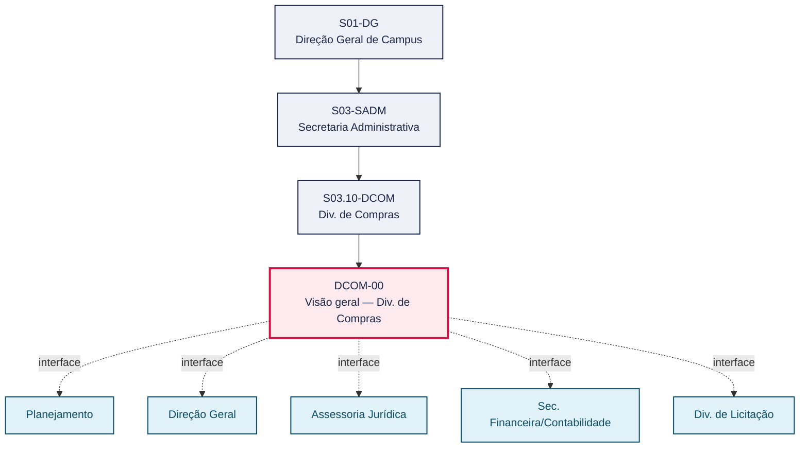

# POP DCOM-00 — Visão geral — Div. de Compras

> **Documento vivo** · ATDG — Assessoria Técnica da Direção Geral · UNIOESTE Campus Foz do Iguaçu · Formato DDD híbrido + BPMN 2.0 padrão Anne Bail · Versão **1.1.0** · Status **em_validacao** · Atualizado em 2026-09-03

## 0. Cabeçalho DDD

| Divisão | Departamento | Descrição |
|---|---|---|
| Secretaria Administrativa | Div. de Compras | Guia geral das contratações diretas conduzidas pela Div. de Compras (dispensa emergencial e inexigibilidade de licitação, com contrato ou com Ordem de Compra), cobrindo a tramitação do pedido do interessado até a formalização do instrumento e a publicação no DIOE, nos termos da Lei nº 14.133/2021. O passo a passo detalhado de cada modalidade está nos fluxos DCOM-01 a DCOM-04. |

| Domínio | Subdomínio | Tipo | Contexto delimitado |
|---|---|---|---|
| Contratações Públicas | Visão geral das contratações diretas (dispensa e inexigibilidade) | core | S03.10-DCOM |

### 0.3 Linguagem ubíqua (glossário do processo)

| Termo | Definição | Sistema |
|---|---|---|
| TR | Termo de Referência — documento que descreve o objeto, as especificações técnicas, a justificativa e os requisitos da contratação, elaborado pelo setor requisitante/interessado. | e-Protocolo |
| DDF | Sigla utilizada pelo setor para o registro de comprometimento orçamentário/financeiro que antecede a contratação por inexigibilidade (função análoga ao empenho, usado nas dispensas); expansão exata da sigla a confirmar com a Sec. Financeira/Contabilidade. | GMS |
| DIOE | Diário Oficial do Estado — veículo oficial de publicação dos atos administrativos (extratos de contrato/OC, avisos de dispensa/inexigibilidade, portarias); a publicação é condição de eficácia do ato. | DIOE |
| Dispensa (de licitação) | Hipótese de contratação direta, sem processo licitatório, prevista na Lei nº 14.133/2021, cabível nas situações legalmente definidas (como a emergência), mediante justificativa da situação que a fundamenta. | — |
| Inexigibilidade | Hipótese de contratação direta, sem processo licitatório, cabível quando há inviabilidade de competição (art. 74 da Lei nº 14.133/2021), como no caso de fornecedor exclusivo comprovado por carta de exclusividade. | — |
| Carta de exclusividade | Declaração emitida pelo fornecedor (ou por entidade representativa, quando aplicável) atestando que é o único capaz de fornecer o objeto pretendido, subsidiando a caracterização da inexigibilidade. | — |

## 1. Identificação

| Campo | Valor |
|---|---|
| Código | DCOM-00 |
| Setor | Div. de Compras (`S03.10-DCOM`) |
| Responsável (função) | Chefe da Divisão de Compras |
| Periodicidade | Sob demanda — conforme a ocorrência de situações de dispensa emergencial ou inexigibilidade que justifiquem contratação direta |
| Subordinação | Secretaria Administrativa |
| Normativa | Lei nº 14.133/2021; normas internas Unioeste |
| Produto ATDG | POP |
| Pasta OneDrive | 03_MAPEAMENTO DE PROCESSOS |
| Fontes (entradas do Canvas) | pb-compras |
| Lacunas abertas | prazo, versao_documento, sistema |
| Agente responsável | pop-dcom-00 |

## 2. Organograma

## 3. Playbook

### 3.1 Gatilho (evento de domínio)

**Necessidade de contratação direta identificada pela unidade requisitante (dispensa emergencial ou inexigibilidade)** — origem: Requisitante/Interessado

### 3.2 Entrada

- TR/memorando
- Cotações de preços ou tabela comparativa
- Carta de exclusividade (hipótese de inexigibilidade)
- Justificativa de urgência (hipótese de dispensa emergencial)

### 3.3 Passo a passo

| Nº | Ação | Responsável | Sistema | Artefato | Prazo | Evento |
|---|---|---|---|---|---|---|
| 1 | Identificar a hipótese de contratação direta aplicável (dispensa emergencial ou inexigibilidade) e o instrumento de formalização (contrato ou Ordem de Compra) | Div. de Compras | e-Protocolo | Enquadramento da contratação direta | A definir | Modalidade e instrumento definidos |
| 2 | Receber e instruir o processo de contratação direta (TR/memorando, cotações/tabela comparativa ou carta de exclusividade, conforme a hipótese) | Div. de Compras | e-Protocolo | TR/memorando, cotações/tabela comparativa ou carta de exclusividade | A definir | Processo de contratação direta instruído |
| 3 | Acompanhar a análise do Planejamento e a autorização da Direção Geral | Div. de Compras | e-Protocolo | Processo analisado e autorizado | A definir | Autorização da contratação direta concedida |
| 4 | Pesquisar preços de mercado e verificar a regularidade fiscal do fornecedor | Div. de Compras | ComprasNet/PNCP | Certidões de regularidade fiscal | A definir | Regularidade fiscal verificada |
| 5 | Acompanhar a emissão do parecer jurídico pela Assessoria Jurídica | Div. de Compras | e-Protocolo | Parecer jurídico | A definir | Parecer jurídico emitido |
| 6 | Acompanhar o empenho (dispensa) ou a formalização da DDF (inexigibilidade) pela Sec. Financeira/Contabilidade | Div. de Compras | GMS | Empenho ou DDF | A definir | Empenho ou DDF formalizado |
| 7 | Emitir ou acompanhar a emissão do contrato ou da Ordem de Compra, com a publicação no DIOE | Div. de Compras | DIOE | Contrato ou Ordem de Compra e extrato de publicação | A definir | Instrumento publicado no DIOE (condição de eficácia) |
| 8 | Acompanhar a emissão das portarias de Gestor e Fiscal do contrato, quando aplicável | Div. de Compras | e-Protocolo | Portarias de Gestor e Fiscal | A definir | Portarias emitidas (quando aplicável) |

### 3.4 Saída (entregáveis)

- Contrato ou Ordem de Compra formalizado(a) e publicado(a) no DIOE
- Portarias de Gestor e Fiscal do contrato, quando aplicável

## 4. Formulários e artefatos (agregados)

| Nome | Tipo | Sistema | Campos-chave | Preenchimento |
|---|---|---|---|---|
| TR/memorando | documento | e-Protocolo | objeto, justificativa, valor estimado | Requisitante/Interessado |
| Enquadramento da contratação direta | formulario | e-Protocolo | hipótese legal (dispensa/inexigibilidade), instrumento (contrato/OC) | Div. de Compras |
| Certidões de regularidade fiscal | documento | ComprasNet/PNCP | CNPJ do fornecedor, validade das certidões, situação | Div. de Compras |
| Parecer jurídico | documento | e-Protocolo | fundamentação legal, conclusão | Assessoria Jurídica |
| Empenho ou DDF | registro | GMS | número, dotação orçamentária, valor | Sec. Financeira/Contabilidade |
| Contrato ou Ordem de Compra | documento | e-Protocolo | partes, objeto, valor | Div. de Licitação |
| Extrato de publicação (DIOE) | registro | DIOE | número do extrato, data de publicação | Div. de Compras |

## 5. Decisões, exceções e pontos de atenção

| Decisão | Condição | Sim → | Não → |
|---|---|---|---|
| A hipótese é de dispensa emergencial? | Ao identificar a necessidade de contratação direta e verificar os requisitos legais | Segue-se o fluxo de dispensa emergencial (DCOM-01 ou DCOM-02, conforme o instrumento) | Verifica-se a hipótese de inexigibilidade (fornecedor exclusivo) e segue-se o fluxo correspondente (DCOM-03 ou DCOM-04) |
| A formalização será por contrato? | Definida a modalidade de contratação direta | Segue-se o fluxo com formalização por contrato (DCOM-01 ou DCOM-03) | Segue-se o fluxo com emissão de Ordem de Compra (DCOM-02 ou DCOM-04) |

**Pontos de atenção**

- Dispensa exige justificativa de urgência; inexigibilidade exige carta de exclusividade
- Aguardar 3 dias após o aviso de inexigibilidade
- Verificar regularidade fiscal antes do empenho
- A escolha entre dispensa emergencial e inexigibilidade depende da hipótese legal efetivamente configurada; nunca deve ser presumida
- O detalhamento de responsáveis por setor, sistemas, decisões e prazos de cada etapa está nos fluxos específicos (DCOM-01 a DCOM-04)
- A publicação no DIOE é condição de eficácia do contrato ou da Ordem de Compra, em qualquer modalidade

## 6. Contingência

- Se não for possível enquadrar a necessidade em nenhuma hipótese de contratação direta, a Div. de Compras orienta o interessado a seguir o processo licitatório ordinário.
- Se a Direção Geral não autorizar a contratação direta, o processo é devolvido ao interessado com as razões da negativa.
- Se houver dúvida sobre a modalidade ou o instrumento aplicável, a Div. de Compras consulta a Assessoria Jurídica antes de prosseguir.

## 7. Checklist

- ( ) Hipótese de contratação direta (dispensa ou inexigibilidade) identificada e enquadrada
- ( ) Instrumento de formalização (contrato ou Ordem de Compra) definido
- ( ) Regularidade fiscal do fornecedor verificada antes do empenho/DDF
- ( ) Instrumento publicado no DIOE

## 8. KPI / Indicadores

| Indicador | Fórmula | Meta | Fonte |
|---|---|---|---|
| Volume de contratações diretas por modalidade (dispensa x inexigibilidade) e instrumento (contrato x OC) | Contagem de processos concluídos por modalidade/instrumento no período | A definir | e-Protocolo |
| Tempo médio de tramitação da contratação direta (visão consolidada dos 4 fluxos) | Média de (data de publicação do instrumento − data de protocolo do TR/memorando), em dias corridos | A definir | e-Protocolo |

## 9. Mapa de contexto (interfaces inter-setoriais)

| Origem | Relação | Destino | Artefato | Canal |
|---|---|---|---|---|
| Div. de Compras | recebe | Planejamento | Processo analisado, a caminho da autorização da Direção Geral | e-Protocolo |
| Div. de Compras | recebe | Direção Geral | Autorização da contratação direta | e-Protocolo |
| Div. de Compras | recebe | Assessoria Jurídica | Parecer jurídico | e-Protocolo |
| Div. de Compras | recebe | Sec. Financeira/Contabilidade | Empenho ou DDF formalizado(a) | e-Protocolo |
| Div. de Compras | recebe | Div. de Licitação | Contrato elaborado/publicado ou aviso de inexigibilidade | e-Protocolo |

## 10. Fluxograma (BPMN 2.0 — padrão Anne Bail)

```mermaid
flowchart LR
  subgraph R1["Div. de Compras"]
    direction LR
    e2["Identificar a hipótese de contratação direta aplicável (dispensa emer…"]
    e3["Receber e instruir o processo de contratação direta (TR/memorando, co…"]
    e4["Acompanhar a análise do Planejamento e a autorização da Direção Geral"]
    e5["Pesquisar preços de mercado e verificar a regularidade fiscal do forn…"]
    e6["Acompanhar a emissão do parecer jurídico pela Assessoria Jurídica"]
    e7["Acompanhar o empenho (dispensa) ou a formalização da DDF (inexigibili…"]
    e8["Emitir ou acompanhar a emissão do contrato ou da Ordem de Compra, com…"]
    e9["Acompanhar a emissão das portarias de Gestor e Fiscal do contrato, qu…"]
    e1(("Necessidade de contratação direta identificada pela unidade requisita…"))
    e10((("Contrato ou Ordem de Compra formalizado(a) e publicado(a) no DIOE")))
  end
  e2 --> e3
  e3 --> e4
  e4 --> e5
  e5 --> e6
  e6 --> e7
  e7 --> e8
  e8 --> e9
  e1 --> e2
  e9 --> e10
  classDef inicio fill:#f3f4f6,stroke:#6b7280,stroke-width:1.5px,color:#374151
  classDef atividade fill:#E6F7F0,stroke:#0B7A4E,stroke-width:2px,color:#0B7A4E
  classDef decisao fill:#FFF4ED,stroke:#C9783A,stroke-width:2px,color:#C9783A
  classDef fim fill:#FDEAEE,stroke:#CC1544,stroke-width:4px,color:#CC1544
  classDef pausa fill:#FDEAEE,stroke:#CC1544,stroke-width:2px,color:#CC1544
  classDef captura fill:#E0F2F8,stroke:#0B4D66,stroke-width:2px,color:#0B4D66
  class e2,e3,e4,e5,e6,e7,e8,e9 atividade
  class e1 inicio
  class e10 fim
```

## 11. Especificação BPMN para o Miro

**Raias:** Chefe da Divisão de Compras · Div. de Compras

| Id | Tipo | Elemento | Raia |
|---|---|---|---|
| e2 | atividade | Identificar a hipótese de contratação direta aplicável (dispensa emergencial ou inexigibilidade) e o instrumento de formalização (contrato ou Ordem de Compra) | Div. de Compras |
| e3 | atividade | Receber e instruir o processo de contratação direta (TR/memorando, cotações/tabela comparativa ou carta de exclusividade, conforme a hipótese) | Div. de Compras |
| e4 | atividade | Acompanhar a análise do Planejamento e a autorização da Direção Geral | Div. de Compras |
| e5 | atividade | Pesquisar preços de mercado e verificar a regularidade fiscal do fornecedor | Div. de Compras |
| e6 | atividade | Acompanhar a emissão do parecer jurídico pela Assessoria Jurídica | Div. de Compras |
| e7 | atividade | Acompanhar o empenho (dispensa) ou a formalização da DDF (inexigibilidade) pela Sec. Financeira/Contabilidade | Div. de Compras |
| e8 | atividade | Emitir ou acompanhar a emissão do contrato ou da Ordem de Compra, com a publicação no DIOE | Div. de Compras |
| e9 | atividade | Acompanhar a emissão das portarias de Gestor e Fiscal do contrato, quando aplicável | Div. de Compras |
| e1 | inicio | Necessidade de contratação direta identificada pela unidade requisitante (dispensa emergencial ou inexigibilidade) | Div. de Compras |
| e10 | fim | Contrato ou Ordem de Compra formalizado(a) e publicado(a) no DIOE | Div. de Compras |

| De | Para | Rótulo |
|---|---|---|
| e2 | e3 | — |
| e3 | e4 | — |
| e4 | e5 | — |
| e5 | e6 | — |
| e6 | e7 | — |
| e7 | e8 | — |
| e8 | e9 | — |
| e1 | e2 | — |
| e9 | e10 | — |

_Especificação gerada a partir dos passos do POP; 2 raia(s). Revisar decisões e pausas antes de construir no Miro._

## 12. Histórico de versões

| Versão | Data | Autor | Tipo | Mudanças | Fontes |
|---|---|---|---|---|---|
| 0.1.0 | 2026-09-02 | scripts/scaffold_pops.py | patch | Esqueleto inicial gerado deterministicamente a partir das entradas pb-compras | pb-compras |
| 1.0.0 | 2026-09-03 | agente:construtor-pop (lote DCOM) | major | Passo 1 alterado (acao, responsavel, sistema, artefato, prazo, evento); Passo 2 alterado (acao, responsavel, sistema, artefato, prazo, evento); Passo 3 alterado (acao, responsavel, sistema, artefato, prazo, evento); Passo 4 alterado (acao, responsavel, sistema, artefato, prazo, evento); Passo 5 alterado (acao, responsavel, sistema, artefato, prazo, evento); Passo adicionado após 5: Acompanhar a emissão das portarias de Gestor e Fiscal do contrato, quando aplicá; Passo adicionado após 4: Acompanhar o empenho (dispensa) ou a formalização da DDF (inexigibilidade) pela ; Passo adicionado após 0: Identificar a hipótese de contratação direta aplicável (dispensa emergencial ou ; entrada_nova: +4; saida_nova: +2; artefatos_novos: +7; decisoes_novas: +2; kpis_novos: +2; mapa_contexto_novo: +5; pontos_atencao_novos: +3; contingencia_nova: +3; checklist_novo: +4; glossario_novo: +6; Campo ddd.descricao atualizado; Campo ddd.subdominio atualizado; Campo identificacao.responsavel atualizado; Campo identificacao.periodicidade atualizado; Campo playbook.gatilho atualizado; Campo observacoes atualizado; Fluxograma regenerado a partir dos passos; Status promovido a em_validacao (≥ 3 passos e responsável definido) | pb-compras |
| 1.1.0 | 2026-09-03 | agente:construtor-pop (lote DCOM) | minor | Elementos BPMN removidos: e1, e10; Elementos BPMN adicionados: 2 | pb-compras |

## 13. Validação e aprovação

| Papel | Função / unidade | Data |
|---|---|---|
| Elaboração | ATDG — Assessoria Técnica da Direção Geral | 2026-09-02 |
| Revisão | A definir (responsável do setor) | ___/___/______ |
| Aprovação | Direção Geral do Campus | ___/___/______ |

## 14. Lições incorporadas

- **L-001** — Referir sempre função/cargo; nomes apenas no bloco 13 (Validação), com anuência (LGPD).
- **L-004** — Nunca regenerar POP existente: aplicar patch com changelog, fontes e versão.
- **L-006** — Preservar códigos legados como códigos de processo; não renumerar.
- **L-007** — Referência Externa é benchmark; normativa do POP só cita atos da Unioeste, do Estado do Paraná ou federais aplicáveis.
- **L-002** — Um passo = uma ação; ações compostas viram passos distintos.
- **L-003** — Cada linha do mapa de contexto gera um elemento `captura` no BPMN e um passo na raia de destino.

> **Observações:** Inferência a validar com a Divisão de Compras: este POP é a visão geral (playbook) das contratações diretas, com passos em nível de macroetapa e raia única atribuída à Div. de Compras como coordenadora do macroprocesso; a atribuição detalhada de responsáveis por setor, sistemas, decisões e a pausa de 3 dias da inexigibilidade está nos fluxos específicos DCOM-01 (dispensa/contrato), DCOM-02 (dispensa/OC), DCOM-03 (inexigibilidade/contrato) e DCOM-04 (inexigibilidade/OC), construídos a partir das fontes 1780963200050-53.

---
_Canvas Vivo — Base de Conhecimento Institucional · ATDG · UNIOESTE Campus Foz do Iguaçu · gerado por `scripts/render_pop.py` a partir de `pops/DCOM/DCOM-00.pop.json` (diretrizes v1.0)._
