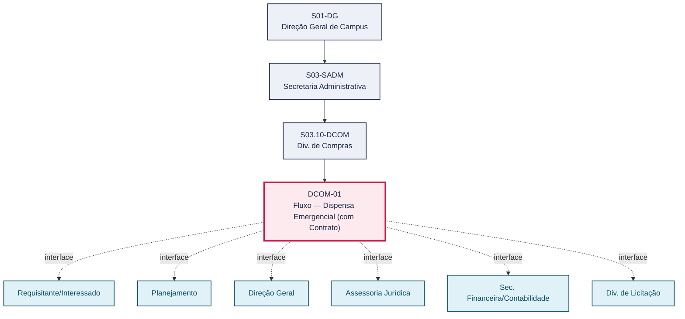

# POP DCOM-01 — Fluxo — Dispensa Emergencial (com Contrato)

> **Documento vivo** · ATDG — Assessoria Técnica da Direção Geral · UNIOESTE Campus Foz do Iguaçu · Formato DDD híbrido + BPMN 2.0 padrão Anne Bail · Versão **1.0.0** · Status **em_validacao** · Atualizado em 2026-09-03

## 0. Cabeçalho DDD

| Divisão | Departamento | Descrição |
|---|---|---|
| Secretaria Administrativa | Div. de Compras | Contratação direta por dispensa emergencial de licitação, formalizada por contrato administrativo. A Div. de Compras conduz a pesquisa de preços e a verificação de regularidade fiscal do fornecedor, subsidiando a Assessoria Jurídica, a Sec. Financeira/Contabilidade e a Div. de Licitação até a assinatura do contrato, a publicação no DIOE e a emissão das portarias de Gestor e Fiscal, nos termos da Lei nº 14.133/2021. |

| Domínio | Subdomínio | Tipo | Contexto delimitado |
|---|---|---|---|
| Contratações Públicas | Contratação direta por dispensa emergencial com formalização de contrato | core | S03.10-DCOM |

### 0.3 Linguagem ubíqua (glossário do processo)

| Termo | Definição | Sistema |
|---|---|---|
| TR | Termo de Referência — documento que descreve o objeto, as especificações técnicas, a justificativa e os requisitos da contratação, elaborado pelo setor requisitante/interessado. | e-Protocolo |
| DDF | Sigla utilizada pelo setor para o registro de comprometimento orçamentário/financeiro que antecede a contratação por inexigibilidade (função análoga ao empenho, usado nas dispensas); expansão exata da sigla a confirmar com a Sec. Financeira/Contabilidade. | GMS |
| DIOE | Diário Oficial do Estado — veículo oficial de publicação dos atos administrativos (extratos de contrato, avisos de dispensa/inexigibilidade, portarias); a publicação é condição de eficácia do ato. | DIOE |
| Dispensa (de licitação) | Hipótese de contratação direta, sem processo licitatório, prevista na Lei nº 14.133/2021, cabível nas situações legalmente definidas (como a emergência), mediante justificativa da situação que a fundamenta. | — |
| Inexigibilidade | Hipótese de contratação direta, sem processo licitatório, cabível quando há inviabilidade de competição (art. 74 da Lei nº 14.133/2021), como no caso de fornecedor exclusivo comprovado por carta de exclusividade. | — |
| Carta de exclusividade | Declaração emitida pelo fornecedor (ou por entidade representativa, quando aplicável) atestando que é o único capaz de fornecer o objeto pretendido, subsidiando a caracterização da inexigibilidade. | — |

## 1. Identificação

| Campo | Valor |
|---|---|
| Código | DCOM-01 |
| Setor | Div. de Compras (`S03.10-DCOM`) |
| Responsável (função) | Chefe da Divisão de Compras |
| Periodicidade | Sob demanda — a cada situação emergencial que enseje contratação direta por dispensa, sem periodicidade fixa |
| Subordinação | Secretaria Administrativa |
| Normativa | Lei nº 14.133/2021 (Licitações e Contratos); normas internas Unioeste |
| Produto ATDG | POP |
| Pasta OneDrive | 03_MAPEAMENTO DE PROCESSOS |
| Fontes (entradas do Canvas) | 1780963200050 |
| Lacunas abertas | prazo, versao_documento, sistema |
| Agente responsável | pop-dcom-01 |

## 2. Organograma

## 3. Playbook

### 3.1 Gatilho (evento de domínio)

**Necessidade emergencial de contratação identificada pela unidade requisitante, com previsão de formalização por contrato** — origem: Requisitante/Interessado

### 3.2 Entrada

- Termo de referência (TR)
- Cotações de preços
- Tabela comparativa de preços
- Justificativa de urgência da dispensa emergencial

### 3.3 Passo a passo

| Nº | Ação | Responsável | Sistema | Artefato | Prazo | Evento |
|---|---|---|---|---|---|---|
| 1 | Elaborar o termo de referência (TR), as cotações de preços e a tabela comparativa | Requisitante/Interessado | e-Protocolo | TR, cotações de preços e tabela comparativa | A definir | TR instruído e protocolado |
| 2 | Elaborar a justificativa da situação de urgência que fundamenta a dispensa emergencial | Requisitante/Interessado | e-Protocolo | Justificativa de urgência | A definir | Justificativa de urgência anexada ao processo |
| 3 | Analisar a instrução processual e submeter à autorização da Direção Geral | Planejamento | e-Protocolo | Processo analisado por Planejamento | A definir | Processo submetido à Direção Geral |
| 4 | Autorizar a contratação direta por dispensa emergencial | Direção Geral | e-Protocolo | Despacho de autorização | A definir | Autorização concedida |
| 5 | Pesquisar preços de mercado e verificar a regularidade fiscal do fornecedor | Div. de Compras | ComprasNet/PNCP | Cotações complementares e certidões de regularidade fiscal | A definir | Regularidade fiscal verificada |
| 6 | Emitir parecer jurídico sobre a contratação direta | Assessoria Jurídica | e-Protocolo | Parecer jurídico | A definir | Parecer jurídico emitido |
| 7 | Empenhar a despesa (emitir a nota de empenho no GMS) | Sec. Financeira/Contabilidade | GMS | Nota de empenho | Após parecer jurídico favorável e antes da assinatura do contrato | Empenho emitido |
| 8 | Elaborar a minuta do contrato administrativo | Div. de Licitação | e-Protocolo | Minuta do contrato administrativo | A definir | Minuta de contrato elaborada |
| 9 | Assinar o contrato administrativo e publicar o extrato no DIOE | Div. de Licitação | DIOE | Contrato assinado e extrato de publicação | A definir | Contrato publicado no DIOE (condição de eficácia) |
| 10 | Emitir as portarias de Gestor e Fiscal do contrato | Direção Geral | e-Protocolo | Portarias de Gestor e Fiscal | A definir | Portarias emitidas |

### 3.4 Saída (entregáveis)

- Contrato administrativo assinado e publicado no DIOE
- Portarias de Gestor e Fiscal do contrato

## 4. Formulários e artefatos (agregados)

| Nome | Tipo | Sistema | Campos-chave | Preenchimento |
|---|---|---|---|---|
| Termo de referência (TR) | documento | e-Protocolo | objeto, justificativa, especificação técnica, valor estimado | Requisitante/Interessado |
| Justificativa de urgência | documento | e-Protocolo | motivo da urgência, risco de dano, nexo com a contratação | Requisitante/Interessado |
| Tabela comparativa de preços | formulario | e-Protocolo | fornecedores cotados, valores unitários/totais, menor preço | Requisitante/Interessado |
| Certidões de regularidade fiscal | documento | ComprasNet/PNCP | CNPJ do fornecedor, validade das certidões, situação (regular/irregular) | Div. de Compras |
| Parecer jurídico | documento | e-Protocolo | fundamentação legal, conclusão (favorável/desfavorável), ressalvas | Assessoria Jurídica |
| Nota de empenho | registro | GMS | número do empenho, dotação orçamentária, valor empenhado | Sec. Financeira/Contabilidade |
| Contrato administrativo | documento | e-Protocolo | partes, objeto, vigência, valor, assinaturas | Div. de Licitação |
| Extrato de publicação (DIOE) | registro | DIOE | número do extrato, data de publicação | Div. de Licitação |
| Portarias de Gestor e Fiscal | documento | e-Protocolo | função designada, número da portaria, data de publicação | Direção Geral |

## 5. Decisões, exceções e pontos de atenção

| Decisão | Condição | Sim → | Não → |
|---|---|---|---|
| Urgência comprovada e justificada? | Após a elaboração da justificativa de urgência e a submissão do processo à Direção Geral | A Direção Geral autoriza a contratação direta por dispensa emergencial | O processo retorna ao interessado para complementação da justificativa ou reavaliação da hipótese de contratação direta |
| Regularidade fiscal do fornecedor comprovada? | Após a pesquisa de preços e a consulta às certidões pela Div. de Compras | O processo segue à Assessoria Jurídica para parecer | A Div. de Compras notifica o fornecedor para regularização ou realiza nova pesquisa de preços com outro fornecedor apto |

**Pontos de atenção**

- Dispensa emergencial exige justificativa da urgência
- Verificar regularidade fiscal antes do empenho
- Publicação no DIOE é condição de eficácia
- O contrato só produz efeitos após a publicação do extrato no DIOE
- As certidões de regularidade fiscal devem estar dentro do prazo de validade no momento da verificação
- As portarias de Gestor e Fiscal devem ser emitidas antes do início da execução contratual

## 6. Contingência

- Se a certidão de regularidade fiscal estiver vencida ou irregular, a Div. de Compras solicita a regularização ao fornecedor ou realiza nova pesquisa de preços com outro fornecedor apto.
- Se o parecer jurídico apontar impedimento, o processo retorna à Div. de Compras/Planejamento para ajuste da instrução antes de nova submissão à Assessoria Jurídica.
- Se a justificativa de urgência for considerada insuficiente pela Direção Geral, o processo é devolvido ao interessado para complementação ou reavaliação da hipótese de contratação direta.
- Se houver indisponibilidade orçamentária no momento do empenho, a Sec. Financeira/Contabilidade comunica a Div. de Compras para reavaliação do processo antes da assinatura do contrato.

## 7. Checklist

- ( ) TR, cotações, tabela comparativa e justificativa de urgência anexados ao processo
- ( ) Regularidade fiscal do fornecedor verificada, com certidões válidas anexadas
- ( ) Parecer jurídico favorável emitido e anexado ao processo
- ( ) Empenho emitido antes da assinatura do contrato
- ( ) Extrato do contrato publicado no DIOE
- ( ) Portarias de Gestor e Fiscal emitidas

## 8. KPI / Indicadores

| Indicador | Fórmula | Meta | Fonte |
|---|---|---|---|
| Tempo médio de tramitação da dispensa emergencial (do protocolo do TR à assinatura do contrato) | Média de (data de assinatura do contrato − data de protocolo do TR), em dias corridos | A definir | e-Protocolo |
| Taxa de publicação tempestiva do extrato no DIOE | (Nº de contratos publicados no DIOE dentro do prazo interno ÷ total de contratos assinados no período) × 100 | A definir | DIOE |
| Taxa de processos devolvidos por regularidade fiscal ou parecer jurídico desfavorável | (Nº de processos devolvidos ÷ total de processos de dispensa emergencial no período) × 100 | A definir | e-Protocolo |

## 9. Mapa de contexto (interfaces inter-setoriais)

| Origem | Relação | Destino | Artefato | Canal |
|---|---|---|---|---|
| Requisitante/Interessado | fornece | Planejamento | TR, cotações, tabela comparativa e justificativa de urgência | e-Protocolo |
| Planejamento | fornece | Direção Geral | Processo analisado | e-Protocolo |
| Direção Geral | aprova | Div. de Compras | Autorização da contratação direta | e-Protocolo |
| Div. de Compras | fornece | Assessoria Jurídica | Processo com pesquisa de preços e regularidade fiscal | e-Protocolo |
| Assessoria Jurídica | fornece | Sec. Financeira/Contabilidade | Parecer jurídico favorável | e-Protocolo |
| Sec. Financeira/Contabilidade | fornece | Div. de Licitação | Processo empenhado | e-Protocolo |
| Div. de Licitação | informa | Direção Geral | Contrato assinado e publicado no DIOE | DIOE |

## 10. Fluxograma (BPMN 2.0 — padrão Anne Bail)

```mermaid
flowchart LR
  subgraph R1["Div. de Compras"]
    direction LR
    e9[["✉ Encaminhar processo autorizado à Div. de Compras"]]
    e10["Pesquisar preços de mercado e verificar regularidade fiscal do fornec…"]
    e11{"Regularidade fiscal comprovada?"}
  end
  subgraph R2["Requisitante/Interessado"]
    direction LR
    e1(("Necessidade emergencial de contratação identificada"))
    e2["Elaborar o TR, as cotações de preços e a tabela comparativa"]
    e3["Elaborar a justificativa de urgência"]
  end
  subgraph R3["Planejamento"]
    direction LR
    e4[["✉ Encaminhar processo ao Planejamento"]]
    e5["Analisar a instrução processual e submeter à Direção Geral"]
  end
  subgraph R4["Direção Geral"]
    direction LR
    e6[["✉ Encaminhar processo à Direção Geral"]]
    e7{"Urgência comprovada e justificada?"}
    e8["Autorizar a contratação direta por dispensa emergencial"]
    e19[["✉ Encaminhar contrato publicado à Direção Geral"]]
    e20["Emitir as portarias de Gestor e Fiscal do contrato"]
    e21((("Contrato vigente, com Gestor e Fiscal designados")))
  end
  subgraph R5["Assessoria Jurídica"]
    direction LR
    e12[["✉ Encaminhar processo à Assessoria Jurídica"]]
    e13["Emitir parecer jurídico sobre a contratação direta"]
  end
  subgraph R6["Sec. Financeira/Contabilidade"]
    direction LR
    e14[["✉ Encaminhar processo com parecer favorável à Sec. Financeira/Contabili…"]]
    e15["Empenhar a despesa (nota de empenho no GMS)"]
  end
  subgraph R7["Div. de Licitação"]
    direction LR
    e16[["✉ Encaminhar processo empenhado à Div. de Licitação"]]
    e17["Elaborar a minuta do contrato administrativo"]
    e18["Assinar o contrato e publicar o extrato no DIOE"]
  end
  e1 --> e2
  e2 --> e3
  e3 --> e4
  e4 --> e5
  e5 --> e6
  e6 --> e7
  e7 -- Sim --> e8
  e7 -- Não --> e2
  e8 --> e9
  e9 --> e10
  e10 --> e11
  e11 -- Sim --> e12
  e11 -- Não --> e10
  e12 --> e13
  e13 --> e14
  e14 --> e15
  e15 --> e16
  e16 --> e17
  e17 --> e18
  e18 --> e19
  e19 --> e20
  e20 --> e21
  classDef inicio fill:#f3f4f6,stroke:#6b7280,stroke-width:1.5px,color:#374151
  classDef atividade fill:#E6F7F0,stroke:#0B7A4E,stroke-width:2px,color:#0B7A4E
  classDef decisao fill:#FFF4ED,stroke:#C9783A,stroke-width:2px,color:#C9783A
  classDef fim fill:#FDEAEE,stroke:#CC1544,stroke-width:4px,color:#CC1544
  classDef pausa fill:#FDEAEE,stroke:#CC1544,stroke-width:2px,color:#CC1544
  classDef captura fill:#E0F2F8,stroke:#0B4D66,stroke-width:2px,color:#0B4D66
  class e1 inicio
  class e2,e3,e5,e8,e10,e13,e15,e17,e18,e20 atividade
  class e4,e6,e9,e12,e14,e16,e19 captura
  class e7,e11 decisao
  class e21 fim
```

## 11. Especificação BPMN para o Miro

**Raias:** Div. de Compras · Requisitante/Interessado · Planejamento · Direção Geral · Assessoria Jurídica · Sec. Financeira/Contabilidade · Div. de Licitação

| Id | Tipo | Elemento | Raia |
|---|---|---|---|
| e1 | inicio | Necessidade emergencial de contratação identificada | Requisitante/Interessado |
| e2 | atividade | Elaborar o TR, as cotações de preços e a tabela comparativa | Requisitante/Interessado |
| e3 | atividade | Elaborar a justificativa de urgência | Requisitante/Interessado |
| e4 | captura | Encaminhar processo ao Planejamento | Planejamento |
| e5 | atividade | Analisar a instrução processual e submeter à Direção Geral | Planejamento |
| e6 | captura | Encaminhar processo à Direção Geral | Direção Geral |
| e7 | decisao | Urgência comprovada e justificada? | Direção Geral |
| e8 | atividade | Autorizar a contratação direta por dispensa emergencial | Direção Geral |
| e9 | captura | Encaminhar processo autorizado à Div. de Compras | Div. de Compras |
| e10 | atividade | Pesquisar preços de mercado e verificar regularidade fiscal do fornecedor | Div. de Compras |
| e11 | decisao | Regularidade fiscal comprovada? | Div. de Compras |
| e12 | captura | Encaminhar processo à Assessoria Jurídica | Assessoria Jurídica |
| e13 | atividade | Emitir parecer jurídico sobre a contratação direta | Assessoria Jurídica |
| e14 | captura | Encaminhar processo com parecer favorável à Sec. Financeira/Contabilidade | Sec. Financeira/Contabilidade |
| e15 | atividade | Empenhar a despesa (nota de empenho no GMS) | Sec. Financeira/Contabilidade |
| e16 | captura | Encaminhar processo empenhado à Div. de Licitação | Div. de Licitação |
| e17 | atividade | Elaborar a minuta do contrato administrativo | Div. de Licitação |
| e18 | atividade | Assinar o contrato e publicar o extrato no DIOE | Div. de Licitação |
| e19 | captura | Encaminhar contrato publicado à Direção Geral | Direção Geral |
| e20 | atividade | Emitir as portarias de Gestor e Fiscal do contrato | Direção Geral |
| e21 | fim | Contrato vigente, com Gestor e Fiscal designados | Direção Geral |

| De | Para | Rótulo |
|---|---|---|
| e1 | e2 | — |
| e2 | e3 | — |
| e3 | e4 | — |
| e4 | e5 | — |
| e5 | e6 | — |
| e6 | e7 | — |
| e7 | e8 | Sim |
| e7 | e2 | Não |
| e8 | e9 | — |
| e9 | e10 | — |
| e10 | e11 | — |
| e11 | e12 | Sim |
| e11 | e10 | Não |
| e12 | e13 | — |
| e13 | e14 | — |
| e14 | e15 | — |
| e15 | e16 | — |
| e16 | e17 | — |
| e17 | e18 | — |
| e18 | e19 | — |
| e19 | e20 | — |
| e20 | e21 | — |

_Especificação gerada a partir dos passos do POP; 1 raia(s). Revisar decisões e pausas antes de construir no Miro._

## 12. Histórico de versões

| Versão | Data | Autor | Tipo | Mudanças | Fontes |
|---|---|---|---|---|---|
| 0.1.0 | 2026-09-02 | scripts/scaffold_pops.py | patch | Esqueleto inicial gerado deterministicamente a partir das entradas 1780963200050 | 1780963200050 |
| 1.0.0 | 2026-09-03 | agente:construtor-pop (lote DCOM) | major | Passo 1 alterado (acao, responsavel, sistema, artefato, prazo, evento); Passo 2 alterado (acao, responsavel, sistema, artefato, prazo, evento); Passo 3 alterado (acao, responsavel, sistema, artefato, prazo, evento); Passo 4 alterado (acao, responsavel, sistema, artefato, prazo, evento); Passo 5 alterado (acao, responsavel, sistema, artefato, prazo, evento); Passo 6 alterado (acao, responsavel, sistema, artefato, prazo, evento); Passo adicionado após 5: Assinar o contrato administrativo e publicar o extrato no DIOE; Passo adicionado após 4: Empenhar a despesa (emitir a nota de empenho no GMS); Passo adicionado após 2: Autorizar a contratação direta por dispensa emergencial; Passo adicionado após 1: Elaborar a justificativa da situação de urgência que fundamenta a dispensa emerg; entrada_nova: +4; saida_nova: +2; artefatos_novos: +9; decisoes_novas: +2; kpis_novos: +3; mapa_contexto_novo: +7; pontos_atencao_novos: +3; contingencia_nova: +4; checklist_novo: +6; glossario_novo: +6; Campo ddd.descricao atualizado; Campo ddd.subdominio atualizado; Campo identificacao.responsavel atualizado; Campo identificacao.periodicidade atualizado; Campo playbook.gatilho atualizado; Campo observacoes atualizado; Raias adicionadas: Requisitante/Interessado, Planejamento, Direção Geral, Assessoria Jurídica, Sec. Financeira/Contabilidade, Div. de Licitação; Elementos BPMN removidos: e1, e2, e3, e4, e5, e6, e7, e8; Elementos BPMN adicionados: 21; Status promovido a em_validacao (≥ 3 passos e responsável definido) | 1780963200050 |

## 13. Validação e aprovação

| Papel | Função / unidade | Data |
|---|---|---|
| Elaboração | ATDG — Assessoria Técnica da Direção Geral | 2026-09-02 |
| Revisão | A definir (responsável do setor) | ___/___/______ |
| Aprovação | Direção Geral do Campus | ___/___/______ |

## 14. Lições incorporadas

- **L-001** — Referir sempre função/cargo; nomes apenas no bloco 13 (Validação), com anuência (LGPD).
- **L-004** — Nunca regenerar POP existente: aplicar patch com changelog, fontes e versão.
- **L-006** — Preservar códigos legados como códigos de processo; não renumerar.
- **L-007** — Referência Externa é benchmark; normativa do POP só cita atos da Unioeste, do Estado do Paraná ou federais aplicáveis.
- **L-002** — Um passo = uma ação; ações compostas viram passos distintos.
- **L-003** — Cada linha do mapa de contexto gera um elemento `captura` no BPMN e um passo na raia de destino.

> **Observações:** Inferência a validar com a Divisão de Compras: atribuição dos sistemas de apoio (e-Protocolo para tramitação; ComprasNet/PNCP para pesquisa de preços e regularidade fiscal; GMS para o empenho; DIOE para publicação) e dos responsáveis por função, inferidos a partir do fluxograma institucional (fonte 1780963200050) e do playbook do setor (pb-compras); prazos específicos de cada etapa permanecem 'A definir' até confirmação formal da Divisão.

---
_Canvas Vivo — Base de Conhecimento Institucional · ATDG · UNIOESTE Campus Foz do Iguaçu · gerado por `scripts/render_pop.py` a partir de `pops/DCOM/DCOM-01.pop.json` (diretrizes v1.0)._
