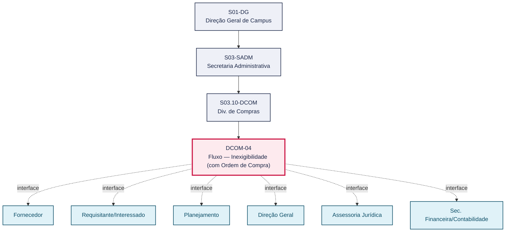

# POP DCOM-04 — Fluxo — Inexigibilidade (com Ordem de Compra)

> **Documento vivo** · ATDG — Assessoria Técnica da Direção Geral · UNIOESTE Campus Foz do Iguaçu · Formato DDD híbrido + BPMN 2.0 padrão Anne Bail · Versão **1.0.0** · Status **em_validacao** · Atualizado em 2026-09-03

## 0. Cabeçalho DDD

| Divisão | Departamento | Descrição |
|---|---|---|
| Secretaria Administrativa | Div. de Compras | Contratação direta por inexigibilidade de licitação (fornecedor exclusivo), formalizada por Ordem de Compra. A Div. de Compras verifica a regularidade fiscal do fornecedor, subsidiando a Assessoria Jurídica e a Sec. Financeira/Contabilidade, até a publicação do aviso de inexigibilidade pela Div. de Licitação, o decurso do prazo de 3 dias para impugnação, a ratificação da inexigibilidade e a emissão e publicação da Ordem de Compra pela Div. de Compras, nos termos do art. 74 da Lei nº 14.133/2021. |

| Domínio | Subdomínio | Tipo | Contexto delimitado |
|---|---|---|---|
| Contratações Públicas | Contratação direta por inexigibilidade com emissão de Ordem de Compra | core | S03.10-DCOM |

### 0.3 Linguagem ubíqua (glossário do processo)

| Termo | Definição | Sistema |
|---|---|---|
| TR | Termo de Referência — documento que descreve o objeto, as especificações técnicas, a justificativa e os requisitos da contratação, elaborado pelo setor requisitante/interessado. | e-Protocolo |
| DDF | Sigla utilizada pelo setor para o registro de comprometimento orçamentário/financeiro que antecede a contratação por inexigibilidade (função análoga ao empenho, usado nas dispensas); expansão exata da sigla a confirmar com a Sec. Financeira/Contabilidade. | GMS |
| DIOE | Diário Oficial do Estado — veículo oficial de publicação dos atos administrativos (avisos, ratificações, extratos de OC); a publicação é condição de eficácia do ato. | DIOE |
| Dispensa (de licitação) | Hipótese de contratação direta, sem processo licitatório, prevista na Lei nº 14.133/2021, cabível nas situações legalmente definidas (como a emergência), mediante justificativa da situação que a fundamenta. | — |
| Inexigibilidade | Hipótese de contratação direta, sem processo licitatório, cabível quando há inviabilidade de competição (art. 74 da Lei nº 14.133/2021), como no caso de fornecedor exclusivo comprovado por carta de exclusividade. | — |
| Carta de exclusividade | Declaração emitida pelo fornecedor (ou por entidade representativa, quando aplicável) atestando que é o único capaz de fornecer o objeto pretendido, subsidiando a caracterização da inexigibilidade. | — |

## 1. Identificação

| Campo | Valor |
|---|---|
| Código | DCOM-04 |
| Setor | Div. de Compras (`S03.10-DCOM`) |
| Responsável (função) | Chefe da Divisão de Compras |
| Periodicidade | Sob demanda — a cada identificação de fornecedor exclusivo que enseje contratação por inexigibilidade, sem periodicidade fixa |
| Subordinação | Secretaria Administrativa |
| Normativa | Lei nº 14.133/2021, art. 74; normas internas Unioeste |
| Produto ATDG | POP |
| Pasta OneDrive | 03_MAPEAMENTO DE PROCESSOS |
| Fontes (entradas do Canvas) | 1780963200053 |
| Lacunas abertas | prazo, versao_documento, sistema |
| Agente responsável | — (não moldado) |

## 2. Organograma

## 3. Playbook

### 3.1 Gatilho (evento de domínio)

**Necessidade de contratação de fornecedor exclusivo identificada pela unidade requisitante, com previsão de emissão de Ordem de Compra** — origem: Requisitante/Interessado

### 3.2 Entrada

- Termo de referência (TR)
- Cotações de preços
- Carta de exclusividade

### 3.3 Passo a passo

| Nº | Ação | Responsável | Sistema | Artefato | Prazo | Evento |
|---|---|---|---|---|---|---|
| 1 | Elaborar o termo de referência (TR) e as cotações de preços, instruindo o processo com a carta de exclusividade | Requisitante/Interessado | e-Protocolo | TR, cotações e carta de exclusividade | A definir | TR instruído e protocolado |
| 2 | Analisar a instrução processual e submeter à Direção Geral | Planejamento | e-Protocolo | Processo analisado por Planejamento | A definir | Processo submetido à Direção Geral |
| 3 | Autorizar a contratação direta por inexigibilidade | Direção Geral | e-Protocolo | Despacho de autorização | A definir | Autorização concedida |
| 4 | Pesquisar preços de mercado e verificar a regularidade fiscal do fornecedor exclusivo | Div. de Compras | ComprasNet/PNCP | Certidões de regularidade fiscal | A definir | Regularidade fiscal verificada |
| 5 | Emitir parecer jurídico sobre a inexigibilidade | Assessoria Jurídica | e-Protocolo | Parecer jurídico | A definir | Parecer jurídico emitido |
| 6 | Formalizar a DDF (registro do comprometimento financeiro da despesa) | Sec. Financeira/Contabilidade | GMS | DDF | Após parecer jurídico favorável e antes da publicação do aviso de inexigibilidade | DDF formalizada |
| 7 | Publicar o aviso de inexigibilidade | Div. de Licitação | ComprasNet/PNCP | Aviso de inexigibilidade | A definir | Aviso de inexigibilidade publicado |
| 8 | Aguardar o prazo de 3 dias e, não havendo impugnação, publicar a ratificação da inexigibilidade | Div. de Licitação | DIOE | Extrato de ratificação da inexigibilidade | 3 dias após a publicação do aviso de inexigibilidade | Inexigibilidade ratificada e publicada |
| 9 | Emitir a Ordem de Compra e publicá-la no DIOE | Div. de Compras | DIOE | Ordem de Compra e extrato de publicação | A definir | Ordem de Compra publicada no DIOE (condição de eficácia) |

### 3.4 Saída (entregáveis)

- Ordem de Compra emitida após a ratificação da inexigibilidade
- Extrato de publicação da Ordem de Compra no DIOE

## 4. Formulários e artefatos (agregados)

| Nome | Tipo | Sistema | Campos-chave | Preenchimento |
|---|---|---|---|---|
| Termo de referência (TR) | documento | e-Protocolo | objeto, justificativa, especificação técnica, valor estimado | Requisitante/Interessado |
| Carta de exclusividade | documento | e-Protocolo | fornecedor, objeto exclusivo, declaração de exclusividade | Fornecedor |
| Cotações de preços | formulario | e-Protocolo | fornecedor, valor cotado, condições | Requisitante/Interessado |
| Certidões de regularidade fiscal | documento | ComprasNet/PNCP | CNPJ do fornecedor, validade das certidões, situação (regular/irregular) | Div. de Compras |
| Parecer jurídico | documento | e-Protocolo | fundamentação legal (art. 74), conclusão (favorável/desfavorável), ressalvas | Assessoria Jurídica |
| DDF | registro | GMS | número do registro, dotação orçamentária, valor | Sec. Financeira/Contabilidade |
| Aviso de inexigibilidade | documento | ComprasNet/PNCP | objeto, fornecedor, data de publicação, prazo para impugnação | Div. de Licitação |
| Extrato de ratificação da inexigibilidade (DIOE) | registro | DIOE | número do extrato, data de publicação | Div. de Licitação |
| Ordem de Compra | documento | GMS | fornecedor, objeto, valor, prazo de entrega/execução | Div. de Compras |
| Extrato de publicação da OC (DIOE) | registro | DIOE | número do extrato, data de publicação | Div. de Compras |

## 5. Decisões, exceções e pontos de atenção

| Decisão | Condição | Sim → | Não → |
|---|---|---|---|
| Exclusividade do fornecedor comprovada (carta de exclusividade válida)? | Após a instrução do processo com a carta de exclusividade e a submissão à Direção Geral | A Direção Geral autoriza a contratação direta por inexigibilidade | O processo retorna ao interessado para complementação da carta de exclusividade ou reavaliação da hipótese de contratação direta |
| Regularidade fiscal do fornecedor comprovada? | Após a pesquisa de preços e a consulta às certidões pela Div. de Compras | O processo segue à Assessoria Jurídica para parecer | A Div. de Compras notifica o fornecedor para regularização |
| Houve impugnação ao aviso de inexigibilidade no prazo de 3 dias? | Após o decurso do prazo de 3 dias da publicação do aviso de inexigibilidade | A Assessoria Jurídica reanalisa a impugnação antes de qualquer ratificação | A Div. de Licitação publica a ratificação da inexigibilidade e o processo retorna à Div. de Compras para emissão da Ordem de Compra |

**Pontos de atenção**

- Carta de exclusividade é essencial
- Aguardar prazo de 3 dias após o aviso
- Modalidade com OC — observar limites legais
- A Ordem de Compra só produz efeitos após a publicação do extrato no DIOE
- O prazo de 3 dias após o aviso de inexigibilidade deve ser integralmente observado antes da ratificação
- A carta de exclusividade deve identificar precisamente o objeto e o fornecedor, sob pena de questionamento da inexigibilidade

## 6. Contingência

- Se a carta de exclusividade for insuficiente ou questionável, o processo retorna ao interessado/Div. de Compras para complementação da comprovação de exclusividade.
- Se a certidão de regularidade fiscal estiver vencida ou irregular, a Div. de Compras solicita a regularização ao fornecedor.
- Se houver impugnação ao aviso de inexigibilidade dentro do prazo de 3 dias, a Assessoria Jurídica analisa a impugnação antes de qualquer ratificação ou emissão da Ordem de Compra.
- Se o parecer jurídico apontar impedimento, o processo retorna à Div. de Compras/Planejamento para ajuste da instrução antes de nova submissão à Assessoria Jurídica.

## 7. Checklist

- ( ) TR, cotações e carta de exclusividade anexados ao processo
- ( ) Regularidade fiscal do fornecedor exclusivo verificada, com certidões válidas anexadas
- ( ) Parecer jurídico favorável emitido e anexado ao processo
- ( ) DDF formalizada antes da publicação do aviso de inexigibilidade
- ( ) Prazo de 3 dias após o aviso de inexigibilidade decorrido sem impugnação (ou impugnação analisada)
- ( ) Ratificação da inexigibilidade publicada no DIOE
- ( ) Ordem de Compra emitida e publicada no DIOE

## 8. KPI / Indicadores

| Indicador | Fórmula | Meta | Fonte |
|---|---|---|---|
| Tempo médio de tramitação da inexigibilidade com OC (do protocolo do TR à emissão da OC) | Média de (data de emissão da OC − data de protocolo do TR), em dias corridos | A definir | e-Protocolo |
| Taxa de avisos de inexigibilidade impugnados no prazo de 3 dias | (Nº de avisos impugnados ÷ total de avisos de inexigibilidade publicados no período) × 100 | A definir | ComprasNet/PNCP |
| Taxa de publicação tempestiva da OC no DIOE | (Nº de OC publicadas no DIOE dentro do prazo interno ÷ total de OC emitidas no período) × 100 | A definir | DIOE |

## 9. Mapa de contexto (interfaces inter-setoriais)

| Origem | Relação | Destino | Artefato | Canal |
|---|---|---|---|---|
| Fornecedor | informa | Requisitante/Interessado | Carta de exclusividade | e-Protocolo |
| Requisitante/Interessado | fornece | Planejamento | TR, cotações e carta de exclusividade | e-Protocolo |
| Planejamento | fornece | Direção Geral | Processo analisado | e-Protocolo |
| Direção Geral | aprova | Div. de Compras | Autorização da contratação por inexigibilidade | e-Protocolo |
| Div. de Compras | fornece | Assessoria Jurídica | Processo com pesquisa de preços e regularidade fiscal | e-Protocolo |
| Assessoria Jurídica | fornece | Sec. Financeira/Contabilidade | Parecer jurídico favorável | e-Protocolo |
| Sec. Financeira/Contabilidade | fornece | Div. de Licitação | Processo com DDF formalizada | e-Protocolo |
| Div. de Licitação | informa | Div. de Compras | Inexigibilidade ratificada e publicada | DIOE |
| Div. de Compras | informa | Fornecedor | Ordem de Compra emitida e publicada no DIOE | DIOE |

## 10. Fluxograma (BPMN 2.0 — padrão Anne Bail)

```mermaid
flowchart LR
  subgraph R1["Div. de Compras"]
    direction LR
    e9[["✉ Encaminhar processo autorizado à Div. de Compras"]]
    e10["Pesquisar preços de mercado e verificar regularidade fiscal do fornec…"]
    e11{"Regularidade fiscal comprovada?"}
    e21[["✉ Encaminhar processo com inexigibilidade ratificada à Div. de Compras"]]
    e22["Emitir a Ordem de Compra e publicá-la no DIOE"]
  end
  subgraph R2["Requisitante/Interessado"]
    direction LR
    e1(("Necessidade de contratação de fornecedor exclusivo identificada"))
    e3["Elaborar o TR e as cotações, instruindo o processo com a carta de exc…"]
  end
  subgraph R3["Fornecedor"]
    direction LR
    e2[["✉ Fornecedor emite a carta de exclusividade"]]
    e23[["✉ Fornecedor recebe a Ordem de Compra"]]
    e24((("Ordem de Compra emitida e fornecimento/prestação iniciado")))
  end
  subgraph R4["Planejamento"]
    direction LR
    e4[["✉ Encaminhar processo ao Planejamento"]]
    e5["Analisar a instrução processual e submeter à Direção Geral"]
  end
  subgraph R5["Direção Geral"]
    direction LR
    e6[["✉ Encaminhar processo à Direção Geral"]]
    e7{"Exclusividade comprovada (carta válida)?"}
    e8["Autorizar a contratação direta por inexigibilidade"]
  end
  subgraph R6["Assessoria Jurídica"]
    direction LR
    e12[["✉ Encaminhar processo à Assessoria Jurídica"]]
    e13["Emitir parecer jurídico sobre a inexigibilidade"]
  end
  subgraph R7["Sec. Financeira/Contabilidade"]
    direction LR
    e14[["✉ Encaminhar processo com parecer favorável à Sec. Financeira/Contabili…"]]
    e15["Formalizar a DDF (comprometimento financeiro)"]
  end
  subgraph R8["Div. de Licitação"]
    direction LR
    e16[["✉ Encaminhar processo à Div. de Licitação"]]
    e17["Publicar o aviso de inexigibilidade"]
    e18(["⏱ Aguardar 3 dias do aviso de inexigibilidade"])
    e19{"Houve impugnação no prazo de 3 dias?"}
    e20["Publicar a ratificação da inexigibilidade"]
  end
  e1 --> e2
  e2 --> e3
  e3 --> e4
  e4 --> e5
  e5 --> e6
  e6 --> e7
  e7 -- Sim --> e8
  e7 -- Não --> e3
  e8 --> e9
  e9 --> e10
  e10 --> e11
  e11 -- Sim --> e12
  e11 -- Não --> e10
  e12 --> e13
  e13 --> e14
  e14 --> e15
  e15 --> e16
  e16 --> e17
  e17 --> e18
  e18 --> e19
  e19 -- Não --> e20
  e19 -- Sim --> e12
  e20 --> e21
  e21 --> e22
  e22 --> e23
  e23 --> e24
  classDef inicio fill:#f3f4f6,stroke:#6b7280,stroke-width:1.5px,color:#374151
  classDef atividade fill:#E6F7F0,stroke:#0B7A4E,stroke-width:2px,color:#0B7A4E
  classDef decisao fill:#FFF4ED,stroke:#C9783A,stroke-width:2px,color:#C9783A
  classDef fim fill:#FDEAEE,stroke:#CC1544,stroke-width:4px,color:#CC1544
  classDef pausa fill:#FDEAEE,stroke:#CC1544,stroke-width:2px,color:#CC1544
  classDef captura fill:#E0F2F8,stroke:#0B4D66,stroke-width:2px,color:#0B4D66
  class e1 inicio
  class e2,e4,e6,e9,e12,e14,e16,e21,e23 captura
  class e3,e5,e8,e10,e13,e15,e17,e20,e22 atividade
  class e7,e11,e19 decisao
  class e18 pausa
  class e24 fim
```

## 11. Especificação BPMN para o Miro

**Raias:** Div. de Compras · Requisitante/Interessado · Fornecedor · Planejamento · Direção Geral · Assessoria Jurídica · Sec. Financeira/Contabilidade · Div. de Licitação

| Id | Tipo | Elemento | Raia |
|---|---|---|---|
| e1 | inicio | Necessidade de contratação de fornecedor exclusivo identificada | Requisitante/Interessado |
| e2 | captura | Fornecedor emite a carta de exclusividade | Fornecedor |
| e3 | atividade | Elaborar o TR e as cotações, instruindo o processo com a carta de exclusividade | Requisitante/Interessado |
| e4 | captura | Encaminhar processo ao Planejamento | Planejamento |
| e5 | atividade | Analisar a instrução processual e submeter à Direção Geral | Planejamento |
| e6 | captura | Encaminhar processo à Direção Geral | Direção Geral |
| e7 | decisao | Exclusividade comprovada (carta válida)? | Direção Geral |
| e8 | atividade | Autorizar a contratação direta por inexigibilidade | Direção Geral |
| e9 | captura | Encaminhar processo autorizado à Div. de Compras | Div. de Compras |
| e10 | atividade | Pesquisar preços de mercado e verificar regularidade fiscal do fornecedor exclusivo | Div. de Compras |
| e11 | decisao | Regularidade fiscal comprovada? | Div. de Compras |
| e12 | captura | Encaminhar processo à Assessoria Jurídica | Assessoria Jurídica |
| e13 | atividade | Emitir parecer jurídico sobre a inexigibilidade | Assessoria Jurídica |
| e14 | captura | Encaminhar processo com parecer favorável à Sec. Financeira/Contabilidade | Sec. Financeira/Contabilidade |
| e15 | atividade | Formalizar a DDF (comprometimento financeiro) | Sec. Financeira/Contabilidade |
| e16 | captura | Encaminhar processo à Div. de Licitação | Div. de Licitação |
| e17 | atividade | Publicar o aviso de inexigibilidade | Div. de Licitação |
| e18 | pausa | Aguardar 3 dias do aviso de inexigibilidade | Div. de Licitação |
| e19 | decisao | Houve impugnação no prazo de 3 dias? | Div. de Licitação |
| e20 | atividade | Publicar a ratificação da inexigibilidade | Div. de Licitação |
| e21 | captura | Encaminhar processo com inexigibilidade ratificada à Div. de Compras | Div. de Compras |
| e22 | atividade | Emitir a Ordem de Compra e publicá-la no DIOE | Div. de Compras |
| e23 | captura | Fornecedor recebe a Ordem de Compra | Fornecedor |
| e24 | fim | Ordem de Compra emitida e fornecimento/prestação iniciado | Fornecedor |

| De | Para | Rótulo |
|---|---|---|
| e1 | e2 | — |
| e2 | e3 | — |
| e3 | e4 | — |
| e4 | e5 | — |
| e5 | e6 | — |
| e6 | e7 | — |
| e7 | e8 | Sim |
| e7 | e3 | Não |
| e8 | e9 | — |
| e9 | e10 | — |
| e10 | e11 | — |
| e11 | e12 | Sim |
| e11 | e10 | Não |
| e12 | e13 | — |
| e13 | e14 | — |
| e14 | e15 | — |
| e15 | e16 | — |
| e16 | e17 | — |
| e17 | e18 | — |
| e18 | e19 | — |
| e19 | e20 | Não |
| e19 | e12 | Sim |
| e20 | e21 | — |
| e21 | e22 | — |
| e22 | e23 | — |
| e23 | e24 | — |

_Especificação gerada a partir dos passos do POP; 1 raia(s). Revisar decisões e pausas antes de construir no Miro._

## 12. Histórico de versões

| Versão | Data | Autor | Tipo | Mudanças | Fontes |
|---|---|---|---|---|---|
| 0.1.0 | 2026-09-02 | scripts/scaffold_pops.py | patch | Esqueleto inicial gerado deterministicamente a partir das entradas 1780963200053 | 1780963200053 |
| 1.0.0 | 2026-09-03 | agente:construtor-pop (lote DCOM) | major | Passo 1 alterado (acao, responsavel, sistema, artefato, prazo, evento); Passo 2 alterado (acao, responsavel, sistema, artefato, prazo, evento); Passo 3 alterado (acao, responsavel, sistema, artefato, prazo, evento); Passo 4 alterado (acao, responsavel, sistema, artefato, prazo, evento); Passo 5 alterado (acao, responsavel, sistema, artefato, prazo, evento); Passo 6 alterado (acao, responsavel, sistema, artefato, prazo, evento); Passo adicionado após 5: Aguardar o prazo de 3 dias e, não havendo impugnação, publicar a ratificação da ; Passo adicionado após 4: Formalizar a DDF (registro do comprometimento financeiro da despesa); Passo adicionado após 2: Autorizar a contratação direta por inexigibilidade; entrada_nova: +3; saida_nova: +2; artefatos_novos: +10; decisoes_novas: +3; kpis_novos: +3; mapa_contexto_novo: +9; pontos_atencao_novos: +3; contingencia_nova: +4; checklist_novo: +7; glossario_novo: +6; Campo ddd.descricao atualizado; Campo ddd.subdominio atualizado; Campo identificacao.responsavel atualizado; Campo identificacao.periodicidade atualizado; Campo playbook.gatilho atualizado; Campo observacoes atualizado; Raias adicionadas: Requisitante/Interessado, Fornecedor, Planejamento, Direção Geral, Assessoria Jurídica, Sec. Financeira/Contabilidade, Div. de Licitação; Elementos BPMN removidos: e1, e2, e3, e4, e5, e6, e7, e8; Elementos BPMN adicionados: 24; Status promovido a em_validacao (≥ 3 passos e responsável definido) | 1780963200053 |

## 13. Validação e aprovação

| Papel | Função / unidade | Data |
|---|---|---|
| Elaboração | ATDG — Assessoria Técnica da Direção Geral | 2026-09-02 |
| Revisão | A definir (responsável do setor) | ___/___/______ |
| Aprovação | Direção Geral do Campus | ___/___/______ |

## 14. Lições incorporadas

- **L-001** — Referir sempre função/cargo; nomes apenas no bloco 13 (Validação), com anuência (LGPD).
- **L-004** — Nunca regenerar POP existente: aplicar patch com changelog, fontes e versão.
- **L-006** — Preservar códigos legados como códigos de processo; não renumerar.
- **L-007** — Referência Externa é benchmark; normativa do POP só cita atos da Unioeste, do Estado do Paraná ou federais aplicáveis.
- **L-002** — Um passo = uma ação; ações compostas viram passos distintos.
- **L-003** — Cada linha do mapa de contexto gera um elemento `captura` no BPMN e um passo na raia de destino.

> **Observações:** Inferência a validar com a Divisão de Compras: atribuição dos sistemas de apoio (e-Protocolo para tramitação; ComprasNet/PNCP para pesquisa de preços, regularidade fiscal e publicação do aviso; GMS para a DDF e a Ordem de Compra; DIOE para as publicações) e dos responsáveis por função, inferidos a partir do fluxograma institucional (fonte 1780963200053) e do playbook do setor (pb-compras); prazos específicos das demais etapas (além dos 3 dias do aviso) permanecem 'A definir' até confirmação formal da Divisão.

---
_Canvas Vivo — Base de Conhecimento Institucional · ATDG · UNIOESTE Campus Foz do Iguaçu · gerado por `scripts/render_pop.py` a partir de `pops/DCOM/DCOM-04.pop.json` (diretrizes v1.0)._
