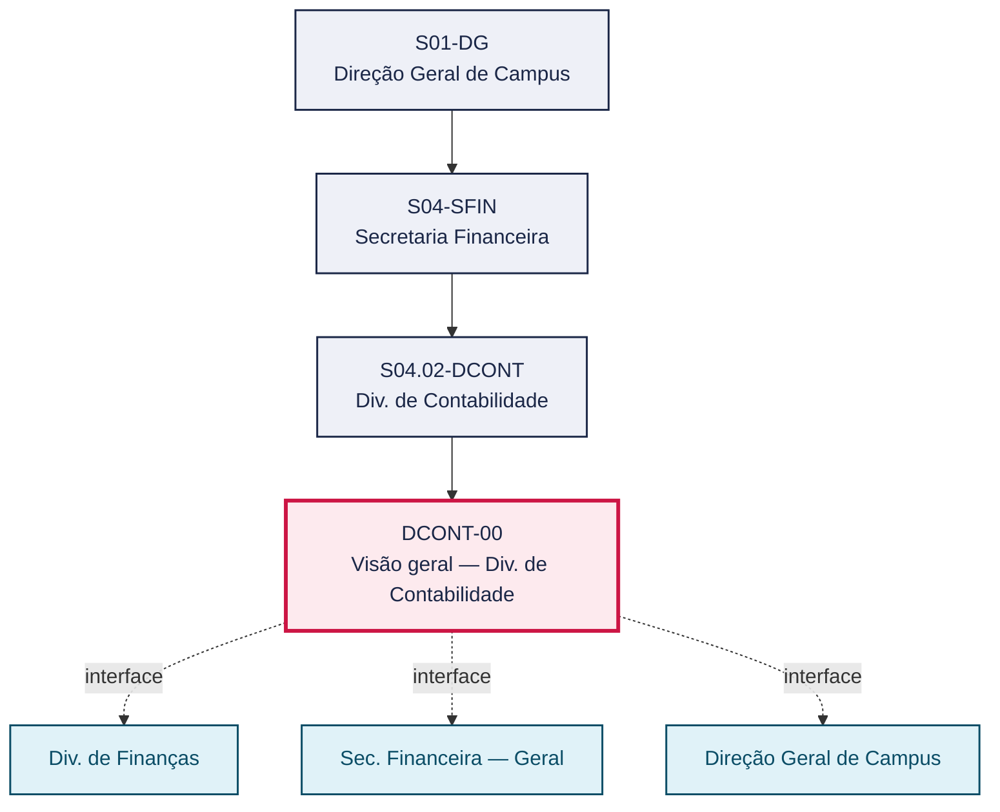
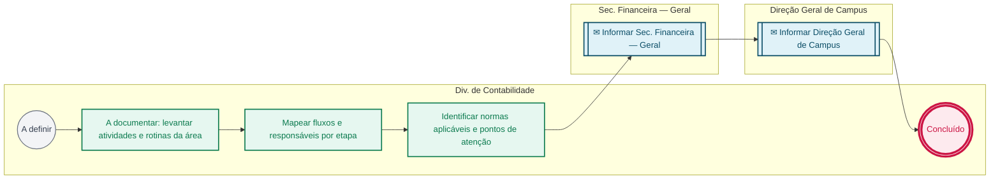

# POP DCONT-00 — Visão geral — Div. de Contabilidade

> **Documento vivo** · ATDG — Assessoria Técnica da Direção Geral · UNIOESTE Campus Foz do Iguaçu · Formato DDD híbrido + BPMN 2.0 padrão Anne Bail · Versão **0.2.0** · Status **rascunho** · Atualizado em 2026-09-03

## 0. Cabeçalho DDD

| Divisão | Departamento | Descrição |
|---|---|---|
| Secretaria Financeira | Div. de Contabilidade | Divisão de Contabilidade da Secretaria Financeira. Playbook em construção (empenho, conformidade e prestação de contas). |

| Domínio | Subdomínio | Tipo | Contexto delimitado |
|---|---|---|---|
| Finanças e Orçamento | Visão geral do setor (playbook) | core | S04.02-DCONT |

### 0.3 Linguagem ubíqua (glossário do processo)

Herda integralmente o glossário institucional (`diretrizes/09-glossario-institucional.md`); sem termos locais adicionais.

## 1. Identificação

| Campo | Valor |
|---|---|
| Código | DCONT-00 |
| Setor | Div. de Contabilidade (`S04.02-DCONT`) |
| Responsável (função) | A definir |
| Periodicidade | A definir |
| Subordinação | Secretaria Financeira |
| Normativa | A definir (normas contábeis públicas; TCE-PR) |
| Produto ATDG | POP |
| Pasta OneDrive | 03_MAPEAMENTO DE PROCESSOS |
| Fontes (entradas do Canvas) | pb-contabilidade |
| Lacunas abertas | responsavel, gatilho, entrada, saida, kpi, contingencia, formulario, prazo, interface_setorial |
| Agente responsável | — (não moldado) |

## 2. Organograma

## 3. Playbook

### 3.1 Gatilho (evento de domínio)

**A definir**

### 3.2 Entrada

— A definir

### 3.3 Passo a passo

| Nº | Ação | Responsável | Sistema | Artefato | Prazo | Evento |
|---|---|---|---|---|---|---|
| 1 | A documentar: levantar atividades e rotinas da área | A definir | — | Roteiro de levantamento (checklist ATDG) | A definir | — |
| 2 | Mapear fluxos e responsáveis por etapa | A definir | — | Mapa de fluxos preliminar | A definir | — |
| 3 | Identificar normas aplicáveis e pontos de atenção | A definir | — | Lista de normas aplicáveis (TCE-PR, normas contábeis) | A definir | — |

### 3.4 Saída (entregáveis)

— A definir

## 4. Formulários e artefatos (agregados)

| Nome | Tipo | Sistema | Campos-chave | Preenchimento |
|---|---|---|---|---|
| Roteiro de levantamento (checklist ATDG) | documento | Canvas Vivo ATDG | processo, responsável, sistema, artefato, prazo | A definir |

## 5. Decisões, exceções e pontos de atenção

— Sem decisões registradas

**Pontos de atenção**

- Área ainda não mapeada — playbook em construção

## 6. Contingência

- Caso não haja retorno do setor para a entrevista de levantamento, escalar a solicitação à Secretaria Financeira ou à Direção Geral do Campus.
- Na ausência de normativa própria confirmada, registrar como lacuna e citar apenas as referências genéricas já identificadas (normas contábeis públicas; TCE-PR) até validação.
- Se o processo de empenho depender de informação da Div. de Finanças ainda não documentada, registrar a dependência e priorizar o levantamento conjunto dos dois setores.

## 7. Checklist

- ( ) Confirmar com o setor a função/cargo responsável pela Div. de Contabilidade
- ( ) Levantar os sistemas efetivamente utilizados para empenho e prestação de contas
- ( ) Coletar modelos de documentos/registros de empenho e conformidade
- ( ) Registrar interfaces com a Div. de Finanças e a Secretaria Financeira

## 8. KPI / Indicadores

| Indicador | Fórmula | Meta | Fonte |
|---|---|---|---|
| Percentual de passos do playbook com responsável e sistema definidos | passos completos / total de passos × 100 | 100% até a validação do POP | pop.json do setor |
| Tempo até a primeira validação do roteiro de coleta | data da 1ª entrevista de levantamento − data de criação do roteiro | A definir | Registro de acompanhamento ATDG |

## 9. Mapa de contexto (interfaces inter-setoriais)

| Origem | Relação | Destino | Artefato | Canal |
|---|---|---|---|---|
| Div. de Contabilidade | recebe | Div. de Finanças | Processo de despesa com fonte/conta indicada (para empenho) | e-Protocolo |
| Div. de Contabilidade | informa | Sec. Financeira — Geral | Roteiro de levantamento de processos contábeis | Canvas Vivo ATDG |
| Div. de Contabilidade | informa | Direção Geral de Campus | Status do mapeamento de processos | e-mail institucional |

## 10. Fluxograma (BPMN 2.0 — padrão Anne Bail)

## 11. Especificação BPMN para o Miro

**Raias:** Div. de Contabilidade · Sec. Financeira — Geral · Direção Geral de Campus

| Id | Tipo | Elemento | Raia |
|---|---|---|---|
| e1 | inicio | A definir | Div. de Contabilidade |
| e2 | atividade | A documentar: levantar atividades e rotinas da área | Div. de Contabilidade |
| e3 | atividade | Mapear fluxos e responsáveis por etapa | Div. de Contabilidade |
| e4 | atividade | Identificar normas aplicáveis e pontos de atenção | Div. de Contabilidade |
| e5 | captura | Informar Sec. Financeira — Geral | Sec. Financeira — Geral |
| e6 | captura | Informar Direção Geral de Campus | Direção Geral de Campus |
| e7 | fim | Concluído | Div. de Contabilidade |

| De | Para | Rótulo |
|---|---|---|
| e1 | e2 | — |
| e2 | e3 | — |
| e3 | e4 | — |
| e4 | e5 | — |
| e5 | e6 | — |
| e6 | e7 | — |

_Especificação gerada a partir dos passos do POP; 3 raia(s). Revisar decisões e pausas antes de construir no Miro._

## 12. Histórico de versões

| Versão | Data | Autor | Tipo | Mudanças | Fontes |
|---|---|---|---|---|---|
| 0.1.0 | 2026-09-02 | scripts/scaffold_pops.py | patch | Esqueleto inicial gerado deterministicamente a partir das entradas pb-contabilidade | pb-contabilidade |
| 0.2.0 | 2026-09-03 | agente:construtor-pop (lote D1) | minor | Passo 1 alterado (sistema, artefato); Passo 2 alterado (sistema, artefato); Passo 3 alterado (sistema, artefato); artefatos_novos: +1; kpis_novos: +2; mapa_contexto_novo: +3; contingencia_nova: +3; checklist_novo: +4; Campo observacoes atualizado; Fluxograma regenerado a partir dos passos | pb-contabilidade |

## 13. Validação e aprovação

| Papel | Função / unidade | Data |
|---|---|---|
| Elaboração | ATDG — Assessoria Técnica da Direção Geral | 2026-09-02 |
| Revisão | A definir (responsável do setor) | ___/___/______ |
| Aprovação | Direção Geral do Campus | ___/___/______ |

## 14. Lições incorporadas

- **L-001** — Referir sempre função/cargo; nomes apenas no bloco 13 (Validação), com anuência (LGPD).
- **L-004** — Nunca regenerar POP existente: aplicar patch com changelog, fontes e versão.
- **L-006** — Preservar códigos legados como códigos de processo; não renumerar.
- **L-007** — Referência Externa é benchmark; normativa do POP só cita atos da Unioeste, do Estado do Paraná ou federais aplicáveis.
- **L-002** — Um passo = uma ação; ações compostas viram passos distintos.
- **L-003** — Cada linha do mapa de contexto gera um elemento `captura` no BPMN e um passo na raia de destino.

> **Observações:** Setor ainda não mapeado — roteiro de coleta.

---
_Canvas Vivo — Base de Conhecimento Institucional · ATDG · UNIOESTE Campus Foz do Iguaçu · gerado por `scripts/render_pop.py` a partir de `pops/DCONT/DCONT-00.pop.json` (diretrizes v1.2)._
