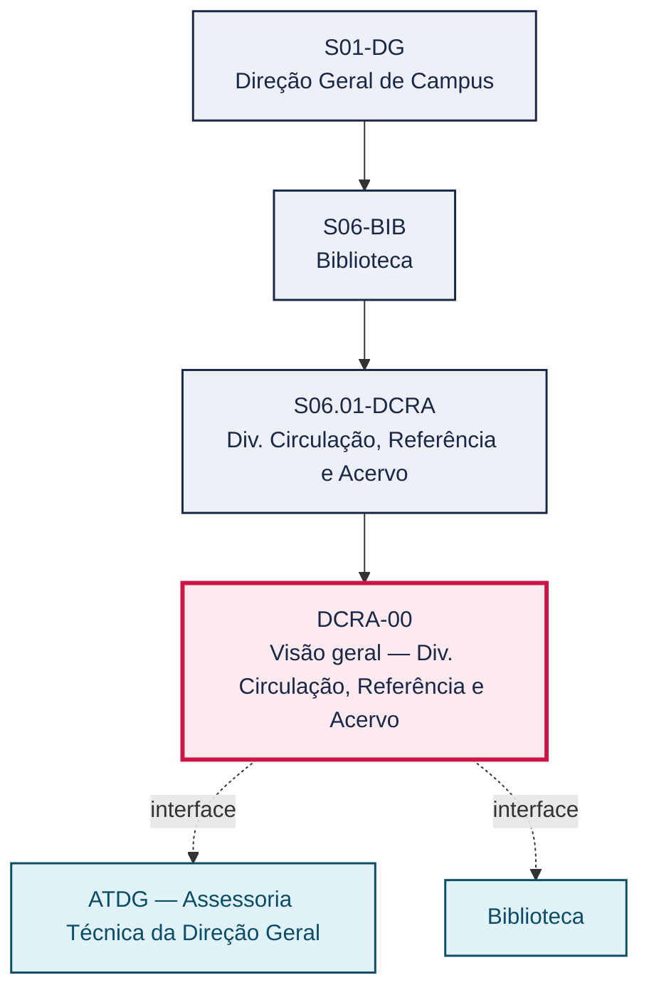

# POP DCRA-00 — Visão geral — Div. Circulação, Referência e Acervo

> **Documento vivo** · ATDG — Assessoria Técnica da Direção Geral · UNIOESTE Campus Foz do Iguaçu · Formato DDD híbrido + BPMN 2.0 padrão Anne Bail · Versão **0.2.0** · Status **rascunho** · Atualizado em 2026-09-03

## 0. Cabeçalho DDD

| Divisão | Departamento | Descrição |
|---|---|---|
| Biblioteca | Div. Circulação, Referência e Acervo | Estabelece o roteiro de coleta para o mapeamento das rotinas de circulação, referência, preservação e conservação do acervo da Biblioteca, a ser aplicado pela ATDG até que a Divisão tenha responsável, fluxos e normas formalmente definidos. |

| Domínio | Subdomínio | Tipo | Contexto delimitado |
|---|---|---|---|
| Informação e Acervo | Roteiro de coleta para mapeamento de processos (setor ainda não mapeado) | suporte | S06.01-DCRA |

### 0.3 Linguagem ubíqua (glossário do processo)

Herda integralmente o glossário institucional (`diretrizes/09-glossario-institucional.md`); sem termos locais adicionais.

## 1. Identificação

| Campo | Valor |
|---|---|
| Código | DCRA-00 |
| Setor | Div. Circulação, Referência e Acervo (`S06.01-DCRA`) |
| Responsável (função) | A definir |
| Periodicidade | A definir |
| Subordinação | Biblioteca |
| Normativa | A definir (regulamentos do Sistema de Bibliotecas da Unioeste) |
| Produto ATDG | POP |
| Pasta OneDrive | 03_MAPEAMENTO DE PROCESSOS |
| Fontes (entradas do Canvas) | pb-biblioteca-acervo |
| Lacunas abertas | responsavel, formulario, prazo |
| Agente responsável | pop-dcra-00 |

## 2. Organograma

## 3. Playbook

### 3.1 Gatilho (evento de domínio)

**Inclusão da Div. Circulação, Referência e Acervo no cronograma de mapeamento de processos da ATDG** — origem: ATDG — Assessoria Técnica da Direção Geral

### 3.2 Entrada

- Cronograma de mapeamento de processos da ATDG, com o questionário de atividades a ser respondido pela Divisão
- Contato institucional da Chefia da Divisão

### 3.3 Passo a passo

| Nº | Ação | Responsável | Sistema | Artefato | Prazo | Evento |
|---|---|---|---|---|---|---|
| 1 | Levantar, junto à Chefia da Divisão, as atividades e rotinas de circulação, referência e acervo | A definir | — | Roteiro de coleta preenchido | A definir | Atividades e rotinas levantadas |
| 2 | Mapear os fluxos e os responsáveis por etapa das rotinas de circulação, referência e preservação do acervo | A definir | — | Esboço de fluxo por rotina | A definir | Fluxos e responsáveis mapeados |
| 3 | Identificar as normas aplicáveis (regulamentos do Sistema de Bibliotecas) e os pontos de atenção da Divisão | A definir | — | Lista de normas e pontos de atenção | A definir | Normas e pontos de atenção identificados |
| 4 | Aplicar questionário de mapeamento de atividades à Chefia da Divisão de Circulação, Referência e Acervo | A definir | Microsoft Forms | Questionário de mapeamento de atividades | A definir | Questionário aplicado |
| 5 | Consolidar as respostas do questionário e as evidências documentais coletadas | A definir | Microsoft Forms | Planilha de consolidação de respostas | A definir | Respostas consolidadas |
| 6 | Elaborar playbook preliminar da Divisão com as lacunas identificadas | A definir | — | Playbook preliminar | A definir | Playbook preliminar elaborado |
| 7 | Submeter o roteiro de coleta e o playbook preliminar à Chefia da Biblioteca para validação | A definir | — | Playbook preliminar validado | A definir | Roteiro validado pela Chefia |

### 3.4 Saída (entregáveis)

- Roteiro de coleta aplicado, com respostas e evidências documentais consolidadas
- Playbook preliminar da Divisão submetido à validação da Chefia da Biblioteca

## 4. Formulários e artefatos (agregados)

| Nome | Tipo | Sistema | Campos-chave | Preenchimento |
|---|---|---|---|---|
| Questionário de mapeamento de atividades — Div. Circulação, Referência e Acervo | formulario | Microsoft Forms | atividade, frequência, sistema utilizado, norma aplicável | Bibliotecário(a)/Chefia da Divisão |
| Playbook preliminar — Div. Circulação, Referência e Acervo | documento | — | atividades levantadas, fluxos, lacunas | ATDG — Assessoria Técnica da Direção Geral |

## 5. Decisões, exceções e pontos de atenção

| Decisão | Condição | Sim → | Não → |
|---|---|---|---|
| A Chefia da Biblioteca validou o playbook preliminar da Divisão? | Análise da Chefia da Biblioteca sobre o conteúdo levantado no roteiro de coleta da Divisão | Consolidar o playbook preliminar como base para a elaboração do POP definitivo da Divisão | Retornar à Chefia da Divisão para complementação das informações e reaplicar o questionário nos pontos pendentes |

**Pontos de atenção**

- Área ainda não mapeada — playbook em construção
- Divisão ainda não possui responsável formalmente designado nem normativa própria além do regulamento do Sistema de Bibliotecas (a definir).
- Enquanto o roteiro de coleta não for concluído, este documento não substitui um POP operacional de circulação, referência e acervo.

## 6. Contingência

- Se a Chefia da Divisão não responder ao questionário no prazo combinado, a ATDG reenvia o formulário e registra o atraso nas lacunas do setor.
- Se não houver Chefia da Divisão formalmente designada no momento da coleta, aplicar o questionário à Chefia da Biblioteca.
- Se as evidências coletadas forem insuficientes para elaborar o playbook preliminar, registrar a lacuna e agendar nova rodada de coleta.

## 7. Checklist

- ( ) Cronograma de mapeamento da Divisão confirmado com a ATDG
- ( ) Questionário de mapeamento de atividades aplicado à Chefia da Divisão
- ( ) Respostas e evidências consolidadas em planilha
- ( ) Playbook preliminar elaborado e submetido à validação da Chefia da Biblioteca

## 8. KPI / Indicadores

| Indicador | Fórmula | Meta | Fonte |
|---|---|---|---|
| Percentual de questionários de mapeamento respondidos pela Divisão | Questionários respondidos / questionários aplicados × 100 | A definir | Microsoft Forms |
| Prazo decorrido até a validação do playbook preliminar pela Chefia da Biblioteca | Data de validação − data de aplicação do questionário | A definir | Registro da ATDG |

## 9. Mapa de contexto (interfaces inter-setoriais)

| Origem | Relação | Destino | Artefato | Canal |
|---|---|---|---|---|
| Div. Circulação, Referência e Acervo | fornece | ATDG — Assessoria Técnica da Direção Geral | Respostas do questionário de mapeamento e evidências documentais | Microsoft Forms |
| Div. Circulação, Referência e Acervo | informa | Biblioteca | Resultado do roteiro de coleta e playbook preliminar da Divisão | Reunião/e-mail institucional |

## 10. Fluxograma (BPMN 2.0 — padrão Anne Bail)

```mermaid
flowchart LR
  subgraph R1["Div. Circulação, Referência e Acervo"]
    direction LR
    e1(("Inclusão da Div. Circulação, Referência e Acervo no cronograma de map…"))
    e2["Levantar, junto à Chefia da Divisão, as atividades e rotinas de circu…"]
    e3["Mapear os fluxos e os responsáveis por etapa das rotinas de circulaçã…"]
    e4["Identificar as normas aplicáveis (regulamentos do Sistema de Bibliote…"]
    e5["Aplicar questionário de mapeamento de atividades à Chefia da Divisão…"]
    e6["Consolidar as respostas do questionário e as evidências documentais c…"]
    e7["Elaborar playbook preliminar da Divisão com as lacunas identificadas"]
    e8["Submeter o roteiro de coleta e o playbook preliminar à Chefia da Bibl…"]
    e11((("Roteiro de coleta aplicado, com respostas e evidências documentais co…")))
  end
  subgraph R2["ATDG — Assessoria Técnica da Direção Geral"]
    direction LR
    e9[["✉ Encaminhar a ATDG — Assessoria Técnica da Direção Geral"]]
  end
  subgraph R3["Biblioteca"]
    direction LR
    e10[["✉ Informar Biblioteca"]]
  end
  e1 --> e2
  e2 --> e3
  e3 --> e4
  e4 --> e5
  e5 --> e6
  e6 --> e7
  e7 --> e8
  e8 --> e9
  e9 --> e10
  e10 --> e11
  classDef inicio fill:#f3f4f6,stroke:#6b7280,stroke-width:1.5px,color:#374151
  classDef atividade fill:#E6F7F0,stroke:#0B7A4E,stroke-width:2px,color:#0B7A4E
  classDef decisao fill:#FFF4ED,stroke:#C9783A,stroke-width:2px,color:#C9783A
  classDef fim fill:#FDEAEE,stroke:#CC1544,stroke-width:4px,color:#CC1544
  classDef pausa fill:#FDEAEE,stroke:#CC1544,stroke-width:2px,color:#CC1544
  classDef captura fill:#E0F2F8,stroke:#0B4D66,stroke-width:2px,color:#0B4D66
  class e1 inicio
  class e2,e3,e4,e5,e6,e7,e8 atividade
  class e9,e10 captura
  class e11 fim
```

## 11. Especificação BPMN para o Miro

**Raias:** Div. Circulação, Referência e Acervo · ATDG — Assessoria Técnica da Direção Geral · Biblioteca

| Id | Tipo | Elemento | Raia |
|---|---|---|---|
| e1 | inicio | Inclusão da Div. Circulação, Referência e Acervo no cronograma de mapeamento de processos da ATDG | Div. Circulação, Referência e Acervo |
| e2 | atividade | Levantar, junto à Chefia da Divisão, as atividades e rotinas de circulação, referência e acervo | Div. Circulação, Referência e Acervo |
| e3 | atividade | Mapear os fluxos e os responsáveis por etapa das rotinas de circulação, referência e preservação do acervo | Div. Circulação, Referência e Acervo |
| e4 | atividade | Identificar as normas aplicáveis (regulamentos do Sistema de Bibliotecas) e os pontos de atenção da Divisão | Div. Circulação, Referência e Acervo |
| e5 | atividade | Aplicar questionário de mapeamento de atividades à Chefia da Divisão de Circulação, Referência e Acervo | Div. Circulação, Referência e Acervo |
| e6 | atividade | Consolidar as respostas do questionário e as evidências documentais coletadas | Div. Circulação, Referência e Acervo |
| e7 | atividade | Elaborar playbook preliminar da Divisão com as lacunas identificadas | Div. Circulação, Referência e Acervo |
| e8 | atividade | Submeter o roteiro de coleta e o playbook preliminar à Chefia da Biblioteca para validação | Div. Circulação, Referência e Acervo |
| e9 | captura | Encaminhar a ATDG — Assessoria Técnica da Direção Geral | ATDG — Assessoria Técnica da Direção Geral |
| e10 | captura | Informar Biblioteca | Biblioteca |
| e11 | fim | Roteiro de coleta aplicado, com respostas e evidências documentais consolidadas | Div. Circulação, Referência e Acervo |

| De | Para | Rótulo |
|---|---|---|
| e1 | e2 | — |
| e2 | e3 | — |
| e3 | e4 | — |
| e4 | e5 | — |
| e5 | e6 | — |
| e6 | e7 | — |
| e7 | e8 | — |
| e8 | e9 | — |
| e9 | e10 | — |
| e10 | e11 | — |

_Especificação gerada a partir dos passos do POP; 3 raia(s). Revisar decisões e pausas antes de construir no Miro._

## 12. Histórico de versões

| Versão | Data | Autor | Tipo | Mudanças | Fontes |
|---|---|---|---|---|---|
| 0.1.0 | 2026-09-02 | scripts/scaffold_pops.py | patch | Esqueleto inicial gerado deterministicamente a partir das entradas pb-biblioteca-acervo | pb-biblioteca-acervo |
| 0.2.0 | 2026-09-03 | agente:construtor-pop (lote D2) | minor | Passo 1 alterado (acao, sistema, artefato, prazo, evento); Passo 2 alterado (acao, sistema, artefato, prazo, evento); Passo 3 alterado (acao, sistema, artefato, prazo, evento); Passo adicionado após 3: Submeter o roteiro de coleta e o playbook preliminar à Chefia da Biblioteca para; Passo adicionado após 3: Elaborar playbook preliminar da Divisão com as lacunas identificadas; Passo adicionado após 3: Consolidar as respostas do questionário e as evidências documentais coletadas; Passo adicionado após 3: Aplicar questionário de mapeamento de atividades à Chefia da Divisão de Circulaç; entrada_nova: +2; saida_nova: +2; artefatos_novos: +2; decisoes_novas: +1; kpis_novos: +2; mapa_contexto_novo: +2; pontos_atencao_novos: +2; contingencia_nova: +3; checklist_novo: +4; Campo ddd.descricao atualizado; Campo ddd.subdominio atualizado; Campo playbook.gatilho atualizado; Campo observacoes atualizado; Fluxograma regenerado a partir dos passos | pb-biblioteca-acervo |

## 13. Validação e aprovação

| Papel | Função / unidade | Data |
|---|---|---|
| Elaboração | ATDG — Assessoria Técnica da Direção Geral | 2026-09-02 |
| Revisão | A definir (responsável do setor) | ___/___/______ |
| Aprovação | Direção Geral do Campus | ___/___/______ |

## 14. Lições incorporadas

- **L-001** — Referir sempre função/cargo; nomes apenas no bloco 13 (Validação), com anuência (LGPD).
- **L-004** — Nunca regenerar POP existente: aplicar patch com changelog, fontes e versão.
- **L-006** — Preservar códigos legados como códigos de processo; não renumerar.
- **L-007** — Referência Externa é benchmark; normativa do POP só cita atos da Unioeste, do Estado do Paraná ou federais aplicáveis.
- **L-002** — Um passo = uma ação; ações compostas viram passos distintos.
- **L-003** — Cada linha do mapa de contexto gera um elemento `captura` no BPMN e um passo na raia de destino.
- **L-005** — No diagnóstico, agrupar versões do mesmo documento e registrar lacuna `versao_documento`.

> **Observações:** Setor ainda não mapeado — roteiro de coleta.

---
_Canvas Vivo — Base de Conhecimento Institucional · ATDG · UNIOESTE Campus Foz do Iguaçu · gerado por `scripts/render_pop.py` a partir de `pops/DCRA/DCRA-00.pop.json` (diretrizes v1.0)._
