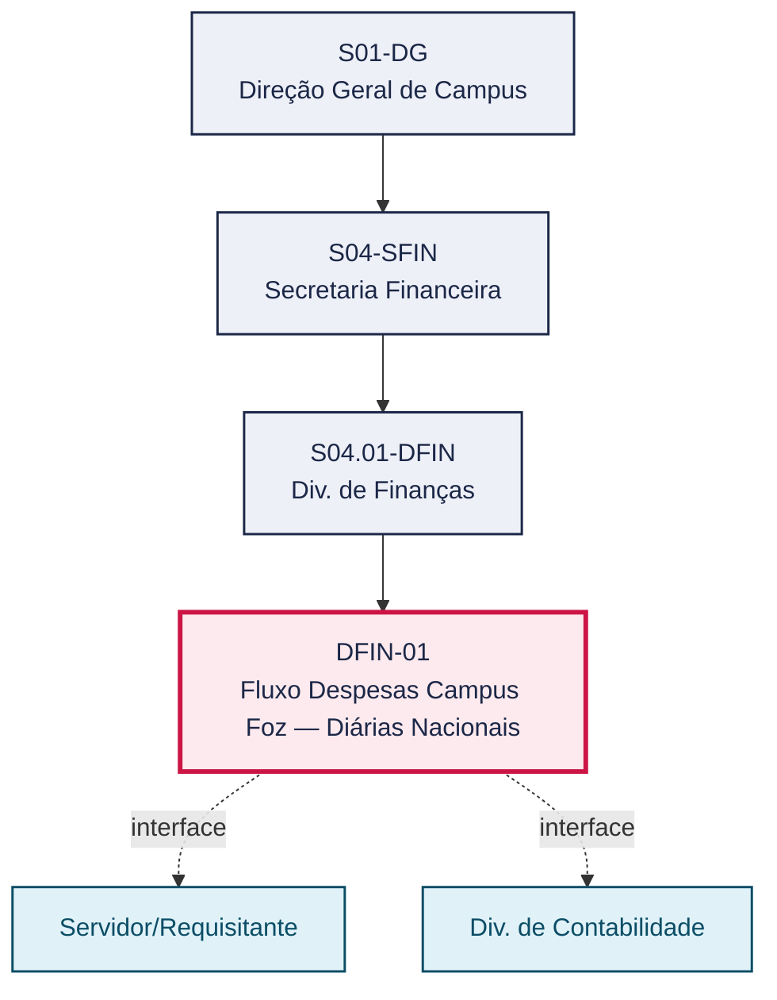
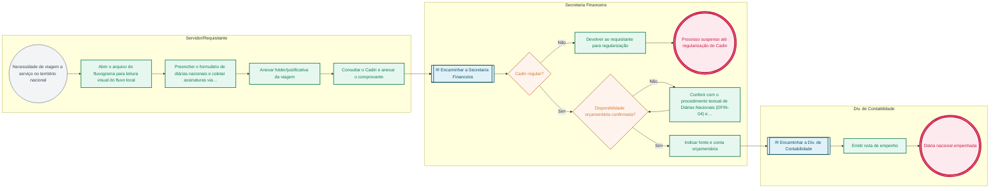

# POP DFIN-01 — Fluxo Despesas Campus Foz — Diárias Nacionais

> **Documento vivo** · ATDG — Assessoria Técnica da Direção Geral · UNIOESTE Campus Foz do Iguaçu · Formato DDD híbrido + BPMN 2.0 padrão Anne Bail · Versão **1.0.0** · Status **em_validacao** · Atualizado em 2026-09-03

## 0. Cabeçalho DDD

| Divisão | Departamento | Descrição |
|---|---|---|
| Secretaria Financeira | Div. de Finanças | Fluxograma específico do Campus Foz para a despesa de diárias nacionais, no âmbito do e-Protocolo. Arquivo em PDF no formato de imagem/diagrama, sem texto extraível automaticamente. Define a tramitação local do pedido de diárias até o pagamento; requer leitura visual para detalhamento das etapas. |

| Domínio | Subdomínio | Tipo | Contexto delimitado |
|---|---|---|---|
| Finanças e Orçamento | Fluxo Despesas Campus Foz — Diárias Nacionais | core | S04.01-DFIN |

### 0.3 Linguagem ubíqua (glossário do processo)

| Termo | Definição | Sistema |
|---|---|---|
| Cadin | Cadastro Informativo de créditos não quitados do setor público federal; consulta obrigatória para verificar pendências do beneficiário antes da concessão de diárias ou despesas de viagem. | Cadin |
| e-Protocolo | Sistema institucional de tramitação eletrônica de processos e documentos da Unioeste, usado para abrir, assinar e encaminhar solicitações de despesa. | e-Protocolo |
| Empenho | Ato administrativo que reserva o crédito orçamentário para a despesa, formalizado pela Div. de Contabilidade após a indicação de fonte e conta pela Secretaria Financeira. | Sistema orçamentário/contábil |
| PRAF | Pró-Reitoria de Administração e Finanças da Unioeste, responsável pelos formulários e procedimentos oficiais de despesas, diárias e viagens. | — |
| Folder/justificativa | Documento que detalha objetivo, roteiro e justificativa institucional da viagem ou despesa solicitada, anexado ao processo no e-Protocolo. | e-Protocolo |

## 1. Identificação

| Campo | Valor |
|---|---|
| Código | DFIN-01 |
| Setor | Div. de Finanças (`S04.01-DFIN`) |
| Responsável (função) | Chefe da Divisão de Finanças |
| Periodicidade | A definir |
| Subordinação | Secretaria Financeira |
| Normativa | Procedimentos de diárias — PRAF/Unioeste; Fluxograma: Fluxos e-Protocolo — Despesas, Campus Foz do Iguaçu: Diárias Nacionais (documento-fonte, formato imagem) |
| Produto ATDG | POP |
| Pasta OneDrive | 03_MAPEAMENTO DE PROCESSOS |
| Fontes (entradas do Canvas) | 1780963200040, 1780963200049 |
| Lacunas abertas | versao_documento, dados_pessoais_lgpd |
| Agente responsável | — (não moldado) |

## 2. Organograma

## 3. Playbook

### 3.1 Gatilho (evento de domínio)

**Necessidade de viagem a serviço no território nacional** — origem: Servidor/Requisitante

### 3.2 Entrada

- Solicitação de diárias nacionais

### 3.3 Passo a passo

| Nº | Ação | Responsável | Sistema | Artefato | Prazo | Evento |
|---|---|---|---|---|---|---|
| 1 | Abrir o arquivo do fluxograma para leitura visual do fluxo local | Servidor/Requisitante | e-Protocolo | Fluxograma — Diárias Nacionais (Campus Foz) | A definir | Fluxo consultado |
| 2 | Preencher o formulário de diárias nacionais e coletar assinaturas via e-Protocolo | Servidor/Requisitante | e-Protocolo | Formulário de Diárias Nacionais | Até a data-limite definida pela PRAF | Formulário assinado |
| 3 | Anexar folder/justificativa da viagem | Servidor/Requisitante | e-Protocolo | Folder/justificativa da viagem | Antes do encaminhamento à Secretaria Financeira | Documentação anexada |
| 4 | Consultar o Cadin do interessado e anexar o comprovante | Servidor/Requisitante | Cadin | Consulta Cadin | Antes do encaminhamento à Secretaria Financeira | Consulta Cadin anexada |
| 5 | Conferir com o procedimento textual de Diárias Nacionais (DFIN-04) e ajustar eventuais divergências | Secretaria Financeira | e-Protocolo | Processo de diárias nacionais | A definir | Fluxo conferido |
| 6 | Verificar a disponibilidade orçamentária para a diária nacional | Secretaria Financeira | e-Protocolo | Declaração de Disponibilidade Orçamentária e Financeira (DDF) | A definir | Disponibilidade confirmada |
| 7 | Indicar a fonte e a conta orçamentária da diária | Secretaria Financeira | e-Protocolo | Declaração de Disponibilidade Orçamentária e Financeira (DDF) | A definir | Fonte/conta indicada |
| 8 | Encaminhar o processo à Div. de Contabilidade para empenho | Secretaria Financeira | e-Protocolo | Processo de diárias nacionais | A definir | Processo encaminhado à Contabilidade |
| 9 | Emitir a nota de empenho da diária nacional | Div. de Contabilidade | Sistema orçamentário/contábil | Nota de Empenho | A definir | Diária nacional empenhada |

### 3.4 Saída (entregáveis)

- Processo de diárias nacionais empenhado pela Div. de Contabilidade

## 4. Formulários e artefatos (agregados)

| Nome | Tipo | Sistema | Campos-chave | Preenchimento |
|---|---|---|---|---|
| Formulário de Diárias Nacionais | formulario | e-Protocolo | dados do servidor, destino e período da viagem, quantidade de diárias, justificativa/folder, fonte e conta orçamentária | Servidor/Requisitante |
| Folder/justificativa da viagem | documento | e-Protocolo | objetivo da viagem, programação/roteiro, vínculo institucional do evento | Servidor/Requisitante |
| Consulta Cadin | registro | Cadin | CPF do beneficiário, situação (regular/irregular), data da consulta | Servidor/Requisitante |
| Declaração de Disponibilidade Orçamentária e Financeira (DDF) | documento | e-Protocolo | fonte de recursos, conta/elemento de despesa, valor disponível | Secretaria Financeira |
| Nota de Empenho | registro | Sistema orçamentário/contábil | número do empenho, credor, valor, fonte de recursos | Div. de Contabilidade |

## 5. Decisões, exceções e pontos de atenção

| Decisão | Condição | Sim → | Não → |
|---|---|---|---|
| Cadin regular? | A consulta ao Cadin do interessado retorna situação regular | Prosseguir com a verificação de disponibilidade orçamentária | Suspender o processo e notificar o interessado até a regularização |
| Disponibilidade orçamentária confirmada? | Há saldo na fonte/conta indicada para a despesa | Secretaria Financeira indica fonte/conta e encaminha à Div. de Contabilidade | Devolver ao requisitante ou acionar remanejamento orçamentário |

**Pontos de atenção**

- PDF em imagem — não indexável por texto
- Fluxo específico do Campus Foz
- A consulta ao Cadin é obrigatória e deve ser conferida tanto pelo interessado quanto pela Secretaria Financeira antes do encaminhamento à Contabilidade.
- Utilizar sempre os links e formulários oficiais da PRAF vigentes; versões desatualizadas geram devolução do processo.
- Os formulários e a consulta ao Cadin contêm dados pessoais (CPF, nome); observar a LGPD no manuseio, na tramitação e no arquivamento.
- Fluxo específico do Campus Foz; documento-fonte em PDF-imagem, sem texto extraível — conferir sempre com o procedimento textual DFIN-04.

## 6. Contingência

- Se a consulta ao Cadin indicar situação irregular, suspender o processo e notificar o interessado até a regularização.
- Se não houver disponibilidade orçamentária na fonte indicada, devolver o processo ao requisitante ou acionar a Secretaria Financeira para remanejamento antes do empenho.
- Se o e-Protocolo estiver indisponível, registrar a solicitação em meio alternativo (papel/e-mail institucional) e regularizar a tramitação eletrônica assim que o sistema for restabelecido.
- Em caso de urgência da viagem, priorizar a conferência do Cadin e da disponibilidade orçamentária para evitar atraso no empenho.

## 7. Checklist

- ( ) Formulário preenchido com todos os dados obrigatórios do servidor e da viagem/despesa
- ( ) Assinaturas coletadas via e-Protocolo (servidor e chefia imediata)
- ( ) Folder/justificativa anexado
- ( ) Consulta ao Cadin realizada e anexada, com situação regular
- ( ) Disponibilidade orçamentária conferida e fonte/conta indicada
- ( ) Processo encaminhado à Contabilidade com todos os anexos

## 8. KPI / Indicadores

| Indicador | Fórmula | Meta | Fonte |
|---|---|---|---|
| Tempo médio de tramitação da despesa (abertura → empenho) | Σ(data do empenho − data de abertura no e-Protocolo) / nº de processos no período | A definir | e-Protocolo |
| Percentual de processos devolvidos por pendência no Cadin ou na documentação | processos devolvidos / total de processos abertos × 100 | A definir | e-Protocolo |

## 9. Mapa de contexto (interfaces inter-setoriais)

| Origem | Relação | Destino | Artefato | Canal |
|---|---|---|---|---|
| Servidor/Requisitante | fornece | Div. de Finanças | Formulário de despesa e documentação anexa | e-Protocolo |
| Div. de Finanças | fornece | Div. de Contabilidade | Processo de despesa com fonte/conta indicada | e-Protocolo |
| Div. de Contabilidade | informa | Div. de Finanças | Nota de empenho | e-Protocolo |

## 10. Fluxograma (BPMN 2.0 — padrão Anne Bail)

## 11. Especificação BPMN para o Miro

**Raias:** Div. de Finanças · Servidor/Requisitante · Secretaria Financeira · Div. de Contabilidade

| Id | Tipo | Elemento | Raia |
|---|---|---|---|
| e1 | inicio | Necessidade de viagem a serviço no território nacional | Servidor/Requisitante |
| e2 | atividade | Abrir o arquivo do fluxograma para leitura visual do fluxo local | Servidor/Requisitante |
| e3 | atividade | Preencher o formulário de diárias nacionais e coletar assinaturas via e-Protocolo | Servidor/Requisitante |
| e4 | atividade | Anexar folder/justificativa da viagem | Servidor/Requisitante |
| e5 | atividade | Consultar o Cadin e anexar o comprovante | Servidor/Requisitante |
| e6 | captura | Encaminhar a Secretaria Financeira | Secretaria Financeira |
| e7 | decisao | Cadin regular? | Secretaria Financeira |
| e8 | atividade | Devolver ao requisitante para regularização | Secretaria Financeira |
| e9 | fim | Processo suspenso até regularização do Cadin | Secretaria Financeira |
| e10 | decisao | Disponibilidade orçamentária confirmada? | Secretaria Financeira |
| e11 | atividade | Conferir com o procedimento textual de Diárias Nacionais (DFIN-04) e ajustar | Secretaria Financeira |
| e12 | atividade | Indicar fonte e conta orçamentária | Secretaria Financeira |
| e13 | captura | Encaminhar a Div. de Contabilidade | Div. de Contabilidade |
| e14 | atividade | Emitir nota de empenho | Div. de Contabilidade |
| e15 | fim | Diária nacional empenhada | Div. de Contabilidade |

| De | Para | Rótulo |
|---|---|---|
| e1 | e2 | — |
| e2 | e3 | — |
| e3 | e4 | — |
| e4 | e5 | — |
| e5 | e6 | — |
| e6 | e7 | — |
| e7 | e8 | Não |
| e8 | e9 | — |
| e7 | e10 | Sim |
| e10 | e11 | Não |
| e11 | e10 | — |
| e10 | e12 | Sim |
| e12 | e13 | — |
| e13 | e14 | — |
| e14 | e15 | — |

_Especificação gerada a partir dos passos do POP; 1 raia(s). Revisar decisões e pausas antes de construir no Miro._

## 12. Histórico de versões

| Versão | Data | Autor | Tipo | Mudanças | Fontes |
|---|---|---|---|---|---|
| 0.1.0 | 2026-09-02 | scripts/scaffold_pops.py | patch | Esqueleto inicial gerado deterministicamente a partir das entradas 1780963200040 | 1780963200040 |
| 1.0.0 | 2026-09-03 | agente:construtor-pop (lote D1) | major | Passo 1 alterado (acao, responsavel, sistema, artefato, prazo, evento); Passo 2 alterado (acao, responsavel, sistema, artefato, prazo, evento); Passo 3 alterado (acao, responsavel, sistema, artefato, prazo, evento); Passo adicionado após 2: Anexar folder/justificativa da viagem; Passo adicionado após 2: Consultar o Cadin do interessado e anexar o comprovante; Passo adicionado após 3: Verificar a disponibilidade orçamentária para a diária nacional; Passo adicionado após 3: Indicar a fonte e a conta orçamentária da diária; Passo adicionado após 3: Encaminhar o processo à Div. de Contabilidade para empenho; Passo adicionado após 3: Emitir a nota de empenho da diária nacional; entrada_nova: +1; saida_nova: +1; artefatos_novos: +5; decisoes_novas: +2; kpis_novos: +2; mapa_contexto_novo: +3; pontos_atencao_novos: +4; contingencia_nova: +4; checklist_novo: +6; glossario_novo: +5; normativa_nova: +1; Campo identificacao.responsavel atualizado; Campo playbook.gatilho atualizado; Raias adicionadas: Servidor/Requisitante, Secretaria Financeira, Div. de Contabilidade; Elementos BPMN removidos: e1, e2, e3, e4, e5; Elementos BPMN adicionados: 15; Status promovido a em_validacao (≥ 3 passos e responsável definido) | 1780963200040, 1780963200049 |

## 13. Validação e aprovação

| Papel | Função / unidade | Data |
|---|---|---|
| Elaboração | ATDG — Assessoria Técnica da Direção Geral | 2026-09-02 |
| Revisão | A definir (responsável do setor) | ___/___/______ |
| Aprovação | Direção Geral do Campus | ___/___/______ |

## 14. Lições incorporadas

- **L-001** — Referir sempre função/cargo; nomes apenas no bloco 13 (Validação), com anuência (LGPD).
- **L-004** — Nunca regenerar POP existente: aplicar patch com changelog, fontes e versão.
- **L-006** — Preservar códigos legados como códigos de processo; não renumerar.
- **L-007** — Referência Externa é benchmark; normativa do POP só cita atos da Unioeste, do Estado do Paraná ou federais aplicáveis.
- **L-002** — Um passo = uma ação; ações compostas viram passos distintos.
- **L-003** — Cada linha do mapa de contexto gera um elemento `captura` no BPMN e um passo na raia de destino.

---
_Canvas Vivo — Base de Conhecimento Institucional · ATDG · UNIOESTE Campus Foz do Iguaçu · gerado por `scripts/render_pop.py` a partir de `pops/DFIN/DFIN-01.pop.json` (diretrizes v1.2)._
