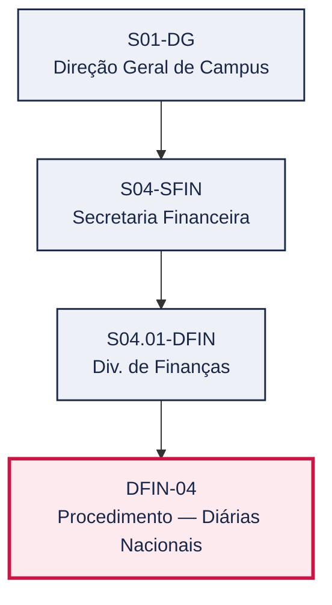

# POP DFIN-04 — Procedimento — Diárias Nacionais

> **Documento vivo** · ATDG — Assessoria Técnica da Direção Geral · UNIOESTE Campus Foz do Iguaçu · Formato DDD híbrido + BPMN 2.0 padrão Anne Bail · Versão **0.1.0** · Status **rascunho** · Atualizado em 2026-09-02

## 0. Cabeçalho DDD

| Divisão | Departamento | Descrição |
|---|---|---|
| Secretaria Financeira | Div. de Finanças | Procedimento textual para solicitação de diárias nacionais. O interessado preenche o formulário (link PRAF), coleta assinaturas via e-Protocolo, anexa folder/justificativa da viagem e consulta ao Cadin, e encaminha à Secretaria Financeira. Esta verifica o preenchimento e a disponibilidade orçamentária/financeira, indica fonte e conta, e encaminha à Contabilidade para empenho. |

| Domínio | Subdomínio | Tipo | Contexto delimitado |
|---|---|---|---|
| Finanças e Orçamento | Procedimento — Diárias Nacionais | core | S04.01-DFIN |

### 0.3 Linguagem ubíqua (glossário do processo)

Herda integralmente o glossário institucional (`diretrizes/09-glossario-institucional.md`); sem termos locais adicionais.

## 1. Identificação

| Campo | Valor |
|---|---|
| Código | DFIN-04 |
| Setor | Div. de Finanças (`S04.01-DFIN`) |
| Responsável (função) | A definir |
| Periodicidade | A definir |
| Subordinação | Secretaria Financeira |
| Normativa | Procedimentos de diárias — PRAF/Unioeste |
| Produto ATDG | POP |
| Pasta OneDrive | 03_MAPEAMENTO DE PROCESSOS |
| Fontes (entradas do Canvas) | 1780963200049 |
| Lacunas abertas | responsavel, gatilho, entrada, saida, kpi, contingencia, formulario, prazo |
| Agente responsável | — (não moldado) |

## 2. Organograma

## 3. Playbook

### 3.1 Gatilho (evento de domínio)

**A definir**

### 3.2 Entrada

— A definir

### 3.3 Passo a passo

| Nº | Ação | Responsável | Sistema | Artefato | Prazo | Evento |
|---|---|---|---|---|---|---|
| 1 | Preencher formulário de diárias nacionais (link PRAF) | A definir | — | — | A definir | — |
| 2 | Assinar e solicitar assinaturas via e-Protocolo | A definir | — | — | A definir | — |
| 3 | Anexar folder/justificativa e consulta ao Cadin do interessado | A definir | — | — | A definir | — |
| 4 | Encaminhar (C27) à Secretária Financeira para conferência e fonte | A definir | — | — | A definir | — |
| 5 | Encaminhar à Contabilidade para empenho | A definir | — | — | A definir | — |

### 3.4 Saída (entregáveis)

— A definir

## 4. Formulários e artefatos (agregados)

— A definir

## 5. Decisões, exceções e pontos de atenção

— Sem decisões registradas

**Pontos de atenção**

- Consulta ao Cadin é obrigatória (interessado e conferência)
- Verificar disponibilidade orçamentária antes do encaminhamento
- Usar os links oficiais de formulário e instrução de assinatura

## 6. Contingência

— A definir

## 7. Checklist

— A definir

## 8. KPI / Indicadores

— A definir

## 9. Mapa de contexto (interfaces inter-setoriais)

— Sem interfaces registradas

## 10. Fluxograma (BPMN 2.0 — padrão Anne Bail)

```mermaid
flowchart LR
  subgraph R1["Div. de Finanças"]
    direction LR
    e1(("A definir"))
    e2["Preencher formulário de diárias nacionais (link PRAF)"]
    e3["Assinar e solicitar assinaturas via e-Protocolo"]
    e4["Anexar folder/justificativa e consulta ao Cadin do interessado"]
    e5["Encaminhar (C27) à Secretária Financeira para conferência e fonte"]
    e6["Encaminhar à Contabilidade para empenho"]
    e7((("Concluído")))
  end
  e1 --> e2
  e2 --> e3
  e3 --> e4
  e4 --> e5
  e5 --> e6
  e6 --> e7
  classDef inicio fill:#f3f4f6,stroke:#6b7280,stroke-width:1.5px,color:#374151
  classDef atividade fill:#E6F7F0,stroke:#0B7A4E,stroke-width:2px,color:#0B7A4E
  classDef decisao fill:#FFF4ED,stroke:#C9783A,stroke-width:2px,color:#C9783A
  classDef fim fill:#FDEAEE,stroke:#CC1544,stroke-width:4px,color:#CC1544
  classDef pausa fill:#FDEAEE,stroke:#CC1544,stroke-width:2px,color:#CC1544
  classDef captura fill:#E0F2F8,stroke:#0B4D66,stroke-width:2px,color:#0B4D66
  class e1 inicio
  class e2,e3,e4,e5,e6 atividade
  class e7 fim
```

## 11. Especificação BPMN para o Miro

**Raias:** Div. de Finanças

| Id | Tipo | Elemento | Raia |
|---|---|---|---|
| e1 | inicio | A definir | Div. de Finanças |
| e2 | atividade | Preencher formulário de diárias nacionais (link PRAF) | Div. de Finanças |
| e3 | atividade | Assinar e solicitar assinaturas via e-Protocolo | Div. de Finanças |
| e4 | atividade | Anexar folder/justificativa e consulta ao Cadin do interessado | Div. de Finanças |
| e5 | atividade | Encaminhar (C27) à Secretária Financeira para conferência e fonte | Div. de Finanças |
| e6 | atividade | Encaminhar à Contabilidade para empenho | Div. de Finanças |
| e7 | fim | Concluído | Div. de Finanças |

| De | Para | Rótulo |
|---|---|---|
| e1 | e2 | — |
| e2 | e3 | — |
| e3 | e4 | — |
| e4 | e5 | — |
| e5 | e6 | — |
| e6 | e7 | — |

_Especificação gerada a partir dos passos do POP; 1 raia(s). Revisar decisões e pausas antes de construir no Miro._

## 12. Histórico de versões

| Versão | Data | Autor | Tipo | Mudanças | Fontes |
|---|---|---|---|---|---|
| 0.1.0 | 2026-09-02 | scripts/scaffold_pops.py | patch | Esqueleto inicial gerado deterministicamente a partir das entradas 1780963200049 | 1780963200049 |

## 13. Validação e aprovação

| Papel | Função / unidade | Data |
|---|---|---|
| Elaboração | ATDG — Assessoria Técnica da Direção Geral | 2026-09-02 |
| Revisão | A definir (responsável do setor) | ___/___/______ |
| Aprovação | Direção Geral do Campus | ___/___/______ |

## 14. Lições incorporadas

- **L-001** — Referir sempre função/cargo; nomes apenas no bloco 13 (Validação), com anuência (LGPD).
- **L-004** — Nunca regenerar POP existente: aplicar patch com changelog, fontes e versão.
- **L-006** — Preservar códigos legados como códigos de processo; não renumerar.
- **L-007** — Referência Externa é benchmark; normativa do POP só cita atos da Unioeste, do Estado do Paraná ou federais aplicáveis.

---
_Canvas Vivo — Base de Conhecimento Institucional · ATDG · UNIOESTE Campus Foz do Iguaçu · gerado por `scripts/render_pop.py` a partir de `pops/DFIN/DFIN-04.pop.json` (diretrizes v1.0)._
