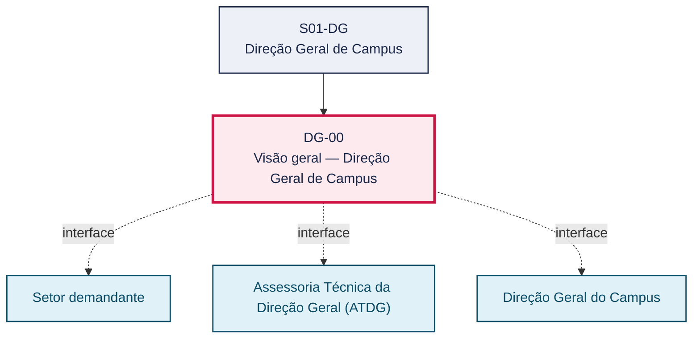
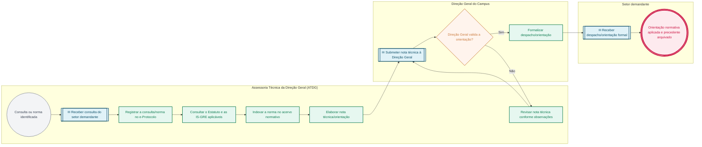

# POP DG-00 — Visão geral — Direção Geral de Campus

> **Documento vivo** · ATDG — Assessoria Técnica da Direção Geral · UNIOESTE Campus Foz do Iguaçu · Formato DDD híbrido + BPMN 2.0 padrão Anne Bail · Versão **1.0.0** · Status **em_validacao** · Atualizado em 2026-09-03

## 0. Cabeçalho DDD

| Divisão | Departamento | Descrição |
|---|---|---|
| Direção Geral de Campus | Direção Geral de Campus | Mantém e disponibiliza o acervo normativo institucional (Estatuto da Unioeste e Instruções de Serviço do GRE) e responde a consultas de setores do Campus sobre sua aplicação, sob validação da Direção Geral. |

| Domínio | Subdomínio | Tipo | Contexto delimitado |
|---|---|---|---|
| Governança e Direção do Campus | Visão geral do setor (playbook) | core | S01-DG |

### 0.3 Linguagem ubíqua (glossário do processo)

| Termo | Definição | Sistema |
|---|---|---|
| IS-GRE | Instrução de Serviço do Gabinete da Reitoria — ato normativo interno da Reitoria da Unioeste com orientações de caráter geral ou específico. | — |
| Acervo normativo | Conjunto indexado de normas institucionais (Estatuto, Instruções de Serviço) mantido pela ATDG para consulta. | OneDrive ATDG |

## 1. Identificação

| Campo | Valor |
|---|---|
| Código | DG-00 |
| Setor | Direção Geral de Campus (`S01-DG`) |
| Responsável (função) | Direção Geral do Campus |
| Periodicidade | Sob demanda (consulta ou norma nova/alterada) |
| Subordinação | Reitoria da Unioeste |
| Normativa | Resoluções 017/99-COU e 194/2024-COU (Estatuto); Instruções de Serviço GRE; Resolução nº 017/1999-COU (Estatuto da Unioeste); Resolução nº 194/2024-COU (altera a Resolução nº 017/1999-COU); Instruções de Serviço do Gabinete da Reitoria (GRE) |
| Produto ATDG | POP |
| Pasta OneDrive | 01_ADMINISTRATIVO |
| Fontes (entradas do Canvas) | pb-direcao-geral, 1780963200023, 1780963200024, 1780963200028, 1780963200029 |
| Lacunas abertas | formulario, prazo |
| Agente responsável | — (não moldado) |

## 2. Organograma

## 3. Playbook

### 3.1 Gatilho (evento de domínio)

**Norma institucional nova, revisada ou consultada (Estatuto ou Instrução de Serviço do GRE) identificada pela Direção Geral, pela ATDG ou por setor do Campus** — origem: Setor demandante ou Gabinete da Reitoria (GRE)

### 3.2 Entrada

- Estatuto da Unioeste (Res. 017/99-COU e alterações)
- Instruções de Serviço do GRE
- Consulta de setor sobre aplicação normativa

### 3.3 Passo a passo

| Nº | Ação | Responsável | Sistema | Artefato | Prazo | Evento |
|---|---|---|---|---|---|---|
| 1 | Receber e registrar a norma ou a consulta normativa recebida | Assessoria Técnica da Direção Geral (ATDG) | e-Protocolo | Ofício/memorando/consulta | A definir | Consulta ou norma registrada |
| 2 | Consultar o Estatuto para competências de órgãos e funções | Assessoria Técnica da Direção Geral (ATDG) | OneDrive ATDG | Estatuto da Unioeste (Res. 017/99-COU e 194/2024-COU) | A definir | Norma localizada e consultada |
| 3 | Aplicar as Instruções de Serviço do GRE pertinentes | Assessoria Técnica da Direção Geral (ATDG) | OneDrive ATDG | Instrução de Serviço do GRE aplicável | A definir | Norma identificada como aplicável |
| 4 | Observar as alterações do Estatuto (Res. 194/2024-COU) | Assessoria Técnica da Direção Geral (ATDG) | OneDrive ATDG | Quadro comparativo de alterações estatutárias | A definir | Alteração normativa registrada |
| 5 | Indexar e catalogar a norma no acervo normativo da ATDG | Assessoria Técnica da Direção Geral (ATDG) | OneDrive ATDG | Índice do acervo normativo | A definir | Norma indexada |
| 6 | Elaborar resposta técnica ou orientação com base no acervo normativo, quando houver consulta | Assessoria Técnica da Direção Geral (ATDG) | e-Protocolo | Nota técnica/orientação | A definir | Resposta técnica elaborada |
| 7 | Submeter a resposta técnica à Direção Geral do Campus para validação e formalização | Assessoria Técnica da Direção Geral (ATDG) | e-Protocolo | Nota técnica/orientação | A definir | Resposta submetida à validação |
| 8 | Comunicar a orientação normativa ao setor demandante e arquivar o precedente | Direção Geral do Campus | e-Protocolo | Ofício de resposta/registro de precedente | A definir | Orientação comunicada e precedente arquivado |

### 3.4 Saída (entregáveis)

- Acervo normativo consolidado e indexado (OneDrive ATDG)
- Resposta/orientação formal à consulta normativa do setor

## 4. Formulários e artefatos (agregados)

| Nome | Tipo | Sistema | Campos-chave | Preenchimento |
|---|---|---|---|---|
| Acervo normativo da ATDG (Estatuto e Instruções de Serviço do GRE) | registro | OneDrive ATDG | norma, número/ano, data de vigência, situação (vigente/alterada/revogada) | Assessoria Técnica da Direção Geral (ATDG) |
| Nota técnica/orientação normativa | documento | e-Protocolo | norma aplicável, situação analisada, conclusão/orientação | Assessoria Técnica da Direção Geral (ATDG) |

## 5. Decisões, exceções e pontos de atenção

| Decisão | Condição | Sim → | Não → |
|---|---|---|---|
| A Direção Geral valida a orientação normativa elaborada pela ATDG? | Nota técnica/orientação elaborada pela ATDG em resposta a consulta ou à identificação de norma aplicável | Formalizar o despacho/orientação e comunicar ao setor demandante | Devolver a nota técnica à ATDG para revisão e complementação |

**Pontos de atenção**

- Estatuto alterado pela Resolução 194/2024-COU
- Algumas normas estão em PDF imagem — consultar o original
- Confirmar a vigência da norma antes de aplicá-la a um caso concreto, dada a existência de alterações estatutárias (Res. 194/2024-COU)
- Normas digitalizadas em PDF-imagem exigem consulta ao documento original, pois não são indexáveis por texto

## 6. Contingência

- Norma citada em consulta não localizada no acervo: solicitar cópia oficial ao Gabinete da Reitoria (GRE) antes de responder
- Divergência de interpretação entre ATDG e setor demandante: submeter a questão à Direção Geral do Campus para decisão
- PDF da norma ilegível ou corrompido: registrar a ocorrência e buscar via oficial junto à Reitoria/GRE

## 7. Checklist

- ( ) Consulta ou norma registrada no e-Protocolo
- ( ) Norma localizada e vigência confirmada
- ( ) Nota técnica/orientação elaborada com fundamentação normativa explícita
- ( ) Validação da Direção Geral obtida antes da resposta ao setor demandante
- ( ) Precedente arquivado no acervo normativo da ATDG

## 8. KPI / Indicadores

| Indicador | Fórmula | Meta | Fonte |
|---|---|---|---|
| Tempo médio de resposta a consultas normativas | Média (data da resposta − data de registro da consulta) | A definir | e-Protocolo |
| Percentual de consultas com precedente registrado no acervo normativo | (Consultas com registro no acervo / total de consultas) × 100 | A definir | OneDrive ATDG |

## 9. Mapa de contexto (interfaces inter-setoriais)

| Origem | Relação | Destino | Artefato | Canal |
|---|---|---|---|---|
| Setor demandante | fornece | Assessoria Técnica da Direção Geral (ATDG) | Consulta sobre aplicação normativa | e-Protocolo/e-mail institucional |
| Assessoria Técnica da Direção Geral (ATDG) | aprova | Direção Geral do Campus | Nota técnica/orientação | e-Protocolo |
| Direção Geral do Campus | informa | Setor demandante | Despacho/orientação formal | e-Protocolo |

## 10. Fluxograma (BPMN 2.0 — padrão Anne Bail)

## 11. Especificação BPMN para o Miro

**Raias:** Assessoria Técnica da Direção Geral (ATDG) · Direção Geral do Campus · Setor demandante

| Id | Tipo | Elemento | Raia |
|---|---|---|---|
| e1 | inicio | Consulta ou norma identificada | Assessoria Técnica da Direção Geral (ATDG) |
| e2 | captura | Receber consulta do setor demandante | Assessoria Técnica da Direção Geral (ATDG) |
| e3 | atividade | Registrar a consulta/norma no e-Protocolo | Assessoria Técnica da Direção Geral (ATDG) |
| e4 | atividade | Consultar o Estatuto e as IS-GRE aplicáveis | Assessoria Técnica da Direção Geral (ATDG) |
| e5 | atividade | Indexar a norma no acervo normativo | Assessoria Técnica da Direção Geral (ATDG) |
| e6 | atividade | Elaborar nota técnica/orientação | Assessoria Técnica da Direção Geral (ATDG) |
| e7 | captura | Submeter nota técnica à Direção Geral | Direção Geral do Campus |
| e8 | decisao | Direção Geral valida a orientação? | Direção Geral do Campus |
| e9 | atividade | Revisar nota técnica conforme observações | Assessoria Técnica da Direção Geral (ATDG) |
| e10 | atividade | Formalizar despacho/orientação | Direção Geral do Campus |
| e11 | captura | Receber despacho/orientação formal | Setor demandante |
| e12 | fim | Orientação normativa aplicada e precedente arquivado | Setor demandante |

| De | Para | Rótulo |
|---|---|---|
| e1 | e2 | — |
| e2 | e3 | — |
| e3 | e4 | — |
| e4 | e5 | — |
| e5 | e6 | — |
| e6 | e7 | — |
| e7 | e8 | — |
| e8 | e9 | Não |
| e9 | e7 | — |
| e8 | e10 | Sim |
| e10 | e11 | — |
| e11 | e12 | — |

_Especificação gerada a partir dos passos do POP; 1 raia(s). Revisar decisões e pausas antes de construir no Miro._

## 12. Histórico de versões

| Versão | Data | Autor | Tipo | Mudanças | Fontes |
|---|---|---|---|---|---|
| 0.1.0 | 2026-09-02 | scripts/scaffold_pops.py | patch | Esqueleto inicial gerado deterministicamente a partir das entradas pb-direcao-geral | pb-direcao-geral |
| 1.0.0 | 2026-09-03 | agente:construtor-pop (lote B) | major | Passo 1 alterado (responsavel, sistema, artefato, prazo, evento, fontes); Passo 2 alterado (responsavel, sistema, artefato, prazo, evento, fontes); Passo 3 alterado (responsavel, sistema, artefato, prazo, evento, fontes); Passo adicionado após 0: Receber e registrar a norma ou a consulta normativa recebida; Passo adicionado após 3: Indexar e catalogar a norma no acervo normativo da ATDG; Passo adicionado após 4: Elaborar resposta técnica ou orientação com base no acervo normativo, quando hou; Passo adicionado após 5: Submeter a resposta técnica à Direção Geral do Campus para validação e formaliza; Passo adicionado após 6: Comunicar a orientação normativa ao setor demandante e arquivar o precedente; entrada_nova: +3; saida_nova: +2; artefatos_novos: +2; decisoes_novas: +1; kpis_novos: +2; mapa_contexto_novo: +3; pontos_atencao_novos: +2; contingencia_nova: +3; checklist_novo: +5; glossario_novo: +2; normativa_nova: +3; Campo ddd.descricao atualizado; Campo identificacao.responsavel atualizado; Campo identificacao.periodicidade atualizado; Campo playbook.gatilho atualizado; Raias adicionadas: Assessoria Técnica da Direção Geral (ATDG), Direção Geral do Campus, Setor demandante; Elementos BPMN removidos: e1, e2, e3, e4, e5; Elementos BPMN adicionados: 12; Status promovido a em_validacao (≥ 3 passos e responsável definido) | pb-direcao-geral, 1780963200023, 1780963200024, 1780963200028, 1780963200029 |

## 13. Validação e aprovação

| Papel | Função / unidade | Data |
|---|---|---|
| Elaboração | ATDG — Assessoria Técnica da Direção Geral | 2026-09-02 |
| Revisão | A definir (responsável do setor) | ___/___/______ |
| Aprovação | Direção Geral do Campus | ___/___/______ |

## 14. Lições incorporadas

- **L-001** — Referir sempre função/cargo; nomes apenas no bloco 13 (Validação), com anuência (LGPD).
- **L-004** — Nunca regenerar POP existente: aplicar patch com changelog, fontes e versão.
- **L-006** — Preservar códigos legados como códigos de processo; não renumerar.
- **L-007** — Referência Externa é benchmark; normativa do POP só cita atos da Unioeste, do Estado do Paraná ou federais aplicáveis.
- **L-002** — Um passo = uma ação; ações compostas viram passos distintos.
- **L-003** — Cada linha do mapa de contexto gera um elemento `captura` no BPMN e um passo na raia de destino.

---
_Canvas Vivo — Base de Conhecimento Institucional · ATDG · UNIOESTE Campus Foz do Iguaçu · gerado por `scripts/render_pop.py` a partir de `pops/DG/DG-00.pop.json` (diretrizes v1.8)._
