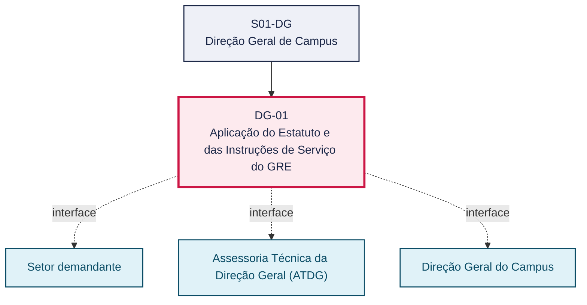
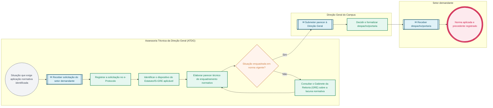

# POP DG-01 — Aplicação do Estatuto e das Instruções de Serviço do GRE

> **Documento vivo** · ATDG — Assessoria Técnica da Direção Geral · UNIOESTE Campus Foz do Iguaçu · Formato DDD híbrido + BPMN 2.0 padrão Anne Bail · Versão **1.0.0** · Status **em_validacao** · Atualizado em 2026-09-03

## 0. Cabeçalho DDD

| Divisão | Departamento | Descrição |
|---|---|---|
| Direção Geral de Campus | Direção Geral de Campus | Aplicação do Estatuto e das Instruções de Serviço do GRE. Processo codificado no manual institucional da ATDG (jun/2026); conteúdo operacional a documentar. |

| Domínio | Subdomínio | Tipo | Contexto delimitado |
|---|---|---|---|
| Governança e Direção do Campus | Aplicação do Estatuto e das Instruções de Serviço do GRE | core | S01-DG |

### 0.3 Linguagem ubíqua (glossário do processo)

| Termo | Definição | Sistema |
|---|---|---|
| Precedente normativo | Registro de uma decisão de aplicação de norma a um caso concreto, mantido para orientar casos semelhantes futuros. | OneDrive ATDG |

## 1. Identificação

| Campo | Valor |
|---|---|
| Código | DG-01 |
| Setor | Direção Geral de Campus (`S01-DG`) |
| Responsável (função) | Direção Geral do Campus |
| Periodicidade | Sob demanda |
| Subordinação | Reitoria da Unioeste |
| Normativa | Resolução nº 017/1999-COU (Estatuto da Unioeste); Resolução nº 194/2024-COU (altera a Resolução nº 017/1999-COU); Instruções de Serviço do Gabinete da Reitoria (GRE) |
| Produto ATDG | POP |
| Pasta OneDrive | 01_ADMINISTRATIVO |
| Fontes (entradas do Canvas) | pb-direcao-geral, 1780963200023, 1780963200024, 1780963200028, 1780963200029 |
| Lacunas abertas | formulario, prazo |
| Agente responsável | — (não moldado) |

## 2. Organograma

## 3. Playbook

### 3.1 Gatilho (evento de domínio)

**Situação concreta do Campus que exige aplicação ou interpretação do Estatuto ou de Instrução de Serviço do GRE (definição de competência, criação/alteração de órgão, dúvida de procedimento)** — origem: Setor demandante ou iniciativa da própria Direção Geral

### 3.2 Entrada

- Solicitação/consulta do setor sobre competência ou procedimento
- Estatuto da Unioeste (Res. 017/99-COU e 194/2024-COU)
- Instrução de Serviço do GRE aplicável ao caso

### 3.3 Passo a passo

| Nº | Ação | Responsável | Sistema | Artefato | Prazo | Evento |
|---|---|---|---|---|---|---|
| 1 | Registrar a solicitação ou identificar a situação que exige aplicação normativa | Assessoria Técnica da Direção Geral (ATDG) | e-Protocolo | Memorando/ofício de solicitação | A definir | Situação registrada |
| 2 | Identificar o dispositivo do Estatuto ou da Instrução de Serviço do GRE aplicável ao caso | Assessoria Técnica da Direção Geral (ATDG) | OneDrive ATDG | Estatuto/IS-GRE | A definir | Dispositivo identificado |
| 3 | Elaborar parecer técnico de enquadramento normativo | Assessoria Técnica da Direção Geral (ATDG) | e-Protocolo | Parecer técnico | A definir | Parecer elaborado |
| 4 | Submeter o parecer técnico à Direção Geral do Campus para decisão | Assessoria Técnica da Direção Geral (ATDG) | e-Protocolo | Parecer técnico | A definir | Parecer submetido |
| 5 | Decidir sobre a aplicação da norma ao caso concreto | Direção Geral do Campus | e-Protocolo | Despacho decisório | A definir | Decisão proferida |
| 6 | Formalizar o despacho ou a portaria de aplicação da norma | Direção Geral do Campus | e-Protocolo | Despacho/portaria | A definir | Ato formalizado |
| 7 | Comunicar o ato ao setor demandante e registrar o precedente no acervo normativo | Assessoria Técnica da Direção Geral (ATDG) | OneDrive ATDG | Registro de precedente | A definir | Precedente registrado |

### 3.4 Saída (entregáveis)

- Despacho/portaria de aplicação da norma ao caso concreto
- Registro do precedente no acervo normativo da ATDG

## 4. Formulários e artefatos (agregados)

| Nome | Tipo | Sistema | Campos-chave | Preenchimento |
|---|---|---|---|---|
| Parecer técnico de enquadramento normativo | documento | e-Protocolo | situação analisada, dispositivo aplicável, conclusão | Assessoria Técnica da Direção Geral (ATDG) |
| Despacho/portaria de aplicação da norma | documento | e-Protocolo | ato normativo aplicado, decisão, data | Direção Geral do Campus |

## 5. Decisões, exceções e pontos de atenção

| Decisão | Condição | Sim → | Não → |
|---|---|---|---|
| A situação está devidamente enquadrada no Estatuto ou em Instrução de Serviço do GRE vigente? | Parecer técnico de enquadramento normativo elaborado pela ATDG | Submeter o parecer à Direção Geral do Campus para decisão e formalização do ato | Consultar o Gabinete da Reitoria (GRE) para orientação sobre a lacuna normativa identificada |

**Pontos de atenção**

- Situações não previstas expressamente no Estatuto ou nas IS-GRE exigem consulta prévia ao Gabinete da Reitoria antes da decisão
- Verificar se a competência tratada foi alterada pela Res. 194/2024-COU

## 6. Contingência

- Lacuna normativa identificada: suspender a decisão e consultar o Gabinete da Reitoria (GRE)
- Norma referenciada não localizada no acervo: solicitar via oficial à Reitoria antes de prosseguir
- Divergência entre o parecer da ATDG e o entendimento do setor demandante: submeter à Direção Geral para decisão final

## 7. Checklist

- ( ) Situação registrada no e-Protocolo
- ( ) Dispositivo normativo aplicável identificado e citado com precisão
- ( ) Parecer técnico de enquadramento elaborado
- ( ) Decisão da Direção Geral formalizada em despacho/portaria
- ( ) Precedente registrado no acervo normativo da ATDG

## 8. KPI / Indicadores

| Indicador | Fórmula | Meta | Fonte |
|---|---|---|---|
| Tempo médio entre o registro da solicitação e a formalização do despacho | Média (data do despacho − data de registro) | A definir | e-Protocolo |
| Percentual de casos com precedente registrado no acervo normativo | (Casos com precedente registrado / total de casos) × 100 | A definir | OneDrive ATDG |

## 9. Mapa de contexto (interfaces inter-setoriais)

| Origem | Relação | Destino | Artefato | Canal |
|---|---|---|---|---|
| Setor demandante | fornece | Assessoria Técnica da Direção Geral (ATDG) | Memorando/ofício de solicitação | e-Protocolo |
| Assessoria Técnica da Direção Geral (ATDG) | aprova | Direção Geral do Campus | Parecer técnico de enquadramento normativo | e-Protocolo |
| Direção Geral do Campus | informa | Setor demandante | Despacho/portaria de aplicação da norma | e-Protocolo |

## 10. Fluxograma (BPMN 2.0 — padrão Anne Bail)

## 11. Especificação BPMN para o Miro

**Raias:** Assessoria Técnica da Direção Geral (ATDG) · Direção Geral do Campus · Setor demandante

| Id | Tipo | Elemento | Raia |
|---|---|---|---|
| e1 | inicio | Situação que exige aplicação normativa identificada | Assessoria Técnica da Direção Geral (ATDG) |
| e2 | captura | Receber solicitação do setor demandante | Assessoria Técnica da Direção Geral (ATDG) |
| e3 | atividade | Registrar a solicitação no e-Protocolo | Assessoria Técnica da Direção Geral (ATDG) |
| e4 | atividade | Identificar o dispositivo do Estatuto/IS-GRE aplicável | Assessoria Técnica da Direção Geral (ATDG) |
| e5 | atividade | Elaborar parecer técnico de enquadramento normativo | Assessoria Técnica da Direção Geral (ATDG) |
| e6 | decisao | Situação enquadrada em norma vigente? | Assessoria Técnica da Direção Geral (ATDG) |
| e7 | atividade | Consultar o Gabinete da Reitoria (GRE) sobre a lacuna normativa | Assessoria Técnica da Direção Geral (ATDG) |
| e8 | captura | Submeter parecer à Direção Geral | Direção Geral do Campus |
| e9 | atividade | Decidir e formalizar despacho/portaria | Direção Geral do Campus |
| e10 | captura | Receber despacho/portaria | Setor demandante |
| e11 | fim | Norma aplicada e precedente registrado | Setor demandante |

| De | Para | Rótulo |
|---|---|---|
| e1 | e2 | — |
| e2 | e3 | — |
| e3 | e4 | — |
| e4 | e5 | — |
| e5 | e6 | — |
| e6 | e7 | Não |
| e7 | e5 | — |
| e6 | e8 | Sim |
| e8 | e9 | — |
| e9 | e10 | — |
| e10 | e11 | — |

_Especificação gerada a partir dos passos do POP; 1 raia(s). Revisar decisões e pausas antes de construir no Miro._

## 12. Histórico de versões

| Versão | Data | Autor | Tipo | Mudanças | Fontes |
|---|---|---|---|---|---|
| 0.1.0 | 2026-09-02 | scripts/scaffold_pops.py | patch | Esqueleto inicial gerado deterministicamente | — |
| 1.0.0 | 2026-09-03 | agente:construtor-pop (lote B) | major | Passo adicionado após 0: Registrar a solicitação ou identificar a situação que exige aplicação normativa; Passo adicionado após 1: Identificar o dispositivo do Estatuto ou da Instrução de Serviço do GRE aplicáve; Passo adicionado após 2: Elaborar parecer técnico de enquadramento normativo; Passo adicionado após 3: Submeter o parecer técnico à Direção Geral do Campus para decisão; Passo adicionado após 4: Decidir sobre a aplicação da norma ao caso concreto; Passo adicionado após 5: Formalizar o despacho ou a portaria de aplicação da norma; Passo adicionado após 6: Comunicar o ato ao setor demandante e registrar o precedente no acervo normativo; entrada_nova: +3; saida_nova: +2; artefatos_novos: +2; decisoes_novas: +1; kpis_novos: +2; mapa_contexto_novo: +3; pontos_atencao_novos: +2; contingencia_nova: +3; checklist_novo: +5; glossario_novo: +1; normativa_nova: +3; Campo identificacao.responsavel atualizado; Campo identificacao.periodicidade atualizado; Campo playbook.gatilho atualizado; Raias adicionadas: Assessoria Técnica da Direção Geral (ATDG), Direção Geral do Campus, Setor demandante; Elementos BPMN removidos: e1, e2; Elementos BPMN adicionados: 11; Status promovido a em_validacao (≥ 3 passos e responsável definido) | pb-direcao-geral, 1780963200023, 1780963200024, 1780963200028, 1780963200029 |

## 13. Validação e aprovação

| Papel | Função / unidade | Data |
|---|---|---|
| Elaboração | ATDG — Assessoria Técnica da Direção Geral | 2026-09-02 |
| Revisão | A definir (responsável do setor) | ___/___/______ |
| Aprovação | Direção Geral do Campus | ___/___/______ |

## 14. Lições incorporadas

- **L-001** — Referir sempre função/cargo; nomes apenas no bloco 13 (Validação), com anuência (LGPD).
- **L-004** — Nunca regenerar POP existente: aplicar patch com changelog, fontes e versão.
- **L-006** — Preservar códigos legados como códigos de processo; não renumerar.
- **L-007** — Referência Externa é benchmark; normativa do POP só cita atos da Unioeste, do Estado do Paraná ou federais aplicáveis.
- **L-002** — Um passo = uma ação; ações compostas viram passos distintos.
- **L-003** — Cada linha do mapa de contexto gera um elemento `captura` no BPMN e um passo na raia de destino.

---
_Canvas Vivo — Base de Conhecimento Institucional · ATDG · UNIOESTE Campus Foz do Iguaçu · gerado por `scripts/render_pop.py` a partir de `pops/DG/DG-01.pop.json` (diretrizes v1.8)._
