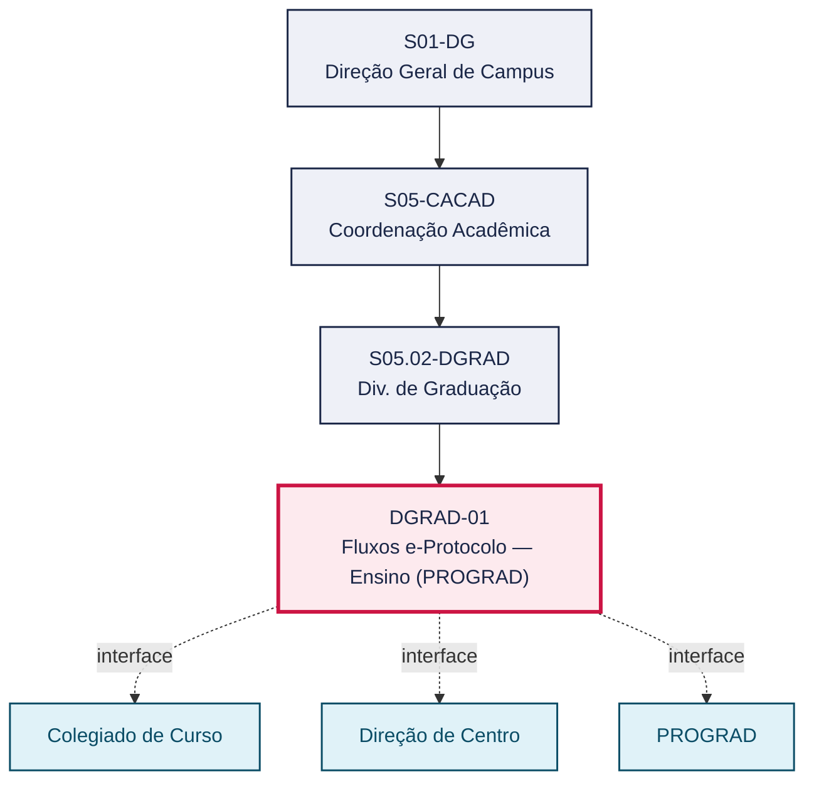
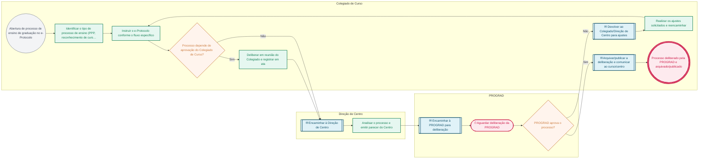

# POP DGRAD-01 — Fluxos e-Protocolo — Ensino (PROGRAD)

> **Documento vivo** · ATDG — Assessoria Técnica da Direção Geral · UNIOESTE Campus Foz do Iguaçu · Formato DDD híbrido + BPMN 2.0 padrão Anne Bail · Versão **1.0.0** · Status **em_validacao** · Atualizado em 2026-09-03

## 0. Cabeçalho DDD

| Divisão | Departamento | Descrição |
|---|---|---|
| Coordenação Acadêmica | Div. de Graduação | Manual da Comissão e-Protocolo com os fluxos dos processos da área de Ensino sob a PROGRAD. Cobre, entre outros, alteração de resoluções de ensino, regulamentos de bibliotecas, PPP (alteração e novo curso), reconhecimento/renovação de curso, regulamentos de estágio/TCC/internato, projetos de ensino e monitorias (voluntárias e remuneradas). Referência para tramitação correta de processos acadêmicos no e-Protocolo. |

| Domínio | Subdomínio | Tipo | Contexto delimitado |
|---|---|---|---|
| Gestão Acadêmica | Fluxos e-Protocolo — Ensino (PROGRAD) | core | S05.02-DGRAD |

### 0.3 Linguagem ubíqua (glossário do processo)

| Termo | Definição | Sistema |
|---|---|---|
| e-Protocolo | Sistema institucional de tramitação eletrônica de processos e documentos da Unioeste. | e-Protocolo |
| PROGRAD | Pró-Reitoria de Ensino da Unioeste, responsável por deliberar sobre processos de ensino de graduação (PPP, reconhecimento de curso, regulamentos, projetos de ensino e monitorias). | — |
| PPP | Projeto Pedagógico de Curso — documento que define a estrutura curricular e pedagógica de um curso de graduação. | — |
| Monitoria | Atividade de apoio ao ensino exercida por discente, nas modalidades voluntária ou remunerada, vinculada a um projeto de ensino. | — |

## 1. Identificação

| Campo | Valor |
|---|---|
| Código | DGRAD-01 |
| Setor | Div. de Graduação (`S05.02-DGRAD`) |
| Responsável (função) | Coordenação Acadêmica |
| Periodicidade | A definir |
| Subordinação | Coordenação Acadêmica |
| Normativa | Manual de Fluxos e-Protocolo — PROGRAD/Unioeste; FLUXO_DE_PROCESSOS_ENSINO_pdf_PROGRAD_-_Atualizado.pdf — Manual da Comissão e-Protocolo (documento-fonte) |
| Produto ATDG | POP |
| Pasta OneDrive | 03_MAPEAMENTO DE PROCESSOS |
| Fontes (entradas do Canvas) | 1780963200038 |
| Lacunas abertas | interface_setorial, versao_documento |
| Agente responsável | — (não moldado) |

## 2. Organograma

## 3. Playbook

### 3.1 Gatilho (evento de domínio)

**Abertura de processo de ensino de graduação no e-Protocolo** — origem: Colegiado de Curso

### 3.2 Entrada

- Processo de ensino de graduação instruído conforme o fluxo específico

### 3.3 Passo a passo

| Nº | Ação | Responsável | Sistema | Artefato | Prazo | Evento |
|---|---|---|---|---|---|---|
| 1 | Identificar o tipo de processo de ensino (alteração de resolução/regulamento, PPP, reconhecimento/renovação de curso, regulamento de estágio/TCC/internato, projeto de ensino ou monitoria) | Colegiado de Curso | e-Protocolo | Processo de ensino (PPP/regulamento/projeto/monitoria) | Antes da abertura do e-Protocolo | Tipo de processo identificado |
| 2 | Abrir e instruir o e-Protocolo conforme o fluxo específico | Colegiado de Curso | e-Protocolo | Processo e-Protocolo | A definir | e-Protocolo instruído |
| 3 | Deliberar em reunião do Colegiado de Curso e registrar em ata, quando exigido pelo tipo de processo | Colegiado de Curso | e-Protocolo | Ata de deliberação do Colegiado de Curso | A definir | Deliberação do Colegiado registrada |
| 4 | Encaminhar às instâncias na ordem prevista (curso, centro, PROGRAD) | Direção de Centro | e-Protocolo | Processo e-Protocolo | A definir | Processo encaminhado |
| 5 | Analisar o processo e emitir parecer da Direção de Centro | Direção de Centro | e-Protocolo | Parecer da Direção de Centro | A definir | Parecer emitido |
| 6 | Acompanhar as deliberações e o arquivamento do processo | Coordenação Acadêmica | e-Protocolo | Processo e-Protocolo | A definir | Processo arquivado/publicado |
| 7 | Devolver ao Colegiado/Direção de Centro para ajustes quando a PROGRAD não aprovar | PROGRAD | e-Protocolo | Processo e-Protocolo | A definir | Processo devolvido para ajustes |

### 3.4 Saída (entregáveis)

- Processo deliberado pela PROGRAD, com arquivamento ou retorno para ajustes

## 4. Formulários e artefatos (agregados)

| Nome | Tipo | Sistema | Campos-chave | Preenchimento |
|---|---|---|---|---|
| Processo de ensino (PPP/regulamento/projeto/monitoria) | documento | e-Protocolo | tipo de processo, curso/centro, responsável pela instrução | Colegiado de Curso |
| Ata de deliberação do Colegiado de Curso | registro | e-Protocolo | data da reunião, deliberação, encaminhamentos | Colegiado de Curso |

## 5. Decisões, exceções e pontos de atenção

| Decisão | Condição | Sim → | Não → |
|---|---|---|---|
| Processo depende de aprovação do Colegiado de Curso? | O tipo de processo de ensino exige deliberação do Colegiado de Curso antes de seguir à Direção de Centro | Aguardar a ata de deliberação do Colegiado antes de encaminhar | Encaminhar diretamente à instância seguinte prevista no fluxo |
| PROGRAD aprova o processo? | A PROGRAD delibera favoravelmente ao processo de ensino | Arquivar/publicar a deliberação e comunicar ao curso/centro | Devolver ao Colegiado/Direção de Centro para ajustes |

**Pontos de atenção**

- Seguir o fluxo correto evita devoluções e atrasos
- Verificar versão atualizada do manual da Comissão e-Protocolo
- Há cópia idêntica deste manual no acervo de 'Fluxos Internos' (usar sempre a fonte oficial mais recente, evitando divergência de versões).

## 6. Contingência

- Se o e-Protocolo estiver indisponível, registrar a solicitação em meio alternativo e regularizar a tramitação eletrônica assim que o sistema for restabelecido.
- Se a documentação estiver incompleta, devolver ao curso/Colegiado com a relação de pendências antes de encaminhar à Direção de Centro.
- Em caso de dúvida sobre o fluxo aplicável ao tipo de processo de ensino, consultar a Comissão e-Protocolo ou a PROGRAD antes de tramitar.
- Se o Colegiado de Curso não deliberar dentro do prazo esperado, a Coordenação Acadêmica pode cobrar formalmente o andamento antes de escalar à Direção de Centro.

## 7. Checklist

- ( ) Tipo de processo de ensino corretamente identificado
- ( ) e-Protocolo aberto e instruído conforme o fluxo específico
- ( ) Documentação obrigatória anexada
- ( ) Deliberação do Colegiado de Curso registrada (ata), quando exigida
- ( ) Encaminhamento às instâncias na ordem prevista (curso, centro, PROGRAD)

## 8. KPI / Indicadores

| Indicador | Fórmula | Meta | Fonte |
|---|---|---|---|
| Tempo médio de tramitação (abertura no e-Protocolo → deliberação da PROGRAD) | Σ(data da deliberação − data de abertura) / nº de processos no período | A definir | e-Protocolo |
| Percentual de processos devolvidos por pendência documental ou fluxo incorreto | processos devolvidos / total de processos abertos × 100 | A definir | e-Protocolo |

## 9. Mapa de contexto (interfaces inter-setoriais)

| Origem | Relação | Destino | Artefato | Canal |
|---|---|---|---|---|
| Colegiado de Curso | fornece | Direção de Centro | Processo de ensino deliberado pelo Colegiado | e-Protocolo |
| Direção de Centro | aprova | PROGRAD | Processo de ensino encaminhado | e-Protocolo |
| PROGRAD | informa | Colegiado de Curso | Deliberação final da PROGRAD | e-Protocolo |

## 10. Fluxograma (BPMN 2.0 — padrão Anne Bail)

## 11. Especificação BPMN para o Miro

**Raias:** Colegiado de Curso · Direção de Centro · PROGRAD

| Id | Tipo | Elemento | Raia |
|---|---|---|---|
| e1 | inicio | Abertura de processo de ensino de graduação no e-Protocolo | Colegiado de Curso |
| e2 | atividade | Identificar o tipo de processo de ensino (PPP, reconhecimento de curso, regulamento, projeto de ensino ou monitoria) | Colegiado de Curso |
| e3 | atividade | Instruir o e-Protocolo conforme o fluxo específico | Colegiado de Curso |
| e4 | decisao | Processo depende de aprovação do Colegiado de Curso? | Colegiado de Curso |
| e5 | atividade | Deliberar em reunião do Colegiado e registrar em ata | Colegiado de Curso |
| e6 | captura | Encaminhar à Direção de Centro | Direção de Centro |
| e7 | atividade | Analisar o processo e emitir parecer do Centro | Direção de Centro |
| e8 | captura | Encaminhar à PROGRAD para deliberação | PROGRAD |
| e9 | pausa | Aguardar deliberação da PROGRAD | PROGRAD |
| e10 | decisao | PROGRAD aprova o processo? | PROGRAD |
| e11 | captura | Devolver ao Colegiado/Direção de Centro para ajustes | Colegiado de Curso |
| e12 | atividade | Realizar os ajustes solicitados e reencaminhar | Colegiado de Curso |
| e13 | captura | Arquivar/publicar a deliberação e comunicar ao curso/centro | Colegiado de Curso |
| e14 | fim | Processo deliberado pela PROGRAD e arquivado/publicado | Colegiado de Curso |

| De | Para | Rótulo |
|---|---|---|
| e1 | e2 | — |
| e2 | e3 | — |
| e3 | e4 | — |
| e4 | e5 | Sim |
| e5 | e6 | — |
| e4 | e6 | Não |
| e6 | e7 | — |
| e7 | e8 | — |
| e8 | e9 | — |
| e9 | e10 | — |
| e10 | e11 | Não |
| e11 | e12 | — |
| e12 | e3 | — |
| e10 | e13 | Sim |
| e13 | e14 | — |

_Especificação gerada a partir dos passos do POP; 1 raia(s). Revisar decisões e pausas antes de construir no Miro._

## 12. Histórico de versões

| Versão | Data | Autor | Tipo | Mudanças | Fontes |
|---|---|---|---|---|---|
| 0.1.0 | 2026-09-02 | scripts/scaffold_pops.py | patch | Esqueleto inicial gerado deterministicamente a partir das entradas 1780963200038 | 1780963200038 |
| 1.0.0 | 2026-09-03 | agente:construtor-pop (lote D1) | major | Passo 1 alterado (acao, responsavel, sistema, artefato, prazo, evento); Passo 2 alterado (acao, responsavel, sistema, artefato, prazo, evento); Passo 3 alterado (acao, responsavel, sistema, artefato, prazo, evento); Passo 4 alterado (acao, responsavel, sistema, artefato, prazo, evento); Passo adicionado após 2: Deliberar em reunião do Colegiado de Curso e registrar em ata, quando exigido pe; Passo adicionado após 3: Analisar o processo e emitir parecer da Direção de Centro; Passo adicionado após 4: Devolver ao Colegiado/Direção de Centro para ajustes quando a PROGRAD não aprova; entrada_nova: +1; saida_nova: +1; artefatos_novos: +2; decisoes_novas: +2; kpis_novos: +2; mapa_contexto_novo: +3; pontos_atencao_novos: +3; contingencia_nova: +4; checklist_novo: +5; glossario_novo: +4; normativa_nova: +1; Campo identificacao.responsavel atualizado; Campo playbook.gatilho atualizado; Raias adicionadas: Colegiado de Curso, Direção de Centro, PROGRAD; Elementos BPMN removidos: e1, e2, e3, e4, e5, e6; Elementos BPMN adicionados: 14; Status promovido a em_validacao (≥ 3 passos e responsável definido) | 1780963200038 |

## 13. Validação e aprovação

| Papel | Função / unidade | Data |
|---|---|---|
| Elaboração | ATDG — Assessoria Técnica da Direção Geral | 2026-09-02 |
| Revisão | A definir (responsável do setor) | ___/___/______ |
| Aprovação | Direção Geral do Campus | ___/___/______ |

## 14. Lições incorporadas

- **L-001** — Referir sempre função/cargo; nomes apenas no bloco 13 (Validação), com anuência (LGPD).
- **L-004** — Nunca regenerar POP existente: aplicar patch com changelog, fontes e versão.
- **L-006** — Preservar códigos legados como códigos de processo; não renumerar.
- **L-007** — Referência Externa é benchmark; normativa do POP só cita atos da Unioeste, do Estado do Paraná ou federais aplicáveis.
- **L-002** — Um passo = uma ação; ações compostas viram passos distintos.
- **L-003** — Cada linha do mapa de contexto gera um elemento `captura` no BPMN e um passo na raia de destino.

---
_Canvas Vivo — Base de Conhecimento Institucional · ATDG · UNIOESTE Campus Foz do Iguaçu · gerado por `scripts/render_pop.py` a partir de `pops/DGRAD/DGRAD-01.pop.json` (diretrizes v1.2)._
