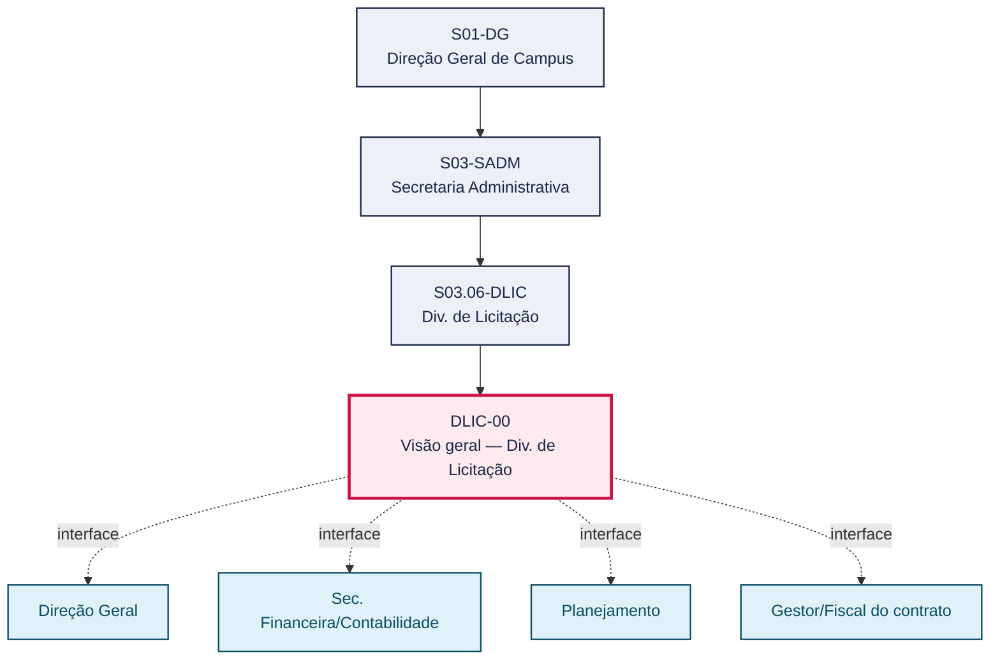

# POP DLIC-00 — Visão geral — Div. de Licitação

> **Documento vivo** · ATDG — Assessoria Técnica da Direção Geral · UNIOESTE Campus Foz do Iguaçu · Formato DDD híbrido + BPMN 2.0 padrão Anne Bail · Versão **1.0.0** · Status **em_validacao** · Atualizado em 2026-09-03

## 0. Cabeçalho DDD

| Divisão | Departamento | Descrição |
|---|---|---|
| Secretaria Administrativa | Div. de Licitação | Coordena o ciclo de aquisições e contratações da Unioeste Foz, do Termo de Referência à autorização da Direção Geral, licitação, formalização do contrato, emissão de portarias de Gestor e Fiscal e acompanhamento da execução até o encerramento da vigência, nos termos da Lei nº 14.133/2021 e das normas internas da Unioeste. |

| Domínio | Subdomínio | Tipo | Contexto delimitado |
|---|---|---|---|
| Contratações Públicas | Ciclo de aquisições e contratações (planejamento, licitação, contrato e execução) | core | S03.06-DLIC |

### 0.3 Linguagem ubíqua (glossário do processo)

| Termo | Definição | Sistema |
|---|---|---|
| DDF | Declaração de Disponibilidade Financeira, documento que indica a existência de recursos orçamentários para a despesa. | GMS |
| GMS | Sistema de gestão utilizado para catalogação, pesquisa de preços e registro de contratos. | GMS |
| DIOE | Diário Oficial do Estado, veículo de publicação obrigatória dos atos e contratos administrativos. | DIOE |

## 1. Identificação

| Campo | Valor |
|---|---|
| Código | DLIC-00 |
| Setor | Div. de Licitação (`S03.06-DLIC`) |
| Responsável (função) | Chefe da Divisão de Licitação |
| Periodicidade | Contínua (conforme demanda de aquisições e contratações) |
| Subordinação | Secretaria Administrativa |
| Normativa | Lei nº 14.133/2021; normas internas Unioeste |
| Produto ATDG | POP |
| Pasta OneDrive | 03_MAPEAMENTO DE PROCESSOS |
| Fontes (entradas do Canvas) | pb-licitacao, 1780963200054, 1780963200055, 1780963200056 |
| Lacunas abertas | prazo |
| Agente responsável | pop-dlic-00 |

## 2. Organograma

## 3. Playbook

### 3.1 Gatilho (evento de domínio)

**Recebimento de demanda de aquisição ou contratação de serviço pela Div. de Licitação** — origem: Requisitante (unidade demandante)

### 3.2 Entrada

- Memorando de solicitação do requisitante
- Termo de Referência (TR) preliminar e cotações de preços

### 3.3 Passo a passo

| Nº | Ação | Responsável | Sistema | Artefato | Prazo | Evento |
|---|---|---|---|---|---|---|
| 1 | Elaborar o Termo de Referência (TR) e realizar cotações de preços | Requisitante | — | TR e cotações | A definir | TR e cotações elaborados |
| 2 | Submeter o TR e as cotações à autorização da Direção Geral | Direção Geral | e-Protocolo | Autorização da Direção Geral | A definir | TR e cotações autorizados |
| 3 | Catalogar o item/serviço no GMS | Chefe da Divisão de Licitação | GMS | Catalogação no GMS | A definir | Item catalogado |
| 4 | Realizar pesquisa de preços de mercado | Chefe da Divisão de Licitação | GMS | Pesquisa de preços | A definir | Pesquisa de preços concluída |
| 5 | Indicar os elementos de despesa e elaborar a Declaração de Disponibilidade Financeira (DDF) | Sec. Financeira/Contabilidade | GMS | Declaração de Disponibilidade Financeira (DDF) | A definir | DDF emitida |
| 6 | Elaborar o edital e cadastrar o processo no GMS e no ComprasNet/PNCP | Chefe da Divisão de Licitação | GMS, ComprasNet/PNCP | Edital | A definir | Edital publicado |
| 7 | Conduzir a sessão pública e apurar o resultado da licitação | Chefe da Divisão de Licitação | ComprasNet/PNCP | Ata de sessão / resultado do certame | A definir | Licitação homologada |
| 8 | Gerar o contrato decorrente da licitação e verificar a regularidade fiscal do contratado | Chefe da Divisão de Licitação | GMS | Contrato | A definir | Contrato gerado |
| 9 | Publicar o contrato assinado no Diário Oficial do Estado (DIOE) | Chefe da Divisão de Licitação | DIOE | Extrato de publicação no DIOE | A definir | Contrato publicado |
| 10 | Emitir e publicar as portarias de Gestor e Fiscal do contrato | Direção Geral | e-Protocolo | Portaria de Gestor; Portaria de Fiscal | A definir | Portarias publicadas |
| 11 | Registrar o contrato e as portarias no Planejamento (GMS) | Planejamento | GMS | Registro do contrato no GMS | A definir | Contrato registrado |
| 12 | Acompanhar a execução contratual, as entregas e as notas fiscais até o encerramento da vigência | Gestor/Fiscal do contrato | GMS | Notas fiscais; relatório de execução | Durante toda a vigência contratual | Execução encerrada |

### 3.4 Saída (entregáveis)

- Contrato assinado, publicado no DIOE e registrado no GMS
- Execução contratual acompanhada até o encerramento da vigência

## 4. Formulários e artefatos (agregados)

| Nome | Tipo | Sistema | Campos-chave | Preenchimento |
|---|---|---|---|---|
| Termo de Referência (TR) | documento | GMS | objeto, justificativa, especificações técnicas, estimativa de custo | Requisitante |
| Cotações de preços | documento | GMS | fornecedor, valor unitário, data da cotação | Requisitante |
| Declaração de Disponibilidade Financeira (DDF) | documento | GMS | elemento de despesa, fonte de recurso, valor | Sec. Financeira/Contabilidade |
| Portaria de Gestor do contrato | documento | e-Protocolo | nº da portaria, servidor designado, contrato vinculado | Direção Geral |
| Portaria de Fiscal do contrato | documento | e-Protocolo | nº da portaria, servidor designado, contrato vinculado | Direção Geral |
| Contrato administrativo | documento | GMS | nº do contrato, partes, objeto, vigência, valor | Chefe da Divisão de Licitação |

## 5. Decisões, exceções e pontos de atenção

| Decisão | Condição | Sim → | Não → |
|---|---|---|---|
| Direção Geral autoriza o TR e as cotações? | Adequação do Termo de Referência e das cotações apresentadas à necessidade da contratação | Prossegue para catalogação no GMS | Requisitante revisa o TR e as cotações |

**Pontos de atenção**

- Termo de Referência bem elaborado evita retrabalho
- Portarias de Gestor e Fiscal são obrigatórias
- Serviços contínuos exigem acompanhamento durante a vigência
- A regularidade fiscal do contratado deve ser verificada antes de cada pagamento, não apenas na assinatura
- O cadastro no ComprasNet/PNCP deve ser conferido para evitar divergência com o GMS

## 6. Contingência

- Se a Direção Geral não autorizar o TR/cotações, o Requisitante deve revisar e reencaminhar o processo
- Se a pesquisa de preços não localizar fornecedores suficientes, ampliar as fontes de cotação antes de prosseguir
- Se o contratado apresentar irregularidade fiscal, suspender a assinatura ou o pagamento até a regularização, comunicando a Assessoria Jurídica
- Se o prazo de publicação no DIOE não for cumprido, registrar justificativa e reprogramar a publicação junto à Direção Geral

## 7. Checklist

- ( ) TR e cotações anexados e conferidos
- ( ) Autorização da Direção Geral registrada no e-Protocolo
- ( ) Elementos de despesa e DDF emitidos pela Sec. Financeira/Contabilidade
- ( ) Edital cadastrado no GMS e no ComprasNet/PNCP
- ( ) Portarias de Gestor e Fiscal emitidas e publicadas
- ( ) Contrato publicado no DIOE e registrado no GMS

## 8. KPI / Indicadores

| Indicador | Fórmula | Meta | Fonte |
|---|---|---|---|
| Prazo médio entre autorização da Direção Geral e publicação do edital | Data de publicação do edital − Data de autorização da Direção Geral | A definir | GMS |
| Percentual de contratos com portarias de Gestor/Fiscal emitidas antes do início da execução | (Contratos com portarias emitidas antes da execução ÷ total de contratos) × 100 | 100% | e-Protocolo/GMS |
| Percentual de pagamentos com regularidade fiscal verificada previamente | (Pagamentos com regularidade verificada ÷ total de pagamentos) × 100 | 100% | GMS |

## 9. Mapa de contexto (interfaces inter-setoriais)

| Origem | Relação | Destino | Artefato | Canal |
|---|---|---|---|---|
| Div. de Licitação | aprova | Direção Geral | TR e cotações | e-Protocolo |
| Div. de Licitação | recebe | Sec. Financeira/Contabilidade | Elementos de despesa e DDF | GMS |
| Div. de Licitação | informa | Direção Geral | Contrato assinado para emissão de portarias | e-Protocolo |
| Div. de Licitação | fornece | Planejamento | Registro do contrato e portarias | GMS |
| Div. de Licitação | informa | Gestor/Fiscal do contrato | Contrato e portarias para acompanhamento | e-Protocolo |

## 10. Fluxograma (BPMN 2.0 — padrão Anne Bail)

```mermaid
flowchart LR
  subgraph R1["Div. de Licitação"]
    direction LR
    e1(("Recebimento de demanda de aquisição ou contratação de serviço"))
    e5["Catalogar o item/serviço no GMS"]
    e6["Realizar pesquisa de preços de mercado"]
    e9["Elaborar o edital e cadastrar no GMS e ComprasNet/PNCP"]
    e10["Conduzir a sessão pública e apurar o resultado"]
    e11["Gerar o contrato e verificar regularidade fiscal"]
    e12["Publicar o contrato assinado no DIOE"]
  end
  subgraph R2["Requisitante"]
    direction LR
    e2["Elaborar o TR e realizar cotações de preços"]
  end
  subgraph R3["Direção Geral"]
    direction LR
    e3[["✉ Encaminhar TR e cotações à Direção Geral"]]
    e4{"Direção Geral autoriza o TR e as cotações?"}
    e13[["✉ Encaminhar processo à Direção Geral para portarias"]]
    e14["Emitir e publicar as portarias de Gestor e Fiscal"]
  end
  subgraph R4["Sec. Financeira/Contabilidade"]
    direction LR
    e7[["✉ Encaminhar elementos de despesa à Sec. Financeira/Contabilidade"]]
    e8["Indicar elementos de despesa e elaborar a DDF"]
  end
  subgraph R5["Planejamento"]
    direction LR
    e15[["✉ Encaminhar contrato e portarias ao Planejamento"]]
    e16["Registrar o contrato e as portarias no Planejamento (GMS)"]
  end
  subgraph R6["Gestor/Fiscal do contrato"]
    direction LR
    e17[["✉ Informar Gestor e Fiscal do contrato assinado"]]
    e18["Acompanhar execução, entregas e notas fiscais"]
    e19((("Execução contratual encerrada")))
  end
  e1 --> e2
  e2 --> e3
  e3 --> e4
  e4 -- Sim --> e5
  e4 -- Não --> e2
  e5 --> e6
  e6 --> e7
  e7 --> e8
  e8 --> e9
  e9 --> e10
  e10 --> e11
  e11 --> e12
  e12 --> e13
  e13 --> e14
  e14 --> e15
  e15 --> e16
  e16 --> e17
  e17 --> e18
  e18 --> e19
  classDef inicio fill:#f3f4f6,stroke:#6b7280,stroke-width:1.5px,color:#374151
  classDef atividade fill:#E6F7F0,stroke:#0B7A4E,stroke-width:2px,color:#0B7A4E
  classDef decisao fill:#FFF4ED,stroke:#C9783A,stroke-width:2px,color:#C9783A
  classDef fim fill:#FDEAEE,stroke:#CC1544,stroke-width:4px,color:#CC1544
  classDef pausa fill:#FDEAEE,stroke:#CC1544,stroke-width:2px,color:#CC1544
  classDef captura fill:#E0F2F8,stroke:#0B4D66,stroke-width:2px,color:#0B4D66
  class e1 inicio
  class e2,e5,e6,e8,e9,e10,e11,e12,e14,e16,e18 atividade
  class e3,e7,e13,e15,e17 captura
  class e4 decisao
  class e19 fim
```

## 11. Especificação BPMN para o Miro

**Raias:** Div. de Licitação · Requisitante · Direção Geral · Sec. Financeira/Contabilidade · Planejamento · Gestor/Fiscal do contrato

| Id | Tipo | Elemento | Raia |
|---|---|---|---|
| e1 | inicio | Recebimento de demanda de aquisição ou contratação de serviço | Div. de Licitação |
| e2 | atividade | Elaborar o TR e realizar cotações de preços | Requisitante |
| e3 | captura | Encaminhar TR e cotações à Direção Geral | Direção Geral |
| e4 | decisao | Direção Geral autoriza o TR e as cotações? | Direção Geral |
| e5 | atividade | Catalogar o item/serviço no GMS | Div. de Licitação |
| e6 | atividade | Realizar pesquisa de preços de mercado | Div. de Licitação |
| e7 | captura | Encaminhar elementos de despesa à Sec. Financeira/Contabilidade | Sec. Financeira/Contabilidade |
| e8 | atividade | Indicar elementos de despesa e elaborar a DDF | Sec. Financeira/Contabilidade |
| e9 | atividade | Elaborar o edital e cadastrar no GMS e ComprasNet/PNCP | Div. de Licitação |
| e10 | atividade | Conduzir a sessão pública e apurar o resultado | Div. de Licitação |
| e11 | atividade | Gerar o contrato e verificar regularidade fiscal | Div. de Licitação |
| e12 | atividade | Publicar o contrato assinado no DIOE | Div. de Licitação |
| e13 | captura | Encaminhar processo à Direção Geral para portarias | Direção Geral |
| e14 | atividade | Emitir e publicar as portarias de Gestor e Fiscal | Direção Geral |
| e15 | captura | Encaminhar contrato e portarias ao Planejamento | Planejamento |
| e16 | atividade | Registrar o contrato e as portarias no Planejamento (GMS) | Planejamento |
| e17 | captura | Informar Gestor e Fiscal do contrato assinado | Gestor/Fiscal do contrato |
| e18 | atividade | Acompanhar execução, entregas e notas fiscais | Gestor/Fiscal do contrato |
| e19 | fim | Execução contratual encerrada | Gestor/Fiscal do contrato |

| De | Para | Rótulo |
|---|---|---|
| e1 | e2 | — |
| e2 | e3 | — |
| e3 | e4 | — |
| e4 | e5 | Sim |
| e4 | e2 | Não |
| e5 | e6 | — |
| e6 | e7 | — |
| e7 | e8 | — |
| e8 | e9 | — |
| e9 | e10 | — |
| e10 | e11 | — |
| e11 | e12 | — |
| e12 | e13 | — |
| e13 | e14 | — |
| e14 | e15 | — |
| e15 | e16 | — |
| e16 | e17 | — |
| e17 | e18 | — |
| e18 | e19 | — |

_Especificação gerada a partir dos passos do POP; 1 raia(s). Revisar decisões e pausas antes de construir no Miro._

## 12. Histórico de versões

| Versão | Data | Autor | Tipo | Mudanças | Fontes |
|---|---|---|---|---|---|
| 0.1.0 | 2026-09-02 | scripts/scaffold_pops.py | patch | Esqueleto inicial gerado deterministicamente a partir das entradas pb-licitacao | pb-licitacao |
| 1.0.0 | 2026-09-03 | agente:construtor-pop (lote C) | major | Passo 1 alterado (acao, responsavel, sistema, artefato, prazo, evento, fontes); Passo 2 alterado (acao, responsavel, sistema, artefato, prazo, evento, fontes); Passo 3 alterado (acao, responsavel, sistema, artefato, prazo, evento, fontes); Passo 4 alterado (acao, responsavel, sistema, artefato, prazo, evento, fontes); Passo 5 alterado (acao, responsavel, sistema, artefato, prazo, evento, fontes); Passo adicionado após 5: Acompanhar a execução contratual, as entregas e as notas fiscais até o encerrame; Passo adicionado após 4: Emitir e publicar as portarias de Gestor e Fiscal do contrato; Passo adicionado após 4: Publicar o contrato assinado no Diário Oficial do Estado (DIOE); Passo adicionado após 3: Conduzir a sessão pública e apurar o resultado da licitação; Passo adicionado após 2: Indicar os elementos de despesa e elaborar a Declaração de Disponibilidade Finan; Passo adicionado após 2: Realizar pesquisa de preços de mercado; Passo adicionado após 1: Submeter o TR e as cotações à autorização da Direção Geral; entrada_nova: +2; saida_nova: +2; artefatos_novos: +6; decisoes_novas: +1; kpis_novos: +3; mapa_contexto_novo: +5; pontos_atencao_novos: +2; contingencia_nova: +4; checklist_novo: +6; glossario_novo: +3; Campo identificacao.responsavel atualizado; Campo identificacao.periodicidade atualizado; Campo ddd.descricao atualizado; Campo ddd.subdominio atualizado; Campo playbook.gatilho atualizado; Raias adicionadas: Requisitante, Direção Geral, Sec. Financeira/Contabilidade, Planejamento, Gestor/Fiscal do contrato; Elementos BPMN removidos: e1, e2, e3, e4, e5, e6, e7; Elementos BPMN adicionados: 19; Status promovido a em_validacao (≥ 3 passos e responsável definido) | pb-licitacao, 1780963200054, 1780963200055, 1780963200056 |

## 13. Validação e aprovação

| Papel | Função / unidade | Data |
|---|---|---|
| Elaboração | ATDG — Assessoria Técnica da Direção Geral | 2026-09-02 |
| Revisão | A definir (responsável do setor) | ___/___/______ |
| Aprovação | Direção Geral do Campus | ___/___/______ |

## 14. Lições incorporadas

- **L-001** — Referir sempre função/cargo; nomes apenas no bloco 13 (Validação), com anuência (LGPD).
- **L-004** — Nunca regenerar POP existente: aplicar patch com changelog, fontes e versão.
- **L-006** — Preservar códigos legados como códigos de processo; não renumerar.
- **L-007** — Referência Externa é benchmark; normativa do POP só cita atos da Unioeste, do Estado do Paraná ou federais aplicáveis.
- **L-002** — Um passo = uma ação; ações compostas viram passos distintos.
- **L-003** — Cada linha do mapa de contexto gera um elemento `captura` no BPMN e um passo na raia de destino.
- **L-005** — No diagnóstico, agrupar versões do mesmo documento e registrar lacuna `versao_documento`.

---
_Canvas Vivo — Base de Conhecimento Institucional · ATDG · UNIOESTE Campus Foz do Iguaçu · gerado por `scripts/render_pop.py` a partir de `pops/DLIC/DLIC-00.pop.json` (diretrizes v1.0)._
