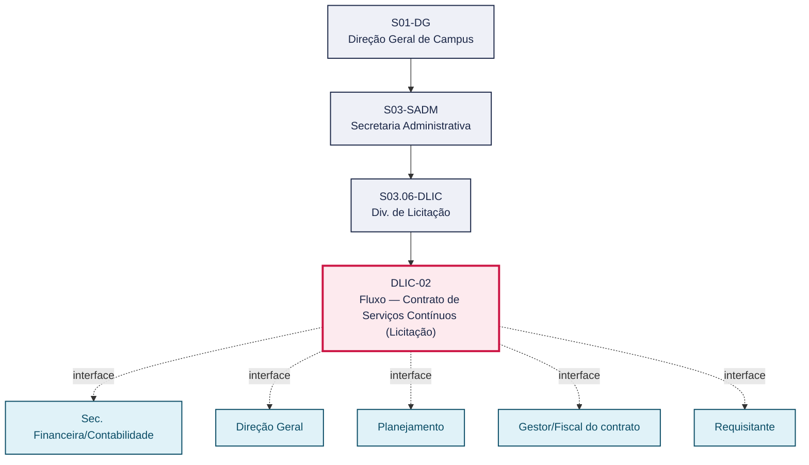

# POP DLIC-02 — Fluxo — Contrato de Serviços Contínuos (Licitação)

> **Documento vivo** · ATDG — Assessoria Técnica da Direção Geral · UNIOESTE Campus Foz do Iguaçu · Formato DDD híbrido + BPMN 2.0 padrão Anne Bail · Versão **1.0.0** · Status **em_validacao** · Atualizado em 2026-09-03

## 0. Cabeçalho DDD

| Divisão | Departamento | Descrição |
|---|---|---|
| Secretaria Administrativa | Div. de Licitação | Formaliza e acompanha o contrato de serviços contínuos decorrente de licitação homologada: geração do contrato, verificação da regularidade fiscal e da disponibilidade orçamentária, publicação no DIOE, emissão de portarias de Gestor e Fiscal, registro no Planejamento e fiscalização mensal da execução (empenho, medições e notas fiscais) até a prorrogação ou o encerramento da vigência. |

| Domínio | Subdomínio | Tipo | Contexto delimitado |
|---|---|---|---|
| Contratações Públicas | Formalização e fiscalização de contrato de serviços contínuos | core | S03.06-DLIC |

### 0.3 Linguagem ubíqua (glossário do processo)

| Termo | Definição | Sistema |
|---|---|---|
| Medição | Verificação periódica da execução do serviço contínuo para fins de pagamento e controle de qualidade. | GMS |
| Prorrogação contratual | Extensão da vigência do contrato de serviço contínuo, quando prevista em cláusula e amparada em lei. | — |

## 1. Identificação

| Campo | Valor |
|---|---|
| Código | DLIC-02 |
| Setor | Div. de Licitação (`S03.06-DLIC`) |
| Responsável (função) | Chefe da Divisão de Licitação |
| Periodicidade | Por contrato de serviços contínuos, com acompanhamento mensal durante a vigência |
| Subordinação | Secretaria Administrativa |
| Normativa | Lei nº 14.133/2021; normas internas Unioeste |
| Produto ATDG | POP |
| Pasta OneDrive | 03_MAPEAMENTO DE PROCESSOS |
| Fontes (entradas do Canvas) | 1780963200055 |
| Lacunas abertas | prazo |
| Agente responsável | pop-dlic-02 |

## 2. Organograma

## 3. Playbook

### 3.1 Gatilho (evento de domínio)

**Homologação da licitação e necessidade de formalizar o contrato de serviços contínuos** — origem: Div. de Licitação (processo licitatório homologado)

### 3.2 Entrada

- Processo licitatório homologado
- Minuta do contrato de serviços contínuos

### 3.3 Passo a passo

| Nº | Ação | Responsável | Sistema | Artefato | Prazo | Evento |
|---|---|---|---|---|---|---|
| 1 | Gerar o contrato de serviços contínuos no GMS | Chefe da Divisão de Licitação | GMS | Contrato de serviços contínuos | A definir | Contrato gerado |
| 2 | Verificar a regularidade fiscal do contratado antes da assinatura | Chefe da Divisão de Licitação | — | Certidões de regularidade fiscal | A definir | Regularidade fiscal verificada |
| 3 | Confirmar a disponibilidade orçamentária para o exercício corrente | Sec. Financeira/Contabilidade | GMS | Confirmação de disponibilidade orçamentária | A definir | Disponibilidade orçamentária confirmada |
| 4 | Publicar o contrato assinado no Diário Oficial do Estado (DIOE) | Chefe da Divisão de Licitação | DIOE | Extrato de publicação no DIOE | A definir | Contrato publicado |
| 5 | Emitir e publicar as portarias de Gestor e Fiscal do contrato | Direção Geral | e-Protocolo | Portaria de Gestor; Portaria de Fiscal | A definir | Portarias publicadas |
| 6 | Registrar o contrato e as portarias no Planejamento (GMS) | Planejamento | GMS | Registro do contrato no GMS | A definir | Contrato registrado |
| 7 | Fiscal do contrato solicita o empenho para o período de referência | Fiscal do contrato | GMS | Nota de empenho mensal | A definir | Empenho solicitado |
| 8 | Acompanhar a execução mensal do serviço | Fiscal do contrato | GMS | Relatório de medição mensal | Mensal | Execução mensal acompanhada |
| 9 | Conferir as medições e as notas fiscais mensais | Fiscal do contrato | GMS | Relatório de medição mensal | Mensal | Medição mensal conferida |
| 10 | Formalizar a prorrogação do contrato, quando prevista e legalmente possível, ou encaminhar à Div. de Licitação para novo processo licitatório | Fiscal do contrato | e-Protocolo | Termo de prorrogação contratual | Antes do término da vigência | Prorrogação formalizada ou novo processo encaminhado |

### 3.4 Saída (entregáveis)

- Contrato de serviços contínuos publicado, registrado e com portarias emitidas
- Execução mensal fiscalizada até a prorrogação ou o encerramento da vigência

## 4. Formulários e artefatos (agregados)

| Nome | Tipo | Sistema | Campos-chave | Preenchimento |
|---|---|---|---|---|
| Contrato de serviços contínuos | documento | GMS | nº do contrato, objeto, contratada, valor mensal, vigência | Chefe da Divisão de Licitação |
| Certidões de regularidade fiscal | documento | — | CNPJ, validade, situação | Chefe da Divisão de Licitação |
| Portaria de Gestor do contrato | documento | e-Protocolo | nº da portaria, servidor designado | Direção Geral |
| Portaria de Fiscal do contrato | documento | e-Protocolo | nº da portaria, servidor designado | Direção Geral |
| Nota de empenho mensal | documento | GMS | nº do empenho, período de referência, valor | Fiscal do contrato |
| Relatório de medição mensal | documento | GMS | período, itens medidos, conformidade | Fiscal do contrato |
| Termo de prorrogação contratual | documento | e-Protocolo | nova vigência, justificativa, amparo legal | Fiscal do contrato |

## 5. Decisões, exceções e pontos de atenção

| Decisão | Condição | Sim → | Não → |
|---|---|---|---|
| Contratado está com a regularidade fiscal em dia? | Conferência das certidões de regularidade fiscal do contratado | Prossegue para confirmação da disponibilidade orçamentária | Assinatura/execução suspensa até a regularização |
| O contrato está próximo do término da vigência? | Verificação do prazo de vigência contratual | Avalia a possibilidade de prorrogação | Prossegue o ciclo mensal de acompanhamento |
| Há prorrogação prevista e legalmente possível? | Existência de previsão contratual e amparo legal para prorrogação (Lei nº 14.133/2021) | Fiscal formaliza a prorrogação do contrato | Encaminha-se à Div. de Licitação para abertura de novo processo licitatório |

**Pontos de atenção**

- Serviços contínuos exigem acompanhamento de execução durante a vigência
- Verificar regularidade fiscal a cada medição/pagamento
- Atenção à vigência e eventuais prorrogações
- A decisão sobre prorrogação deve ser tomada com antecedência suficiente para evitar solução de continuidade do serviço
- Glosas identificadas na medição devem ser registradas antes do processamento do pagamento

## 6. Contingência

- Se o contratado não apresentar regularidade fiscal, suspender a assinatura até a regularização
- Se não houver disponibilidade orçamentária para o exercício, o processo retorna ao Planejamento para readequação
- Se a medição mensal identificar não conformidade, o Fiscal deve notificar a contratada e glosar o valor correspondente antes do pagamento
- Se não houver amparo legal ou interesse na prorrogação, encaminhar à Div. de Licitação para novo processo licitatório com antecedência mínima ao término da vigência

## 7. Checklist

- ( ) Regularidade fiscal do contratado verificada antes da assinatura
- ( ) Disponibilidade orçamentária confirmada para o exercício corrente
- ( ) Contrato publicado no DIOE e portarias emitidas
- ( ) Empenho do período de referência solicitado
- ( ) Medições e notas fiscais mensais conferidas
- ( ) Necessidade de prorrogação avaliada com antecedência ao término da vigência

## 8. KPI / Indicadores

| Indicador | Fórmula | Meta | Fonte |
|---|---|---|---|
| Percentual de medições mensais sem não conformidade | (Medições sem não conformidade ÷ total de medições) × 100 | 100% | GMS |
| Prazo de antecedência entre a decisão de não prorrogar e o encaminhamento à Licitação | Data de encaminhamento à Licitação − Data da decisão de não prorrogar | A definir | e-Protocolo |

## 9. Mapa de contexto (interfaces inter-setoriais)

| Origem | Relação | Destino | Artefato | Canal |
|---|---|---|---|---|
| Div. de Licitação | recebe | Sec. Financeira/Contabilidade | Confirmação de disponibilidade orçamentária | GMS |
| Div. de Licitação | informa | Direção Geral | Contrato de serviços contínuos assinado | e-Protocolo |
| Div. de Licitação | fornece | Planejamento | Registro do contrato e portarias | GMS |
| Div. de Licitação | informa | Gestor/Fiscal do contrato | Contrato de serviços contínuos para fiscalização | e-Protocolo |
| Div. de Licitação | informa | Requisitante | Encerramento da vigência e necessidade de novo processo licitatório | e-Protocolo |

## 10. Fluxograma (BPMN 2.0 — padrão Anne Bail)

```mermaid
flowchart LR
  subgraph R1["Div. de Licitação"]
    direction LR
    e1(("Homologação da licitação e necessidade de formalizar o contrato"))
    e2["Gerar o contrato de serviços contínuos no GMS"]
    e3["Verificar a regularidade fiscal do contratado"]
    e4{"Contratado está com a regularidade fiscal em dia?"}
    e5(["⏱ Aguardar regularização fiscal do contratado"])
    e8["Publicar o contrato assinado no DIOE"]
    e21[["✉ Encaminhar à Div. de Licitação para novo processo licitatório"]]
    e22((("Vigência encerrada — novo processo licitatório a iniciar")))
  end
  subgraph R2["Sec. Financeira/Contabilidade"]
    direction LR
    e6[["✉ Encaminhar consulta de disponibilidade orçamentária"]]
    e7["Confirmar a disponibilidade orçamentária"]
  end
  subgraph R3["Direção Geral"]
    direction LR
    e9[["✉ Encaminhar contrato à Direção Geral para portarias"]]
    e10["Emitir e publicar as portarias de Gestor e Fiscal"]
  end
  subgraph R4["Planejamento"]
    direction LR
    e11[["✉ Encaminhar contrato e portarias ao Planejamento"]]
    e12["Registrar o contrato e as portarias no Planejamento (GMS)"]
  end
  subgraph R5["Fiscal do contrato"]
    direction LR
    e13[["✉ Informar Fiscal do contrato assinado"]]
    e14["Solicitar o empenho do período de referência"]
    e15["Acompanhar a execução mensal do serviço"]
    e16["Conferir as medições e as notas fiscais mensais"]
    e17{"O contrato está próximo do término da vigência?"}
    e18{"Há prorrogação prevista e legalmente possível?"}
    e19["Formalizar a prorrogação do contrato"]
    e20((("Contrato prorrogado")))
  end
  e1 --> e2
  e2 --> e3
  e3 --> e4
  e4 -- Sim --> e6
  e4 -- Não --> e5
  e5 --> e3
  e6 --> e7
  e7 --> e8
  e8 --> e9
  e9 --> e10
  e10 --> e11
  e11 --> e12
  e12 --> e13
  e13 --> e14
  e14 --> e15
  e15 --> e16
  e16 --> e17
  e17 -- Não --> e14
  e17 -- Sim --> e18
  e18 -- Sim --> e19
  e19 --> e20
  e18 -- Não --> e21
  e21 --> e22
  classDef inicio fill:#f3f4f6,stroke:#6b7280,stroke-width:1.5px,color:#374151
  classDef atividade fill:#E6F7F0,stroke:#0B7A4E,stroke-width:2px,color:#0B7A4E
  classDef decisao fill:#FFF4ED,stroke:#C9783A,stroke-width:2px,color:#C9783A
  classDef fim fill:#FDEAEE,stroke:#CC1544,stroke-width:4px,color:#CC1544
  classDef pausa fill:#FDEAEE,stroke:#CC1544,stroke-width:2px,color:#CC1544
  classDef captura fill:#E0F2F8,stroke:#0B4D66,stroke-width:2px,color:#0B4D66
  class e1 inicio
  class e2,e3,e7,e8,e10,e12,e14,e15,e16,e19 atividade
  class e4,e17,e18 decisao
  class e5 pausa
  class e6,e9,e11,e13,e21 captura
  class e20,e22 fim
```

## 11. Especificação BPMN para o Miro

**Raias:** Div. de Licitação · Sec. Financeira/Contabilidade · Direção Geral · Planejamento · Fiscal do contrato

| Id | Tipo | Elemento | Raia |
|---|---|---|---|
| e1 | inicio | Homologação da licitação e necessidade de formalizar o contrato | Div. de Licitação |
| e2 | atividade | Gerar o contrato de serviços contínuos no GMS | Div. de Licitação |
| e3 | atividade | Verificar a regularidade fiscal do contratado | Div. de Licitação |
| e4 | decisao | Contratado está com a regularidade fiscal em dia? | Div. de Licitação |
| e5 | pausa | Aguardar regularização fiscal do contratado | Div. de Licitação |
| e6 | captura | Encaminhar consulta de disponibilidade orçamentária | Sec. Financeira/Contabilidade |
| e7 | atividade | Confirmar a disponibilidade orçamentária | Sec. Financeira/Contabilidade |
| e8 | atividade | Publicar o contrato assinado no DIOE | Div. de Licitação |
| e9 | captura | Encaminhar contrato à Direção Geral para portarias | Direção Geral |
| e10 | atividade | Emitir e publicar as portarias de Gestor e Fiscal | Direção Geral |
| e11 | captura | Encaminhar contrato e portarias ao Planejamento | Planejamento |
| e12 | atividade | Registrar o contrato e as portarias no Planejamento (GMS) | Planejamento |
| e13 | captura | Informar Fiscal do contrato assinado | Fiscal do contrato |
| e14 | atividade | Solicitar o empenho do período de referência | Fiscal do contrato |
| e15 | atividade | Acompanhar a execução mensal do serviço | Fiscal do contrato |
| e16 | atividade | Conferir as medições e as notas fiscais mensais | Fiscal do contrato |
| e17 | decisao | O contrato está próximo do término da vigência? | Fiscal do contrato |
| e18 | decisao | Há prorrogação prevista e legalmente possível? | Fiscal do contrato |
| e19 | atividade | Formalizar a prorrogação do contrato | Fiscal do contrato |
| e20 | fim | Contrato prorrogado | Fiscal do contrato |
| e21 | captura | Encaminhar à Div. de Licitação para novo processo licitatório | Div. de Licitação |
| e22 | fim | Vigência encerrada — novo processo licitatório a iniciar | Div. de Licitação |

| De | Para | Rótulo |
|---|---|---|
| e1 | e2 | — |
| e2 | e3 | — |
| e3 | e4 | — |
| e4 | e6 | Sim |
| e4 | e5 | Não |
| e5 | e3 | — |
| e6 | e7 | — |
| e7 | e8 | — |
| e8 | e9 | — |
| e9 | e10 | — |
| e10 | e11 | — |
| e11 | e12 | — |
| e12 | e13 | — |
| e13 | e14 | — |
| e14 | e15 | — |
| e15 | e16 | — |
| e16 | e17 | — |
| e17 | e14 | Não |
| e17 | e18 | Sim |
| e18 | e19 | Sim |
| e19 | e20 | — |
| e18 | e21 | Não |
| e21 | e22 | — |

_Especificação gerada a partir dos passos do POP; 1 raia(s). Revisar decisões e pausas antes de construir no Miro._

## 12. Histórico de versões

| Versão | Data | Autor | Tipo | Mudanças | Fontes |
|---|---|---|---|---|---|
| 0.1.0 | 2026-09-02 | scripts/scaffold_pops.py | patch | Esqueleto inicial gerado deterministicamente a partir das entradas 1780963200055 | 1780963200055 |
| 1.0.0 | 2026-09-03 | agente:construtor-pop (lote C) | major | Passo 1 alterado (acao, responsavel, sistema, artefato, prazo, evento, fontes); Passo 2 alterado (acao, responsavel, sistema, artefato, prazo, evento, fontes); Passo 3 alterado (acao, responsavel, sistema, artefato, prazo, evento, fontes); Passo 4 alterado (acao, responsavel, sistema, artefato, prazo, evento, fontes); Passo 5 alterado (acao, responsavel, sistema, artefato, prazo, evento, fontes); Passo adicionado após 5: Formalizar a prorrogação do contrato, quando prevista e legalmente possível, ou ; Passo adicionado após 5: Conferir as medições e as notas fiscais mensais; Passo adicionado após 5: Acompanhar a execução mensal do serviço; Passo adicionado após 1: Confirmar a disponibilidade orçamentária para o exercício corrente; Passo adicionado após 1: Verificar a regularidade fiscal do contratado antes da assinatura; entrada_nova: +2; saida_nova: +2; artefatos_novos: +7; decisoes_novas: +3; kpis_novos: +2; mapa_contexto_novo: +5; pontos_atencao_novos: +2; contingencia_nova: +4; checklist_novo: +6; glossario_novo: +2; Campo identificacao.responsavel atualizado; Campo identificacao.periodicidade atualizado; Campo ddd.descricao atualizado; Campo ddd.subdominio atualizado; Campo playbook.gatilho atualizado; Raias adicionadas: Sec. Financeira/Contabilidade, Direção Geral, Planejamento, Fiscal do contrato; Elementos BPMN removidos: e1, e2, e3, e4, e5, e6, e7; Elementos BPMN adicionados: 22; Status promovido a em_validacao (≥ 3 passos e responsável definido) | 1780963200055 |

## 13. Validação e aprovação

| Papel | Função / unidade | Data |
|---|---|---|
| Elaboração | ATDG — Assessoria Técnica da Direção Geral | 2026-09-02 |
| Revisão | A definir (responsável do setor) | ___/___/______ |
| Aprovação | Direção Geral do Campus | ___/___/______ |

## 14. Lições incorporadas

- **L-001** — Referir sempre função/cargo; nomes apenas no bloco 13 (Validação), com anuência (LGPD).
- **L-004** — Nunca regenerar POP existente: aplicar patch com changelog, fontes e versão.
- **L-006** — Preservar códigos legados como códigos de processo; não renumerar.
- **L-007** — Referência Externa é benchmark; normativa do POP só cita atos da Unioeste, do Estado do Paraná ou federais aplicáveis.
- **L-002** — Um passo = uma ação; ações compostas viram passos distintos.
- **L-003** — Cada linha do mapa de contexto gera um elemento `captura` no BPMN e um passo na raia de destino.
- **L-005** — No diagnóstico, agrupar versões do mesmo documento e registrar lacuna `versao_documento`.

---
_Canvas Vivo — Base de Conhecimento Institucional · ATDG · UNIOESTE Campus Foz do Iguaçu · gerado por `scripts/render_pop.py` a partir de `pops/DLIC/DLIC-02.pop.json` (diretrizes v1.0)._
