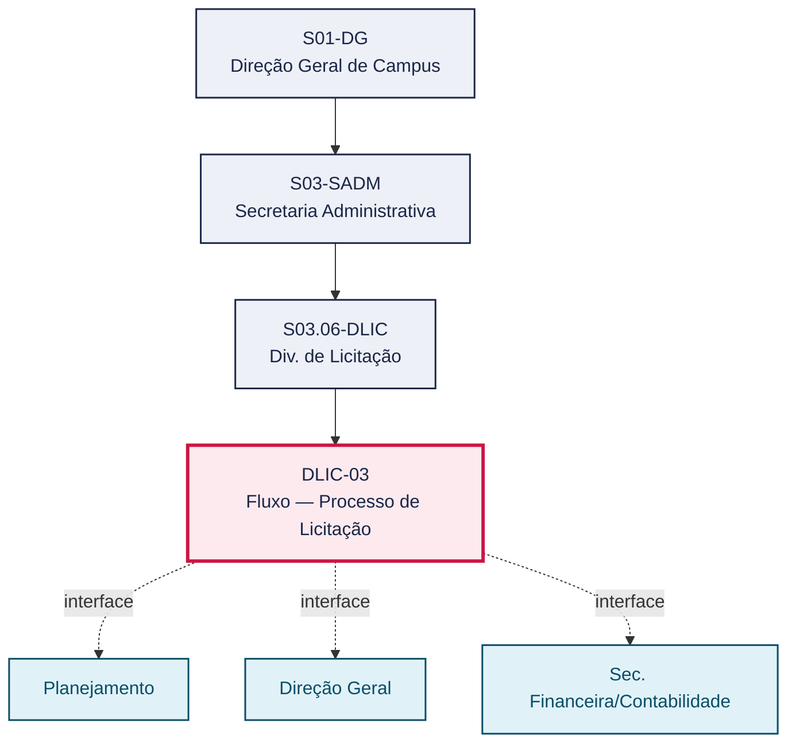

# POP DLIC-03 — Fluxo — Processo de Licitação

> **Documento vivo** · ATDG — Assessoria Técnica da Direção Geral · UNIOESTE Campus Foz do Iguaçu · Formato DDD híbrido + BPMN 2.0 padrão Anne Bail · Versão **1.0.0** · Status **em_validacao** · Atualizado em 2026-09-03

## 0. Cabeçalho DDD

| Divisão | Departamento | Descrição |
|---|---|---|
| Secretaria Administrativa | Div. de Licitação | Conduz o processo licitatório desde a elaboração do TR e das cotações pelo Requisitante até a autorização da Direção Geral, a catalogação e a pesquisa de preços, os elementos de despesa e a DDF, a elaboração do edital e o cadastro no GMS e no ComprasNet/PNCP, a sessão pública e a homologação, encaminhando o resultado à formalização do contrato de aquisição ou de serviços contínuos. |

| Domínio | Subdomínio | Tipo | Contexto delimitado |
|---|---|---|---|
| Contratações Públicas | Condução do processo licitatório (do Termo de Referência à homologação) | core | S03.06-DLIC |

### 0.3 Linguagem ubíqua (glossário do processo)

| Termo | Definição | Sistema |
|---|---|---|
| Homologação | Ato da autoridade competente que confirma a regularidade do processo licitatório e autoriza a contratação. | ComprasNet/PNCP |
| ComprasNet/PNCP | Portal Nacional de Contratações Públicas utilizado para publicação de editais e sessões públicas. | ComprasNet/PNCP |

## 1. Identificação

| Campo | Valor |
|---|---|
| Código | DLIC-03 |
| Setor | Div. de Licitação (`S03.06-DLIC`) |
| Responsável (função) | Chefe da Divisão de Licitação |
| Periodicidade | Por demanda de aquisição ou contratação de serviço |
| Subordinação | Secretaria Administrativa |
| Normativa | Lei nº 14.133/2021; normas internas Unioeste |
| Produto ATDG | POP |
| Pasta OneDrive | 03_MAPEAMENTO DE PROCESSOS |
| Fontes (entradas do Canvas) | 1780963200056 |
| Lacunas abertas | prazo |
| Agente responsável | pop-dlic-03 |

## 2. Organograma

## 3. Playbook

### 3.1 Gatilho (evento de domínio)

**Recebimento de memorando de solicitação de aquisição ou contratação de serviço** — origem: Requisitante (unidade demandante)

### 3.2 Entrada

- Memorando de solicitação
- Termo de Referência (TR) e cotações de preços

### 3.3 Passo a passo

| Nº | Ação | Responsável | Sistema | Artefato | Prazo | Evento |
|---|---|---|---|---|---|---|
| 1 | Elaborar o memorando de solicitação e o Termo de Referência (TR) | Requisitante | e-Protocolo | Memorando; TR | A definir | Memorando e TR elaborados |
| 2 | Realizar cotações de preços e elaborar a tabela comparativa | Requisitante | — | Tabela comparativa de cotações | A definir | Cotações e tabela comparativa concluídas |
| 3 | Planejamento analisa a solicitação | Planejamento | e-Protocolo | Análise do Planejamento | A definir | Solicitação analisada |
| 4 | Submeter o processo à autorização da Direção Geral | Direção Geral | e-Protocolo | Autorização de abertura do processo | A definir | Abertura do processo autorizada |
| 5 | Catalogar o item/serviço no GMS | Chefe da Divisão de Licitação | GMS | Catalogação no GMS | A definir | Item catalogado |
| 6 | Realizar pesquisa de preços de mercado | Chefe da Divisão de Licitação | GMS | Pesquisa de preços | A definir | Pesquisa de preços concluída |
| 7 | Indicar os elementos de despesa | Sec. Financeira/Contabilidade | GMS | Elementos de despesa | A definir | Elementos de despesa indicados |
| 8 | Elaborar a Declaração de Disponibilidade Financeira (DDF) | Sec. Financeira/Contabilidade | GMS | Declaração de Disponibilidade Financeira (DDF) | A definir | DDF emitida |
| 9 | Elaborar o edital | Chefe da Divisão de Licitação | GMS | Edital de licitação | A definir | Edital elaborado |
| 10 | Cadastrar o processo no GMS e no ComprasNet/PNCP | Chefe da Divisão de Licitação | GMS, ComprasNet/PNCP | Processo cadastrado no ComprasNet/PNCP | A definir | Processo cadastrado |
| 11 | Direção Geral analisa e autoriza o prosseguimento do processo licitatório | Direção Geral | e-Protocolo | Autorização de prosseguimento | A definir | Prosseguimento autorizado |
| 12 | Conduzir a sessão pública e homologar o resultado da licitação | Chefe da Divisão de Licitação | ComprasNet/PNCP | Ata de sessão / termo de homologação | A definir | Licitação homologada |

### 3.4 Saída (entregáveis)

- Licitação homologada e encaminhada à formalização do contrato de aquisição ou de serviços contínuos

## 4. Formulários e artefatos (agregados)

| Nome | Tipo | Sistema | Campos-chave | Preenchimento |
|---|---|---|---|---|
| Memorando de solicitação | documento | e-Protocolo | unidade solicitante, objeto, justificativa | Requisitante |
| Termo de Referência (TR) | documento | GMS | objeto, especificações técnicas, estimativa de custo | Requisitante |
| Tabela comparativa de cotações | documento | — | fornecedores cotados, valores, menor preço | Requisitante |
| Declaração de Disponibilidade Financeira (DDF) | documento | GMS | elemento de despesa, fonte de recurso, valor | Sec. Financeira/Contabilidade |
| Edital de licitação | documento | GMS, ComprasNet/PNCP | modalidade, objeto, critério de julgamento, data da sessão | Chefe da Divisão de Licitação |

## 5. Decisões, exceções e pontos de atenção

| Decisão | Condição | Sim → | Não → |
|---|---|---|---|
| Direção Geral autoriza a abertura do processo licitatório? | Análise do memorando, do TR e das cotações apresentadas | O processo é encaminhado à Div. de Licitação para catalogação | Requisitante ajusta o TR e as cotações |
| Direção Geral autoriza o prosseguimento do processo licitatório? | Análise do edital elaborado e do processo cadastrado no GMS/ComprasNet | Div. de Licitação conduz a sessão pública | Div. de Licitação ajusta o edital |
| Objeto licitado é aquisição de bens (não serviço contínuo)? | Natureza do objeto definida no Termo de Referência | Encaminha-se à formalização do contrato de aquisição (DLIC-01) | Encaminha-se à formalização do contrato de serviços contínuos (DLIC-02) |

**Pontos de atenção**

- Termo de Referência bem elaborado evita retrabalho
- Cadastro correto no ComprasNet é essencial
- Autorização da Direção Geral em pontos de decisão
- O TR deve conter especificações técnicas suficientes para evitar impugnações ao edital
- A modalidade licitatória deve ser escolhida conforme o valor estimado e a natureza do objeto (Lei nº 14.133/2021)

## 6. Contingência

- Se a Direção Geral não autorizar a abertura, o Requisitante deve revisar o TR e as cotações antes de reencaminhar
- Se não houver cotações suficientes para a tabela comparativa, ampliar a pesquisa antes de prosseguir
- Se a Direção Geral não autorizar o prosseguimento após o edital, a Div. de Licitação deve ajustá-lo conforme as observações
- Se a sessão pública for deserta ou fracassada, registrar o resultado e reavaliar o edital ou a modalidade

## 7. Checklist

- ( ) Memorando, TR e cotações anexados ao processo
- ( ) Autorização da Direção Geral para abertura do processo registrada
- ( ) Elementos de despesa e DDF emitidos
- ( ) Edital cadastrado no GMS e no ComprasNet/PNCP
- ( ) Autorização da Direção Geral para prosseguimento registrada
- ( ) Resultado da sessão pública e homologação registrados

## 8. KPI / Indicadores

| Indicador | Fórmula | Meta | Fonte |
|---|---|---|---|
| Prazo médio entre a autorização de abertura e a publicação do edital | Data de publicação do edital − Data de autorização de abertura | A definir | GMS |
| Percentual de processos licitatórios homologados sem necessidade de novo certame | (Processos homologados na 1ª tentativa ÷ total de processos abertos) × 100 | A definir | ComprasNet/PNCP |

## 9. Mapa de contexto (interfaces inter-setoriais)

| Origem | Relação | Destino | Artefato | Canal |
|---|---|---|---|---|
| Div. de Licitação | recebe | Planejamento | Solicitação analisada (TR, cotações) | e-Protocolo |
| Div. de Licitação | aprova | Direção Geral | Autorização de abertura do processo licitatório | e-Protocolo |
| Div. de Licitação | recebe | Sec. Financeira/Contabilidade | Elementos de despesa e DDF | GMS |
| Div. de Licitação | aprova | Direção Geral | Autorização de prosseguimento (edital) | e-Protocolo |

## 10. Fluxograma (BPMN 2.0 — padrão Anne Bail)

```mermaid
flowchart LR
  subgraph R1["Div. de Licitação"]
    direction LR
    e9[["✉ Encaminhar processo autorizado à Div. de Licitação"]]
    e10["Catalogar o item/serviço no GMS"]
    e11["Realizar pesquisa de preços de mercado"]
    e15["Elaborar o edital"]
    e16["Cadastrar o processo no GMS e no ComprasNet/PNCP"]
    e19(["⏱ Aguardar ajuste do edital"])
    e20["Conduzir a sessão pública e homologar"]
    e21{"Objeto licitado é aquisição de bens (não serviço contínuo)?"}
    e22[["✉ Encaminhar à formalização do contrato de aquisição (DLIC-01)"]]
    e23((("Licitação homologada — contrato de aquisição a formalizar")))
    e24[["✉ Encaminhar à formalização do contrato de serviços contínuos (DLIC-02)"]]
    e25((("Licitação homologada — contrato de serviços contínuos a formalizar")))
  end
  subgraph R2["Requisitante"]
    direction LR
    e1(("Recebimento de memorando de solicitação"))
    e2["Elaborar o memorando e o TR"]
    e3["Realizar cotações e elaborar a tabela comparativa"]
    e8(["⏱ Aguardar ajuste do TR e das cotações"])
  end
  subgraph R3["Planejamento"]
    direction LR
    e4[["✉ Encaminhar solicitação ao Planejamento"]]
    e5["Analisar a solicitação"]
  end
  subgraph R4["Direção Geral"]
    direction LR
    e6[["✉ Submeter à autorização da Direção Geral"]]
    e7{"Direção Geral autoriza a abertura do processo?"}
    e17[["✉ Submeter o edital à autorização da Direção Geral"]]
    e18{"Direção Geral autoriza o prosseguimento?"}
  end
  subgraph R5["Sec. Financeira/Contabilidade"]
    direction LR
    e12[["✉ Encaminhar elementos de despesa à Sec. Financeira/Contabilidade"]]
    e13["Indicar os elementos de despesa"]
    e14["Elaborar a DDF"]
  end
  e1 --> e2
  e2 --> e3
  e3 --> e4
  e4 --> e5
  e5 --> e6
  e6 --> e7
  e7 -- Sim --> e9
  e7 -- Não --> e8
  e8 --> e2
  e9 --> e10
  e10 --> e11
  e11 --> e12
  e12 --> e13
  e13 --> e14
  e14 --> e15
  e15 --> e16
  e16 --> e17
  e17 --> e18
  e18 -- Sim --> e20
  e18 -- Não --> e19
  e19 --> e15
  e20 --> e21
  e21 -- Sim --> e22
  e22 --> e23
  e21 -- Não --> e24
  e24 --> e25
  classDef inicio fill:#f3f4f6,stroke:#6b7280,stroke-width:1.5px,color:#374151
  classDef atividade fill:#E6F7F0,stroke:#0B7A4E,stroke-width:2px,color:#0B7A4E
  classDef decisao fill:#FFF4ED,stroke:#C9783A,stroke-width:2px,color:#C9783A
  classDef fim fill:#FDEAEE,stroke:#CC1544,stroke-width:4px,color:#CC1544
  classDef pausa fill:#FDEAEE,stroke:#CC1544,stroke-width:2px,color:#CC1544
  classDef captura fill:#E0F2F8,stroke:#0B4D66,stroke-width:2px,color:#0B4D66
  class e1 inicio
  class e2,e3,e5,e10,e11,e13,e14,e15,e16,e20 atividade
  class e4,e6,e9,e12,e17,e22,e24 captura
  class e7,e18,e21 decisao
  class e8,e19 pausa
  class e23,e25 fim
```

## 11. Especificação BPMN para o Miro

**Raias:** Div. de Licitação · Requisitante · Planejamento · Direção Geral · Sec. Financeira/Contabilidade

| Id | Tipo | Elemento | Raia |
|---|---|---|---|
| e1 | inicio | Recebimento de memorando de solicitação | Requisitante |
| e2 | atividade | Elaborar o memorando e o TR | Requisitante |
| e3 | atividade | Realizar cotações e elaborar a tabela comparativa | Requisitante |
| e4 | captura | Encaminhar solicitação ao Planejamento | Planejamento |
| e5 | atividade | Analisar a solicitação | Planejamento |
| e6 | captura | Submeter à autorização da Direção Geral | Direção Geral |
| e7 | decisao | Direção Geral autoriza a abertura do processo? | Direção Geral |
| e8 | pausa | Aguardar ajuste do TR e das cotações | Requisitante |
| e9 | captura | Encaminhar processo autorizado à Div. de Licitação | Div. de Licitação |
| e10 | atividade | Catalogar o item/serviço no GMS | Div. de Licitação |
| e11 | atividade | Realizar pesquisa de preços de mercado | Div. de Licitação |
| e12 | captura | Encaminhar elementos de despesa à Sec. Financeira/Contabilidade | Sec. Financeira/Contabilidade |
| e13 | atividade | Indicar os elementos de despesa | Sec. Financeira/Contabilidade |
| e14 | atividade | Elaborar a DDF | Sec. Financeira/Contabilidade |
| e15 | atividade | Elaborar o edital | Div. de Licitação |
| e16 | atividade | Cadastrar o processo no GMS e no ComprasNet/PNCP | Div. de Licitação |
| e17 | captura | Submeter o edital à autorização da Direção Geral | Direção Geral |
| e18 | decisao | Direção Geral autoriza o prosseguimento? | Direção Geral |
| e19 | pausa | Aguardar ajuste do edital | Div. de Licitação |
| e20 | atividade | Conduzir a sessão pública e homologar | Div. de Licitação |
| e21 | decisao | Objeto licitado é aquisição de bens (não serviço contínuo)? | Div. de Licitação |
| e22 | captura | Encaminhar à formalização do contrato de aquisição (DLIC-01) | Div. de Licitação |
| e23 | fim | Licitação homologada — contrato de aquisição a formalizar | Div. de Licitação |
| e24 | captura | Encaminhar à formalização do contrato de serviços contínuos (DLIC-02) | Div. de Licitação |
| e25 | fim | Licitação homologada — contrato de serviços contínuos a formalizar | Div. de Licitação |

| De | Para | Rótulo |
|---|---|---|
| e1 | e2 | — |
| e2 | e3 | — |
| e3 | e4 | — |
| e4 | e5 | — |
| e5 | e6 | — |
| e6 | e7 | — |
| e7 | e9 | Sim |
| e7 | e8 | Não |
| e8 | e2 | — |
| e9 | e10 | — |
| e10 | e11 | — |
| e11 | e12 | — |
| e12 | e13 | — |
| e13 | e14 | — |
| e14 | e15 | — |
| e15 | e16 | — |
| e16 | e17 | — |
| e17 | e18 | — |
| e18 | e20 | Sim |
| e18 | e19 | Não |
| e19 | e15 | — |
| e20 | e21 | — |
| e21 | e22 | Sim |
| e22 | e23 | — |
| e21 | e24 | Não |
| e24 | e25 | — |

_Especificação gerada a partir dos passos do POP; 1 raia(s). Revisar decisões e pausas antes de construir no Miro._

## 12. Histórico de versões

| Versão | Data | Autor | Tipo | Mudanças | Fontes |
|---|---|---|---|---|---|
| 0.1.0 | 2026-09-02 | scripts/scaffold_pops.py | patch | Esqueleto inicial gerado deterministicamente a partir das entradas 1780963200056 | 1780963200056 |
| 1.0.0 | 2026-09-03 | agente:construtor-pop (lote C) | major | Passo 1 alterado (acao, responsavel, sistema, artefato, prazo, evento, fontes); Passo 2 alterado (acao, responsavel, sistema, artefato, prazo, evento, fontes); Passo 3 alterado (acao, responsavel, sistema, artefato, prazo, evento, fontes); Passo 4 alterado (acao, responsavel, sistema, artefato, prazo, evento, fontes); Passo 5 alterado (acao, responsavel, sistema, artefato, prazo, evento, fontes); Passo 6 alterado (acao, responsavel, sistema, artefato, prazo, evento, fontes); Passo adicionado após 6: Conduzir a sessão pública e homologar o resultado da licitação; Passo adicionado após 5: Cadastrar o processo no GMS e no ComprasNet/PNCP; Passo adicionado após 4: Elaborar a Declaração de Disponibilidade Financeira (DDF); Passo adicionado após 3: Realizar pesquisa de preços de mercado; Passo adicionado após 2: Submeter o processo à autorização da Direção Geral; Passo adicionado após 1: Realizar cotações de preços e elaborar a tabela comparativa; entrada_nova: +2; saida_nova: +1; artefatos_novos: +5; decisoes_novas: +3; kpis_novos: +2; mapa_contexto_novo: +4; pontos_atencao_novos: +2; contingencia_nova: +4; checklist_novo: +6; glossario_novo: +2; Campo identificacao.responsavel atualizado; Campo identificacao.periodicidade atualizado; Campo ddd.descricao atualizado; Campo ddd.subdominio atualizado; Campo playbook.gatilho atualizado; Raias adicionadas: Requisitante, Planejamento, Direção Geral, Sec. Financeira/Contabilidade; Elementos BPMN removidos: e1, e2, e3, e4, e5, e6, e7, e8; Elementos BPMN adicionados: 25; Status promovido a em_validacao (≥ 3 passos e responsável definido) | 1780963200056 |

## 13. Validação e aprovação

| Papel | Função / unidade | Data |
|---|---|---|
| Elaboração | ATDG — Assessoria Técnica da Direção Geral | 2026-09-02 |
| Revisão | A definir (responsável do setor) | ___/___/______ |
| Aprovação | Direção Geral do Campus | ___/___/______ |

## 14. Lições incorporadas

- **L-001** — Referir sempre função/cargo; nomes apenas no bloco 13 (Validação), com anuência (LGPD).
- **L-004** — Nunca regenerar POP existente: aplicar patch com changelog, fontes e versão.
- **L-006** — Preservar códigos legados como códigos de processo; não renumerar.
- **L-007** — Referência Externa é benchmark; normativa do POP só cita atos da Unioeste, do Estado do Paraná ou federais aplicáveis.
- **L-002** — Um passo = uma ação; ações compostas viram passos distintos.
- **L-003** — Cada linha do mapa de contexto gera um elemento `captura` no BPMN e um passo na raia de destino.
- **L-005** — No diagnóstico, agrupar versões do mesmo documento e registrar lacuna `versao_documento`.

---
_Canvas Vivo — Base de Conhecimento Institucional · ATDG · UNIOESTE Campus Foz do Iguaçu · gerado por `scripts/render_pop.py` a partir de `pops/DLIC/DLIC-03.pop.json` (diretrizes v1.0)._
