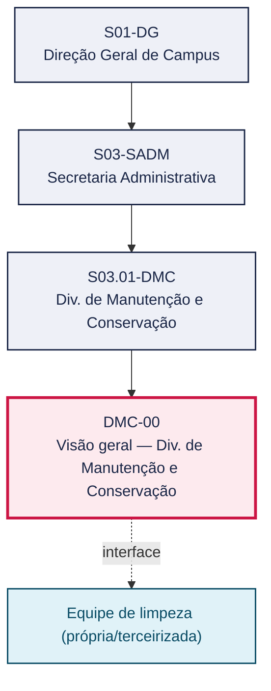

# POP DMC-00 — Visão geral — Div. de Manutenção e Conservação

> **Documento vivo** · ATDG — Assessoria Técnica da Direção Geral · UNIOESTE Campus Foz do Iguaçu · Formato DDD híbrido + BPMN 2.0 padrão Anne Bail · Versão **1.0.0** · Status **em_validacao** · Atualizado em 2026-09-03

## 0. Cabeçalho DDD

| Divisão | Departamento | Descrição |
|---|---|---|
| Secretaria Administrativa | Div. de Manutenção e Conservação | Planeja e dimensiona os serviços de limpeza e conservação por ambiente (tipo de limpeza, tempo médio, equipe e materiais), elabora a escala de execução, supervisiona a equipe própria ou terceirizada e revisa periodicamente o dimensionamento conforme o contrato vigente e as normas de saúde e segurança. |

| Domínio | Subdomínio | Tipo | Contexto delimitado |
|---|---|---|---|
| Infraestrutura e Serviços | Planejamento, execução e supervisão da limpeza e conservação | suporte | S03.01-DMC |

### 0.3 Linguagem ubíqua (glossário do processo)

| Termo | Definição | Sistema |
|---|---|---|
| DSMC | Divisão de Serviços e Manutenção/Conservação — denominação usada no controle manual de tempos de limpeza. | planilha |
| Faxina | Limpeza profunda de um ambiente, com tempo médio superior ao da limpeza normal de manutenção diária. | planilha |

## 1. Identificação

| Campo | Valor |
|---|---|
| Código | DMC-00 |
| Setor | Div. de Manutenção e Conservação (`S03.01-DMC`) |
| Responsável (função) | Chefe da Divisão de Manutenção e Conservação |
| Periodicidade | Contínua, com revisão periódica do dimensionamento |
| Subordinação | Secretaria Administrativa |
| Normativa | Contrato de prestação de serviços de limpeza/conservação; normas de saúde e segurança |
| Produto ATDG | POP |
| Pasta OneDrive | 03_MAPEAMENTO DE PROCESSOS |
| Fontes (entradas do Canvas) | pb-manutencao, 1780963200030 |
| Lacunas abertas | prazo |
| Agente responsável | — (não moldado) |

## 2. Organograma

## 3. Playbook

### 3.1 Gatilho (evento de domínio)

**Necessidade de planejar ou revisar a limpeza e conservação de um ambiente do campus** — origem: Chefe da Divisão de Manutenção e Conservação

### 3.2 Entrada

- Relação de ambientes do campus
- Contrato de prestação de serviços de limpeza/conservação

### 3.3 Passo a passo

| Nº | Ação | Responsável | Sistema | Artefato | Prazo | Evento |
|---|---|---|---|---|---|---|
| 1 | Cadastrar ambientes e tipo de limpeza (faxina/normal) | Chefe da Divisão de Manutenção e Conservação | planilha | Cadastro de ambientes | A definir | Ambientes cadastrados |
| 2 | Definir o tempo médio por ambiente | Chefe da Divisão de Manutenção e Conservação | planilha | Cadastro de ambientes | A definir | Tempo médio definido |
| 3 | Dimensionar a equipe (quantidade de pessoal) | Chefe da Divisão de Manutenção e Conservação | planilha | Dimensionamento de equipe | A definir | Equipe dimensionada |
| 4 | Relacionar os materiais necessários por atividade | Chefe da Divisão de Manutenção e Conservação | planilha | Relação de materiais | A definir | Materiais relacionados |
| 5 | Elaborar a escala/rotina de limpeza por ambiente e turno | Chefe da Divisão de Manutenção e Conservação | planilha | Escala/rotina de limpeza | A definir | Escala elaborada |
| 6 | Executar a rotina de limpeza conforme a escala e os tempos definidos | Equipe de limpeza (própria/terceirizada) | planilha | Escala/rotina de limpeza | Conforme escala | Rotina executada |
| 7 | Supervisionar e conferir a execução da rotina | Chefe da Divisão de Manutenção e Conservação | planilha | Registro de ocorrências e não conformidades | A definir | Execução supervisionada |
| 8 | Registrar ocorrências e não conformidades identificadas na supervisão | Chefe da Divisão de Manutenção e Conservação | planilha | Registro de ocorrências e não conformidades | A definir | Ocorrência registrada |
| 9 | Revisar o dimensionamento periodicamente conforme o contrato terceirizado | Chefe da Divisão de Manutenção e Conservação | planilha | Dimensionamento de equipe | Periódica | Dimensionamento revisado |

### 3.4 Saída (entregáveis)

- Escala de limpeza executada e supervisionada, com dimensionamento revisado periodicamente

## 4. Formulários e artefatos (agregados)

| Nome | Tipo | Sistema | Campos-chave | Preenchimento |
|---|---|---|---|---|
| Cadastro de ambientes | registro | planilha | ambiente, tipo de limpeza, tempo médio | Chefe da Divisão de Manutenção e Conservação |
| Escala/rotina de limpeza | documento | planilha | ambiente, turno, responsável pela execução | Chefe da Divisão de Manutenção e Conservação |
| Registro de ocorrências e não conformidades | registro | planilha | data, ambiente, ocorrência, providência | Chefe da Divisão de Manutenção e Conservação |

## 5. Decisões, exceções e pontos de atenção

| Decisão | Condição | Sim → | Não → |
|---|---|---|---|
| A supervisão identificou não conformidade na execução? | Conferência da limpeza executada frente à escala e aos padrões definidos | Registrar a ocorrência e orientar a equipe para correção | Prossegue a rotina normalmente |

**Pontos de atenção**

- Tempos são médias de referência — ajustar à realidade
- Revisar dimensionamento conforme o contrato terceirizado
- A escala deve considerar o horário de menor circulação para reduzir transtornos aos usuários dos ambientes
- Materiais de limpeza devem observar as normas de saúde e segurança do trabalho

## 6. Contingência

- Se a equipe estiver incompleta, priorizar os ambientes de maior criticidade (banheiros, áreas de circulação) até a normalização
- Se a supervisão identificar não conformidade recorrente, reforçar a orientação à equipe ou acionar a contratada terceirizada
- Se os materiais necessários não estiverem disponíveis, comunicar o Almoxarifado com antecedência para reposição

## 7. Checklist

- ( ) Ambientes e tipos de limpeza cadastrados
- ( ) Tempo médio por ambiente definido
- ( ) Equipe dimensionada conforme os ambientes e tempos
- ( ) Materiais relacionados por atividade
- ( ) Escala de limpeza elaborada e comunicada à equipe
- ( ) Execução supervisionada e ocorrências registradas

## 8. KPI / Indicadores

| Indicador | Fórmula | Meta | Fonte |
|---|---|---|---|
| Percentual de ambientes com limpeza executada conforme a escala | (Ambientes conformes ÷ total de ambientes supervisionados) × 100 | 100% | planilha |
| Número de não conformidades registradas por período | Contagem de ocorrências registradas no período | A definir | planilha |

## 9. Mapa de contexto (interfaces inter-setoriais)

| Origem | Relação | Destino | Artefato | Canal |
|---|---|---|---|---|
| Div. de Manutenção e Conservação | fornece | Equipe de limpeza (própria/terceirizada) | Escala/rotina de limpeza | planilha |
| Div. de Manutenção e Conservação | recebe | Equipe de limpeza (própria/terceirizada) | Execução da rotina de limpeza | planilha |

## 10. Fluxograma (BPMN 2.0 — padrão Anne Bail)

```mermaid
flowchart LR
  subgraph R1["Div. de Manutenção e Conservação"]
    direction LR
    e1(("Necessidade de planejar ou revisar a limpeza de um ambiente"))
    e2["Cadastrar ambientes e tipo de limpeza"]
    e3["Definir o tempo médio por ambiente"]
    e4["Dimensionar a equipe"]
    e5["Relacionar os materiais necessários"]
    e6["Elaborar a escala/rotina de limpeza"]
    e9[["✉ Retornar execução para supervisão"]]
    e10["Supervisionar e conferir a execução"]
    e11{"A supervisão identificou não conformidade?"}
    e12["Registrar ocorrência e orientar a equipe para correção"]
    e13["Revisar o dimensionamento periodicamente"]
    e14((("Rotina de limpeza executada e supervisionada")))
  end
  subgraph R2["Equipe de limpeza (própria/terceirizada)"]
    direction LR
    e7[["✉ Encaminhar escala à equipe de limpeza"]]
    e8["Executar a rotina conforme a escala e os tempos"]
  end
  e1 --> e2
  e2 --> e3
  e3 --> e4
  e4 --> e5
  e5 --> e6
  e6 --> e7
  e7 --> e8
  e8 --> e9
  e9 --> e10
  e10 --> e11
  e11 -- Sim --> e12
  e12 --> e8
  e11 -- Não --> e13
  e13 --> e14
  classDef inicio fill:#f3f4f6,stroke:#6b7280,stroke-width:1.5px,color:#374151
  classDef atividade fill:#E6F7F0,stroke:#0B7A4E,stroke-width:2px,color:#0B7A4E
  classDef decisao fill:#FFF4ED,stroke:#C9783A,stroke-width:2px,color:#C9783A
  classDef fim fill:#FDEAEE,stroke:#CC1544,stroke-width:4px,color:#CC1544
  classDef pausa fill:#FDEAEE,stroke:#CC1544,stroke-width:2px,color:#CC1544
  classDef captura fill:#E0F2F8,stroke:#0B4D66,stroke-width:2px,color:#0B4D66
  class e1 inicio
  class e2,e3,e4,e5,e6,e8,e10,e12,e13 atividade
  class e7,e9 captura
  class e11 decisao
  class e14 fim
```

## 11. Especificação BPMN para o Miro

**Raias:** Div. de Manutenção e Conservação · Equipe de limpeza (própria/terceirizada)

| Id | Tipo | Elemento | Raia |
|---|---|---|---|
| e1 | inicio | Necessidade de planejar ou revisar a limpeza de um ambiente | Div. de Manutenção e Conservação |
| e2 | atividade | Cadastrar ambientes e tipo de limpeza | Div. de Manutenção e Conservação |
| e3 | atividade | Definir o tempo médio por ambiente | Div. de Manutenção e Conservação |
| e4 | atividade | Dimensionar a equipe | Div. de Manutenção e Conservação |
| e5 | atividade | Relacionar os materiais necessários | Div. de Manutenção e Conservação |
| e6 | atividade | Elaborar a escala/rotina de limpeza | Div. de Manutenção e Conservação |
| e7 | captura | Encaminhar escala à equipe de limpeza | Equipe de limpeza (própria/terceirizada) |
| e8 | atividade | Executar a rotina conforme a escala e os tempos | Equipe de limpeza (própria/terceirizada) |
| e9 | captura | Retornar execução para supervisão | Div. de Manutenção e Conservação |
| e10 | atividade | Supervisionar e conferir a execução | Div. de Manutenção e Conservação |
| e11 | decisao | A supervisão identificou não conformidade? | Div. de Manutenção e Conservação |
| e12 | atividade | Registrar ocorrência e orientar a equipe para correção | Div. de Manutenção e Conservação |
| e13 | atividade | Revisar o dimensionamento periodicamente | Div. de Manutenção e Conservação |
| e14 | fim | Rotina de limpeza executada e supervisionada | Div. de Manutenção e Conservação |

| De | Para | Rótulo |
|---|---|---|
| e1 | e2 | — |
| e2 | e3 | — |
| e3 | e4 | — |
| e4 | e5 | — |
| e5 | e6 | — |
| e6 | e7 | — |
| e7 | e8 | — |
| e8 | e9 | — |
| e9 | e10 | — |
| e10 | e11 | — |
| e11 | e12 | Sim |
| e12 | e8 | — |
| e11 | e13 | Não |
| e13 | e14 | — |

_Especificação gerada a partir dos passos do POP; 1 raia(s). Revisar decisões e pausas antes de construir no Miro._

## 12. Histórico de versões

| Versão | Data | Autor | Tipo | Mudanças | Fontes |
|---|---|---|---|---|---|
| 0.1.0 | 2026-09-02 | scripts/scaffold_pops.py | patch | Esqueleto inicial gerado deterministicamente a partir das entradas pb-manutencao | pb-manutencao |
| 1.0.0 | 2026-09-03 | agente:construtor-pop (lote C) | major | Passo 1 alterado (acao, responsavel, sistema, artefato, prazo, evento, fontes); Passo 2 alterado (acao, responsavel, sistema, artefato, prazo, evento, fontes); Passo 3 alterado (acao, responsavel, sistema, artefato, prazo, evento, fontes); Passo 4 alterado (acao, responsavel, sistema, artefato, prazo, evento, fontes); Passo adicionado após 4: Elaborar a escala/rotina de limpeza por ambiente e turno; Passo adicionado após 4: Executar a rotina de limpeza conforme a escala e os tempos definidos; Passo adicionado após 4: Supervisionar e conferir a execução da rotina; Passo adicionado após 4: Registrar ocorrências e não conformidades identificadas na supervisão; Passo adicionado após 4: Revisar o dimensionamento periodicamente conforme o contrato terceirizado; entrada_nova: +2; saida_nova: +1; artefatos_novos: +3; decisoes_novas: +1; kpis_novos: +2; mapa_contexto_novo: +2; pontos_atencao_novos: +2; contingencia_nova: +3; checklist_novo: +6; glossario_novo: +2; Campo identificacao.responsavel atualizado; Campo identificacao.periodicidade atualizado; Campo ddd.descricao atualizado; Campo ddd.subdominio atualizado; Campo playbook.gatilho atualizado; Raias adicionadas: Equipe de limpeza (própria/terceirizada); Elementos BPMN removidos: e1, e2, e3, e4, e5, e6; Elementos BPMN adicionados: 14; Status promovido a em_validacao (≥ 3 passos e responsável definido) | pb-manutencao, 1780963200030 |

## 13. Validação e aprovação

| Papel | Função / unidade | Data |
|---|---|---|
| Elaboração | ATDG — Assessoria Técnica da Direção Geral | 2026-09-02 |
| Revisão | A definir (responsável do setor) | ___/___/______ |
| Aprovação | Direção Geral do Campus | ___/___/______ |

## 14. Lições incorporadas

- **L-001** — Referir sempre função/cargo; nomes apenas no bloco 13 (Validação), com anuência (LGPD).
- **L-004** — Nunca regenerar POP existente: aplicar patch com changelog, fontes e versão.
- **L-006** — Preservar códigos legados como códigos de processo; não renumerar.
- **L-007** — Referência Externa é benchmark; normativa do POP só cita atos da Unioeste, do Estado do Paraná ou federais aplicáveis.
- **L-002** — Um passo = uma ação; ações compostas viram passos distintos.
- **L-003** — Cada linha do mapa de contexto gera um elemento `captura` no BPMN e um passo na raia de destino.
- **L-005** — No diagnóstico, agrupar versões do mesmo documento e registrar lacuna `versao_documento`.

---
_Canvas Vivo — Base de Conhecimento Institucional · ATDG · UNIOESTE Campus Foz do Iguaçu · gerado por `scripts/render_pop.py` a partir de `pops/DMC/DMC-00.pop.json` (diretrizes v1.5)._
