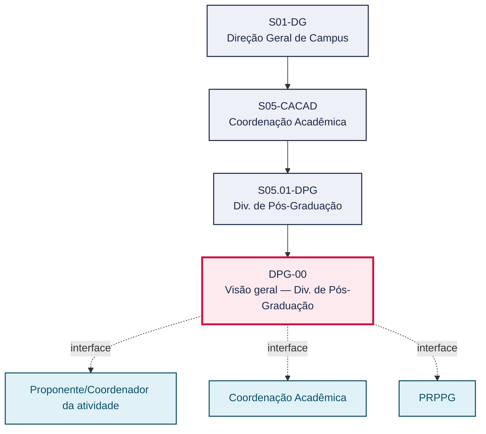

# POP DPG-00 — Visão geral — Div. de Pós-Graduação

> **Documento vivo** · ATDG — Assessoria Técnica da Direção Geral · UNIOESTE Campus Foz do Iguaçu · Formato DDD híbrido + BPMN 2.0 padrão Anne Bail · Versão **1.0.0** · Status **em_validacao** · Atualizado em 2026-09-03

## 0. Cabeçalho DDD

| Divisão | Departamento | Descrição |
|---|---|---|
| Coordenação Acadêmica | Div. de Pós-Graduação | Guia dos fluxos de pós-graduação e pesquisa no e-Protocolo (PRPPG): capacitação/afastamento docente, ética no uso de animais (CEUA/CEUAP) e cursos lato e stricto sensu. |

| Domínio | Subdomínio | Tipo | Contexto delimitado |
|---|---|---|---|
| Gestão Acadêmica | Visão geral do setor (playbook) | core | S05.01-DPG |

### 0.3 Linguagem ubíqua (glossário do processo)

| Termo | Definição | Sistema |
|---|---|---|
| e-Protocolo | Sistema institucional de tramitação eletrônica de processos e documentos da Unioeste. | e-Protocolo |
| PRPPG | Pró-Reitoria de Pesquisa e Pós-Graduação da Unioeste, responsável por deliberar sobre afastamento/capacitação docente, cursos de pós-graduação e ética em pesquisa. | — |
| CEUA | Comitê de Ética no Uso de Animais, responsável por autorizar e acompanhar projetos de pesquisa que envolvam animais. | — |
| CEUAP | Comitê de Ética no Uso de Animais de Produção, responsável por autorizar e acompanhar projetos que envolvam animais de produção. | — |
| Lato sensu | Pós-graduação de especialização, com carga horária e regras próprias definidas pela Resolução nº 071/2021-CEPE. | — |
| Stricto sensu | Pós-graduação de mestrado ou doutorado, com programas regidos pela Resolução nº 078/2016-CEPE. | — |

## 1. Identificação

| Campo | Valor |
|---|---|
| Código | DPG-00 |
| Setor | Div. de Pós-Graduação (`S05.01-DPG`) |
| Responsável (função) | Coordenação Acadêmica |
| Periodicidade | A definir |
| Subordinação | Coordenação Acadêmica |
| Normativa | Resoluções CEPE 029/2013, 071/2021 e 078/2016; Manuais de Fluxos e-Protocolo PRPPG; Manuais de Fluxos e-Protocolo — PRPPG (Capacitação de Servidores, CEUA, CEUAP, Lato Sensu, Stricto Sensu) |
| Produto ATDG | POP |
| Pasta OneDrive | 03_MAPEAMENTO DE PROCESSOS |
| Fontes (entradas do Canvas) | pb-pos-graduacao |
| Lacunas abertas | interface_setorial, versao_documento |
| Agente responsável | pop-dpg-00 |

## 2. Organograma

## 3. Playbook

### 3.1 Gatilho (evento de domínio)

**Necessidade de afastamento/capacitação, projeto de ética ou proposta/alteração de curso de pós-graduação** — origem: Proponente/Coordenador da atividade

### 3.2 Entrada

- Solicitação de afastamento/capacitação, projeto de ética (CEUA/CEUAP) ou proposta/alteração de curso lato/stricto sensu

### 3.3 Passo a passo

| Nº | Ação | Responsável | Sistema | Artefato | Prazo | Evento |
|---|---|---|---|---|---|---|
| 1 | Identificar o ato (afastamento/capacitação, proposta/alteração de curso lato/stricto, projeto de ética CEUA/CEUAP) | Proponente/Coordenador da atividade | e-Protocolo | Protocolo unificado/formulário específico | Antes da abertura do e-Protocolo | Ato identificado |
| 2 | Verificar se o projeto/proposta envolve propriedade intelectual e, em caso positivo, marcar o processo como sigiloso | Proponente/Coordenador da atividade | e-Protocolo | Processo e-Protocolo (sigiloso) | No ato da abertura do e-Protocolo | Sigilo classificado |
| 3 | Instruir o e-Protocolo conforme o fluxo aplicável ao ato identificado | Proponente/Coordenador da atividade | e-Protocolo | Processo e-Protocolo | A definir | e-Protocolo instruído |
| 4 | Anexar a documentação exigida pelo ato | Proponente/Coordenador da atividade | e-Protocolo | Documentação específica do ato | Antes do encaminhamento à Coordenação Acadêmica | Documentação anexada |
| 5 | Encaminhar à PRPPG (ou ao comitê de ética competente) para deliberação | Coordenação Acadêmica | e-Protocolo | Processo e-Protocolo | A definir | Processo encaminhado |
| 6 | Identificar se o ato é de competência de comitê de ética (CEUA/CEUAP) e direcionar adequadamente | Coordenação Acadêmica | e-Protocolo | Processo e-Protocolo | A definir | Processo direcionado |
| 7 | Registrar a deliberação da PRPPG (ou do comitê de ética) e comunicar ao proponente | Coordenação Acadêmica | e-Protocolo | Processo e-Protocolo | A definir | Deliberação comunicada |

### 3.4 Saída (entregáveis)

- Processo deliberado pela PRPPG ou pelo comitê de ética competente (deferido, indeferido ou com pendência)

## 4. Formulários e artefatos (agregados)

| Nome | Tipo | Sistema | Campos-chave | Preenchimento |
|---|---|---|---|---|
| Protocolo unificado e termo de responsabilidade | formulario | e-Protocolo | proponente, ato solicitado, sigilo (S/N) | Proponente/Coordenador da atividade |

## 5. Decisões, exceções e pontos de atenção

| Decisão | Condição | Sim → | Não → |
|---|---|---|---|
| Projeto envolve propriedade intelectual? | O projeto de pesquisa/ato envolve propriedade intelectual | Marcar e tramitar o e-Protocolo como sigiloso | Tramitar pelo fluxo ordinário (não sigiloso) |
| Ato é de competência de comitê de ética (CEUA/CEUAP)? | O ato identificado é um projeto de pesquisa com uso de animais | Encaminhar ao CEUA/CEUAP competente | Encaminhar diretamente à PRPPG para deliberação |

**Pontos de atenção**

- Observar as Resoluções CEPE aplicáveis (029/2013, 071/2021, 078/2016)
- Projetos com propriedade intelectual tramitam como sigilosos
- Afastamento para o exterior tem requisitos adicionais

## 6. Contingência

- Se o e-Protocolo estiver indisponível, registrar a solicitação em meio alternativo e regularizar a tramitação eletrônica assim que o sistema for restabelecido.
- Se a documentação estiver incompleta, devolver ao proponente/coordenador com a relação de pendências antes de encaminhar à PRPPG.
- Em caso de dúvida sobre o fluxo aplicável, consultar a Comissão e-Protocolo ou a PRPPG antes de tramitar.

## 7. Checklist

- ( ) Ato/modalidade corretamente identificado
- ( ) e-Protocolo aberto conforme o fluxo específico
- ( ) Documentação obrigatória anexada
- ( ) Classificação de sigilo (propriedade intelectual) verificada, quando aplicável
- ( ) Encaminhamento à PRPPG realizado e acompanhamento registrado

## 8. KPI / Indicadores

| Indicador | Fórmula | Meta | Fonte |
|---|---|---|---|
| Tempo médio de tramitação (abertura no e-Protocolo → deliberação da PRPPG) | Σ(data da deliberação − data de abertura) / nº de processos no período | A definir | e-Protocolo |
| Percentual de processos devolvidos por pendência documental ou fluxo incorreto | processos devolvidos / total de processos abertos × 100 | A definir | e-Protocolo |

## 9. Mapa de contexto (interfaces inter-setoriais)

| Origem | Relação | Destino | Artefato | Canal |
|---|---|---|---|---|
| Proponente/Coordenador da atividade | fornece | Coordenação Acadêmica | Processo instruído (afastamento/curso/projeto) | e-Protocolo |
| Coordenação Acadêmica | aprova | PRPPG | Processo encaminhado à PRPPG | e-Protocolo |
| PRPPG | informa | Coordenação Acadêmica | Deliberação da PRPPG | e-Protocolo |

## 10. Fluxograma (BPMN 2.0 — padrão Anne Bail)

```mermaid
flowchart LR
  subgraph R1["Proponente/Coordenador da atividade"]
    direction LR
    e1(("Necessidade de afastamento/capacitação, projeto de ética ou proposta/…"))
    e2["Identificar o ato (afastamento, proposta/alteração de curso, projeto…"]
    e3{"Projeto envolve propriedade intelectual?"}
    e4["Marcar o processo como sigiloso no e-Protocolo"]
    e5["Instruir o e-Protocolo conforme o fluxo aplicável"]
    e6["Anexar a documentação exigida pelo ato"]
  end
  subgraph R2["Coordenação Acadêmica"]
    direction LR
    e7[["✉ Encaminhar à Coordenação Acadêmica"]]
    e8{"Ato é de competência de comitê de ética (CEUA/CEUAP)?"}
    e12[["✉ Informar deliberação à Coordenação Acadêmica"]]
    e13["Registrar a deliberação e comunicar ao proponente"]
    e14((("Processo deliberado pela PRPPG")))
  end
  subgraph R3["CEUA/CEUAP"]
    direction LR
    e9[["✉ Encaminhar ao CEUA/CEUAP"]]
  end
  subgraph R4["PRPPG"]
    direction LR
    e10[["✉ Encaminhar à PRPPG para deliberação"]]
    e11(["⏱ Aguardar deliberação da PRPPG (ou do comitê de ética)"])
  end
  e1 --> e2
  e2 --> e3
  e3 -- Sim --> e4
  e4 --> e5
  e3 -- Não --> e5
  e5 --> e6
  e6 --> e7
  e7 --> e8
  e8 -- Sim --> e9
  e9 --> e12
  e8 -- Não --> e10
  e10 --> e11
  e11 --> e12
  e12 --> e13
  e13 --> e14
  classDef inicio fill:#f3f4f6,stroke:#6b7280,stroke-width:1.5px,color:#374151
  classDef atividade fill:#E6F7F0,stroke:#0B7A4E,stroke-width:2px,color:#0B7A4E
  classDef decisao fill:#FFF4ED,stroke:#C9783A,stroke-width:2px,color:#C9783A
  classDef fim fill:#FDEAEE,stroke:#CC1544,stroke-width:4px,color:#CC1544
  classDef pausa fill:#FDEAEE,stroke:#CC1544,stroke-width:2px,color:#CC1544
  classDef captura fill:#E0F2F8,stroke:#0B4D66,stroke-width:2px,color:#0B4D66
  class e1 inicio
  class e2,e4,e5,e6,e13 atividade
  class e3,e8 decisao
  class e7,e9,e10,e12 captura
  class e11 pausa
  class e14 fim
```

## 11. Especificação BPMN para o Miro

**Raias:** Proponente/Coordenador da atividade · Coordenação Acadêmica · CEUA/CEUAP · PRPPG

| Id | Tipo | Elemento | Raia |
|---|---|---|---|
| e1 | inicio | Necessidade de afastamento/capacitação, projeto de ética ou proposta/alteração de curso de pós-graduação | Proponente/Coordenador da atividade |
| e2 | atividade | Identificar o ato (afastamento, proposta/alteração de curso, projeto de ética) | Proponente/Coordenador da atividade |
| e3 | decisao | Projeto envolve propriedade intelectual? | Proponente/Coordenador da atividade |
| e4 | atividade | Marcar o processo como sigiloso no e-Protocolo | Proponente/Coordenador da atividade |
| e5 | atividade | Instruir o e-Protocolo conforme o fluxo aplicável | Proponente/Coordenador da atividade |
| e6 | atividade | Anexar a documentação exigida pelo ato | Proponente/Coordenador da atividade |
| e7 | captura | Encaminhar à Coordenação Acadêmica | Coordenação Acadêmica |
| e8 | decisao | Ato é de competência de comitê de ética (CEUA/CEUAP)? | Coordenação Acadêmica |
| e9 | captura | Encaminhar ao CEUA/CEUAP | CEUA/CEUAP |
| e10 | captura | Encaminhar à PRPPG para deliberação | PRPPG |
| e11 | pausa | Aguardar deliberação da PRPPG (ou do comitê de ética) | PRPPG |
| e12 | captura | Informar deliberação à Coordenação Acadêmica | Coordenação Acadêmica |
| e13 | atividade | Registrar a deliberação e comunicar ao proponente | Coordenação Acadêmica |
| e14 | fim | Processo deliberado pela PRPPG | Coordenação Acadêmica |

| De | Para | Rótulo |
|---|---|---|
| e1 | e2 | — |
| e2 | e3 | — |
| e3 | e4 | Sim |
| e4 | e5 | — |
| e3 | e5 | Não |
| e5 | e6 | — |
| e6 | e7 | — |
| e7 | e8 | — |
| e8 | e9 | Sim |
| e9 | e12 | — |
| e8 | e10 | Não |
| e10 | e11 | — |
| e11 | e12 | — |
| e12 | e13 | — |
| e13 | e14 | — |

_Especificação gerada a partir dos passos do POP; 1 raia(s). Revisar decisões e pausas antes de construir no Miro._

## 12. Histórico de versões

| Versão | Data | Autor | Tipo | Mudanças | Fontes |
|---|---|---|---|---|---|
| 0.1.0 | 2026-09-02 | scripts/scaffold_pops.py | patch | Esqueleto inicial gerado deterministicamente a partir das entradas pb-pos-graduacao | pb-pos-graduacao |
| 1.0.0 | 2026-09-03 | agente:construtor-pop (lote D1) | major | Passo 1 alterado (acao, responsavel, sistema, artefato, prazo, evento); Passo 2 alterado (acao, responsavel, sistema, artefato, prazo, evento); Passo 3 alterado (acao, responsavel, sistema, artefato, prazo, evento); Passo 4 alterado (acao, responsavel, sistema, artefato, prazo, evento); Passo adicionado após 1: Verificar se o projeto/proposta envolve propriedade intelectual e, em caso posit; Passo adicionado após 4: Identificar se o ato é de competência de comitê de ética (CEUA/CEUAP) e direcion; Passo adicionado após 4: Registrar a deliberação da PRPPG (ou do comitê de ética) e comunicar ao proponen; entrada_nova: +1; saida_nova: +1; artefatos_novos: +1; decisoes_novas: +2; kpis_novos: +2; mapa_contexto_novo: +3; pontos_atencao_novos: +3; contingencia_nova: +3; checklist_novo: +5; glossario_novo: +6; normativa_nova: +1; Campo identificacao.responsavel atualizado; Campo playbook.gatilho atualizado; Raias adicionadas: Proponente/Coordenador da atividade, Coordenação Acadêmica, CEUA/CEUAP, PRPPG; Elementos BPMN removidos: e1, e2, e3, e4, e5, e6; Elementos BPMN adicionados: 14; Status promovido a em_validacao (≥ 3 passos e responsável definido) | pb-pos-graduacao |

## 13. Validação e aprovação

| Papel | Função / unidade | Data |
|---|---|---|
| Elaboração | ATDG — Assessoria Técnica da Direção Geral | 2026-09-02 |
| Revisão | A definir (responsável do setor) | ___/___/______ |
| Aprovação | Direção Geral do Campus | ___/___/______ |

## 14. Lições incorporadas

- **L-001** — Referir sempre função/cargo; nomes apenas no bloco 13 (Validação), com anuência (LGPD).
- **L-004** — Nunca regenerar POP existente: aplicar patch com changelog, fontes e versão.
- **L-006** — Preservar códigos legados como códigos de processo; não renumerar.
- **L-007** — Referência Externa é benchmark; normativa do POP só cita atos da Unioeste, do Estado do Paraná ou federais aplicáveis.
- **L-002** — Um passo = uma ação; ações compostas viram passos distintos.
- **L-003** — Cada linha do mapa de contexto gera um elemento `captura` no BPMN e um passo na raia de destino.

---
_Canvas Vivo — Base de Conhecimento Institucional · ATDG · UNIOESTE Campus Foz do Iguaçu · gerado por `scripts/render_pop.py` a partir de `pops/DPG/DPG-00.pop.json` (diretrizes v1.2)._
