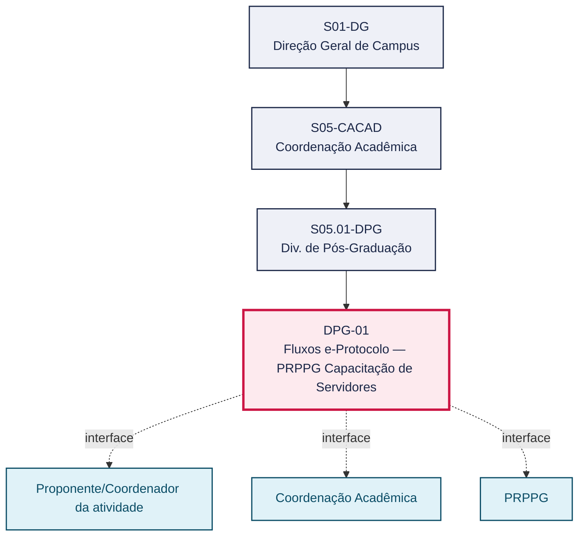
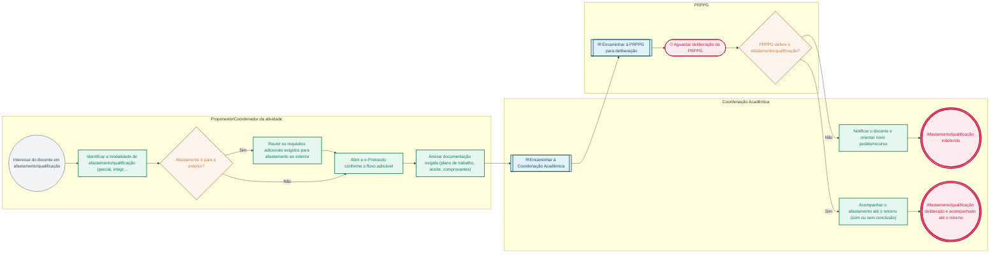

# POP DPG-01 — Fluxos e-Protocolo — PRPPG Capacitação de Servidores

> **Documento vivo** · ATDG — Assessoria Técnica da Direção Geral · UNIOESTE Campus Foz do Iguaçu · Formato DDD híbrido + BPMN 2.0 padrão Anne Bail · Versão **1.0.0** · Status **em_validacao** · Atualizado em 2026-09-03

## 0. Cabeçalho DDD

| Divisão | Departamento | Descrição |
|---|---|---|
| Coordenação Acadêmica | Div. de Pós-Graduação | Manual da Comissão e-Protocolo com os fluxos da PRPPG relativos à capacitação de servidores, com foco no afastamento e qualificação docente (Resolução nº 029/2013-CEPE). Cobre afastamento parcial/integral, afastamento para o exterior, prorrogação, transformação, troca de programa e retorno com/sem conclusão. Orienta a tramitação de cada situação no e-Protocolo. |

| Domínio | Subdomínio | Tipo | Contexto delimitado |
|---|---|---|---|
| Gestão Acadêmica | Fluxos e-Protocolo — PRPPG Capacitação de Servidores | core | S05.01-DPG |

### 0.3 Linguagem ubíqua (glossário do processo)

| Termo | Definição | Sistema |
|---|---|---|
| e-Protocolo | Sistema institucional de tramitação eletrônica de processos e documentos da Unioeste. | e-Protocolo |
| PRPPG | Pró-Reitoria de Pesquisa e Pós-Graduação da Unioeste, responsável por deliberar sobre afastamento/capacitação docente, cursos de pós-graduação e ética em pesquisa. | — |
| CEUA | Comitê de Ética no Uso de Animais, responsável por autorizar e acompanhar projetos de pesquisa que envolvam animais. | — |
| CEUAP | Comitê de Ética no Uso de Animais de Produção, responsável por autorizar e acompanhar projetos que envolvam animais de produção. | — |
| Lato sensu | Pós-graduação de especialização, com carga horária e regras próprias definidas pela Resolução nº 071/2021-CEPE. | — |
| Stricto sensu | Pós-graduação de mestrado ou doutorado, com programas regidos pela Resolução nº 078/2016-CEPE. | — |

## 1. Identificação

| Campo | Valor |
|---|---|
| Código | DPG-01 |
| Setor | Div. de Pós-Graduação (`S05.01-DPG`) |
| Responsável (função) | Coordenação Acadêmica |
| Periodicidade | A definir |
| Subordinação | Coordenação Acadêmica |
| Normativa | Resolução nº 029/2013-CEPE; Manual de Fluxos e-Protocolo PRPPG; FLUXO-PRPPG-CAPACITAÇÃO_SERVIDORES_NOVO_2.pdf — Manual da Comissão e-Protocolo (documento-fonte) |
| Produto ATDG | POP |
| Pasta OneDrive | 03_MAPEAMENTO DE PROCESSOS |
| Fontes (entradas do Canvas) | 1780963200043 |
| Lacunas abertas | interface_setorial, versao_documento |
| Agente responsável | — (não moldado) |

## 2. Organograma

## 3. Playbook

### 3.1 Gatilho (evento de domínio)

**Interesse do docente em afastamento/qualificação para capacitação** — origem: Proponente/Coordenador da atividade

### 3.2 Entrada

- Solicitação de afastamento/qualificação docente

### 3.3 Passo a passo

| Nº | Ação | Responsável | Sistema | Artefato | Prazo | Evento |
|---|---|---|---|---|---|---|
| 1 | Identificar a modalidade de afastamento/qualificação (parcial, integral, prorrogação, transformação ou troca de programa) | Proponente/Coordenador da atividade | e-Protocolo | Formulário de afastamento/qualificação | Antes da abertura do e-Protocolo | Modalidade identificada |
| 2 | Reunir os requisitos adicionais exigidos quando o afastamento for para o exterior | Proponente/Coordenador da atividade | e-Protocolo | Documentação adicional de afastamento ao exterior | A definir | Requisitos adicionais reunidos |
| 3 | Abrir o e-Protocolo conforme o fluxo aplicável à modalidade | Proponente/Coordenador da atividade | e-Protocolo | Processo e-Protocolo | A definir | e-Protocolo aberto |
| 4 | Anexar a documentação exigida (plano de trabalho, aceite da instituição, comprovantes) | Proponente/Coordenador da atividade | e-Protocolo | Plano de trabalho; comprovante de aceite | Antes do encaminhamento à Coordenação Acadêmica | Documentação anexada |
| 5 | Encaminhar o processo à Coordenação Acadêmica | Proponente/Coordenador da atividade | e-Protocolo | Processo e-Protocolo | A definir | Processo encaminhado |
| 6 | Encaminhar à PRPPG para deliberação e acompanhar o retorno | Coordenação Acadêmica | e-Protocolo | Processo e-Protocolo | A definir | Deliberação acompanhada |
| 7 | Notificar o docente em caso de indeferimento e orientar novo pedido/recurso | Coordenação Acadêmica | e-Protocolo | Processo e-Protocolo | A definir | Indeferimento notificado |
| 8 | Acompanhar o afastamento deferido até o retorno, com ou sem conclusão | Coordenação Acadêmica | e-Protocolo | Processo e-Protocolo | A definir | Retorno registrado |

### 3.4 Saída (entregáveis)

- Afastamento/qualificação deliberado pela PRPPG e acompanhado até o retorno

## 4. Formulários e artefatos (agregados)

| Nome | Tipo | Sistema | Campos-chave | Preenchimento |
|---|---|---|---|---|
| Formulário de afastamento/qualificação docente | formulario | e-Protocolo | modalidade, instituição de destino, período, plano de trabalho | Proponente/Coordenador da atividade |
| Plano de trabalho de capacitação | documento | e-Protocolo | objetivo, cronograma, aceite da instituição | Proponente/Coordenador da atividade |

## 5. Decisões, exceções e pontos de atenção

| Decisão | Condição | Sim → | Não → |
|---|---|---|---|
| Afastamento é para o exterior? | O afastamento/qualificação ocorrerá fora do país | Reunir os requisitos adicionais exigidos (Resolução nº 029/2013-CEPE) antes de abrir o e-Protocolo | Seguir a instrução padrão de afastamento nacional |
| PRPPG defere o afastamento/qualificação? | A PRPPG delibera favoravelmente ao pedido | Acompanhar o afastamento até o retorno, com ou sem conclusão | Notificar o docente e orientar novo pedido ou recurso |

**Pontos de atenção**

- Observar a Resolução nº 029/2013-CEPE
- Afastamento para o exterior tem requisitos adicionais

## 6. Contingência

- Se o e-Protocolo estiver indisponível, registrar a solicitação em meio alternativo e regularizar a tramitação eletrônica assim que o sistema for restabelecido.
- Se a documentação estiver incompleta, devolver ao proponente/coordenador com a relação de pendências antes de encaminhar à PRPPG.
- Em caso de dúvida sobre o fluxo aplicável, consultar a Comissão e-Protocolo ou a PRPPG antes de tramitar.
- Para afastamento ao exterior, verificar previamente os requisitos adicionais exigidos antes de abrir o e-Protocolo, evitando retrabalho.

## 7. Checklist

- ( ) Ato/modalidade corretamente identificado
- ( ) e-Protocolo aberto conforme o fluxo específico
- ( ) Documentação obrigatória anexada
- ( ) Classificação de sigilo (propriedade intelectual) verificada, quando aplicável
- ( ) Encaminhamento à PRPPG realizado e acompanhamento registrado

## 8. KPI / Indicadores

| Indicador | Fórmula | Meta | Fonte |
|---|---|---|---|
| Tempo médio de tramitação (abertura no e-Protocolo → deliberação da PRPPG) | Σ(data da deliberação − data de abertura) / nº de processos no período | A definir | e-Protocolo |
| Percentual de processos devolvidos por pendência documental ou fluxo incorreto | processos devolvidos / total de processos abertos × 100 | A definir | e-Protocolo |

## 9. Mapa de contexto (interfaces inter-setoriais)

| Origem | Relação | Destino | Artefato | Canal |
|---|---|---|---|---|
| Proponente/Coordenador da atividade | fornece | Coordenação Acadêmica | Processo instruído (afastamento/curso/projeto) | e-Protocolo |
| Coordenação Acadêmica | aprova | PRPPG | Processo encaminhado à PRPPG | e-Protocolo |
| PRPPG | informa | Coordenação Acadêmica | Deliberação da PRPPG | e-Protocolo |

## 10. Fluxograma (BPMN 2.0 — padrão Anne Bail)

## 11. Especificação BPMN para o Miro

**Raias:** Proponente/Coordenador da atividade · Coordenação Acadêmica · PRPPG

| Id | Tipo | Elemento | Raia |
|---|---|---|---|
| e1 | inicio | Interesse do docente em afastamento/qualificação | Proponente/Coordenador da atividade |
| e2 | atividade | Identificar a modalidade de afastamento/qualificação (parcial, integral, prorrogação, transformação, troca de programa) | Proponente/Coordenador da atividade |
| e3 | decisao | Afastamento é para o exterior? | Proponente/Coordenador da atividade |
| e4 | atividade | Reunir os requisitos adicionais exigidos para afastamento ao exterior | Proponente/Coordenador da atividade |
| e5 | atividade | Abrir o e-Protocolo conforme o fluxo aplicável | Proponente/Coordenador da atividade |
| e6 | atividade | Anexar documentação exigida (plano de trabalho, aceite, comprovantes) | Proponente/Coordenador da atividade |
| e7 | captura | Encaminhar à Coordenação Acadêmica | Coordenação Acadêmica |
| e8 | captura | Encaminhar à PRPPG para deliberação | PRPPG |
| e9 | pausa | Aguardar deliberação da PRPPG | PRPPG |
| e10 | decisao | PRPPG defere o afastamento/qualificação? | PRPPG |
| e11 | atividade | Notificar o docente e orientar novo pedido/recurso | Coordenação Acadêmica |
| e12 | fim | Afastamento/qualificação indeferido | Coordenação Acadêmica |
| e13 | atividade | Acompanhar o afastamento até o retorno (com ou sem conclusão) | Coordenação Acadêmica |
| e14 | fim | Afastamento/qualificação deliberado e acompanhado até o retorno | Coordenação Acadêmica |

| De | Para | Rótulo |
|---|---|---|
| e1 | e2 | — |
| e2 | e3 | — |
| e3 | e4 | Sim |
| e4 | e5 | — |
| e3 | e5 | Não |
| e5 | e6 | — |
| e6 | e7 | — |
| e7 | e8 | — |
| e8 | e9 | — |
| e9 | e10 | — |
| e10 | e11 | Não |
| e11 | e12 | — |
| e10 | e13 | Sim |
| e13 | e14 | — |

_Especificação gerada a partir dos passos do POP; 1 raia(s). Revisar decisões e pausas antes de construir no Miro._

## 12. Histórico de versões

| Versão | Data | Autor | Tipo | Mudanças | Fontes |
|---|---|---|---|---|---|
| 0.1.0 | 2026-09-02 | scripts/scaffold_pops.py | patch | Esqueleto inicial gerado deterministicamente a partir das entradas 1780963200043 | 1780963200043 |
| 1.0.0 | 2026-09-03 | agente:construtor-pop (lote D1) | major | Passo 1 alterado (acao, responsavel, sistema, artefato, prazo, evento); Passo 2 alterado (acao, responsavel, sistema, artefato, prazo, evento); Passo 3 alterado (acao, responsavel, sistema, artefato, prazo, evento); Passo 4 alterado (acao, responsavel, sistema, artefato, prazo, evento); Passo adicionado após 1: Reunir os requisitos adicionais exigidos quando o afastamento for para o exterio; Passo adicionado após 3: Encaminhar o processo à Coordenação Acadêmica; Passo adicionado após 4: Notificar o docente em caso de indeferimento e orientar novo pedido/recurso; Passo adicionado após 4: Acompanhar o afastamento deferido até o retorno, com ou sem conclusão; entrada_nova: +1; saida_nova: +1; artefatos_novos: +2; decisoes_novas: +2; kpis_novos: +2; mapa_contexto_novo: +3; pontos_atencao_novos: +2; contingencia_nova: +4; checklist_novo: +5; glossario_novo: +6; normativa_nova: +1; Campo identificacao.responsavel atualizado; Campo playbook.gatilho atualizado; Raias adicionadas: Proponente/Coordenador da atividade, Coordenação Acadêmica, PRPPG; Elementos BPMN removidos: e1, e2, e3, e4, e5, e6; Elementos BPMN adicionados: 14; Status promovido a em_validacao (≥ 3 passos e responsável definido) | 1780963200043 |

## 13. Validação e aprovação

| Papel | Função / unidade | Data |
|---|---|---|
| Elaboração | ATDG — Assessoria Técnica da Direção Geral | 2026-09-02 |
| Revisão | A definir (responsável do setor) | ___/___/______ |
| Aprovação | Direção Geral do Campus | ___/___/______ |

## 14. Lições incorporadas

- **L-001** — Referir sempre função/cargo; nomes apenas no bloco 13 (Validação), com anuência (LGPD).
- **L-004** — Nunca regenerar POP existente: aplicar patch com changelog, fontes e versão.
- **L-006** — Preservar códigos legados como códigos de processo; não renumerar.
- **L-007** — Referência Externa é benchmark; normativa do POP só cita atos da Unioeste, do Estado do Paraná ou federais aplicáveis.
- **L-002** — Um passo = uma ação; ações compostas viram passos distintos.
- **L-003** — Cada linha do mapa de contexto gera um elemento `captura` no BPMN e um passo na raia de destino.

---
_Canvas Vivo — Base de Conhecimento Institucional · ATDG · UNIOESTE Campus Foz do Iguaçu · gerado por `scripts/render_pop.py` a partir de `pops/DPG/DPG-01.pop.json` (diretrizes v1.2)._
