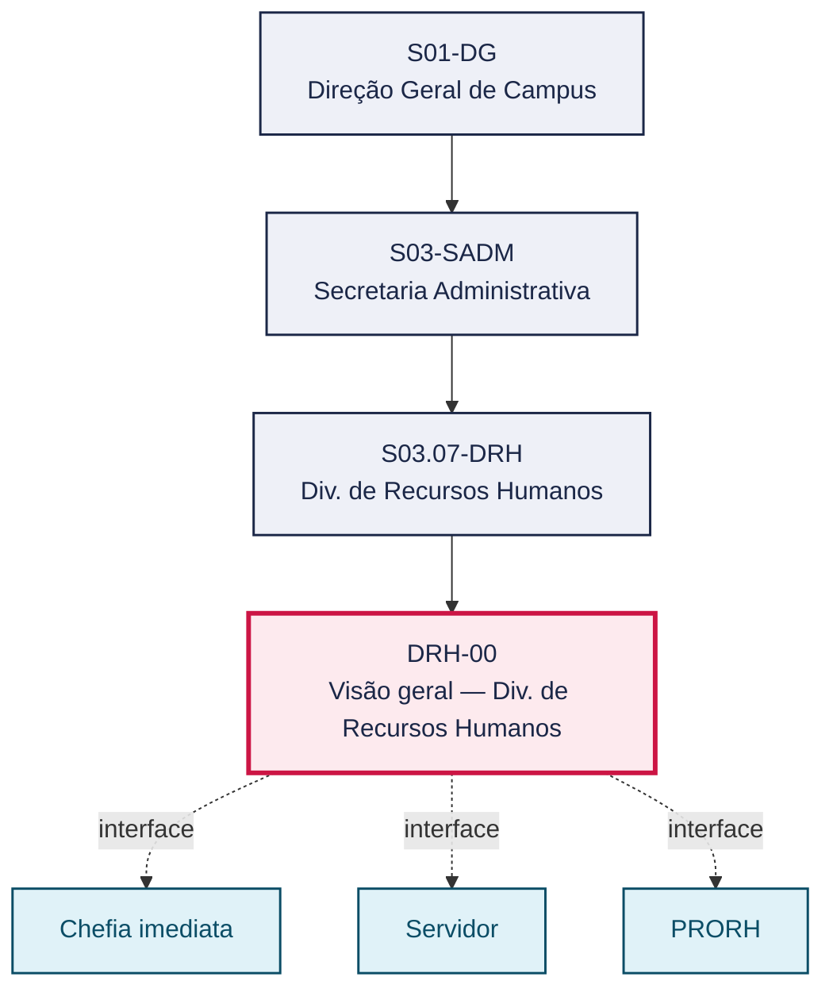

# POP DRH-00 — Visão geral — Div. de Recursos Humanos

> **Documento vivo** · ATDG — Assessoria Técnica da Direção Geral · UNIOESTE Campus Foz do Iguaçu · Formato DDD híbrido + BPMN 2.0 padrão Anne Bail · Versão **1.0.0** · Status **em_validacao** · Atualizado em 2026-09-03

## 0. Cabeçalho DDD

| Divisão | Departamento | Descrição |
|---|---|---|
| Secretaria Administrativa | Div. de Recursos Humanos | Coordena o controle diário e semanal de frequência por ponto eletrônico (IS 001/2024-DRH/Foz e Instrução 002/2019) e a instrução dos processos funcionais de RH (licenças, afastamentos, progressões) no e-Protocolo conforme o fluxo vigente da PRORH (v3.0), nos termos da Lei nº 6.174/1970 e do Edital 096/2023-GRE. |

| Domínio | Subdomínio | Tipo | Contexto delimitado |
|---|---|---|---|
| Gestão de Pessoas | Controle de frequência e instrução de processos funcionais de RH | core | S03.07-DRH |

### 0.3 Linguagem ubíqua (glossário do processo)

| Termo | Definição | Sistema |
|---|---|---|
| PRORH | Comissão/fluxo de Procedimentos de Recursos Humanos que tramita os processos funcionais no e-Protocolo. | e-Protocolo |
| IS 001/2024-DRH/Foz | Instrução de Serviço que disciplina o controle de frequência por ponto eletrônico no Campus Foz. | ponto eletrônico |

## 1. Identificação

| Campo | Valor |
|---|---|
| Código | DRH-00 |
| Setor | Div. de Recursos Humanos (`S03.07-DRH`) |
| Responsável (função) | Chefe da Divisão de Recursos Humanos |
| Periodicidade | Diária (registro de ponto) e semanal (apuração); processos funcionais por demanda |
| Subordinação | Secretaria Administrativa |
| Normativa | Lei nº 6.174/1970; IS 001/2024-DRH/Foz; Instrução 002/2019; Edital 096/2023-GRE (Anexo I); Fluxos e-Protocolo PRORH |
| Produto ATDG | POP |
| Pasta OneDrive | 03_MAPEAMENTO DE PROCESSOS |
| Fontes (entradas do Canvas) | pb-rh, 1780963200022, 1780963200025, 1780963200026, 1780963200027, 1780963200048, 1780963200065 |
| Lacunas abertas | prazo |
| Agente responsável | — (não moldado) |

## 2. Organograma

## 3. Playbook

### 3.1 Gatilho (evento de domínio)

**Início da jornada de trabalho do servidor ou necessidade de instruir processo funcional de RH** — origem: Servidor / Chefia imediata

### 3.2 Entrada

- Registro de ponto eletrônico do dia
- Solicitação de processo funcional (quando houver)

### 3.3 Passo a passo

| Nº | Ação | Responsável | Sistema | Artefato | Prazo | Evento |
|---|---|---|---|---|---|---|
| 1 | Registrar o ponto eletrônico diário (entrada, saída, intervalos) | Servidor | ponto eletrônico | Registro de ponto | Diário | Ponto registrado |
| 2 | Apurar semanalmente a frequência registrada | Chefia imediata | ponto eletrônico | Apuração semanal de frequência | Semanal | Frequência apurada |
| 3 | Consolidar a frequência do período | Chefe da Divisão de Recursos Humanos | ponto eletrônico | Consolidado de frequência | A definir | Frequência consolidada |
| 4 | Comunicar falha ou divergência de registro e apresentar justificativa em até 48h via e-Protocolo | Servidor | e-Protocolo | Justificativa de frequência | Até 48h da falha | Falha justificada |
| 5 | Solicitar processo funcional de RH (licença, afastamento, progressão), quando necessário | Servidor | e-Protocolo | Solicitação de processo funcional | A definir | Processo funcional solicitado |
| 6 | Instruir o processo de RH no e-Protocolo conforme o fluxo PRORH vigente (v3.0) | Chefe da Divisão de Recursos Humanos | e-Protocolo | Processo e-Protocolo de RH | A definir | Processo instruído |
| 7 | Analisar e deliberar sobre o processo | PRORH | e-Protocolo | Deliberação da PRORH | A definir | Processo deliberado |
| 8 | Comunicar a decisão ao servidor e à chefia imediata | PRORH | e-Protocolo | Comunicação de decisão | A definir | Decisão comunicada |
| 9 | Arquivar e atualizar o registro funcional do servidor | Chefe da Divisão de Recursos Humanos | e-Protocolo | Registro funcional atualizado | A definir | Registro funcional atualizado |

### 3.4 Saída (entregáveis)

- Frequência apurada e, quando houver falha, justificada dentro do prazo
- Processo funcional de RH instruído, deliberado pela PRORH e registro atualizado

## 4. Formulários e artefatos (agregados)

| Nome | Tipo | Sistema | Campos-chave | Preenchimento |
|---|---|---|---|---|
| Registro de ponto | registro | ponto eletrônico | matrícula, data, horários registrados | Servidor |
| Apuração semanal de frequência | registro | ponto eletrônico | semana de referência, ocorrências, status | Chefia imediata |
| Justificativa de frequência | formulario | e-Protocolo | data da falha, motivo, documento comprobatório | Servidor |
| Processo e-Protocolo de RH | registro | e-Protocolo | tipo de processo, servidor requerente, documentação anexada | Chefe da Divisão de Recursos Humanos |

## 5. Decisões, exceções e pontos de atenção

| Decisão | Condição | Sim → | Não → |
|---|---|---|---|
| Há falha ou divergência no registro de ponto? | Verificação do registro pela chefia na apuração semanal | Servidor comunica a falha e justifica em até 48h via e-Protocolo | Frequência do período é consolidada normalmente |
| PRORH aprova o processo funcional solicitado? | Análise da documentação e do enquadramento legal do pedido | Chefe da Divisão de Recursos Humanos arquiva e atualiza o registro funcional | Processo é devolvido para complementação de documentação |

**Pontos de atenção**

- Vedada prestação de serviço sem registro de ponto
- Usar o fluxo PRORH v3.0 (set/2024), não a v2.0
- Lei 6.174/70 possui alterações posteriores — verificar vigência
- A Lei nº 6.174/1970 possui alterações posteriores não mapeadas — confirmar vigência antes de fundamentar decisões
- O fluxo PRORH deve seguir a versão vigente (v3.0); versões e cópias anteriores servem apenas de referência histórica

## 6. Contingência

- Se o servidor não comunicar a falha de registro em até 48h, a chefia deve registrar a ocorrência e orientar a regularização
- Se a documentação do processo funcional estiver incompleta, a PRORH devolve o processo para complementação
- Se houver dúvida sobre a norma aplicável em razão de alterações da Lei nº 6.174/1970, consultar a Assessoria Jurídica antes de decidir
- Se o servidor não puder registrar o ponto por motivo justificado, a chefia imediata deve formalizar a exceção conforme a IS 001/2024-DRH/Foz

## 7. Checklist

- ( ) Ponto eletrônico registrado diariamente
- ( ) Frequência apurada semanalmente pela chefia imediata
- ( ) Justificativas de falha comunicadas em até 48h
- ( ) Processo de RH instruído no e-Protocolo conforme o fluxo PRORH v3.0
- ( ) Decisão da PRORH comunicada ao servidor e à chefia
- ( ) Registro funcional do servidor atualizado

## 8. KPI / Indicadores

| Indicador | Fórmula | Meta | Fonte |
|---|---|---|---|
| Percentual de justificativas de frequência apresentadas dentro do prazo de 48h | (Justificativas dentro do prazo ÷ total de falhas) × 100 | 100% | e-Protocolo |
| Prazo médio de tramitação dos processos de RH no e-Protocolo | Data de conclusão − Data de abertura do processo | A definir | e-Protocolo |

## 9. Mapa de contexto (interfaces inter-setoriais)

| Origem | Relação | Destino | Artefato | Canal |
|---|---|---|---|---|
| Div. de Recursos Humanos | recebe | Chefia imediata | Apuração semanal de frequência | ponto eletrônico |
| Div. de Recursos Humanos | recebe | Servidor | Justificativa de frequência / solicitação de processo funcional | e-Protocolo |
| Div. de Recursos Humanos | fornece | PRORH | Processo de RH instruído | e-Protocolo |
| Div. de Recursos Humanos | recebe | PRORH | Decisão sobre o processo funcional | e-Protocolo |

## 10. Fluxograma (BPMN 2.0 — padrão Anne Bail)

```mermaid
flowchart LR
  subgraph R1["Div. de Recursos Humanos"]
    direction LR
    e7[["✉ Encaminhar frequência à Div. de Recursos Humanos"]]
    e8["Consolidar a frequência do período"]
    e10[["✉ Receber solicitação de processo funcional"]]
    e11["Instruir o processo no e-Protocolo (fluxo PRORH v3.0)"]
    e15(["⏱ Aguardar complementação de documentação"])
    e17[["✉ Retornar decisão à Div. de Recursos Humanos"]]
    e18["Arquivar e atualizar o registro funcional do servidor"]
    e19((("Frequência apurada e processo funcional concluído")))
  end
  subgraph R2["Servidor"]
    direction LR
    e1(("Início da jornada de trabalho / necessidade de processo de RH"))
    e2["Registrar o ponto eletrônico diário"]
    e6["Comunicar falha e justificar em até 48h via e-Protocolo"]
    e9["Solicitar processo funcional de RH, quando necessário"]
  end
  subgraph R3["Chefia imediata"]
    direction LR
    e3[["✉ Encaminhar registro para apuração semanal"]]
    e4["Apurar semanalmente a frequência registrada"]
    e5{"Há falha ou divergência no registro de ponto?"}
  end
  subgraph R4["PRORH"]
    direction LR
    e12[["✉ Encaminhar processo à PRORH"]]
    e13["Analisar e deliberar sobre o processo"]
    e14{"PRORH aprova o processo funcional solicitado?"}
    e16["Comunicar a decisão ao servidor e à chefia imediata"]
  end
  e1 --> e2
  e2 --> e3
  e3 --> e4
  e4 --> e5
  e5 -- Sim --> e6
  e5 -- Não --> e7
  e6 --> e7
  e7 --> e8
  e8 --> e9
  e9 --> e10
  e10 --> e11
  e11 --> e12
  e12 --> e13
  e13 --> e14
  e14 -- Não --> e15
  e15 --> e11
  e14 -- Sim --> e16
  e16 --> e17
  e17 --> e18
  e18 --> e19
  classDef inicio fill:#f3f4f6,stroke:#6b7280,stroke-width:1.5px,color:#374151
  classDef atividade fill:#E6F7F0,stroke:#0B7A4E,stroke-width:2px,color:#0B7A4E
  classDef decisao fill:#FFF4ED,stroke:#C9783A,stroke-width:2px,color:#C9783A
  classDef fim fill:#FDEAEE,stroke:#CC1544,stroke-width:4px,color:#CC1544
  classDef pausa fill:#FDEAEE,stroke:#CC1544,stroke-width:2px,color:#CC1544
  classDef captura fill:#E0F2F8,stroke:#0B4D66,stroke-width:2px,color:#0B4D66
  class e1 inicio
  class e2,e4,e6,e8,e9,e11,e13,e16,e18 atividade
  class e3,e7,e10,e12,e17 captura
  class e5,e14 decisao
  class e15 pausa
  class e19 fim
```

## 11. Especificação BPMN para o Miro

**Raias:** Div. de Recursos Humanos · Servidor · Chefia imediata · PRORH

| Id | Tipo | Elemento | Raia |
|---|---|---|---|
| e1 | inicio | Início da jornada de trabalho / necessidade de processo de RH | Servidor |
| e2 | atividade | Registrar o ponto eletrônico diário | Servidor |
| e3 | captura | Encaminhar registro para apuração semanal | Chefia imediata |
| e4 | atividade | Apurar semanalmente a frequência registrada | Chefia imediata |
| e5 | decisao | Há falha ou divergência no registro de ponto? | Chefia imediata |
| e6 | atividade | Comunicar falha e justificar em até 48h via e-Protocolo | Servidor |
| e7 | captura | Encaminhar frequência à Div. de Recursos Humanos | Div. de Recursos Humanos |
| e8 | atividade | Consolidar a frequência do período | Div. de Recursos Humanos |
| e9 | atividade | Solicitar processo funcional de RH, quando necessário | Servidor |
| e10 | captura | Receber solicitação de processo funcional | Div. de Recursos Humanos |
| e11 | atividade | Instruir o processo no e-Protocolo (fluxo PRORH v3.0) | Div. de Recursos Humanos |
| e12 | captura | Encaminhar processo à PRORH | PRORH |
| e13 | atividade | Analisar e deliberar sobre o processo | PRORH |
| e14 | decisao | PRORH aprova o processo funcional solicitado? | PRORH |
| e15 | pausa | Aguardar complementação de documentação | Div. de Recursos Humanos |
| e16 | atividade | Comunicar a decisão ao servidor e à chefia imediata | PRORH |
| e17 | captura | Retornar decisão à Div. de Recursos Humanos | Div. de Recursos Humanos |
| e18 | atividade | Arquivar e atualizar o registro funcional do servidor | Div. de Recursos Humanos |
| e19 | fim | Frequência apurada e processo funcional concluído | Div. de Recursos Humanos |

| De | Para | Rótulo |
|---|---|---|
| e1 | e2 | — |
| e2 | e3 | — |
| e3 | e4 | — |
| e4 | e5 | — |
| e5 | e6 | Sim |
| e5 | e7 | Não |
| e6 | e7 | — |
| e7 | e8 | — |
| e8 | e9 | — |
| e9 | e10 | — |
| e10 | e11 | — |
| e11 | e12 | — |
| e12 | e13 | — |
| e13 | e14 | — |
| e14 | e15 | Não |
| e15 | e11 | — |
| e14 | e16 | Sim |
| e16 | e17 | — |
| e17 | e18 | — |
| e18 | e19 | — |

_Especificação gerada a partir dos passos do POP; 1 raia(s). Revisar decisões e pausas antes de construir no Miro._

## 12. Histórico de versões

| Versão | Data | Autor | Tipo | Mudanças | Fontes |
|---|---|---|---|---|---|
| 0.1.0 | 2026-09-02 | scripts/scaffold_pops.py | patch | Esqueleto inicial gerado deterministicamente a partir das entradas pb-rh | pb-rh |
| 1.0.0 | 2026-09-03 | agente:construtor-pop (lote C) | major | Passo 1 alterado (acao, responsavel, sistema, artefato, prazo, evento, fontes); Passo 2 alterado (acao, responsavel, sistema, artefato, prazo, evento, fontes); Passo 3 alterado (acao, responsavel, sistema, artefato, prazo, evento, fontes); Passo 4 alterado (acao, responsavel, sistema, artefato, prazo, evento, fontes); Passo adicionado após 2: Consolidar a frequência do período; Passo adicionado após 3: Solicitar processo funcional de RH (licença, afastamento, progressão), quando ne; Passo adicionado após 4: Analisar e deliberar sobre o processo; Passo adicionado após 4: Comunicar a decisão ao servidor e à chefia imediata; Passo adicionado após 4: Arquivar e atualizar o registro funcional do servidor; entrada_nova: +2; saida_nova: +2; artefatos_novos: +4; decisoes_novas: +2; kpis_novos: +2; mapa_contexto_novo: +4; pontos_atencao_novos: +2; contingencia_nova: +4; checklist_novo: +6; glossario_novo: +2; Campo identificacao.responsavel atualizado; Campo identificacao.periodicidade atualizado; Campo ddd.descricao atualizado; Campo ddd.subdominio atualizado; Campo playbook.gatilho atualizado; Raias adicionadas: Servidor, Chefia imediata, PRORH; Elementos BPMN removidos: e1, e2, e3, e4, e5, e6; Elementos BPMN adicionados: 19; Status promovido a em_validacao (≥ 3 passos e responsável definido) | pb-rh, 1780963200022, 1780963200025, 1780963200026, 1780963200027, 1780963200048, 1780963200065 |

## 13. Validação e aprovação

| Papel | Função / unidade | Data |
|---|---|---|
| Elaboração | ATDG — Assessoria Técnica da Direção Geral | 2026-09-02 |
| Revisão | A definir (responsável do setor) | ___/___/______ |
| Aprovação | Direção Geral do Campus | ___/___/______ |

## 14. Lições incorporadas

- **L-001** — Referir sempre função/cargo; nomes apenas no bloco 13 (Validação), com anuência (LGPD).
- **L-004** — Nunca regenerar POP existente: aplicar patch com changelog, fontes e versão.
- **L-006** — Preservar códigos legados como códigos de processo; não renumerar.
- **L-007** — Referência Externa é benchmark; normativa do POP só cita atos da Unioeste, do Estado do Paraná ou federais aplicáveis.
- **L-002** — Um passo = uma ação; ações compostas viram passos distintos.
- **L-003** — Cada linha do mapa de contexto gera um elemento `captura` no BPMN e um passo na raia de destino.
- **L-005** — No diagnóstico, agrupar versões do mesmo documento e registrar lacuna `versao_documento`.

---
_Canvas Vivo — Base de Conhecimento Institucional · ATDG · UNIOESTE Campus Foz do Iguaçu · gerado por `scripts/render_pop.py` a partir de `pops/DRH/DRH-00.pop.json` (diretrizes v1.2)._
