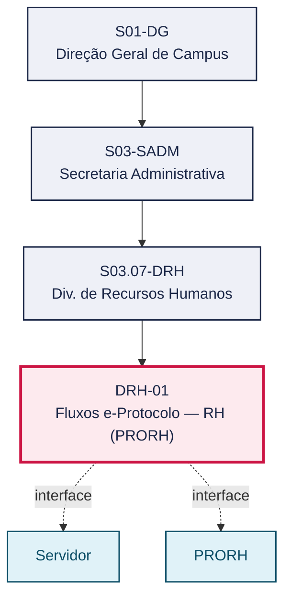

# POP DRH-01 — Fluxos e-Protocolo — RH (PRORH)

> **Documento vivo** · ATDG — Assessoria Técnica da Direção Geral · UNIOESTE Campus Foz do Iguaçu · Formato DDD híbrido + BPMN 2.0 padrão Anne Bail · Versão **1.0.0** · Status **em_validacao** · Atualizado em 2026-09-03

## 0. Cabeçalho DDD

| Divisão | Departamento | Descrição |
|---|---|---|
| Secretaria Administrativa | Div. de Recursos Humanos | Instrui, no e-Protocolo, os processos funcionais de RH (licenças, afastamentos, progressões e demais demandas) conforme a versão vigente do Manual de Fluxos e-Protocolo da PRORH (v3.0, set/2024), que substitui a versão 2.0 (mai/2023) e suas cópias, até a análise e deliberação da PRORH. |

| Domínio | Subdomínio | Tipo | Contexto delimitado |
|---|---|---|---|
| Gestão de Pessoas | Instrução de processos funcionais de RH no e-Protocolo (fluxo PRORH v3.0 vigente) | core | S03.07-DRH |

### 0.3 Linguagem ubíqua (glossário do processo)

| Termo | Definição | Sistema |
|---|---|---|
| Fluxo PRORH v3.0 | Versão vigente (set/2024) do manual de fluxos de RH da Comissão e-Protocolo, que substitui a v2.0 (mai/2023). | e-Protocolo |

## 1. Identificação

| Campo | Valor |
|---|---|
| Código | DRH-01 |
| Setor | Div. de Recursos Humanos (`S03.07-DRH`) |
| Responsável (função) | Chefe da Divisão de Recursos Humanos |
| Periodicidade | Por demanda de processo funcional de RH |
| Subordinação | Secretaria Administrativa |
| Normativa | Manual de Fluxos e-Protocolo — PRORH/Unioeste (v3.0) |
| Produto ATDG | POP |
| Pasta OneDrive | 03_MAPEAMENTO DE PROCESSOS |
| Fontes (entradas do Canvas) | 1780963200048, 1780963200065, 1780963200066 |
| Lacunas abertas | prazo |
| Agente responsável | pop-drh-01 |

## 2. Organograma

## 3. Playbook

### 3.1 Gatilho (evento de domínio)

**Servidor ou chefia solicita processo funcional de RH (licença, afastamento, progressão ou demais demandas)** — origem: Servidor / Chefia imediata

### 3.2 Entrada

- Solicitação do servidor ou da chefia
- Documentação funcional exigida pelo tipo de processo

### 3.3 Passo a passo

| Nº | Ação | Responsável | Sistema | Artefato | Prazo | Evento |
|---|---|---|---|---|---|---|
| 1 | Solicitar o processo funcional de RH (licença, afastamento, progressão ou demais demandas) | Servidor | e-Protocolo | Solicitação de processo funcional | A definir | Processo funcional solicitado |
| 2 | Identificar o tipo de processo de RH e o fluxo aplicável (v3.0) | Chefe da Divisão de Recursos Humanos | e-Protocolo | Processo e-Protocolo de RH | A definir | Tipo de processo identificado |
| 3 | Abrir o processo no e-Protocolo | Chefe da Divisão de Recursos Humanos | e-Protocolo | Processo e-Protocolo de RH | A definir | Processo aberto |
| 4 | Instruir o e-Protocolo conforme o fluxo da versão vigente (v3.0) | Chefe da Divisão de Recursos Humanos | e-Protocolo | Processo e-Protocolo de RH | A definir | Processo instruído |
| 5 | Anexar a documentação funcional exigida | Servidor | e-Protocolo | Documentação funcional | A definir | Documentação anexada |
| 6 | Encaminhar o processo às instâncias de RH/PRORH | Chefe da Divisão de Recursos Humanos | e-Protocolo | Processo e-Protocolo de RH | A definir | Processo encaminhado |
| 7 | PRORH analisa o processo conforme o fluxo vigente | PRORH | e-Protocolo | Análise da PRORH | A definir | Processo analisado |
| 8 | PRORH delibera e comunica a decisão | PRORH | e-Protocolo | Deliberação da PRORH | A definir | Processo deliberado |

### 3.4 Saída (entregáveis)

- Processo de RH instruído, encaminhado e deliberado pela PRORH conforme o fluxo vigente (v3.0)

## 4. Formulários e artefatos (agregados)

| Nome | Tipo | Sistema | Campos-chave | Preenchimento |
|---|---|---|---|---|
| Processo e-Protocolo de RH | registro | e-Protocolo | tipo de processo, servidor requerente, fluxo aplicado (v3.0) | Chefe da Divisão de Recursos Humanos |
| Documentação funcional | documento | e-Protocolo | tipo de documento, data, validade | Servidor |

## 5. Decisões, exceções e pontos de atenção

| Decisão | Condição | Sim → | Não → |
|---|---|---|---|
| O processo está instruído conforme o fluxo vigente (v3.0)? | Conferência da documentação e das etapas exigidas pelo fluxo PRORH v3.0 | Encaminha-se às instâncias de RH/PRORH | Chefe da Divisão de Recursos Humanos corrige a instrução antes de encaminhar |

**Pontos de atenção**

- Versão 3.0 (set/2024) substitui a v2.0 — usar a mais recente
- Confirmar que não há atualização posterior
- A versão 2.0 (mai/2023) e sua cópia no acervo de 'Fluxos Internos' estão superadas; usar exclusivamente a versão 3.0 (set/2024) vigente

## 6. Contingência

- Se o processo estiver instruído por engano conforme a versão 2.0 (ou cópia) do fluxo, reabrir a instrução conforme a versão 3.0 vigente
- Se a documentação funcional estiver incompleta, a Div. de Recursos Humanos solicita complementação ao servidor antes de encaminhar
- Se não houver clareza sobre o fluxo aplicável ao tipo de processo, consultar a versão vigente do Manual de Fluxos e-Protocolo (PRORH v3.0) antes de instruir

## 7. Checklist

- ( ) Tipo de processo identificado e fluxo v3.0 confirmado
- ( ) Processo aberto no e-Protocolo
- ( ) Documentação funcional anexada
- ( ) Instrução conferida antes do encaminhamento
- ( ) Processo encaminhado às instâncias de RH/PRORH

## 8. KPI / Indicadores

| Indicador | Fórmula | Meta | Fonte |
|---|---|---|---|
| Percentual de processos instruídos conforme a versão vigente do fluxo (v3.0) | (Processos instruídos pela v3.0 ÷ total de processos) × 100 | 100% | e-Protocolo |
| Prazo médio de instrução até o encaminhamento à PRORH | Data de encaminhamento − Data de abertura | A definir | e-Protocolo |

## 9. Mapa de contexto (interfaces inter-setoriais)

| Origem | Relação | Destino | Artefato | Canal |
|---|---|---|---|---|
| Div. de Recursos Humanos | recebe | Servidor | Solicitação e documentação funcional | e-Protocolo |
| Div. de Recursos Humanos | fornece | PRORH | Processo de RH instruído | e-Protocolo |

## 10. Fluxograma (BPMN 2.0 — padrão Anne Bail)

```mermaid
flowchart LR
  subgraph R1["Div. de Recursos Humanos"]
    direction LR
    e3[["✉ Encaminhar solicitação à Div. de Recursos Humanos"]]
    e4["Identificar o tipo de processo e o fluxo aplicável (v3.0)"]
    e5["Abrir o processo no e-Protocolo"]
    e6["Instruir o e-Protocolo conforme o fluxo vigente (v3.0)"]
    e9{"Processo está instruído conforme o fluxo vigente?"}
    e10(["⏱ Aguardar correção da instrução"])
    e11["Encaminhar o processo às instâncias de RH/PRORH"]
  end
  subgraph R2["Servidor"]
    direction LR
    e1(("Solicitação de processo funcional de RH"))
    e2["Solicitar o processo funcional de RH"]
    e7[["✉ Solicitar documentação complementar ao servidor"]]
    e8["Anexar a documentação funcional exigida"]
  end
  subgraph R3["PRORH"]
    direction LR
    e12[["✉ Receber processo na PRORH"]]
    e13["Analisar o processo conforme o fluxo vigente"]
    e14["Deliberar e comunicar a decisão"]
    e15((("Processo de RH concluído")))
  end
  e1 --> e2
  e2 --> e3
  e3 --> e4
  e4 --> e5
  e5 --> e6
  e6 --> e7
  e7 --> e8
  e8 --> e9
  e9 -- Não --> e10
  e10 --> e6
  e9 -- Sim --> e11
  e11 --> e12
  e12 --> e13
  e13 --> e14
  e14 --> e15
  classDef inicio fill:#f3f4f6,stroke:#6b7280,stroke-width:1.5px,color:#374151
  classDef atividade fill:#E6F7F0,stroke:#0B7A4E,stroke-width:2px,color:#0B7A4E
  classDef decisao fill:#FFF4ED,stroke:#C9783A,stroke-width:2px,color:#C9783A
  classDef fim fill:#FDEAEE,stroke:#CC1544,stroke-width:4px,color:#CC1544
  classDef pausa fill:#FDEAEE,stroke:#CC1544,stroke-width:2px,color:#CC1544
  classDef captura fill:#E0F2F8,stroke:#0B4D66,stroke-width:2px,color:#0B4D66
  class e1 inicio
  class e2,e4,e5,e6,e8,e11,e13,e14 atividade
  class e3,e7,e12 captura
  class e9 decisao
  class e10 pausa
  class e15 fim
```

## 11. Especificação BPMN para o Miro

**Raias:** Div. de Recursos Humanos · Servidor · PRORH

| Id | Tipo | Elemento | Raia |
|---|---|---|---|
| e1 | inicio | Solicitação de processo funcional de RH | Servidor |
| e2 | atividade | Solicitar o processo funcional de RH | Servidor |
| e3 | captura | Encaminhar solicitação à Div. de Recursos Humanos | Div. de Recursos Humanos |
| e4 | atividade | Identificar o tipo de processo e o fluxo aplicável (v3.0) | Div. de Recursos Humanos |
| e5 | atividade | Abrir o processo no e-Protocolo | Div. de Recursos Humanos |
| e6 | atividade | Instruir o e-Protocolo conforme o fluxo vigente (v3.0) | Div. de Recursos Humanos |
| e7 | captura | Solicitar documentação complementar ao servidor | Servidor |
| e8 | atividade | Anexar a documentação funcional exigida | Servidor |
| e9 | decisao | Processo está instruído conforme o fluxo vigente? | Div. de Recursos Humanos |
| e10 | pausa | Aguardar correção da instrução | Div. de Recursos Humanos |
| e11 | atividade | Encaminhar o processo às instâncias de RH/PRORH | Div. de Recursos Humanos |
| e12 | captura | Receber processo na PRORH | PRORH |
| e13 | atividade | Analisar o processo conforme o fluxo vigente | PRORH |
| e14 | atividade | Deliberar e comunicar a decisão | PRORH |
| e15 | fim | Processo de RH concluído | PRORH |

| De | Para | Rótulo |
|---|---|---|
| e1 | e2 | — |
| e2 | e3 | — |
| e3 | e4 | — |
| e4 | e5 | — |
| e5 | e6 | — |
| e6 | e7 | — |
| e7 | e8 | — |
| e8 | e9 | — |
| e9 | e10 | Não |
| e10 | e6 | — |
| e9 | e11 | Sim |
| e11 | e12 | — |
| e12 | e13 | — |
| e13 | e14 | — |
| e14 | e15 | — |

_Especificação gerada a partir dos passos do POP; 1 raia(s). Revisar decisões e pausas antes de construir no Miro._

## 12. Histórico de versões

| Versão | Data | Autor | Tipo | Mudanças | Fontes |
|---|---|---|---|---|---|
| 0.1.0 | 2026-09-02 | scripts/scaffold_pops.py | patch | Esqueleto inicial gerado deterministicamente a partir das entradas 1780963200048, 1780963200065 | 1780963200048, 1780963200065 |
| 1.0.0 | 2026-09-03 | agente:construtor-pop (lote C) | major | Passo 1 alterado (acao, responsavel, sistema, artefato, prazo, evento, fontes); Passo 2 alterado (acao, responsavel, sistema, artefato, prazo, evento, fontes); Passo 3 alterado (acao, responsavel, sistema, artefato, prazo, evento, fontes); Passo 4 alterado (acao, responsavel, sistema, artefato, prazo, evento, fontes); Passo adicionado após 0: Solicitar o processo funcional de RH (licença, afastamento, progressão ou demais; Passo adicionado após 1: Abrir o processo no e-Protocolo; Passo adicionado após 4: PRORH analisa o processo conforme o fluxo vigente; Passo adicionado após 4: PRORH delibera e comunica a decisão; entrada_nova: +2; saida_nova: +1; artefatos_novos: +2; decisoes_novas: +1; kpis_novos: +2; mapa_contexto_novo: +2; pontos_atencao_novos: +1; contingencia_nova: +3; checklist_novo: +5; glossario_novo: +1; Campo identificacao.responsavel atualizado; Campo identificacao.periodicidade atualizado; Campo ddd.descricao atualizado; Campo ddd.subdominio atualizado; Campo playbook.gatilho atualizado; Raias adicionadas: Servidor, PRORH; Elementos BPMN removidos: e1, e2, e3, e4, e5, e6; Elementos BPMN adicionados: 15; Status promovido a em_validacao (≥ 3 passos e responsável definido) | 1780963200048, 1780963200065, 1780963200066 |

## 13. Validação e aprovação

| Papel | Função / unidade | Data |
|---|---|---|
| Elaboração | ATDG — Assessoria Técnica da Direção Geral | 2026-09-02 |
| Revisão | A definir (responsável do setor) | ___/___/______ |
| Aprovação | Direção Geral do Campus | ___/___/______ |

## 14. Lições incorporadas

- **L-001** — Referir sempre função/cargo; nomes apenas no bloco 13 (Validação), com anuência (LGPD).
- **L-004** — Nunca regenerar POP existente: aplicar patch com changelog, fontes e versão.
- **L-006** — Preservar códigos legados como códigos de processo; não renumerar.
- **L-007** — Referência Externa é benchmark; normativa do POP só cita atos da Unioeste, do Estado do Paraná ou federais aplicáveis.
- **L-002** — Um passo = uma ação; ações compostas viram passos distintos.
- **L-003** — Cada linha do mapa de contexto gera um elemento `captura` no BPMN e um passo na raia de destino.
- **L-005** — No diagnóstico, agrupar versões do mesmo documento e registrar lacuna `versao_documento`.

---
_Canvas Vivo — Base de Conhecimento Institucional · ATDG · UNIOESTE Campus Foz do Iguaçu · gerado por `scripts/render_pop.py` a partir de `pops/DRH/DRH-01.pop.json` (diretrizes v1.2)._
