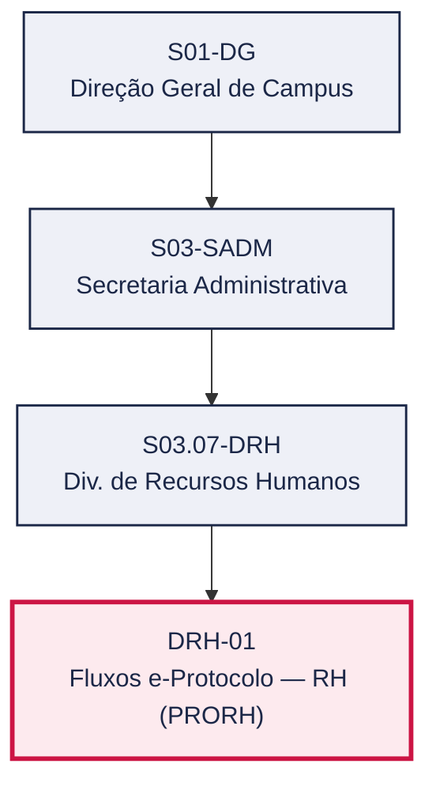
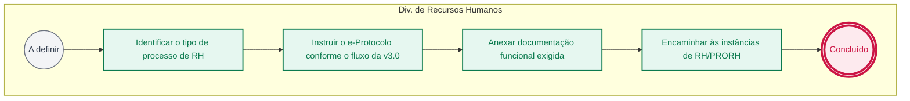

# POP DRH-01 — Fluxos e-Protocolo — RH (PRORH)

> **Documento vivo** · ATDG — Assessoria Técnica da Direção Geral · UNIOESTE Campus Foz do Iguaçu · Formato DDD híbrido + BPMN 2.0 padrão Anne Bail · Versão **0.1.0** · Status **rascunho** · Atualizado em 2026-09-02

## 0. Cabeçalho DDD

| Divisão | Departamento | Descrição |
|---|---|---|
| Secretaria Administrativa | Div. de Recursos Humanos | Versão 3.0 (set/2024) do manual da Comissão e-Protocolo com os fluxos da área de Recursos Humanos. É a versão mais recente do conjunto de fluxos de RH (licenças, afastamentos, frequência, progressões e demais demandas funcionais), substituindo a versão 2.0 de mai/2023. Referência preferencial para a instrução de processos de RH no e-Protocolo. |

| Domínio | Subdomínio | Tipo | Contexto delimitado |
|---|---|---|---|
| Gestão de Pessoas | Fluxos e-Protocolo — RH (PRORH) v3.0 | core | S03.07-DRH |

### 0.3 Linguagem ubíqua (glossário do processo)

Herda integralmente o glossário institucional (`diretrizes/09-glossario-institucional.md`); sem termos locais adicionais.

## 1. Identificação

| Campo | Valor |
|---|---|
| Código | DRH-01 |
| Setor | Div. de Recursos Humanos (`S03.07-DRH`) |
| Responsável (função) | A definir |
| Periodicidade | A definir |
| Subordinação | Secretaria Administrativa |
| Normativa | Manual de Fluxos e-Protocolo — PRORH/Unioeste (v3.0) |
| Produto ATDG | POP |
| Pasta OneDrive | 03_MAPEAMENTO DE PROCESSOS |
| Fontes (entradas do Canvas) | 1780963200048, 1780963200065 |
| Lacunas abertas | responsavel, gatilho, entrada, saida, kpi, contingencia, formulario, prazo |
| Agente responsável | — (não moldado) |

## 2. Organograma

## 3. Playbook

### 3.1 Gatilho (evento de domínio)

**A definir**

### 3.2 Entrada

— A definir

### 3.3 Passo a passo

| Nº | Ação | Responsável | Sistema | Artefato | Prazo | Evento |
|---|---|---|---|---|---|---|
| 1 | Identificar o tipo de processo de RH | A definir | — | — | A definir | — |
| 2 | Instruir o e-Protocolo conforme o fluxo da v3.0 | A definir | — | — | A definir | — |
| 3 | Anexar documentação funcional exigida | A definir | — | — | A definir | — |
| 4 | Encaminhar às instâncias de RH/PRORH | A definir | — | — | A definir | — |

### 3.4 Saída (entregáveis)

— A definir

## 4. Formulários e artefatos (agregados)

— A definir

## 5. Decisões, exceções e pontos de atenção

— Sem decisões registradas

**Pontos de atenção**

- Versão 3.0 (set/2024) substitui a v2.0 — usar a mais recente
- Confirmar que não há atualização posterior

## 6. Contingência

— A definir

## 7. Checklist

— A definir

## 8. KPI / Indicadores

— A definir

## 9. Mapa de contexto (interfaces inter-setoriais)

— Sem interfaces registradas

## 10. Fluxograma (BPMN 2.0 — padrão Anne Bail)

## 11. Especificação BPMN para o Miro

**Raias:** Div. de Recursos Humanos

| Id | Tipo | Elemento | Raia |
|---|---|---|---|
| e1 | inicio | A definir | Div. de Recursos Humanos |
| e2 | atividade | Identificar o tipo de processo de RH | Div. de Recursos Humanos |
| e3 | atividade | Instruir o e-Protocolo conforme o fluxo da v3.0 | Div. de Recursos Humanos |
| e4 | atividade | Anexar documentação funcional exigida | Div. de Recursos Humanos |
| e5 | atividade | Encaminhar às instâncias de RH/PRORH | Div. de Recursos Humanos |
| e6 | fim | Concluído | Div. de Recursos Humanos |

| De | Para | Rótulo |
|---|---|---|
| e1 | e2 | — |
| e2 | e3 | — |
| e3 | e4 | — |
| e4 | e5 | — |
| e5 | e6 | — |

_Especificação gerada a partir dos passos do POP; 1 raia(s). Revisar decisões e pausas antes de construir no Miro._

## 12. Histórico de versões

| Versão | Data | Autor | Tipo | Mudanças | Fontes |
|---|---|---|---|---|---|
| 0.1.0 | 2026-09-02 | scripts/scaffold_pops.py | patch | Esqueleto inicial gerado deterministicamente a partir das entradas 1780963200048, 1780963200065 | 1780963200048, 1780963200065 |

## 13. Validação e aprovação

| Papel | Função / unidade | Data |
|---|---|---|
| Elaboração | ATDG — Assessoria Técnica da Direção Geral | 2026-09-02 |
| Revisão | A definir (responsável do setor) | ___/___/______ |
| Aprovação | Direção Geral do Campus | ___/___/______ |

## 14. Lições incorporadas

- **L-001** — Referir sempre função/cargo; nomes apenas no bloco 13 (Validação), com anuência (LGPD).
- **L-004** — Nunca regenerar POP existente: aplicar patch com changelog, fontes e versão.
- **L-006** — Preservar códigos legados como códigos de processo; não renumerar.
- **L-007** — Referência Externa é benchmark; normativa do POP só cita atos da Unioeste, do Estado do Paraná ou federais aplicáveis.

---
_Canvas Vivo — Base de Conhecimento Institucional · ATDG · UNIOESTE Campus Foz do Iguaçu · gerado por `scripts/render_pop.py` a partir de `pops/DRH/DRH-01.pop.json` (diretrizes v1.0)._
