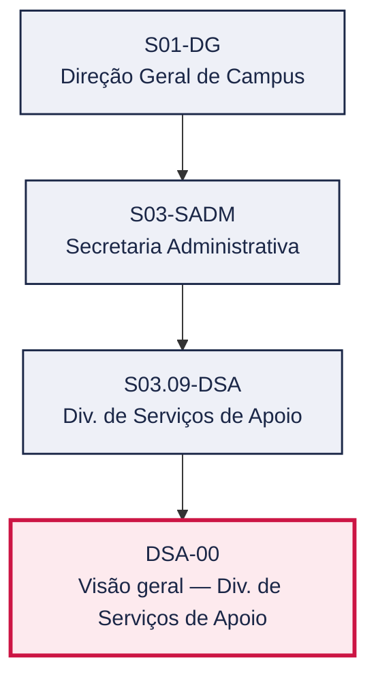
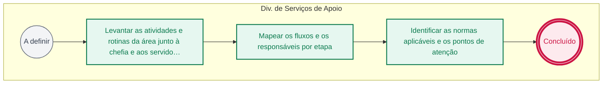

# POP DSA-00 — Visão geral — Div. de Serviços de Apoio

> **Documento vivo** · ATDG — Assessoria Técnica da Direção Geral · UNIOESTE Campus Foz do Iguaçu · Formato DDD híbrido + BPMN 2.0 padrão Anne Bail · Versão **0.2.0** · Status **rascunho** · Atualizado em 2026-09-03

## 0. Cabeçalho DDD

| Divisão | Departamento | Descrição |
|---|---|---|
| Secretaria Administrativa | Div. de Serviços de Apoio | Divisão de Serviços de Apoio da Secretaria Administrativa. Playbook em construção. |

| Domínio | Subdomínio | Tipo | Contexto delimitado |
|---|---|---|---|
| Infraestrutura e Serviços | Visão geral do setor (playbook) | suporte | S03.09-DSA |

### 0.3 Linguagem ubíqua (glossário do processo)

Herda integralmente o glossário institucional (`diretrizes/09-glossario-institucional.md`); sem termos locais adicionais.

## 1. Identificação

| Campo | Valor |
|---|---|
| Código | DSA-00 |
| Setor | Div. de Serviços de Apoio (`S03.09-DSA`) |
| Responsável (função) | A definir |
| Periodicidade | A definir |
| Subordinação | Secretaria Administrativa |
| Normativa | A definir |
| Produto ATDG | POP |
| Pasta OneDrive | 03_MAPEAMENTO DE PROCESSOS |
| Fontes (entradas do Canvas) | pb-servicos-apoio |
| Lacunas abertas | responsavel, gatilho, entrada, saida, kpi, contingencia, formulario, prazo, normativa |
| Agente responsável | — (não moldado) |

## 2. Organograma

## 3. Playbook

### 3.1 Gatilho (evento de domínio)

**A definir**

### 3.2 Entrada

— A definir

### 3.3 Passo a passo

| Nº | Ação | Responsável | Sistema | Artefato | Prazo | Evento |
|---|---|---|---|---|---|---|
| 1 | Levantar as atividades e rotinas da área junto à chefia e aos servidores | A definir | e-Protocolo | Roteiro de levantamento de atividades | A definir | — |
| 2 | Mapear os fluxos e os responsáveis por etapa | A definir | planilha | Mapa de fluxos e responsáveis | A definir | — |
| 3 | Identificar as normas aplicáveis e os pontos de atenção | A definir | e-Protocolo | Lista de normas e pontos de atenção | A definir | — |

### 3.4 Saída (entregáveis)

— A definir

## 4. Formulários e artefatos (agregados)

— A definir

## 5. Decisões, exceções e pontos de atenção

— Sem decisões registradas

**Pontos de atenção**

- Área ainda não mapeada — playbook em construção

## 6. Contingência

- Se a chefia do setor não estiver disponível para o levantamento, agendar nova data e registrar o adiamento
- Se não houver documentação prévia da área, iniciar o levantamento por entrevista direta com os servidores
- Se forem identificadas normas não catalogadas no Canvas, registrá-las como lacuna para validação posterior
- Se o setor não tiver processos definidos, priorizar o mapeamento das atividades de maior volume ou risco

## 7. Checklist

- ( ) Chefia e servidores do setor entrevistados
- ( ) Atividades e rotinas da área levantadas
- ( ) Fluxos e responsáveis por etapa mapeados
- ( ) Normas aplicáveis identificadas
- ( ) Pontos de atenção registrados para o próximo ciclo de diagnóstico

## 8. KPI / Indicadores

— A definir

## 9. Mapa de contexto (interfaces inter-setoriais)

— Sem interfaces registradas

## 10. Fluxograma (BPMN 2.0 — padrão Anne Bail)

## 11. Especificação BPMN para o Miro

**Raias:** Div. de Serviços de Apoio

| Id | Tipo | Elemento | Raia |
|---|---|---|---|
| e1 | inicio | A definir | Div. de Serviços de Apoio |
| e2 | atividade | Levantar as atividades e rotinas da área junto à chefia e aos servidores | Div. de Serviços de Apoio |
| e3 | atividade | Mapear os fluxos e os responsáveis por etapa | Div. de Serviços de Apoio |
| e4 | atividade | Identificar as normas aplicáveis e os pontos de atenção | Div. de Serviços de Apoio |
| e5 | fim | Concluído | Div. de Serviços de Apoio |

| De | Para | Rótulo |
|---|---|---|
| e1 | e2 | — |
| e2 | e3 | — |
| e3 | e4 | — |
| e4 | e5 | — |

_Especificação gerada a partir dos passos do POP; 1 raia(s). Revisar decisões e pausas antes de construir no Miro._

## 12. Histórico de versões

| Versão | Data | Autor | Tipo | Mudanças | Fontes |
|---|---|---|---|---|---|
| 0.1.0 | 2026-09-02 | scripts/scaffold_pops.py | patch | Esqueleto inicial gerado deterministicamente a partir das entradas pb-servicos-apoio | pb-servicos-apoio |
| 0.2.0 | 2026-09-03 | agente:construtor-pop (lote C) | minor | Passo 1 alterado (acao, responsavel, sistema, artefato, prazo, evento, fontes); Passo 2 alterado (acao, responsavel, sistema, artefato, prazo, evento, fontes); Passo 3 alterado (acao, responsavel, sistema, artefato, prazo, evento, fontes); contingencia_nova: +4; checklist_novo: +5; Campo observacoes atualizado; Fluxograma regenerado a partir dos passos | pb-servicos-apoio |

## 13. Validação e aprovação

| Papel | Função / unidade | Data |
|---|---|---|
| Elaboração | ATDG — Assessoria Técnica da Direção Geral | 2026-09-02 |
| Revisão | A definir (responsável do setor) | ___/___/______ |
| Aprovação | Direção Geral do Campus | ___/___/______ |

## 14. Lições incorporadas

- **L-001** — Referir sempre função/cargo; nomes apenas no bloco 13 (Validação), com anuência (LGPD).
- **L-004** — Nunca regenerar POP existente: aplicar patch com changelog, fontes e versão.
- **L-006** — Preservar códigos legados como códigos de processo; não renumerar.
- **L-007** — Referência Externa é benchmark; normativa do POP só cita atos da Unioeste, do Estado do Paraná ou federais aplicáveis.
- **L-002** — Um passo = uma ação; ações compostas viram passos distintos.
- **L-003** — Cada linha do mapa de contexto gera um elemento `captura` no BPMN e um passo na raia de destino.
- **L-005** — No diagnóstico, agrupar versões do mesmo documento e registrar lacuna `versao_documento`.

> **Observações:** Setor ainda não mapeado — roteiro de coleta

---
_Canvas Vivo — Base de Conhecimento Institucional · ATDG · UNIOESTE Campus Foz do Iguaçu · gerado por `scripts/render_pop.py` a partir de `pops/DSA/DSA-00.pop.json` (diretrizes v1.8)._
