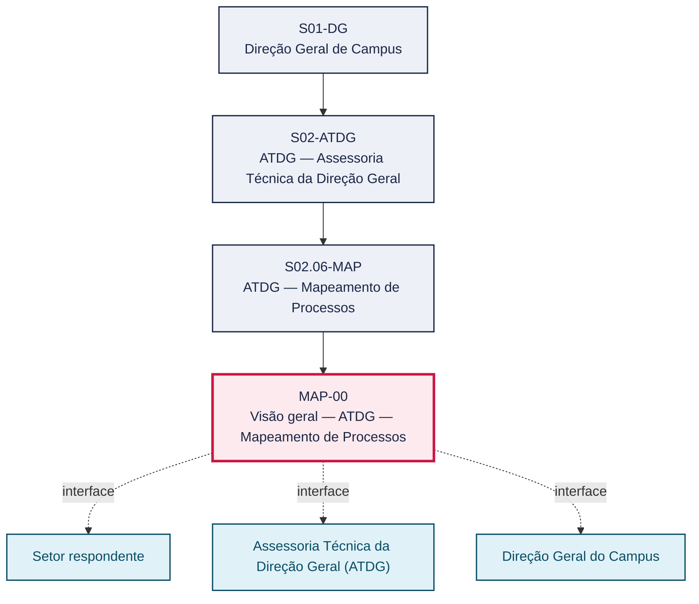
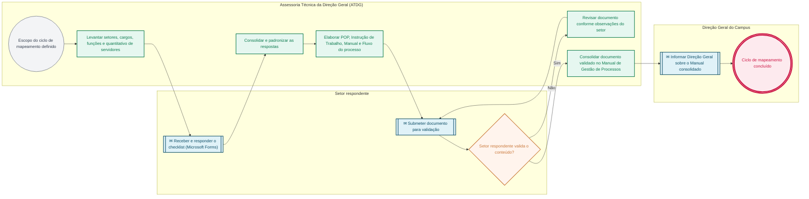

# POP MAP-00 — Visão geral — ATDG — Mapeamento de Processos

> **Documento vivo** · ATDG — Assessoria Técnica da Direção Geral · UNIOESTE Campus Foz do Iguaçu · Formato DDD híbrido + BPMN 2.0 padrão Anne Bail · Versão **1.0.0** · Status **em_validacao** · Atualizado em 2026-09-03

## 0. Cabeçalho DDD

| Divisão | Departamento | Descrição |
|---|---|---|
| ATDG — Assessoria Técnica da Direção Geral | ATDG — Mapeamento de Processos | Conduz o ciclo de Mapeamento de Processos do Campus: define escopo, levanta setores/funções, aplica checklist (Microsoft Forms), consolida respostas e elabora POP/IT/Manual/Fluxo de cada processo, validados pelo setor respondente. |

| Domínio | Subdomínio | Tipo | Contexto delimitado |
|---|---|---|---|
| Assessoria Técnica e Gestão por Processos | Visão geral do setor (playbook) | core | S02.06-MAP |

### 0.3 Linguagem ubíqua (glossário do processo)

| Termo | Definição | Sistema |
|---|---|---|
| Checklist de atividades | Questionário aplicado via Microsoft Forms para levantar as atividades exercidas por cada função do Campus. | Microsoft Forms |
| Setor respondente | Setor, colegiado ou função que responde ao checklist e valida o conteúdo do processo mapeado. | — |

## 1. Identificação

| Campo | Valor |
|---|---|
| Código | MAP-00 |
| Setor | ATDG — Assessoria Técnica da Direção Geral (`S02.06-MAP`) |
| Responsável (função) | Assessoria Técnica da Direção Geral (ATDG) |
| Periodicidade | Por ciclo do projeto de Mapeamento de Processos |
| Subordinação | ATDG — Assessoria Técnica da Direção Geral |
| Normativa | Projeto de Mapeamento de Processos — ATDG; Plano Diretor Unioeste 2017-2026; Estatuto (Res. 017/99-COU); Lei nº 13.709/2018 (Lei Geral de Proteção de Dados Pessoais — LGPD) |
| Produto ATDG | POP |
| Pasta OneDrive | 03_MAPEAMENTO DE PROCESSOS |
| Fontes (entradas do Canvas) | pb-atdg, 1780963200014, 1780963200015, 1780963200016, 1780963200017, 1780963200031, 1780963200034, 1780963200035 |
| Lacunas abertas | prazo, dados_pessoais_lgpd |
| Agente responsável | — (não moldado) |

## 2. Organograma

## 3. Playbook

### 3.1 Gatilho (evento de domínio)

**Definição, pela Direção Geral ou pela ATDG, do início ou de novo ciclo do projeto de Mapeamento de Processos do Campus** — origem: Assessoria Técnica da Direção Geral (ATDG)

### 3.2 Entrada

- Organograma do Campus e relação de setores, cargos e funções
- Formulário/checklist de levantamento (Microsoft Forms)
- Respostas dos setores/colegiados ao checklist

### 3.3 Passo a passo

| Nº | Ação | Responsável | Sistema | Artefato | Prazo | Evento |
|---|---|---|---|---|---|---|
| 1 | Definir com a Direção Geral o escopo e o cronograma do ciclo de mapeamento | Assessoria Técnica da Direção Geral (ATDG) | OneDrive ATDG | Cronograma do projeto de mapeamento | A definir | Escopo e cronograma definidos |
| 2 | Levantar setores, cargos, funções e quantitativo de servidores | Assessoria Técnica da Direção Geral (ATDG) | OneDrive ATDG | Relação de setores, cargos e funções | A definir | Levantamento concluído |
| 3 | Aplicar checklist/questionário por função (Microsoft Forms) | Assessoria Técnica da Direção Geral (ATDG) | Microsoft Forms | Checklist de atividades por função | A definir | Checklist aplicado |
| 4 | Consolidar e padronizar as respostas | Assessoria Técnica da Direção Geral (ATDG) | OneDrive ATDG | Planilha consolidada de respostas | A definir | Respostas consolidadas |
| 5 | Elaborar POP, Instrução de Trabalho, Manual e Fluxos de cada processo | Assessoria Técnica da Direção Geral (ATDG) | OneDrive ATDG | POP/IT/Manual/Fluxo | A definir | Documento elaborado |
| 6 | Submeter os documentos elaborados à validação do setor respondente | Assessoria Técnica da Direção Geral (ATDG) | OneDrive ATDG | POP/IT/Manual/Fluxo em validação | A definir | Documento submetido à validação |
| 7 | Validar o conteúdo do processo mapeado | Setor respondente | OneDrive ATDG | POP/IT/Manual/Fluxo validado | A definir | Conteúdo validado |
| 8 | Consolidar os documentos validados no Manual de Gestão de Processos do Campus | Assessoria Técnica da Direção Geral (ATDG) | OneDrive ATDG | Manual de Gestão de Processos | A definir | Manual atualizado |

### 3.4 Saída (entregáveis)

- POP, Instrução de Trabalho, Manual e Fluxo de cada processo mapeado
- Manual de Gestão de Processos do Campus Foz consolidado

## 4. Formulários e artefatos (agregados)

| Nome | Tipo | Sistema | Campos-chave | Preenchimento |
|---|---|---|---|---|
| Checklist de atividades por função | formulario | Microsoft Forms | setor, cargo, função, chefia imediata, atividades por periodicidade | Setor respondente |
| Planilha consolidada de respostas do mapeamento | registro | OneDrive ATDG | setor, curso/centro, cargo, função, atividades declaradas | Assessoria Técnica da Direção Geral (ATDG) |

## 5. Decisões, exceções e pontos de atenção

| Decisão | Condição | Sim → | Não → |
|---|---|---|---|
| O setor respondente valida o conteúdo do processo mapeado (POP/IT/Manual/Fluxo)? | Documento elaborado pela ATDG a partir das respostas consolidadas do checklist | Consolidar o documento no Manual de Gestão de Processos do Campus | Revisar o documento com o setor respondente e reencaminhar para nova validação |

**Pontos de atenção**

- Dados pessoais dos respondentes (LGPD)
- Controlar versionamento (há artefatos 'em elaboração' e cópias)
- Manter os contatos por função atualizados
- Coleta de dados pessoais de servidores respondentes exige tratamento conforme a LGPD (Lei nº 13.709/2018)

## 6. Contingência

- Setor não responde ao checklist no prazo: reiterar contato por meio da chefia imediata
- Respostas divergentes de servidores da mesma função: consolidar com o setor respondente antes de padronizar
- Versão de planilha de consolidação corrompida ou desatualizada: recuperar a partir da versão anterior controlada no OneDrive ATDG

## 7. Checklist

- ( ) Escopo e cronograma do ciclo de mapeamento definidos
- ( ) Checklist aplicado a todos os setores/funções do escopo
- ( ) Respostas consolidadas e padronizadas
- ( ) Documento (POP/IT/Manual/Fluxo) validado pelo setor respondente
- ( ) Dados pessoais dos respondentes tratados conforme a LGPD

## 8. KPI / Indicadores

| Indicador | Fórmula | Meta | Fonte |
|---|---|---|---|
| Percentual de setores/funções com checklist respondido | (Funções respondidas / total de funções do escopo) × 100 | A definir | Microsoft Forms |
| Percentual de processos mapeados com documento validado pelo setor respondente | (Processos validados / total de processos mapeados) × 100 | A definir | OneDrive ATDG |

## 9. Mapa de contexto (interfaces inter-setoriais)

| Origem | Relação | Destino | Artefato | Canal |
|---|---|---|---|---|
| Setor respondente | fornece | Assessoria Técnica da Direção Geral (ATDG) | Respostas do checklist/questionário (Microsoft Forms) | Microsoft Forms |
| Assessoria Técnica da Direção Geral (ATDG) | valida | Setor respondente | POP/IT/Manual/Fluxo elaborado | OneDrive ATDG |
| Assessoria Técnica da Direção Geral (ATDG) | informa | Direção Geral do Campus | Manual de Gestão de Processos consolidado | OneDrive ATDG |

## 10. Fluxograma (BPMN 2.0 — padrão Anne Bail)

## 11. Especificação BPMN para o Miro

**Raias:** Assessoria Técnica da Direção Geral (ATDG) · Setor respondente · Direção Geral do Campus

| Id | Tipo | Elemento | Raia |
|---|---|---|---|
| e1 | inicio | Escopo do ciclo de mapeamento definido | Assessoria Técnica da Direção Geral (ATDG) |
| e2 | atividade | Levantar setores, cargos, funções e quantitativo de servidores | Assessoria Técnica da Direção Geral (ATDG) |
| e3 | captura | Receber e responder o checklist (Microsoft Forms) | Setor respondente |
| e4 | atividade | Consolidar e padronizar as respostas | Assessoria Técnica da Direção Geral (ATDG) |
| e5 | atividade | Elaborar POP, Instrução de Trabalho, Manual e Fluxo do processo | Assessoria Técnica da Direção Geral (ATDG) |
| e6 | captura | Submeter documento para validação | Setor respondente |
| e7 | decisao | Setor respondente valida o conteúdo? | Setor respondente |
| e8 | atividade | Revisar documento conforme observações do setor | Assessoria Técnica da Direção Geral (ATDG) |
| e9 | atividade | Consolidar documento validado no Manual de Gestão de Processos | Assessoria Técnica da Direção Geral (ATDG) |
| e10 | captura | Informar Direção Geral sobre o Manual consolidado | Direção Geral do Campus |
| e11 | fim | Ciclo de mapeamento concluído | Direção Geral do Campus |

| De | Para | Rótulo |
|---|---|---|
| e1 | e2 | — |
| e2 | e3 | — |
| e3 | e4 | — |
| e4 | e5 | — |
| e5 | e6 | — |
| e6 | e7 | — |
| e7 | e8 | Não |
| e8 | e6 | — |
| e7 | e9 | Sim |
| e9 | e10 | — |
| e10 | e11 | — |

_Especificação gerada a partir dos passos do POP; 1 raia(s). Revisar decisões e pausas antes de construir no Miro._

## 12. Histórico de versões

| Versão | Data | Autor | Tipo | Mudanças | Fontes |
|---|---|---|---|---|---|
| 0.1.0 | 2026-09-02 | scripts/scaffold_pops.py | patch | Esqueleto inicial gerado deterministicamente a partir das entradas pb-atdg | pb-atdg |
| 1.0.0 | 2026-09-03 | agente:construtor-pop (lote B) | major | Passo 1 alterado (responsavel, sistema, artefato, prazo, evento, fontes); Passo 2 alterado (responsavel, sistema, artefato, prazo, evento, fontes); Passo 3 alterado (responsavel, sistema, artefato, prazo, evento, fontes); Passo 4 alterado (responsavel, sistema, artefato, prazo, evento, fontes); Passo adicionado após 0: Definir com a Direção Geral o escopo e o cronograma do ciclo de mapeamento; Passo adicionado após 4: Submeter os documentos elaborados à validação do setor respondente; Passo adicionado após 5: Validar o conteúdo do processo mapeado; Passo adicionado após 6: Consolidar os documentos validados no Manual de Gestão de Processos do Campus; entrada_nova: +3; saida_nova: +2; artefatos_novos: +2; decisoes_novas: +1; kpis_novos: +2; mapa_contexto_novo: +3; pontos_atencao_novos: +1; contingencia_nova: +3; checklist_novo: +5; glossario_novo: +2; normativa_nova: +2; Campo ddd.descricao atualizado; Campo identificacao.responsavel atualizado; Campo identificacao.periodicidade atualizado; Campo playbook.gatilho atualizado; Raias adicionadas: Assessoria Técnica da Direção Geral (ATDG), Setor respondente, Direção Geral do Campus; Elementos BPMN removidos: e1, e2, e3, e4, e5, e6; Elementos BPMN adicionados: 11; Status promovido a em_validacao (≥ 3 passos e responsável definido) | pb-atdg, 1780963200014, 1780963200015, 1780963200016, 1780963200017, 1780963200031, 1780963200034, 1780963200035 |

## 13. Validação e aprovação

| Papel | Função / unidade | Data |
|---|---|---|
| Elaboração | ATDG — Assessoria Técnica da Direção Geral | 2026-09-02 |
| Revisão | A definir (responsável do setor) | ___/___/______ |
| Aprovação | Direção Geral do Campus | ___/___/______ |

## 14. Lições incorporadas

- **L-001** — Referir sempre função/cargo; nomes apenas no bloco 13 (Validação), com anuência (LGPD).
- **L-004** — Nunca regenerar POP existente: aplicar patch com changelog, fontes e versão.
- **L-006** — Preservar códigos legados como códigos de processo; não renumerar.
- **L-007** — Referência Externa é benchmark; normativa do POP só cita atos da Unioeste, do Estado do Paraná ou federais aplicáveis.
- **L-002** — Um passo = uma ação; ações compostas viram passos distintos.
- **L-003** — Cada linha do mapa de contexto gera um elemento `captura` no BPMN e um passo na raia de destino.

---
_Canvas Vivo — Base de Conhecimento Institucional · ATDG · UNIOESTE Campus Foz do Iguaçu · gerado por `scripts/render_pop.py` a partir de `pops/MAP/MAP-00.pop.json` (diretrizes v1.8)._
