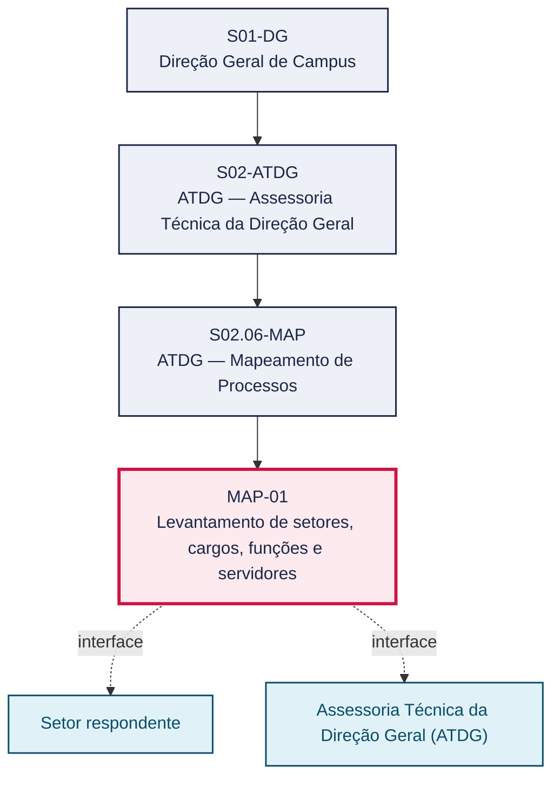
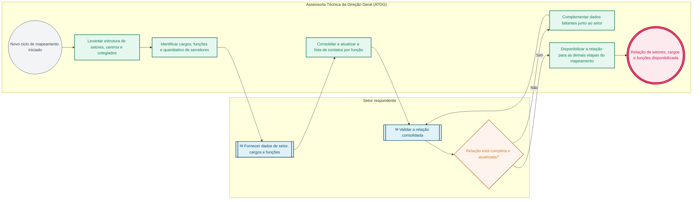

# POP MAP-01 — Levantamento de setores, cargos, funções e servidores

> **Documento vivo** · ATDG — Assessoria Técnica da Direção Geral · UNIOESTE Campus Foz do Iguaçu · Formato DDD híbrido + BPMN 2.0 padrão Anne Bail · Versão **1.0.0** · Status **em_validacao** · Atualizado em 2026-09-03

## 0. Cabeçalho DDD

| Divisão | Departamento | Descrição |
|---|---|---|
| ATDG — Assessoria Técnica da Direção Geral | ATDG — Mapeamento de Processos | Levantamento de setores, cargos, funções e servidores. Processo codificado no manual institucional da ATDG (jun/2026); conteúdo operacional a documentar. |

| Domínio | Subdomínio | Tipo | Contexto delimitado |
|---|---|---|---|
| Assessoria Técnica e Gestão por Processos | Levantamento de setores, cargos, funções e servidores | core | S02.06-MAP |

### 0.3 Linguagem ubíqua (glossário do processo)

| Termo | Definição | Sistema |
|---|---|---|
| Setor respondente | Setor, colegiado ou função que fornece e valida os dados levantados no mapeamento. | — |

## 1. Identificação

| Campo | Valor |
|---|---|
| Código | MAP-01 |
| Setor | ATDG — Assessoria Técnica da Direção Geral (`S02.06-MAP`) |
| Responsável (função) | Assessoria Técnica da Direção Geral (ATDG) |
| Periodicidade | Por ciclo do projeto de Mapeamento de Processos |
| Subordinação | ATDG — Assessoria Técnica da Direção Geral |
| Normativa | Lei nº 13.709/2018 (Lei Geral de Proteção de Dados Pessoais — LGPD) |
| Produto ATDG | POP |
| Pasta OneDrive | 03_MAPEAMENTO DE PROCESSOS |
| Fontes (entradas do Canvas) | pb-atdg, 1780963200014, 1780963200031, 1780963200035 |
| Lacunas abertas | formulario, prazo |
| Agente responsável | — (não moldado) |

## 2. Organograma

## 3. Playbook

### 3.1 Gatilho (evento de domínio)

**Início de novo ciclo de mapeamento de processos definido pela ATDG/Direção Geral** — origem: Assessoria Técnica da Direção Geral (ATDG)

### 3.2 Entrada

- Organograma do Campus
- Lista de contatos institucionais por função

### 3.3 Passo a passo

| Nº | Ação | Responsável | Sistema | Artefato | Prazo | Evento |
|---|---|---|---|---|---|---|
| 1 | Levantar a estrutura de setores, centros e colegiados do Campus | Assessoria Técnica da Direção Geral (ATDG) | OneDrive ATDG | Organograma do Campus | A definir | Estrutura levantada |
| 2 | Identificar cargos e funções existentes em cada setor | Assessoria Técnica da Direção Geral (ATDG) | OneDrive ATDG | Relação de cargos e funções | A definir | Cargos e funções identificados |
| 3 | Levantar o quantitativo de servidores por setor e função | Assessoria Técnica da Direção Geral (ATDG) | OneDrive ATDG | Quantitativo de servidores | A definir | Quantitativo levantado |
| 4 | Consolidar e atualizar a lista de contatos institucionais por função | Assessoria Técnica da Direção Geral (ATDG) | OneDrive ATDG | Lista de contatos por função | A definir | Contatos atualizados |
| 5 | Validar a relação de setores, cargos, funções e servidores com o setor respondente | Setor respondente | OneDrive ATDG | Relação consolidada | A definir | Relação validada |
| 6 | Disponibilizar a relação consolidada para o restante do projeto de mapeamento | Assessoria Técnica da Direção Geral (ATDG) | OneDrive ATDG | Relação consolidada | A definir | Relação disponibilizada |

### 3.4 Saída (entregáveis)

- Relação consolidada de setores, cargos, funções e quantitativo de servidores
- Lista de contatos por função atualizada

## 4. Formulários e artefatos (agregados)

| Nome | Tipo | Sistema | Campos-chave | Preenchimento |
|---|---|---|---|---|
| Relação de setores, cargos, funções e servidores | registro | OneDrive ATDG | setor, centro/colegiado, cargo, função, quantitativo de servidores | Assessoria Técnica da Direção Geral (ATDG) |
| Lista de contatos institucionais por função | registro | OneDrive ATDG | função, e-mail institucional, centro | Assessoria Técnica da Direção Geral (ATDG) |

## 5. Decisões, exceções e pontos de atenção

| Decisão | Condição | Sim → | Não → |
|---|---|---|---|
| A relação de setores, cargos e funções está completa e atualizada? | Relação consolidada de setores, cargos, funções e servidores levantada pela ATDG | Disponibilizar a relação para as demais etapas do mapeamento (MAP-02) | Retornar ao setor para complementação das informações faltantes |

**Pontos de atenção**

- Lista de contatos contém e-mails institucionais de servidores — tratar conforme a LGPD e evitar divulgação externa
- Manter a relação sincronizada com alterações de estrutura (criação/extinção de colegiados e centros)

## 6. Contingência

- Divergência entre o organograma formal e a estrutura em funcionamento: registrar a divergência e confirmar com a Direção Geral
- Contato desatualizado impede o envio de formulários: buscar contato alternativo junto à chefia imediata
- Setor não confirma o quantitativo de servidores: estimar com base no último levantamento e sinalizar como lacuna

## 7. Checklist

- ( ) Estrutura de setores, centros e colegiados levantada
- ( ) Cargos e funções identificados por setor
- ( ) Quantitativo de servidores levantado
- ( ) Lista de contatos por função atualizada e validada
- ( ) Relação consolidada validada pelo setor respondente

## 8. KPI / Indicadores

| Indicador | Fórmula | Meta | Fonte |
|---|---|---|---|
| Percentual de setores com dados de estrutura, cargos e funções levantados | (Setores levantados / total de setores do Campus) × 100 | A definir | OneDrive ATDG |
| Percentual de contatos por função atualizados no último ciclo | (Contatos atualizados / total de contatos) × 100 | A definir | OneDrive ATDG |

## 9. Mapa de contexto (interfaces inter-setoriais)

| Origem | Relação | Destino | Artefato | Canal |
|---|---|---|---|---|
| Setor respondente | fornece | Assessoria Técnica da Direção Geral (ATDG) | Dados de setor, cargos, funções e servidores | e-mail institucional/OneDrive ATDG |
| Assessoria Técnica da Direção Geral (ATDG) | valida | Setor respondente | Relação consolidada de setores, cargos e funções | OneDrive ATDG |

## 10. Fluxograma (BPMN 2.0 — padrão Anne Bail)

## 11. Especificação BPMN para o Miro

**Raias:** Assessoria Técnica da Direção Geral (ATDG) · Setor respondente

| Id | Tipo | Elemento | Raia |
|---|---|---|---|
| e1 | inicio | Novo ciclo de mapeamento iniciado | Assessoria Técnica da Direção Geral (ATDG) |
| e2 | atividade | Levantar estrutura de setores, centros e colegiados | Assessoria Técnica da Direção Geral (ATDG) |
| e3 | atividade | Identificar cargos, funções e quantitativo de servidores | Assessoria Técnica da Direção Geral (ATDG) |
| e4 | captura | Fornecer dados de setor, cargos e funções | Setor respondente |
| e5 | atividade | Consolidar e atualizar a lista de contatos por função | Assessoria Técnica da Direção Geral (ATDG) |
| e6 | captura | Validar a relação consolidada | Setor respondente |
| e7 | decisao | Relação está completa e atualizada? | Setor respondente |
| e8 | atividade | Complementar dados faltantes junto ao setor | Assessoria Técnica da Direção Geral (ATDG) |
| e9 | atividade | Disponibilizar a relação para as demais etapas do mapeamento | Assessoria Técnica da Direção Geral (ATDG) |
| e10 | fim | Relação de setores, cargos e funções disponibilizada | Assessoria Técnica da Direção Geral (ATDG) |

| De | Para | Rótulo |
|---|---|---|
| e1 | e2 | — |
| e2 | e3 | — |
| e3 | e4 | — |
| e4 | e5 | — |
| e5 | e6 | — |
| e6 | e7 | — |
| e7 | e8 | Não |
| e8 | e6 | — |
| e7 | e9 | Sim |
| e9 | e10 | — |

_Especificação gerada a partir dos passos do POP; 1 raia(s). Revisar decisões e pausas antes de construir no Miro._

## 12. Histórico de versões

| Versão | Data | Autor | Tipo | Mudanças | Fontes |
|---|---|---|---|---|---|
| 0.1.0 | 2026-09-02 | scripts/scaffold_pops.py | patch | Esqueleto inicial gerado deterministicamente | — |
| 1.0.0 | 2026-09-03 | agente:construtor-pop (lote B) | major | Passo adicionado após 0: Levantar a estrutura de setores, centros e colegiados do Campus; Passo adicionado após 1: Identificar cargos e funções existentes em cada setor; Passo adicionado após 2: Levantar o quantitativo de servidores por setor e função; Passo adicionado após 3: Consolidar e atualizar a lista de contatos institucionais por função; Passo adicionado após 4: Validar a relação de setores, cargos, funções e servidores com o setor responden; Passo adicionado após 5: Disponibilizar a relação consolidada para o restante do projeto de mapeamento; entrada_nova: +2; saida_nova: +2; artefatos_novos: +2; decisoes_novas: +1; kpis_novos: +2; mapa_contexto_novo: +2; pontos_atencao_novos: +2; contingencia_nova: +3; checklist_novo: +5; glossario_novo: +1; normativa_nova: +1; Campo identificacao.responsavel atualizado; Campo identificacao.periodicidade atualizado; Campo playbook.gatilho atualizado; Raias adicionadas: Assessoria Técnica da Direção Geral (ATDG), Setor respondente; Elementos BPMN removidos: e1, e2; Elementos BPMN adicionados: 10; Status promovido a em_validacao (≥ 3 passos e responsável definido) | pb-atdg, 1780963200014, 1780963200031, 1780963200035 |

## 13. Validação e aprovação

| Papel | Função / unidade | Data |
|---|---|---|
| Elaboração | ATDG — Assessoria Técnica da Direção Geral | 2026-09-02 |
| Revisão | A definir (responsável do setor) | ___/___/______ |
| Aprovação | Direção Geral do Campus | ___/___/______ |

## 14. Lições incorporadas

- **L-001** — Referir sempre função/cargo; nomes apenas no bloco 13 (Validação), com anuência (LGPD).
- **L-004** — Nunca regenerar POP existente: aplicar patch com changelog, fontes e versão.
- **L-006** — Preservar códigos legados como códigos de processo; não renumerar.
- **L-007** — Referência Externa é benchmark; normativa do POP só cita atos da Unioeste, do Estado do Paraná ou federais aplicáveis.
- **L-002** — Um passo = uma ação; ações compostas viram passos distintos.
- **L-003** — Cada linha do mapa de contexto gera um elemento `captura` no BPMN e um passo na raia de destino.

---
_Canvas Vivo — Base de Conhecimento Institucional · ATDG · UNIOESTE Campus Foz do Iguaçu · gerado por `scripts/render_pop.py` a partir de `pops/MAP/MAP-01.pop.json` (diretrizes v1.8)._
